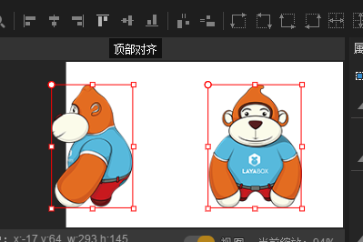

#UI 장면 편집기

장면 편집기는 UI, 애니메이션 등 콘텐츠의 핵심 작업 영역, 그림 1개에서 보여 주는 장면 편집기 중 선택과 컨트롤, 그룹 용기 등을 선택할 수 있다.배경 편집기에서 선택한 구성 요소는 속성 설정기에서 구성된 위치, 회전, 축소, 크기 등 속성, 취득 가능한 장면 미리 보기

​< br />
(그림 1)

##1, 보기 소개

####1.1 보기 조작

아래의 동작을 통해 이동과 위치 편집기 보기:

1. 누르다`鼠标右键`누르다`鼠标滚轮`이동 보기 끌 수 있습니다.

2, 단축키`Ctrl + +`혹은`鼠标滚轮向前`보기 확대 가능.

3, 단축키`Ctrl + -`마우스 스크롤을 뒤로 돌리면 보기 크기를 좁힐 수 있습니다.

4、단축키`Ctrl + 0`100% 원시 비율 보기로 복구할 수 있습니다.

보기 동작을 할 때 UI 장면 편집기 오른쪽 아래쪽에 크기 조정 팁을 볼 수 있습니다.관련 조작은 동영상 2개와 같다.

    (动图2)

####1.2 구성 요소의 구속 상자

구성 요소는 마우스 선택에서 제한 상자 (빨간색, 노드 있는 선 상자) 를 볼 수 있습니다. 구속 상자의 사각형 영역은 구성된 크기 (size) 의 크기를 표시합니다.점 중 어떤 노드가 구성 요소의 크기를 바로 바꿀 수 있다.

​< br / > (동영상 3)

**Tips**그림 렌더가 포함되지 않더라도 (Sprite) 컨트롤을 설정할 수 있습니다.

####1.3 노드

장면 편집기에서 마우스의 왼쪽 단추를 누르고 잡아당기면 빨간색 라인의 사각선을 그리면 마우스 단추를 펴고, 상자의 동층 구성 요소가 선택됩니다.마우스 키가 열리기 전에 선택된 영역을 바꾸기 위해 마우스를 마음대로 미끄러지게 할 수 있습니다.동작 효과 는 동도 4 개 의 보여 준다

< br / > (동영상 4)

####1.4 공구 배치 노드

장면 편집기의 핵심 기능은 바로 알 수 있는 방식으로 편집과 배치 장면에서 볼 수 있는 요소다.홈 창 도구막대 위쪽의 일련의 정렬 도구를 통해 빠른 포맷 노드를 얻을 수 있다.

​< br > (그림 5)

**Tips**구체적인 정렬 도구 사용 안내 참조`工具栏介绍`문서.

##2, 코드 보기

클릭`场景编辑器`오른쪽 밑의`视图`전환 단추 전환`代码`보기 모드, 동도 6 개 시범.코드 보기에는 장면 페이지의 XML 텍스트 프로필 파일을 표시하고 XML 텍스트 파일을 수정할 수 있으며, XML 텍스트 파일 수정 및 컨트롤 수정, 첨삭 등을 편집할 수 있습니다.

< br / > (동영상 6)

