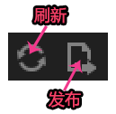

# 工具栏介绍

>LayairierIDE 1.7.3 bate 를 채용하면 최신 LayairIDE, 최신 버전 아이디를 기준으로 다운로드하십시오.

도구 모음은 편집기 메인 창의 정위 위쪽에 위치하고 메뉴 표시줄 아래에서 항목을 열 때 8조 제어 단추나 정보를 볼 수 있으며, 특정 패널에 편집 기능을 제공하거나 작업을 편리하게 할 수 있습니다.

​         

(그림 1)

 

###프로젝트 조작 도구

​< br >>
(2)

새 디렉터리: 현재 항목에서 디렉터리 폴더를 새로 만들기, 단축키 (Ctrl + D).

새 페이지: 선택한 디렉터리에 페이지 (Page) 를 새로 만들기 (Ctrl + N).

 

###저장 도구

​< br >>
(그림 3)

현재: 현재 동작을 저장하는 페이지, 단축키 (Ctrl + S).

모든: 이 항목에 대한 모든 변경을 저장하고 단축키 (Ctrl + Shift + S).

 

###취소 도구

​< br >>
(그림 4)

취소: 현재 조작 취소, 단축키 (Ctrl + Z).

취소 취소: 취소할 때 취소된 조작을 되돌려와 단축키 (Ctrl + Y).

 

###넷, 게시 도구 새로 고침

​        < br >>
(그림 5)

새로 고침: 사용자가 새 자원을 가져오거나 파일을 변경한 후에 새로 고칠 수 있으며, 프로그램은 자동으로 새로운 자원이나 설정, 단축키 (F5)

발표: 사용자가 설계를 완료한 후, 게시 파일을 공유하거나 사용할 수 있으며, 단축키 (F12) 를 클릭할 수 있습니다.

 

###보기 도구

​        < br >>
(그림 6)

보기 크기 좁히기: 보기 단추를 줄이면 자동으로 축소할 수 있지만, 설계 폭이 높은 컨트롤 크기에 영향을 주지 않고 단축키 (Ctrl +) 를 누르십시오.

확대 보기: 확대 보기 단추를 누르면 화면이 자동으로 확대되고, 설계 폭이 높고, 컨트롤 크기, 단축키 (Ctrl +) 를 확대합니다.

보기 회복: 보기 단추를 누르면 자동으로 초기 크기로 복구, 단축키 (Ctrl +).

 

###6、정렬 도구

   

(그림 7)

왼쪽 정렬: 여러 개의 컨트롤 왼쪽 정렬 방식은 가장 왼쪽 컨트롤의 시작 좌표를 정렬 지점으로 왼쪽 정렬합니다.

오른쪽 정렬: 여러 컨트롤 오른쪽 정렬 방식은 오른쪽 컨트롤의 끝 좌표를 시작으로 오른쪽 정렬할 것입니다.

수평 정렬: 여러 가지 컨트롤 수평 정렬 방식을 자동으로 계산 수평 중심 좌표를 거중 정렬한다.

수직거중 정렬: 여러 개의 컨트롤 수직 정렬 방식은 자동으로 수직 중심 좌표를 계산합니다.

정상 정렬: 다중 컨트롤 최상위 컨트롤의 정점 좌표로 정렬 지점을 정렬로 정렬할 것이다.

아래쪽 정렬: 다중 컨트롤 베이스 정렬 방식은 최하측 컨트롤의 하부 좌표를 정렬 지점으로 하부 정렬할 것입니다.

수평 평균 간격: 수평 간격 간격 자동으로 계산한 후 평균 거리 수준에 따라 정렬된다.

수직 평균 간격: 여러 가지 컨트롤은 수직 간격으로 자동으로 계산한 후 평균 거리를 수직으로 정렬한다.

 

###7위 변위 조작

​< br >>
(그림 8)

왼쪽 모서리로 이동: 선택한 컨트롤을 화면의 왼쪽 좌측 위치로 이동합니다.

왼쪽 아래로 이동: 선택한 컨트롤을 화면의 왼쪽 아래로 이동합니다.

오른쪽으로 이동: 선택한 컨트롤을 화면으로 이동하는 오른쪽 오른쪽 좌우로 이동합니다.

오른쪽 아래로 이동: 선택한 컨트롤을 화면의 오른쪽 아래로 이동합니다.

수평으로 이동: 선택한 컨트롤을 장면 보기 수준의 위치로 이동하고, 컨트롤의 수직 위치는 변하지 않습니다.

수직으로 이동: 선택한 컨트롤을 배경 보기의 수직 위치로 이동하고, 컨트롤 수준의 위치는 변하지 않습니다.

상대 원점 중: 선택한 컨트롤을 장면 보기 원점 (0, 0) 으로 이동하고, 원점 위치를 수직과 수직 위치로 진행합니다.

 