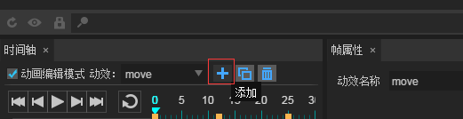
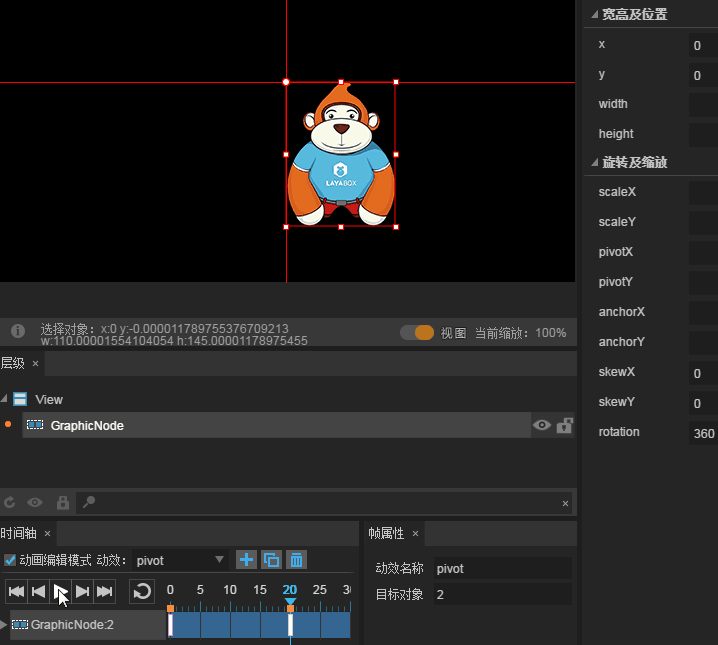
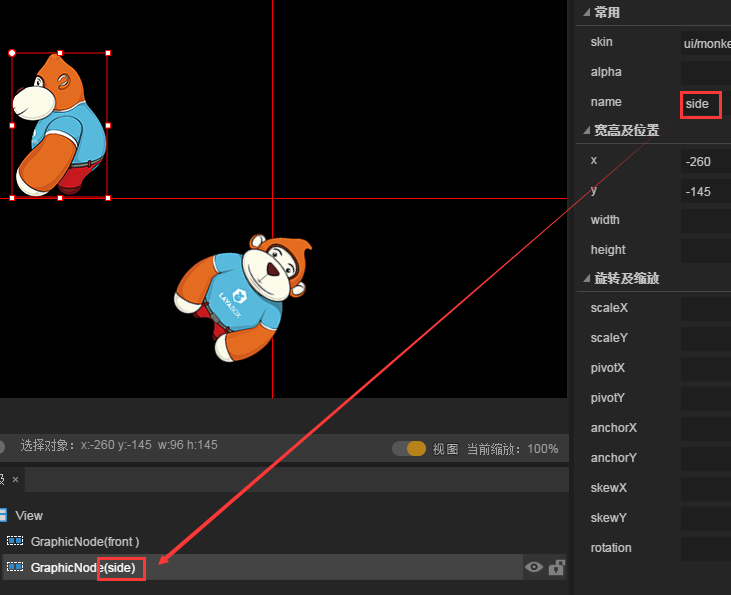
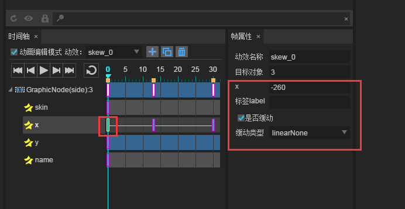

#시간축 애니메이션 편집기 자세

*【주의】 이번 교정은 레이어이더의 1.73 버전을 채택하고 있으며, 글에는 다르면 최신 LayairIDE 버전을 기준으로 삼으세요.*

> 시간축 애니메이션 편집기는 LayaiairiDE 핵심 모듈로 시간축에 대한 관건 프레임 제작을 통해 자동으로 운동의 애니메이션 프레임을 생성해 빠른 실현 게임에서 alpha 투명도 점변, 변환, 회전, 회전, 축소 등 애니메이션 효과를 가진다.제작진의 대부분을 절감해 개발 효율을 높였다.이 편은 시간축을 생성하고 인코딩으로 운용해 시간축 애니메이션 편집기의 기능과 사용을 전면 소개합니다.
>>


#1. 시간축 만들기 애니메이션

　**시간축 애니메이션 두 가지 생성 방식**.하나의 것은 창건이다`.ani`파일의 시간축 애니메이션, 또 하나는 UI 쪽 () 에 있습니다`.ui`파일) 안에 시간축 애니메이션 만들기.

두 파일 제작 시간축 애니메이션 방식은 완전히 같다.**구별**… 에 있다`.ani`파일 안에 만든 시간축 애니메이션은 다른 UI 페이지에 사용되며, UI 페이지 안에 만든 시간축 애니메이션은 현재 UI 페이지에서만 사용할 수 있습니다.

통용 시간축 애니메이션`.ani`파일 안에 생성.본편`.ani`파일 방식을 예시하다.

**Tips**：

-UI 페이지에 시간축 애니메이션 만들기 위해서는 우선`场景编辑器`내에서 편집할 애니메이션 구성 요소를 편집한 다음 시간축 패널을 클릭하십시오`动画编辑模式`애니메이션 편집 조작.

-UI 페이지에서 시간축 만들기`动画编辑模式`선택한 상태를 선택하면, 바로 구성 요소를 끌어들이면 안 된다.`场景编辑器`먼저 물러날 필요가 있다`动画编辑模式`사용할 UI 구성 요소를 우선 끌어 넣기`场景编辑器`그리고 다시 들어갑시다`动画编辑模式`편집하다.

​

###1.1 시간축 만들기 애니메이션 파일 ani

**절차 1**프로젝트 관리자 중`右键`메뉴 중`新建`->`动画`그림 1 개.

< br / > (그림 1)


**절차 2**왼쪽 단추 클릭`动画`이후 시간축 애니메이션 패널 만들기.패널에서 GraphicAnimation 형식을 선택하여 입력하십시오`动画名称`클릭`确定`시계를 2 개처럼.

< br / >2)

*Tips:패널의 각 코너 설명, 문서'UI 페이지, 입자, 애니메이션, 스크립트 신규 판넬 상세*

클릭 이 확정된 후 곧 완성되었다`TimeLine.ani`애니메이션 파일의 생성, 자동으로 열고 애니메이션 편집 모드로 들어갔다.제시한 대로.

<br/>(图3)


**Tips**:

열다`.ani`혹은`.ui`서류`时间轴`패널과`帧属性`패널은 기본적으로 IDE 아래쪽에 위치하고 있으며 시간축 애니메이션이 두 패널을 맞추어 사용해야 합니다. 만약 찾을 수 없거나 조심하지 않으면 단축키를 눌 수 있습니다.`F3`기본 패널 레이아웃으로 복구합니다.

있다`.ani`파일 중, 장면 편집 구역의 시작 좌표`0,0`) 지점은 두 줄의 붉은 선이 교차하는 중심점에 위치한다.UI 파일의 왼쪽 모퉁이와 달리 주의해야 합니다.


###  

###1.2 이동 시간축 애니메이션 만들기

####1.2.1 시간축 변경 효과 이름

<br/>(图4)


시간축 패널에는 여러 개의 애니메이션 효과를 관리할 수 있으며, 기본값은 애니1, ani2...anix 이름으로 기억을 구분하기 위해 Google은 Google을 변경할 수 있습니다.수정 후 새로 고칠 필요는 없고, 즉시 효력을 발효할 수 있는 대로 5개 시사하는 것이다.

< br / > (그림 5)


####1.2.2 애니메이션 편집 모드.

애니메이션 편집 패턴을 뽑아야 현재의 애니메이션 효과를 편집할 수 있다.편집 모드에 들어간 후 기본적으로 0 프레임에 따르면 그림 6개처럼 보여집니다.(* 시간축 애니메이션 0 프레임부터 재생 *)

< br / > (그림 6)


####1.2.3 애니메이션 자원 가져오기

자원 판넬에서 비디오 자원 (Image 구성 요소) 를 애니메이션 패널에 끌어당겨 자동으로 0 프레임에 결정적인 프레임을 생성할 수 있습니다.7 시에 제시한 바와 같다.

< br / > (7)

그림 7 중`GraphicNode:2`애니메이션 노드`第0帧`볼 수 있다`2`목표 대상의 값이다.


####1.2.4 키워드 프레임 만들기

결정적인 프레임은 세 가지 방식이다.각각 층급 패널에서 오른쪽 키를 생성하고, 장면 편집기 중 오른쪽 키를 생성하고, 구성 요소를 바꾸는 임의의 속성치가 자동으로 생성되었습니다.

**첫 번째: 레이어드 패널에 생성**

어떤 프레임에 체크된 후, 층층의 패널의 구성 노드를 선택하면`右键`->`创建关键帧`8-1의 지시.
< br / > (그림 8-1)

**두 번째: 장면 편집기 중 오른쪽 키 만들기**

장면 편집기 중 선택한 장면의 구성 요소 후`右键`->`创建关键帧` 

< br /> (그림 8-2)


**第三种：自动创建。**

장면 편집기에서 구성 요소를 선택하면 구성 요소의 임의 속성치를 바꾸면 자동으로 결정적인 프레임을 생성할 수 있습니다.

본 예에서 우리는 세 번째 방식을 채택하여 창건했다.일단 마우스로 뽑을게요.`第20帧`그리고 x 축의 속성값을 변경`160`이 때 자동으로 20 프레임 생성 열쇠 프레임 을 성공적 으로 x 축 을 만들었습니다`0`이르다`160`시간축 이동 애니메이션.8-3의 지시대로.

< br / > (그림 8-3)


####1.2.5 재생 시간축 애니메이션

애니메이션 버튼은 왼쪽에서 오른쪽으로 순서대로`首帧`버튼`上一帧`버튼`播放/暂停`버튼`下一帧`버튼`尾帧`(* 마지막 관건 프레임 *) 단추`循环播放`단추.다른 단추에 애니메이션의 효과는 동영상 9개와 같다.

< br / > (동영상 9)

**첫 프레임 버튼**클릭 후 재생 지침은 시간축으로 이동하는 첫 프레임 (*) 입니다.

**프레임 단추**클릭 후 재생 지침은 현재 프레임의 프레임으로 이동합니다.현재 프레임이 첫프레임이라면, 포인터가 관전 프레임으로 이동하는 마지막 프레임으로 재생된다.

**재생 단추**클릭 후 현재 프레임 위치에서 애니메이션 효과를 내며 마지막 관건 프레임 정지를 시작합니다.재생 상태에서 누르면 애니메이션이 잠시 멈추고 재생할 때 재생되는 프레임은 계속 방영됩니다.

**다음 프레임 단추**현재 프레임의 다음 프레임으로 이동현재 프레임이 결정적인 프레임의 마지막 프레임이라면, 재생 지침은 첫 프레임으로 이동한다.

**마무리 프레임 버튼**클릭 후 재생 지침은 시간축 관건으로 이동하는 마지막 프레임입니다.

**반복 재생 단추**재생 단추를 누르면 재생 단추를 누르면 애니메이션이 반복됩니다.


　　


###1.3 속성 패널 통해 애니메이션 효과 만들기

구성 요소의 속성 패널에서 일부 보조 애니메이션 효과가 실현되는 속성, 이번 절에는 각각 예를 들어 소개한다.

####1.3.1 회전 애니메이션 효과 증가

예를 들어 우리가 이전 이동한 애니메이션 바탕에 축심점과 회전 각도를 통해 변화시켜 이동 회전의 애니메이션 효과를 만든다.동도 10개와 같이.

< br / > (동영상 10)

**조작 절차:**

마지막 관건 프레임 (제20프레임) 선택하면 구성 요소, 속성 패널 수정:`x`235`y`값은 100이고`pivotX`값은 50이고`pivotY`값은 100이고`rotation`값은 270이다.재생 클릭하면 됩니다.

**속성 해석:**

`x`과`y`구성 요소의 위치 좌표입니다.

`pivotX`과`pivotY`구성 요소의 축심점 좌표 x 와 y.

`rotation`구성 요소의 회전 각도입니다.


####1.3.2 추가 애니메이션 효과

이전 애니메이션의 기초에서 크기 조정 비율을 통해 시간축 애니메이션의 축소 효과를 볼 수 있으며 동영상 11개 시사됩니다.

<br/>(动图11)


**조작 절차:**

마지막 관건 프레임 (제20프레임) 선정 구성 요소, 속성 패널 수정`scaleX`과`scaleY`값은 모두 0.3으로 설정되어 있다.장`rotation`360 변경

**속성 해석:**

`scaleX`구성 요소의 수평 방향 조정, 기본값은 1, 크기 조정하지 않습니다.

`scaleY`구성 요소의 수직 방향 조정, 기본 값은 1, 크기 조정하지 않습니다.


####1.3.3 애니메이션 투명 점변 효과 증가

투명 그라데이션 효과도 흔히 사용하는 애니메이션 효과 중 하나로 alpha 수치를 수정해 담입 페이드아웃 등 투명한 점변효과를 쉽게 실현할 수 있다.우리는 계속 이전 애니메이션의 기초 위에서 연장한다.효과는 동도 12소와 같다.

<br/>(动图12)


**조작 절차:**

마지막 관건 프레임 (제20프레임) 선정 구성 요소, 속성 패널 수정`scaleX`과`scaleY`값은 모두 0.2로 수정되었다.장`rotation`720으로 고치다.`alpha`설정하다

**속성 해석:**

`alpha`투명도 속성값입니다. 기본값은 1, 불투명합니다.0은 완전히 투명하고 속성의 가치 평가 범위는 0~1.


####1.3.4 축 포인트 애니메이션 효과 설정

#####새 시간축 애니메이션 만들기

아까의 위치 이동 효과를 구분하기 위해서, 우리는 가호 아이콘을 클릭하고, 시간축 애니메이션을 하나 더 만들기, 그림 13-1의 시사입니다.

<br/>(图13-1)


생성 후 애니메이션 이름을 pivot 로 바꾸면, 우리는 애니메이션 목록에서 새로 만든 것을 볼 수 있다`pivot`애니메이션`move`애니메이션은 그림 13-2의 지시를 통해 목록의 이름을 누르면 다른 애니메이션의 전환을 실현할 수 있다.

< br /> (그림 13-2)


#####중심점을 중심으로 하는 애니메이션 만들기.

축심점을 설정하지 않을 때 기본적으로 구성 요소 왼쪽 좌상각을 축심으로 삼을 때 우리는 회전 동작을 진행하며, 동작도 14-1의 보여 줍니다.

< br / > (동영상 14-1)

그림의 중심점 회전이 어떻게 되려면 두 가지 방식으로 이루어질 수 있다.

**첫 번째: 닻점을 통해 이루어진다**

닻점은 구성 요소의 X 또는 Y 축의 최대 길이의 비율에 따라 설정하고, 값을 치르는 것이다`0-1`예컨대 우리`anchorX`과`anchorY`속성 값`0.5`X 축과 Y 축 길이의 50% 위치에서 축심점 좌표를 얻는 것이다.이렇게 시간 축미의 프레임에 회전 각도를 설정합니다`rotation为360`중심점을 축심으로 돌리는 효과는 동영상 14-2의 시사된다.

<br/>(动图14-2)


**Tips**：*닻점을 통과하는 것은 매우 편리한 축심점 설정 방식이다.그러나 닻점 방식은 UI 구성 축심점을 설정할 수 있으며 Graphics 구성 요소와 Sprite 등 2D 기초 구성 요소의 축심점은 두 번째 방식으로 이뤄질 수 있다.*


**둘째: 축심점 속성 실현**

우리는 중심점을 축심으로 회전하고 싶고, 축심점 속성으로 구성된 요소를 중심으로 축심점을 설정할 수 있습니다. 예를 들어 그림의 크기는 크기입니다.`110*145`그렇다면 원폭 높이를 2로 나누면 중심점 위치, 설정`pivotX`속성 값`55`,`pivotY`속성 값`72.5`.그리고 애니메이션 재생, 첫 번째 방법과 같은 효과.동도 14-3이 제시한 것처럼.

<br/>(动图14-3)


**Tips**：*정박점에 대해 0.5를 직접 설정하면 중심점을 축심점, 축심점 속성 설정에 간단한 계산이 필요합니다.하지만 축심점 방식은 더욱 광범위하고 구성 요소를 설정할 수 있을 뿐만 아니라 용기와 Sprite 도 설치할 수 있다.*


####1.3.5 경사각도의 애니메이션 효과 설정

#####경사 속성의 좌표계

경사 속성 skewX 와 skewy의 좌표계는 일반 좌표계와 달리**수평 방향은 y, 수직 방향은 x**.그림 15개.

< br / > (그림 15)

skewX 와 skewy의 경사 각도를 이해하기 위해.우리는 바로 시간축 애니메이션으로 표현한다.

#####skewX 의 경사 변화 효과

조작: 네`第0帧`어떤 효과도 설정하지 않고`第20帧`skewX 를 설정합니다`30`재생 후 구성 요소의 skewX 축은 시계 방향으로 변한다.동도 16-1이 제시한 것처럼.

< br /> (동영상 16-1)

**Tips**:*만약 skewX 가 음수에 이르면, 구성 X 축은 시침방향으로 변한다.*

#####skewy의 경사 변화 효과

조작: 네`第0帧`어떤 효과도 설정하지 않고`第20帧`skewy 설정`30`재생 후 구성 요소의 skewy 축은 시계 방향에 따라 변형된다.동도 16-2 시범.

< br /> (동영상 16-2)

**Tips**:*만약 skewy가 음수에 이르면, 구성 요소 Y 축은 시계바늘 방향으로 변한다.*

#####skewy와 skewy 동시에 경사 변화 효과

조작: 네`第0帧`어떤 효과도 설정하지 않고`第20帧`skewX 를 설정합니다`30`skewy 설정`20`재생 후 구성 요소의 skewX 시계 방향 이동, skewy 축 시계 방향 이동, 공동 압축 구성 요소 변형.동도 16-3이 제시한 것처럼.

< br /> (동영상 16-3)

#####변형 의 경사 애니메이션 효과 가 생기지 않다

이전의 시사예는 모두 skew 속성치가 정수에 이르렀을 때 경사각도로 변화해 생기는 형태의 변화 효과가 있다. 만약 Skew 속성치가 부정적인 방향으로 바뀌면 반대 방향이다.따라서 skewX 와 skewy는 같은 수치 각도를 채택하고, 하나의 속성은 정수이며, 다른 속성은 마이너스다.그렇다면 경사각과 방향이 같을 것이고, 형태가 달라지지 않는다.우리는 간단한 시계추 효과를 통해 변함없는 경사 애니메이션 효과를 보여 준다.

조작: 네`第0帧`설치`skewX`되다`-50`,`skewY`되다`50`.제15프레임`skewX`되다`10`,`skewY`되다`-10`.제30프레임`skewX`과`skewY`수치는 제0프레임과 일치한다.설치 후 재생 효과는 동영상 16-4의 시사입니다.

<br/>(动图16-4)


##2. 애니메이션 편집기 소개

애니메이션 편집기에는 두 개의 기본 개념이 있습니다: 노드 층과 노드 속성층을 표시합니다.17개 시사하듯`GraphicNode`노드 보이기 위해 뒤의 숫자는 목표 대상의 아이디와 애니메이션 장면에서 애니메이션 구성 요소를 늘리면 시간축에 대한 노드 를 늘릴 수 있다.노드 좌측의 전개 단추 누르기 (* 삼각 *) 을 누르면 모든 노드 애니메이션 속성을 볼 수 있다`skewY`과`skewX`시간축 애니메이션에서 이루어져야 할 경사 애니메이션 속성이며 애니메이션 속성을 늘리며 노드 아래에 대응하는 노드 속성층이 늘어난다.

< br / > (그림 17)

###2.1 새로운 애니메이션 및 삭제

이전의 예식은 이미 통과되었다`+号`버튼은 새로 빈 시간축 애니메이션 동작을 선보였으나, 애니메이션 복제 버튼을 통해 원애니메이션 같은 새로운 애니메이션과 같은 새로운 애니메이션이 추가되고, 새로운 애니메이션은 애니메이션의 기초에 근거하여 계속 확장과 조정할 수 있다.그림 18 중 애니메이션 목록에서 새로운 애니메이션 이름 복사 방식을 볼 수 있습니다.`原动画名_0,原动画名_1,.....`예를 들어 18 중,`skew_0`과`skew_1`복사`skew`,`skew_0_0_0`복제`skew_0_0`.여러분도 프레임 속성 패널에서 기본 애니메이션을 수정할 수 있습니다.

< br / > (그림 18)

삭제 단추를 눌렀을 때 삭제 여부를 누르면 현재 애니메이션을 삭제할 수 있습니다. 그림 19-1의 그림을 삭제할 수 있습니다.

< br /> (그림 19-1)

**Tips**:**여기에는 시간축 애니메이션 삭제는 시간축의 애니메이션 효과 및 속성을 삭제할 수 있으며, 장면 속의 애니메이션 노드를 삭제하지 않는다는 것이다**.특히 우리는 마지막 애니메이션도 삭제한 후 노드 삭제되지 않은 상황을 더욱 눈에 띄게 볼 수 있다. 마치 19-2의 시사와 같다.

< br /> (그림 19-2)


###2.2 노드 애니메이션 증가 및 삭제

####2.2.1 신규 노드 및 노드 이름

그동안 시간축 애니메이션 시연을 진행해 왔던 시간축 애니메이션 복제에 skew 애니메이션 을 새로 한 다음 새로운 구성 을 끌었다.곧 자동으로 노드 층이 추가될 것이다.

여러 노드 가 나란히 나타날 때, 직관하지 않아, 조작 을 잘 구분하지 못하는 것은 장면 중의 어떤 노드 이다.따라서 노드를 선택해서 속성 관리자에게 name 속성치를 설정하고, 그림 20개처럼 보여 줍니다.

< br / > (그림 20)

####2.2.2로 여러 노드 애니메이션 만들기

새로 늘고 있는 노드 층에서는 실제 수요에 따라 이전 노드 층과 완전히 다른 위치의 관전 프레임은 설정할 수 있다. 예를 들어 이 노드 층이 서로 같은 이동하는 애니메이션을 만들고, 고의로 두 번째 프레임은 13프레임 위치에 설치된다.애니메이션 제작이 완료된 후 효과는 동영상 21개와 같다.(* 전문은 이미 제시한 기초 조작은 더 이상 상세하게 설명할 수 없을 것이다 *)

< br / > (동영상 21)

**Tips**이 예의 이동 애니메이션은 음좌표 구역 안에 있다.여기에 특별히 설명이 필요합니다.`时间轴动画的负坐标区域内，无法触发点击事件`클릭 이벤트가 필요하다면 애니메이션의 X 와 Y 는 정좌표 구역에 위치해야 하며, 십자홍선이 교차하는 우하구역이다.

####2.2.3 노드 삭제

< br / > (그림 22-1)

만약 우리가 22-1 중, 노드, 오른쪽 단추를 선택하면`删除`노드 속성처럼 현재 노드를 삭제할 수 없습니다. 현재 노드 중에서 만든 애니메이션 효과와 노드 속성을 삭제할 수 없습니다.그림 22-2

< br /> (그림 22-2)

그럼 노드를 어떻게 삭제할까요?필요하다`层级`패널에서 삭제할 노드를 선택한 다음 오른쪽 단추`删除`마치 22-3이 제시한 것처럼.스포일러를 하고 있습니다.`是否删除`클릭`确定`곧.하면, 만약, 만약...**애니메이션 목록 안에 여러 개의 애니메이션 이 있다**모든 애니메이션에 사용되지 않았다는 것을 반드시 주의해야 한다.**일단 삭제되면 다른 애니메이션 안의 이 노드 와 애니메이션도 사라진다.**

< br / > (그림 22-3)


###2.3 노드 속성 및 완화 효과 설정

노드 아래는 각 노드 속성층으로 선택되어 노드 속성의 프레임 속성을 볼 수 있으며 상세한 프레임 속성을 볼 수 있다.

< br / > (그림 23)

####노드 프레임 속성 소개

`x`x 는 속성 이름으로, -260은 현재 프레임의 값입니다.Skin을 선택하면 Skin 속성명과 대응 값을 표시합니다.이 란은 수정할 수 없다.

`标签label`이 표시줄 설정 후 항목에서 탭 이름으로 이 프레임에 대해 작동할 수 있습니다.탭을 설치한 후 탭을 설치하는 프레임은 빨간색 둥글게 둥글게 나타난다. 그림 24가 제시한 것처럼 보인다.

<br/>(图24)


`是否缓动`활성 효과를 사용하지 여부를 선택할 수 있습니다. 기본값은 선택할 수 있습니다.

`缓动类型`기본 linearNone 의 완화 효과에 따라 다른 효과개발자는 스스로 체험할 수 있습니다.

**Tips**:*현재 애니메이션의 시작 프레임 위치를 늦춰야 할 경우 유형 유형자를 각별히 주의해야 한다.*


###2.4 프레임 애니메이션 만들기

프레임 애니메이션도 게임에서 자주 쓰는 애니메이션 중의 하나다.시간축에는 두 가지 프레임 애니메이션 제작 방식이 있다.

#####첫 번째 방식, 연속 키워드 프레임 만들기

첫 단계: 첫 번째 프레임을 끌어당기는 구성 요소는 장면 편집기에 들어간다.2단계: 시간축에서 연속 관건 프레임 만들기.마치 25-1의 시사와 같다.

<br/>(图25-1)


3단계: 각 프레임 스킨의 속성을 교체하는 것은 동영상 25-2의 제시.그리고 재생 클릭하면 애니메이션 효과를 볼 수 있다.

< br /> (동영상 25-2)

**Tips**:*구성 요소를 시간축으로 나누면 장면에서 여러 개의 애니메이션 노드가 나타난다.원하는 프레임 애니메이션 효과가 아니다.*

#####두 번째 방식: 일회성 창건

대량 선택에서 구성 요소를 시간축으로 끌어당기면 직접 프레임 애니메이션을 만들 수 있으며, 이러한 방식은 더욱 빠르다.애니메이션 25-3이 제시한 것처럼.

<br/>(动图25-3)


###2.5 밑바닥 기능조

< br / > (그림 26)

시간축 애니메이션 편집기의 밑부분 기능조에서 구체적인 설명은 다음과 같습니다:

`帧率：`기본은 24프레임으로 프레임율을 바꾸어 재생하는 프레임 속도를 바꿀 수 있다.

`加载后：`다른 동작을 선택하면, 다운로드 후에 대응하는 동작을 실행할 수 있습니다.재생, 재생, 재생, 재생 3가지 옵션, 기본적으로 재생하지 않습니다.

*Tips: 이 설정은 UI 시간축에서 애니메이션 편집할 때 유효합니다. Ni 파일의 애니메이션 편집 시 설정이 잘못되었습니다.*

`帧：`기본 현재 프레임 표시, 목표 프레임수를 입력한 후 회차, 바로 목표 프레임수로 이동합니다.

`圆形滑动条：`시간축에 쓰는 프레임과 프레임 사이의 디스플레이 간격 조절.동도 27-1이 제시한 것처럼.

< br /> (동영상 27-1)

`矩形滑动条：`슬라이더 이동 시간축을 끌며 미끄러져 시간축의 프레임에 사용된다.동도 27-2가 제시한 것처럼.

< br /> (동영상 27-2)


##3. 시간축 애니메이션

###3.1 시간축 애니메이션 내보내기

IDE 내 단축키 F12 나 Ctrl + F12를 누르면 시간축 애니메이션`.ani`파일 생성`项目根目录/bin/`목록 아래.애니메이션에 사용된 자원 도집은 위치에 있다`项目根目录/bin/res/atlas/`디렉토리 아래, 마치 28 시.

<br/>(图28)


###3.2 프로젝트 중 시간축 애니메이션 사용

프로젝트 중 시간축 애니메이션은 주로 3단계로 나뉜다.

첫걸음: 애니메이션에 필요한 도화를 다운로드합니다.


```typescript

//加载图集成功后，执行onLoaded回调方法
Laya.loader.load("res/atlas/ui.atlas",Laya.Handler.create(this,this.onLoaded));
```


2단계: 애니메이션 파일 생성


```typescript

//创建一个Animation实例
var tl:Laya.Animation = new Laya.Animation();
//加载动画文件
tl.loadAnimation("TimeLine.ani");
```


3단계: 애니메이션 추가, 애니메이션


```typescript

//添加到舞台
Laya.stage.addChild(tl);
//播放Animation动画
tl.play();
```


완전한 예시 코드 다음과 같습니다:

**입구 종류 GameMain.ts**


```typescript

// 程序入口
class GameMain{
    constructor()
    {
        //初始化引擎
        Laya.init(1334,750,Laya.WebGL);
        //设置舞台背景色
        Laya.stage.bgColor = "#ffffff";
        //加载图集成功后，执行onLoaded回调方法
        Laya.loader.load("res/atlas/ui.atlas",Laya.Handler.create(this,this.onLoaded));
    }
    private onLoaded():void{
        //创建一个Animation实例
        var tl:Laya.Animation = new Laya.Animation();
        //加载动画文件
        tl.loadAnimation("planCrashed.ani");
        //添加到舞台
        Laya.stage.addChild(tl);
        //播放Animation动画
        tl.play();
    }
}
new GameMain();
```


부호 실행 효과는 동도 29의 시사됨:

< br /> (동영상 29)

###3.3 시간축 애니메이션 사용

앞서 저희가 TimeLine.ani 에서 여러 개의 애니메이션을 만들었는데, 어떻게 다른 애니메이션을 사용합니까?이때 애니메이션 이름의 가치가 드러났다.기본 재생 방법 사용하기`play()`할 때, 결성은 첫 번째 애니메이션이다.다른 애니메이션을 사용하려면 세 번째 인자에 애니메이션 이름을 설정하면 된다.`play()`방법의 api 인자 설명은 그림 30개처럼 보여 준다.

< br / > (그림 30)

애니메이션 애니메이션 애니메이션 사용의 사례 코드 변경:

**입구 종류 GameMain.ts** 


```typescript

// 程序入口
class GameMain{
    constructor()
    {
        //初始化引擎
        Laya.init(1334,750,Laya.WebGL);
        //设置舞台背景色
        Laya.stage.bgColor = "#ffffff";
        //加载图集成功后，执行onLoad回调方法
        Laya.loader.load("res/atlas/ui.atlas",Laya.Handler.create(this,this.onLoaded));
    }
    private onLoaded():void{
        //创建一个Animation实例
        var tl:Laya.Animation = new Laya.Animation();
        //加载动画文件
        tl.loadAnimation("planCrashed.ani");
        //添加到舞台
        Laya.stage.addChild(tl);
        //播放Animation动画
        tl.play();

        //创建一个新的Animation实例
        var tl2:Laya.Animation = new Laya.Animation();
        //加载动画文件
        tl2.loadAnimation("TimeLine.ani");
        //添加到舞台
        Laya.stage.addChild(tl2);
        //播放Animation动画的pivot动画
        tl2.play(0,true,"pivot");
        //动画的显示位置
        tl2.pos(300,0);
    }
}
new GameMain();
```


예를 들어 부호 실행 효과는 동도 31 시 표시:

<br/>(动图31)


###3.4는 UI 에서 시간축 애니메이션을 사용한 뒤 프로젝트 코드에서 호출한다.

####3.4.1 UI 페이지 생성, 애니메이션 애니메이션 애니메이션 추가.

저희가 하나 만들어보도록 하겠습니다.`TimeLine.ui`UI 페이지, 바로 잡아당기기`planCrashed.ani`광경에 가면 32개 그림처럼 보인다.

< br / > (그림 32)


####3.4.2 애니메이션 속성값 설정

UI 장면 중 애니메이션은 속성치를 설정할 수 있다.여기 저희가 일단 설치를 해볼게요.`var`이 값은 설정해야 합니다. 그렇지 않으면 애니메이션을 사용할 수 없습니다.그리고 위치속성 x 값을 500 (* 0 (* 에 pos 값 *) 을 설정하고 기존 애니메이션과 겹치는 것을 피합니다.다른 속성값은 하나하나 소개되지 않는다. 마우스가 속성이름으로 이동하면 대응할 소개가 있다.마치 33의 시사와 같다.

 <br /> (图33)


####3.4.3 프로젝트 중 UI 애니메이션 호출

F12 에 따라 내보내기 직전 예에 코드를 추가하면 됩니다.코드 예례는 다음과 같다:

**입구 종류 GameMain.ts** 


```typescript

// 程序入口
class GameMain{
    constructor()
    {
        //初始化引擎
        Laya.init(1334,750,Laya.WebGL);
        //设置舞台背景色
        Laya.stage.bgColor = "#ffffff";
        //加载图集成功后，执行onLoad回调方法
        Laya.loader.load("res/atlas/ui.atlas",Laya.Handler.create(this,this.onLoaded));
    }
    private onLoaded():void{
        //创建一个Animation实例
        var tl:Laya.Animation = new Laya.Animation();
        //加载动画文件
        tl.loadAnimation("planCrashed.ani");
        //添加到舞台
        Laya.stage.addChild(tl);
        //播放Animation动画
        tl.play();

        //创建一个新的Animation实例
        var tl2:Laya.Animation = new Laya.Animation();
        //加载动画文件
        tl2.loadAnimation("planCrashed.ani");
        //添加到舞台
        Laya.stage.addChild(tl2);
        //播放Animation动画的pivot动画
        tl2.play(0,true,"pivot");
        //动画的显示位置
        tl2.pos(300,0);

        //创建一个UI实例
        var plan:ui.TimeLineUI = new ui.TimeLineUI()
        //添加到舞台
        Laya.stage.addChild(plan);
        //播放UI场景中的动画
       plan.crashed.play();
    }
}
new GameMain();
```


실행 효과는 동영상 34개 시사하듯:

< br / > (동영상 34)

UI 에서 사용하는 애니메이션은 UI 속성 관리자에게 직접 애니메이션 속성을 제어할 수 있습니다.예를 들어 우리는 비행기의 폭발 속도를 떨어뜨리고 싶다.그럼 우리는 UI 에서 애니메이션을 선택하고 인터바의 속성치를 설정하면 된다.interval 은 애니메이션 재생 간격을 제어하는 (단위는 밀리초) 로 설정되지 않을 때 기본적으로 50밀리초입니다.이곳은 우리가 더 많이 바꾸면 비행기의 폭발 속도를 떨어뜨릴 수 있다.35 개의 그림을 그리다.

< br / > (도 35)

변경 후 F12 로 내보내기 후 항목 코드 변경 없이 직접 번역, 바로 운송 효과 변경, 동영상 36 시 제시.

< br / > (그림 36)


이에 따라 시간축 애니메이션의 제작과 사용은 이미 소개됐다.더 많은 시간축 애니메이션에 대한 API 사용은 볼 수 있다[Animation API文档](http://layaair.ldc.layabox.com/api/index.html?category=Core&class=laya.display.Animation).