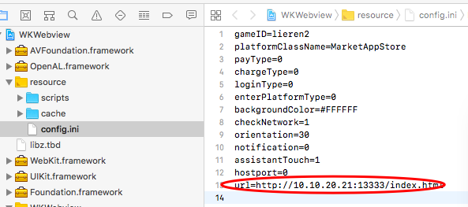

# 3D
Layaiair-1.0의 3D 프로젝트를 임시적으로 지원하며 가장 기초적인 webgl 지령을 사용하고, iOS 버전은 WKWebview 를 사용할 수 있지만 LayaDCC 를 사용할 수 있습니다.(Layanaative2.0, Layaiaiaiaiaiaia 2.0과 함께 발표, Layanaative2.0의 3D 프로젝트 체험은 크게 개선될 것으로 예상된다. 일부 개발자들을 위해 Layaia 1.0으로 한 3D 프로젝트를 활용하기 위해 임시 지원했다)
###1.LayaNative
엔진 최저 버전 요구 Layaiair Native SDK 1.0 Layair 1.7.19.1 beta
현재 Layaiair는 아직 새로운 버전을 발표하지 않았기 때문에 개발자 수공은 Layair-1.19.1-1-beta 버전에서 코드를 수정해야 한다.
자세한 문서: https://github.com/layabox/layair-doc/blob/master/Chinese/LayaNative/3d/modify.md
####1. 3D 프로젝트 만들기
#####1. 수동 생성
config.js 아래에 한 줄 코드 추가

```javascript

window.ConchRenderType = 6;
```

**TIPS:****
ios 버전: 프로젝트의 resourcescriptsconfig.js
****android 버전: 프로젝트의 asetsscriptsconfig.js**
#####2.LayaNative 명령 실행 도구 생성

```javascript

$ layanative createapp -f SnowBallH5 -t 1 -n SnowBallNative -u http://10.10.20.102:8899/index.html -v v0.9.5 -d 3D
```

#####3.IDE 생성
####2. 채널 대합
2D 버전 참고 관련 문서
https://ldc.layabox.com/doc/? nav=zh-as-0-3-0
###2.webview
iOS 플랫폼에서 webview 방안도 제공했습니다.
####1. 주소 시작
  

####2. 가로 세로 화면 설정
  

변수의 의미는 다음과 같습니다:

```

orientation=2   //竖屏：IOS home键在下   
orientation=4   //竖屏：IOS home键在上   
orientation=8   //横屏：IOS home键在左   
orientation=16  //横屏：IOS home键在右   
```

orientation 값은 사용할 수 있습니다`按位或`형식 설정:

```

orientation=6   //代表竖屏可以任意旋转  
orientation=24  //代表横屏可以任意旋转  
```

####3. 로컬 캐시 자원

```

layadcc C:\Users\lvfulong\Desktop\3d\03_Src-replace\ClientMain\client\bin\h5 -cache -url http://10.10.20.21:13333/index.html
```

캐시 디렉터리에 생성
DCCC는 문서 https://ldc.layabox.com/doc/? nav=zh-as-7-2-0
 


####4. 채널 대합
webview 를 이용하여 원생의 통신 시스템과 가속기처럼 MarketAppstore 인터페이스
문서 https://ldc.layabox.com/doc/? nav= zh-2-3-3
####5. 플랫폼 코드 주동 실행 js 스크립트

```

    NSString* js = [NSString stringWithFormat:@"if(!window.conchMarketData){window.conchMarketData=JSON.parse('%@')}",pJsonString];
    [_layaWKWebview.webview evaluateJavaScript:js completionHandler:^(id _Nullable response, NSError * _Nullable error) {
        if (response || error)
        {
            NSLog(@"value: %@ error: %@;", response, error);
        }
    }];
```

####6.webview 원생과 교호
MarketAppstore의 실현을 참고할 수 있습니다.

스크립트

```

var sData={type:"test"};
window.wkbridge.callNative('nativeFunctionXX',JSON.stringify(sData),function(data){
console.log(data);
// TODO 数据处理.
});
```


등록

```

- (void)viewWillAppear:(BOOL)animated
{
    ...
    [_layaWKWebview.webview.configuration.userContentController addScriptMessageHandler:self name:@"nativeFunctionXX"];
    ...
}
```

삭제

```

- (void)viewWillDisppear:(BOOL)animated
{
    ...
    [_layaWKWebview.webview.configuration.userContentController removeScriptMessageHandlerForName:@"nativeFunctionXX"];
    ...
}
```

처리하다

```

- (void)userContentController:(WKUserContentController *)userContentController didReceiveScriptMessage:(WKScriptMessage *)message
{
    ...
    else if ([message.name isEqualToString:@"nativeFunctionXX"])
    {
        ...
        [self callbackToJS:@"nativeFunctionXX" data:jsonParam];//回调
    }
    ...
}
```

