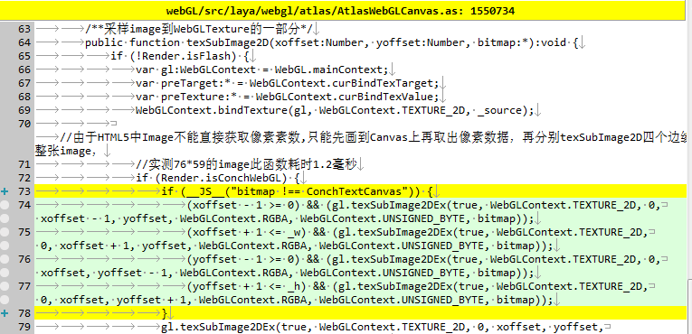
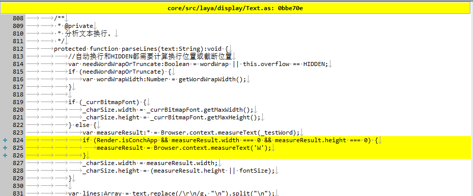

#레이야아 1.7.19.1 beta 코드 변경

###1.webGL/src/laya/webgl/atlas/AtlasWebGLCanvas.as

    

증가 판단

```javascript

if (__JS__("bitmap !== ConchTextCanvas")) {
    ...
}
```

###2.core/src/laya/net/Loader.ass
   

판단

```javascript

if (Render.isConchApp && !Render.isConchWebGL) { 
    ...
}
```

###3.core/src/laya/display/Text.as
   

코드 추가

```javascript

if (Render.isConchApp && measureResult.width === 0 && measureResult.height === 0) {
	measureResult = Browser.context.measureText('W');
}
```

 

###4.core/src/laya/display/Stage.as
   

Render.isconch WebGL 증가
