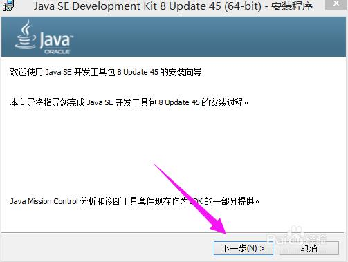
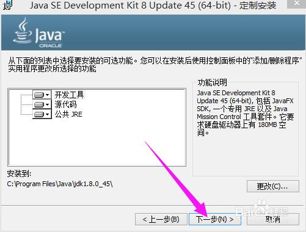
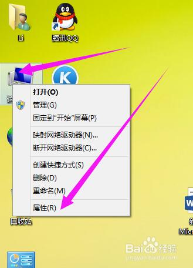
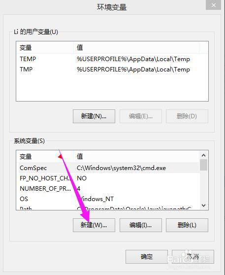
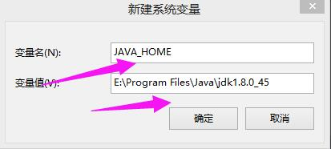
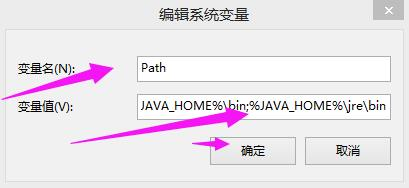
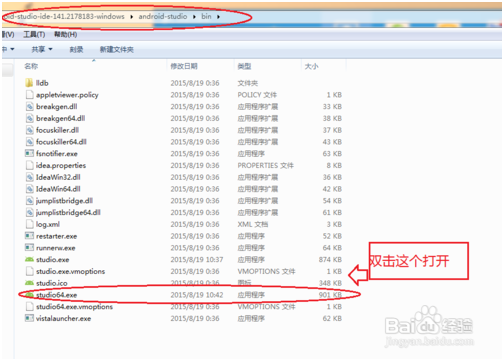
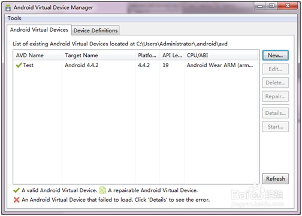
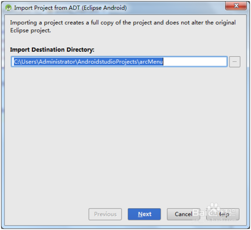
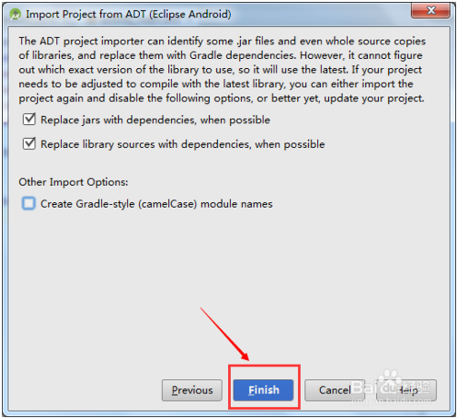

#Android Studio 사용 및 설정

##1, 앤드로이드 스튜디오 설치 준비 작업

###1. 1 다운로드 java JDK

홈페이지에 가서 자바 JDK 다운로드.구체적인 교정은 참고할 수 있다:[http://jingyan.baidu.com/article/9989c746064d46f648ecfe9a.html](http://jingyan.baidu.com/article/9989c746064d46f648ecfe9a.html)

###1.2에 JDK 를 설치하고 환경 변수를 설정한다.

자바 또는 안드로이드의 학습 과정에서 JDK 환경을 만드는 것은 필수다.이 편은 jdk-8u45-windows-x64 를 예를 들어 windows8.1의 64위 시스템에서 설정 환경을 진행한다.

####1.2.1. JDK 설치.

jdk 설치 패키지를 더블 클릭하여 설치 마법사에 들어가고 무뇌 조작을 진행하고, 사진을 계속 누르면 됩니다.

< br />

< br />

< br />

< br />

< br />

####1.2 설정 환경 변수

　　**첫걸음, 오른쪽으로 나의 컴퓨터를 누르고 속성 (아래도)을 누르고 속성 패널에 들어간다.**

　　**2단계, 왼쪽 고급 시스템 설정 클릭, 시스템 속성 설정**

　　**3단계, 고급 클릭, 환경 변수 클릭**

　　**제 4단계, 다음 시스템 변수, 새로 만들기**

　　`变量名：JAVA_HOME`

　　`变量值：JDK的安装路径（如：E:\Program Files\Java\jdk1.8.0_45）`

　　**다섯 번째 단계, 시스템 변수 표시줄, 새로 만들기**

변수 이름:`CLASSPATH`

변수 값`.;%JAVA_HOME%\lib;%JAVA_HOME%\lib\tools.jar`차다

앞 괄호 안에 복사 가능.앞의 점과 중간의 분호를 잊지 말고, 분호는 영문 입력법을 기억해야 한다.

　　**6단계, 시스템 변수에서 Path (또는 path) 변수를 찾습니다**Path (또는 선택한 편집), 원래의 변수 수치가 이미 존재하기 때문에 기존 변수 후에는 (() 를 더해야 합니다`;%JAVA_HOME%\bin;%JAVA_HOME%\jre\bin`괄호 안에 복사 가능.

앞의 분호를 주의하십시오.

　　**일곱 번째 단계, 환경 변수 설정 완료.**

인증 방법: Win + R 실행 상자 열기, cmd 명령 반차 입력

java-version 을 입력하십시오. java 버전 정보 보이기; 입력하십시오. 다음 화면에 나타나면 설정 성공을 설명합니다.

*주의사항*

`配置环境变量时记得将原有的和新加的用;隔开，不要出现中文；号`

###1.3 설치 앤드로이드 스튜디오

Google 은 Android Studio 가 Eclipse 를 대신해 공식 집성개발소프트웨어가 되며 후자에 대한 지지를 중단할 계획이다.본문은 Android Studio 설치 (Android Sudio 1.4를 예로 문중 간략히 AS)

1) 국내 인터넷 요소의 제한으로, 특수 수단을 통과하지 않는 것은 Google 홈페이지를 방문하여 AS 를 다운로드할 수 없다.그래서 다른 사이트의 다운로드 주소를 스스로 검색할 수 있습니다.본편은 하지 않는다

2) 다운로드 완료 후 해압.android-studio-ide-141.218183-windowsandroid-studiobin, studio64.exexe를 누르면 AS 개발환경에 들어갈 수 있다.

3) 실행할 수 없다면 JDK 를 다운로드할 필요가 있습니다.JDK 환경 변수 설정

4) android studio 첫 설치 시 카드가 갱신 인터페이스를 갱신한다.인터넷에는 각종 처리 방법이 있는데, 여기에는 그 중 한 가지 방식만을 소개한다.단계 2 해압 디렉터리 android-studio-ide-141.2178183-windowsandroid-studio

5) idea.properties 파일을 찾아서 텍스트로 열기 (또는 다른 텍스트 편집기 UE 등)를 사용합니다.

파일에서 마지막으로 파일에 추가하기 위해 disable.android.first.run = true

보존하다AS 를 다시 여겠습니다.AS 의 업데이트 검사를 통과할 수 있습니다.

**주의사항**

· 이 작업 단계는 Win7 64위, 기타 운영 시스템을 참고하여 Google 공식 다운로드

· AS 를 설치하기 전에 JDK 를 설치하고 해당하는 JAVA 환경 변수를 설정하십시오

 

#2, Android Studio 새로운 프로젝트 만들기

1) 설치된 후 우리는 우리의 항목을 새로 지어야 한다.포인트는 여기서부터.

2) New Project 를 클릭하면 나타납니다. 우리는 명칭을 잘 설치하고 무뇌조작을 할 수 있고, 계속 next 클릭을 할 수 있지만 이 과정은 끈기 있게 기다려야 합니다.시간이 좀 길다.

3) 그리고 우리는 우리의 개발 인터페이스에 들어간다.그림 속 붉은 줄의 아이콘 (SDK manager) 을 누르면 다음 그림이 나타납니다.

4) 이 절차는 앤드로이드의 sdk 설치, 추천, 앤드로이드1.6~앤드래드4.4.2 모두 설치.(이 시간이 꽤 걸렸으니, 인터넷 속도가 양호하고 여유가 많은 시간 아래 설치되어 설치 과정에서 영화를 볼 수 있게)

5) 설치 후 우리의 avd(Android Virtual Device)를 설정하기 시작하는 것이 앤드로이드의 가상 환경이다.누르다

6) New 클릭

7) AVD name 설정을 마음대로 설정합니다.

8) 설정이 완료된 후 아래의 삼각번호를 클릭할 수 있습니다.

#3, Androidstudio에서 항목을 가져오는 방법:

**3.1 개발 환경:**

> win7
>>
> 앤드로이드 스튜디오
>>

**방법/절차**

1) 자신의 IDE-Androidstudio 를 열어 그림:

2) "File" 단추를 누르고 "Import Project" 을 선택하십시오.

3) 가져올 프로그램을 찾을 때, build.gradle 파일을 선택하십시오:

4) 그림을 선택하십시오:

5) 그림을 선택하십시오:

6) 가져오는 과정을 기다리면 그림:

7) 마지막 도입 성공, 그림 같음

