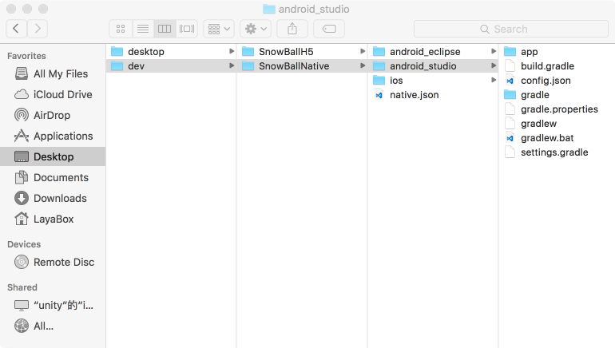
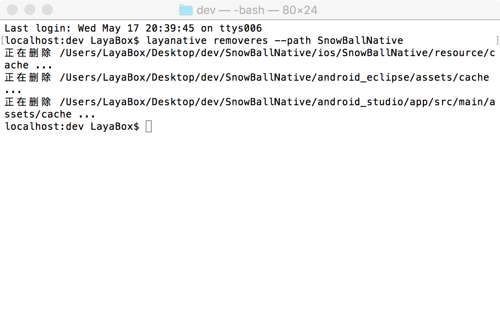

# LayaNative命令行工具
layanative 명령줄 도구는 Android 및 iOS 원생 항목을 생성하고 항목의 자원 갱신 기능을 사용하여 프로젝트를 편리하게 프로젝트 중 자원을 갱신하기 위해 사용합니다.
프로젝트의 기능 대응 IDE`工具/app构建`.
##1. 명령 설명
###1. layanative 설치
windows

```

$ npm install -g layanative  
```

mac

```

$ sudo npm install -g layanative  
```

###1. SDK 버전 정보 보기
SDK 는 네이션 프로젝트 템플릿입니다.listversion 명령은 현재 사용할 수 있는 SDK 버전 정보를 열거합니다. 아래에 네이션 프로젝트를 만들 때 인자 지정에 필요한 버전을 만들 수 있습니다.

```

$ layanative listversions  
```

###2. native 프로젝트 만들기
createapp 의 명령은 native 프로젝트 만들기
명령 createap의 도움말 메시지를 아래의 명령으로 볼 수 있습니다

```

$ layanative createapp --help
```

####용법:
layatiative createapppppppppprettyyyyative crereatapppatif creatapppreappppppppppppppppppppppi i[-f f f f f f f f reisise u ptu pth][-s[-s isise (def tnononothisisisisith][-s[-s isise all[-deall all all all liisisisisisisisisisisisisisisisisu edu edu edu edu edu ecliptu eclipatu etu eclipatu eclipname] [-a a p p _ name] [-package name]

####인자 설명:

키보드
------------------------------------------------------------------------------------------------------------------------------------------------------------------------
124대`--folder,-f`1244의 자원 경로: 게임 자원을 클라이언트에 설치하여 네트워크 다운로드를 줄이기 위한 게임 디렉토리, 예를 들어 index/ game/ index.html 아래, 그 자원은 d: game.t 은 0 시 에는 채우지 않는다
124대`--path`카탈로그 [기본 값 ']
124대`--version，-v`1244K버전: 특정 버전을 자동으로 사용할 SDK, 시스템은 서버에서 SDK 를 다운로드하고 특정 위치에 저장합니다.--version-sdk 상호 갈등을 동시에 지정할 수 없습니다. 기본적으로 최신 버전을 사용하는 SDK
124대`--platform, -p`1244 프로젝트 프로젝트 플랫폼[당선값: all, ios, androipse, androidu studio] [기본 값: all
124대`--type, -t`124대 형식 [0: 자원 가방 1: 블록 버전] [기본값: 0]
124대`--url, -u`1,124대 게임 주소 [t 또는 1 을 때 반드시 채워야 한다. t 2 때, 적어 넣지 않아도 된다]
124대`--name, -n`이름: native 프로젝트 이름: 기본값: Layabox
124대`--app_name, -a`모바일 이름: app 이 휴대전화에 설치된 후 표시된 이름 [기본 값: 레이박스]
124대`--package_name`124대 가방 [기본값: com.layabox.game]
124대`--sdk,-s`SDK 디렉토리: 사용자 정의 SDK 디렉터리인터넷을 끊는 상황에서 사용하면 일반적으로 인자를 사용할 것을 건의합니다. -version.
124대`--demension,-d`124개 항목 유형 2D, 버전 1.2.13 신규 [카우즈: 2D, 3D] [기본값: 2D]
type 는 1, 2시 자원을 native 프로젝트에 싸서 0시에 치지 않는다.자원 밑바닥을 포장하는 것은 실제 dccccc를 호출하는 방법이다.자원 dcc 관련[LayaDcc工具](https://github.com/layabox/layaair-doc/tree/master/Chinese/LayaNative/LayaDcc_Tool).
ID-path 인자 지정 항목의 출력 경로를 사용할 수 있습니다. 기본 출력은 현재 경로 아래로 출력합니다.

-v 에 따르면 v0.9.5 버전의 SDK

```

$ layanative createapp -f SnowBallH5 -t 1 -n SnowBallNative -u http://10.10.20.102:8899/index.html -v v0.9.5
```


지목도 없고-v 도 지정하지 않고, 최신 버전의 SDK 를 사용합니다.

```

$ layanative createapp -f SnowBallH5 -t 1 -n SnowBallNative -u http://10.10.20.102:8899/index.html
```

---version 또는-v 의 지정 버전으로 인터넷 환경이 필요합니다. 인터넷을 끊는 경우 ---sdk 또는-sdk 디렉토리를 지정할 수 있습니다.[SDK下载地址](https://ldc.layabox.com/layadownload/?type=layaairnative-LayaAir%20Native%20SDK%200.9.6)

```

$ layanative createapp -f SnowBallH5 -t 1 -n SnowBallNative -u http://10.10.20.102:8899/index.html -s D:/v0.9.6
```

###3. native 프로젝트 자원 가방 새로 고침
refreshres 명령은 native 항목의 자원 가방 새로 고침
프로젝트 누적 과정 중 h5 항목은 수정, refreshres 명령을 사용하여 자원을 새로 고칠 수 있고 코드를 네이션 프로젝트에 추가합니다.
####용법:
layanative refreshreshres[-p all124테오 androidu eclipse

####인자 설명:

키보드
------------------------------------------------------------------------------------------------------------------------------------------------------------------------
124대`--platform, -p`1244 프로젝트 프로젝트 플랫폼[당선값: all, ios, androipse, androidu studio] [기본 값: all
124대`--path`124대 네이션 프로젝트 경로 [기본 값: '']
124대`--url, -u`게임 주소


만약 생성된 항목이 단기판이라면 refreshres 때 url 을 입력할 필요가 없습니다.인터넷판 url 을 입력하면 인터넷판 자원백을 입력하면 항목 코드를 변경해야 인터넷판의 프로젝트가 된다.
만약 생성된 항목이 인터넷판이라면 refreshres 에서 url 을 입력해야 합니다.새 주소를 입력하면 항목에서 url 코드를 변경해야 URL 의 교체를 완성할 수 있습니다.단기판 주소를 입력하면 단기판의 자원 가방을 입력하면 항목 코드를 변경해야 단기판의 프로젝트가 된다.
수동 전환 단기판과 네트워크판 관련 참조[LayaBox 构建工具](https://github.com/layabox/layaair-doc/tree/master/Chinese/LayaNative/build_Tool).

createap에서 자원 경로를 생성된 native 프로젝트 디렉토리 아래 native.json 파일에 기록했습니다.나중에 자원이 다른 곳으로 옮겨지면 자원 목록을 잘못 찾을 수 없을 것이다.createapp 의 경우 -t 인자가 0 시 자원을 지정하지 않으면 자원 경로 변수를 지정하지 않습니다. native.json 중에서 쓴 자원 경로가 비어 있습니다. 이 항목은 refreshreshres 시 자원 경로가 비어 있습니다.이 같은 두 가지 상황은 native.json 파일을 수동적으로 수정하고 정확한 자원 경로를 지정할 수 있습니다.
###4. 네이션 프로젝트 자원 가방 삭제
removeres 명령은 native 항목의 자원 백을 삭제하는 데 사용됩니다
####용법:
layanative remover [--path path
####인자 설명:

키보드
------------------------------------------------------------------------------------------------------------------------------------------------------------------------
124대`--path`124대 네이션 프로젝트 경로 [기본 값: '']

##3.응용 실례
1. 먼저 하도에서 보여준 디렉터리 구조를 세웠다.SnowballH5는 html5 프로젝트 자원 디렉터리

  

2. SDK 버전 정보 보기
  

3. native 프로젝트 만들기
  

4. 하도에서 보여 주는 디렉터리 구조를 생성한다.
  

5. 수시로 자원 가방 새로 고침
dev 디렉토리 아래에서 ---path 지정 native 프로젝트의 목록
       

native 프로젝트 디렉터리에 들어가면 지정할 필요가 없다
   

5. 자원 가방이 필요 없다면 삭제
dev 디렉토리 아래에서 ---path 지정 native 프로젝트의 목록
    

native 프로젝트 디렉터리에 들어가면 지정할 필요가 없다
  


주의: Mac 에서 명령줄을 실행하면 창은 먼지가 변하고 원인은 알 수 없다.그러나 명령표가 나타나면 명령 집행이 완료되면 명령을 계속 입력할 수 있다.