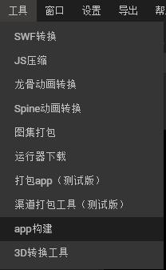

#Layabox 구축 도구
LayaPlayer 모바일 애플 프로젝트를 생성할 수 있도록 도구를 구축하는 데 사용합니다.현재 Android (Eclipse 프로젝트, Android studio 프로젝트) 와 iOS (XCode 프로젝트) 를 지원합니다.

##1. 실행 수요
####기초 개발 환경

개발환경을 마련해야 한다.예를 들어: 아이OS 프로젝트 구성은 Mac 컴퓨터와 XCode, android 는 Eclipse 또는 앤드로이드 studio 를 준비해야 한다.

##2. 사용자를 향해
앤드래드나 아이오S 프로젝트를 구축하는 데 해당하는 앤드래드나 아이오의 앱 개발 기초가 있어야 한다.만약 갖추지 못하면 관련 기초지식을 먼저 배우세요.


##3. LayairIDE에서 App 을 열어

… 에[Layabox官网](http://localhost/LayaAir2_Auto/Layabox.com)layaiaiaiairIDE, LayaiaiaiaiaiairIDE - > 도구 -> appp 구축, 그림 1의 시범:




(그림 1)


구축 도구가 필요한 라이브러리 파일이 비교적 커서 LayairIDE에 직접 포함되지 않았을 때 이 도구를 처음 사용할 때 SDK 가방을 먼저 다운로드하고 다음 그림:

[] (0.gif)

(2)

**주의하다**

이 서류는 비교적 커서 다운로드할 때 끈기 있게 기다려야 한다.

다운로드가 완료되면 앞으로 앱 구축 "을 누르면 바로 구축 대화상자를 팝니다.

##4. 프로젝트 구성 인터페이스 인자

LayaiairIDE에서 프로젝트 구축된 인터페이스를 열 수 있으며, 그림 3에 제시한 것처럼:


(그림 3)

*플랫폼

생성된 프로젝트의 종류는 Android Eclipse 프로젝트, Android studio 항목, iOS 프로젝트 3가지 옵션이 필요하다면 Android-eclipse 또는 Android-studio (google 은 Eclipse 를 지키지 않기 때문에 Andid Sudio 항목을 선택할 것을 권장합니다.XCode (iOS) 프로젝트가 필요하다면 아이OS 옵션을 선택하십시오.


* 싱글 버전 app:

이 옵션을 선택하면, 구성된 항목을 포장하는 App 은 단기판이다. 그렇지 않으면 온라인 버전이다.단기판은 인터넷이 필요 없고, 대응하는 url 이 없어, url을 제공할 필요가 없다.하지만 게임 자원을 제공해야 한다. 그렇지 않으면 포장을 해서 실행할 수 없다.

* 프로젝트 이름:

App 의 이름.항목을 구축하는 출력 디렉터리.

* 가방 이름:

응용 패키지는 정상적인 상황에서 볼 수 없다.일반적으로 도메인 명명 규칙을 적용합니다 (구별과 시스템에서 이미 있는 APP 충돌을 피할 수 있습니다.

예: com.layabox.runtime.demo
xxx.yyyyy.zzzzz의 격식은 적어도 2급, 즉 xxxx.yyyyyyyyyyyyyyyyyyyyyyyyyyyyyyyyyyyyyyyyyyyyyyyyyyyyyyyy그렇지 않으면 포장이 실패할 것이다.

* 게임 url:

패키지 적용이 온라인 프로젝트라면 실행 url을 제공하고 html 페이지를 가리키는 것은 응용 입구입니다.Layaiair를 통해 생성된 항목을 통해 시작된 페이지를 출력합니다. 일반적으로 index.html 입니다.테스트를 할 때, 편리하기 위해, 일반적으로 사용된 로컬 URL 주소는 브라우저에서 테스트, Android Appp로 사용할 때, 진정한 webserver 주소가 있어야 합니다.

예를 들어:

*랜 주소: *


```

    http://10.10.20.19:8888/index.html
```

*실제 주소: *

```

    http://layaair.ldc.layabox.com/layaplayer/index.html
```


​**주의하다**

LayaPlayer html 지원에 한계가 있습니다. 참고해주세요.[这里](https://github.com/layabox/layaair-doc/tree/master/Chinese/LayaNative/native_index);

* 출력 경로:

생성된 App 프로젝트의 보관 주소를 구축합니다.

* 자원 경로:

자원은 스크립트, 그림, 소리 등의 자원이다.온라인 게임에 대해서는 게임의 url 이 있으면 정상적으로 실행될 수 있지만 자원을 Appp백에 직접 입력하면 네트워크 다운로드를 피하고 자원 불러오는 속도를 가속화시킬 수 있다.싱글 게임이라면 게임 url 을 제공하지 않았기 때문에 자원 디렉토리에 필요한 자원을 모두 App 에 넣어야 한다.

App 에 넣은 자원은 여전히 우리의 dcc 도구 (자원 캐시 관리) 를 통해 갱신할 수 있다.
만약 이때 자원 경로를 설치하지 않았다면 프로젝트 구축 후, 여전히 수동적으로 자원을 첨가할 수 있으며, 참고를 첨가할 수 있다.[LayaDcc工具](https://github.com/layabox/layaair-doc/tree/master/Chinese/LayaNative/LayaDcc_Tool).


   **주의:**  

자원을 포장하는 단점은 가방의 크기를 증가시킨다.

자원의 온라인 게임은 서버엔드에서 dccccc를 설치해야 한다. 그렇지 않으면 포장의 우세를 잃고 모든 자원을 다운로드할 것이다.dcc 를 어떻게 누르는지 참조[LayaDcc工具](https://github.com/layabox/layaair-doc/tree/master/Chinese/LayaNative/LayaDcc_Tool).


##5. 구축 된 프로젝트 공정 사용

구축된 App 공사는 대처한 개발 도구로 2차 개발과 포장 등을 운영할 수 있다.

##- Android-eclipe (android) 프로젝트는 eclipse 소프트웨어를 사용하여 도입하고 개발할 수 있습니다. Android-studio（android）项目可以使用 android-studio软件进行导入和开发。

- XCode (ios) 프로젝트는 xcode 소프트웨어를 도입하고 개발할 수 있다.XCode (ios) 프로젝트를 열 때 진정한 ios 장치를 선택해서 build 를 진행해야 합니다.(주의자: 진정한 장치는 Amv7, armv7s, arm64 선이다.ios Simulator 를 사용하면 X86 개의 구성이 가능합니다. 현재 LayaNative 는 ies 장치에서 X86개의 구성을 지원하지 못했습니다. 에뮬레이터를 사용하면 통과할 수 없습니다.(0.9.5판 에뮬레이터 지원하기)


**참고 자원:**

--[Eclipse搭建Android环境](https://github.com/layabox/layaair-doc/tree/master/Chinese/LayaNative/setUpAndroidEnvironment_Eclipse)

--[Android Studio的使用和配置](https://github.com/layabox/layaair-doc/tree/master/Chinese/LayaNative/AndroidStudio_ConfigurationAndApplication)

--[IOS打包发布App详细流程](https://github.com/layabox/layaair-doc/tree/master/Chinese/LayaNative/packagingReleases_IOS)

​

##6. 수동으로 단기판과 인터넷판 전환

구성이 완료된 후 항목에서 직접 코드 수정을 통해 단기판과 인터넷판을 전환할 수 있다.

1. 앤드로이드 프로젝트

구축 항목에서 Mainactivity.java, 검색`mPlugin.game_plugin_set_option("localize","false");`  
단기 판은 "true" 로 설정해야 한다.`mPlugin.game_plugin_set_option("localize","true");`  
네트워크 버전으로 설정하려면 수정:`mPlugin.game_plugin_set_option("localize","false");`정확한 주소를 설정합니다:
     `mPlugin.game_plugin_set_option("gameUrl", "http://你的地址/index.html");`


2. iOS 프로젝트

iOS 프로젝트 구성이 완료된 후 항목 디렉토리 아래의 resource/scripts/index.js 스크립트의 마지막 실행 loadUl의 함수가 있습니다. 여기에 주소를 가재할 수 있습니다.`http://stand.alone.version/index.html`.

예컨대 처음부터 네트워크 버전, 주소로:


    `loadUrl(conch.presetUrl||"http://10.10.20.19:7788/index.html");`   
단기판으로 바꾸려면 이 말을 수정:
    `loadUrl(conch.presetUrl||"http://stand.alone.version/index.html");`  
반대로 해도 역시 그렇다.


   **주의하다**   
url 주소를 고치면, 원래는 포장된 자원이 모두 실효되었다.이 때, cache 디렉토리 다음 내용을 삭제하고, 다시 layadccccc로 포장 자원을 생성할 때, 참고하십시오[《LayaDCC工具》](https://github.com/layabox/layaair-doc/tree/master/Chinese/LayaNative/LayaDcc_Tool).

##7. 자원 쇄신

IDE 구성 공사를 통해 단기판과 포장 자원 버전을 선택하면 선택됩니다.resource/cache 디렉토리 아래 모든 h5 항목의 자원 (스크립트, 그림, html, 소리 등) 모두 이 디렉토리에 포함됩니다.
``android的目录： assets/cache/  ``<br>``iOS的目录：  resource/cache/  ``<br><br>但是在开发过程中，h5的项目一直在变化，为了避免每次都重新构建工程，在IDE-1.7.6-Beta版本之后，可以通过命令行进行刷新。<br><br>자원 가방 버전 호출 명령:``layanative refreshres -u http://testgame.layabox.com/index.html``<br>단기 버전 호출 명령:``layanative refreshres``

***Tips***
**1, 반드시 구축된 app 프로젝트 목록 아래 명령을 집행해야 한다.가장 뚜렷한 표시는 네이vtie.json 의 디렉토리 아래에 표시된 것처럼:**
[] (3.jpg)

layanative 명령에 대한 설치를 어떻게 사용하는지 참고하십시오[layanative命令行工具使用](https://ldc.layabox.com/doc/?nav=ch-as-5-3-0)


##8. 다른 주의 문제
android studio 구축이 완료된 후 자신의 환경에 따라 android sdk 의 버전 번호를 수정해야 합니다. 현재 설정된 것은 23, 수정할 필요가 있습니다.
파일은 app/build.gradle 입니다.