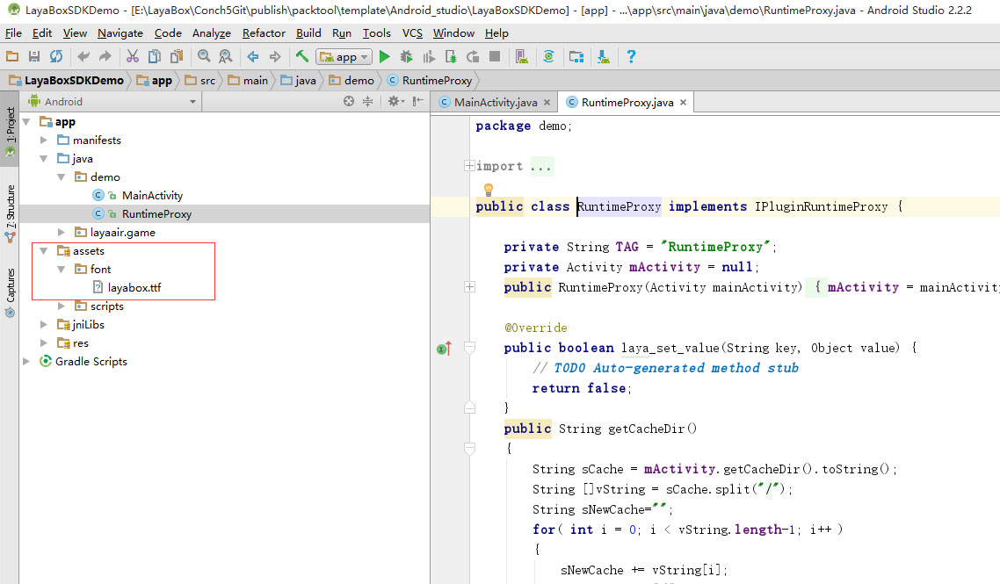

#글꼴 삽입

##1. 글꼴 소개

andriod 설비의 종류가 다양하고 android 의 글꼴 파일이 일치하지 않기 때문에 시스템 기본값의 중국어 글꼴 경로가 차이 (더 이상 국내의 많은 제조업체의 개성화 정제) 를 읽는 것은 font.tttf (난제입니다.

LayaPlayer 정책은 android 시스템 버전에 따라 글꼴 파일을 하나씩 들어올리는 경로를 사용한다면 시스템 기본 글꼴을 사용합니다. Layabox 사이트에서 글꼴을 다운로드할 수 없다면 이 글꼴로 저장된 다음 두 번째 입지를 직접 읽습니다.

LayaPlayer-0.9.5 이후 버전, 개발자는 app 을 포장할 수 있을 때, 기본적으로 글꼴을 appp에 싸서 어떤 특수 장치를 피하고, 인터넷에 4MB TTF 글꼴을 다운로드하는 데 있어서 사용자 체험에 영향을 끼친다.

##2. 글꼴 첨부

1, android 프로젝트 구성, asets 디렉토리를 찾을 수 있으며, font 디렉토리를 생성하여 삽입할 글꼴 파일을 바꾸어'layabox.ttf'로 변경합니다.그림 1의 보여 주기:

2. 레이플레이어-0.9.5 이후의 버전만 지원한다.

3. LayaPlayer-0.9.5 이후 버전, 템플릿 프로젝트는 기본적으로 tttf 글꼴을 포함하면 apk 부피가 증가할 수 있습니다. apk 크기에 신경을 쓰면 asts/font/layabox.ttf 글꼴 파일을 삭제할 수 있습니다.

##3.iOS 글꼴 삽입

1, LayaPlayer-0.9.7 이후의 버전 지원 iOS 기본 글꼴을 입력하고, 구체적으로 android, resource 아래에서 font 디렉토리를 생성하고, layabox.tttf 로 바꾸면 다음 그림 2에 표시됩니다:

