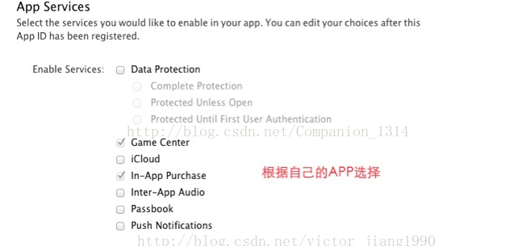
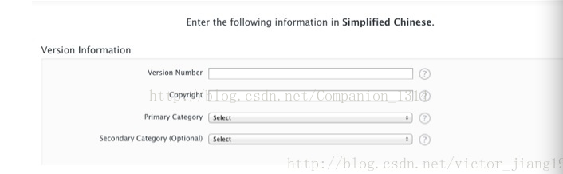
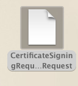
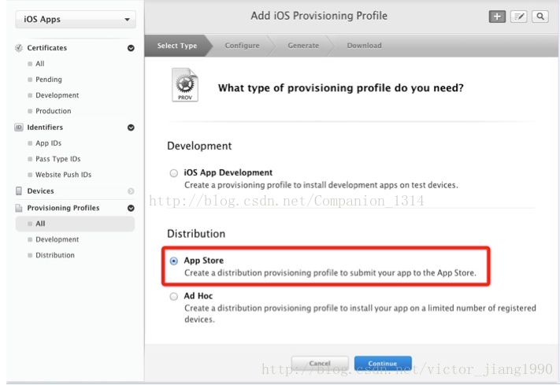
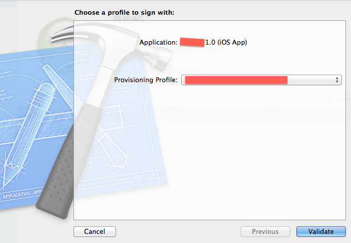
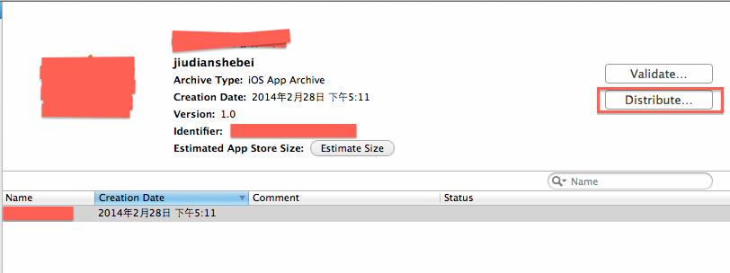
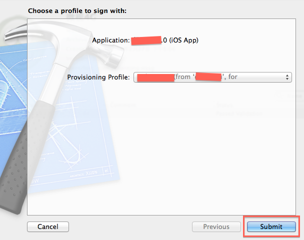
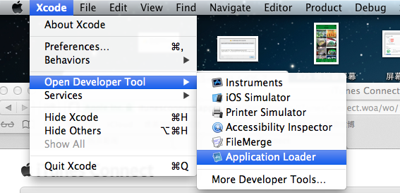
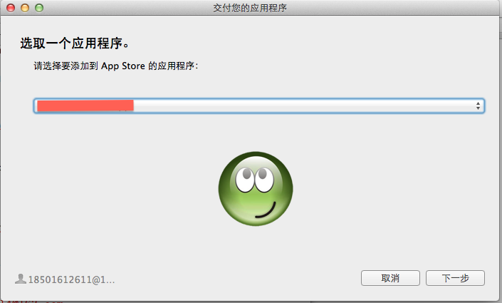
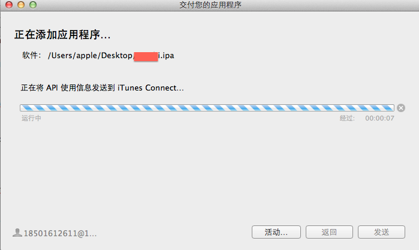

#IOS 패키지 APP 의 모든 자세한 프로세스

기타 좋은 참고:[点击打开链接：ios开发者证书申请及xcode5应用上线发布](https://www.lvtao.net/ios/558.html)

##애플 개발자 계좌

먼저 애플개발자 계좌를 신청해야 APP store 에서 응용을 발표할 수 있다.

개발자 계좌로 나뉜다

주요 구별은:[点击打开链接](http://www.zhihu.com/question/20308474)

###1. 개인 개발자 및 기업 개발 계좌 신청

　　[**링크 열기 클릭**](http://jingyan.baidu.com/article/676629976d12aa54d51b841f.html)

그중 기업이 신청할 때 등백씨 인코딩이 필요합니다:

####1.1회사의 덩백씨 인코딩

애플회사에 메일(애플 개발자 서비스 열기:4006 701 8552)를 보내주세요.그는 너에게 등백씨 번호의 인터넷 주소를 무료로 등록할 것이다.그냥 등록하면 돼.

   [https://developer.apple.com/ios/enroll/dunsLookupForm.action](https://developer.apple.com/ios/enroll/dunsLookupForm.action)

####1.2회사의 영업허가증 사본과 회사 중 영문 대조증명서

당신 회사의 영문 이름을 증명하는 우편물 (이것은 사실 한 마디만 한 마디만 하면 된다. 예를 들어 이 편지는 우리 회사의 영문 이름은 XXXXXXXXXX가 바로 ok 이라는 것을 증명한다) 회사 도장을 찍었다.

많은 국내 회사들이 해외에 팩스를 보낼 수 없으니, 이때 너는 인터넷 팩스 사용, 추천용[http://faxzero.com/](http://faxzero.com/) 

####1.3장 VISA 혹은 MASTER 신용카드 개통

개인적인 것이고 계좌번호는 Apple 대금에 지불합니다 ($99달러를 지불합니다)

###2、절차

####등백씨 번호

우선 등백씨 야드를 신청하려면 다음 날 연락을 받고 메일을 드리겠습니다.그 메일은 등백씨 번호가 아니다.당신의 신청 번호입니다.남겨두는 것이 가장 좋다.10명의 야드인데, 정오 시간에는 화하등백씨의 전화를 받을 것이다.바로 당신과 자료를 대조하는 것입니다.아마 저녁 때 당신은 새로운 우편물을 받아들일 것입니다.그것이 덩백 씨입니다.이 등백씨는 부효가 아니라 최소 14일 후에 사용할 수 있다.

14일 뒤 ios develop 사이트에 가서 개발자 계좌를 신청하면 덩백씨 코드 무효를 제시하면 애플개발자 센터에 전화를 걸어 덩백씨에게 무효라고 알려 주는데, 그는 덩백씨와 연락을 할 것 같다고 말했다. (며칠 더 구체적인 고객센터에서 등백씨 코드를 알려 줄 수 있다.

그리고 당신이 회사 정보를 기입할 때 회사 정보와 애플데이터베이스의 정보가 맞지 않는다고 제시할 수 있습니다.그리고 덩백씨의 연락메일(이 메일은 덩백씨 전용 애플 개발자 계좌를 신청하기 위해) 애플데이터베이스에 있는 회사 정보를 등백씨에게 전달해 변경하도록 했다.14일만 더 기다렸다가 신청하면 다 ok. 이런 상황은 누구나 만날 수 있는 일이 아니다.만약 정보가 일치한다면, 그것은 가장 좋은 것이다.14일 더 기다리지 마세요.

  

*Tips: 14일 후 등록, 등백씨 야드 시도 횟수 제한이 있다.*

####2.2 정보 등록

등백씨 야드를 신청한 후, 바로 아이OS 회사의 개발자 계좌번호를 등록하러 갔다.[http://developer.apple.com/programs/ios/](http://developer.apple.com/programs/ios/)이 개발자 계좌번호 등록 입구를 시작하는 enroll (등록).만약 당신이 이미 apple 의 개인 계좌번호가 있다면, 당신의 개인 계좌번호를 개발자 계좌로 바꿀 수 있습니다. 아니면 새로운 계좌를 신청하십시오.

당신이 개인이나 회사로 등록할 때 회사를 선택하십시오.등록은 메시지를 기입하는 데 주의해야 한다. 함부로 기입하지 말고, 정말로 기입해야 한다. 그렇지 않으면 뒤에 검증할 때 번거롭게 된다.당신이 그 개발 플랫폼을 선택할 때, 너는 ios 를 선택해야 한다.

개인 apple 계정을 등록하면 회사 정보에 옮겨 기입하게 된다.회사 정보 작성도 사실적으로 작성해야 한다. 이것은 당신의 회사 영업 면허가 연결될 것이며, 뒤심사에 사용된다.등록 정보는 영어로만 쓸 수 있기 때문에 영문 이름 없는 회사와 주소에 대해 먼저 처리해야 한다.회사 정보를 작성하고 다음 단계는 메일 작성 (이 후기 앱 개발자 센터와 연락할 수 있습니다) 대표님 (본인이나 사장님 이름을 선택할 수 있습니다.다음은 상대방의 심사를 기다리는 것이고, 이는 일반적으로 1~2일을 기다리며 심사를 했다면 상대방이 메일을 보낼 것이다.

PS: 대표자, 그리고 legal entity 필드는 덩백씨코드를 신청할 때 작성해야 합니다. 그렇지 않으면 통과할 수 없습니다. 이것은 위에서 말하는 데이터베이스 정보에 맞지 않는 필드입니다.

####팩스 자료

apple 쪽은 당신의 회사 정보를 통과하면 메일을 보내드리겠습니다.[devenroll@apple.com](mailto:devenroll@apple.com)이 우편물.당신은 당신의 회사 영업면허를 전달할 필요가 있습니다. 당신의 회사의 영문 이름을 증명하는 편지 한 통은 한 마디만 하면 됩니다. 예를 들면 당신은 이 회사의 영문 이름은 XXXXXXXXXXX OK OK 입니다. 회사 도장을 찍습니다.그리고 팩스가 지나간다.많은 국내 회사들이 해외에 팩스를 보낼 수 없으니, 이때 너는 인터넷 팩스(내가 이렇게 할 수 있어), 추천용[http://faxzero.com/](http://faxzero.com/) 

　　**이 단계는 가장 번거로우니 3-4일간의 심사 기간을 기다려야 한다**

*Tips: 정말 안 돼요. 아시아 애플에 팩스 되고 애플개발자 팀을 전달해 주세요.하지만 사과는 이렇게 하는 것을 추천하지 않는다.*

####전화 검증

만약 당신의 팩스 상대방이 통과한다면 상대방이 메일을 보내 당신에게 전화를 걸어 검증을 하도록 합니다.안에 중국어구 전화가 있는데, 이 전화를 선택할 수 있습니다.

####2.5 지불

전화 검증이 끝나면 보통 몇 분 동안 당신은 메일을 받고 돈을 지불하도록 할 것입니다.apple 은 국내 온라인 커뮤니케이션이 개통되지 않기 때문에 purchaseform 을 메워야 합니다.당신은 글로벌 카드를 준비해야 합니다(예를 들어 visa, mastercard 등), 당신의 신용카드 정보를 입력한 다음, purchase form 이 다시 팩스로 전송됩니다.기본적으로 이틀 후에 상대방이 당신의 지불을 통과하면 정식으로 개통할 수 있습니다.

####2.6 활성화 계정

대금을 지불한 후 계좌번호는 기본적으로 개통되었고, 그리고 사과는 계좌를 활성화하는 우편물 중 부활 코드를 직접 활성화시켜 활성화시킬 수 있습니다.

여기서 개발자 계좌번호 신청이 끝났습니다.

##2, APPID 신청

###1. BundleID 추가

​< br />
그림 (1)

**클릭 추가 후**

​< br />
그림 (2)

**발표할 상점을 선택하다**

​< br />
그림 (3)

마지막에 제출했으면 좋겠어요.

###2. 아이튠스 Connnect 연결

활성화된 계정은 아이튠스Connect에 로그인할 수 없습니다. 로그인할 수 있는 메일에 로그인할 수 있는 메시지를 보내야 로그인할 수 있습니다. 그렇지 않으면 권한이 없다고 합니다.< br />
그림 (4)

###3. 새 적용 만들기

**3.1 iTunes Connect 에 로그인한 후 '응용 관리자' 를 누르십시오.**

​< br />
그림 (5)

 **3.2 '새로운 적용 추가' 단추 누르기**

​< br />
그림 (6)

두 번째는 말하지 않겠다. 세 번째는 SKunumber 무슨 뜻인지 나도 모르겠다. 유일하게 기억하기 위해 BundleID 와 똑같다.네 번째 BundleID 가 선택되면 변경할 수 없으니 신중하게 선택해야 한다.

**3.3 설치 효율시간과 가격**

​< br />
그림 (7)

이곳의 가격은 등급에 따라 온 것이며 구체적인 얼마가 아니라 Tier 1달러가 1달러이며 중국 상점에서는 6위안에 해당한다.

주의 아래 당신의 APP 가 발표한 상점이 하나 더 있습니다. 기본값은 모든 상점이 발표됩니다.

​      < br />
그림 (8)

 **3.4 APP 정보 설정**

버전 번호 포함 소유권

​      < br />
그림 (9)

​

그리고 APP 의 내용 묘사, 기본값은 None 를 선택하고 자신의 APP 실제 상황에 따라

​< br />
그림 (10)

그리고 일부 메타데이터, APPPStoore에 대한 설명을 보여 줍니다.키워드는 사용자가 이 키워드를 이용해 APP 를 검색할 수 있습니다.SuportURL은 사용자가 연락할 수 있는 주소입니다.

​< br />
그림 (11)

이어 APPStoore 심의 피드백 정보, 연락처 정보를 포함해 APP 테스트 계정을 제공한다.

​< br />
그림 (12)

마지막으로 Icon, 화면 캡처를 올리고 화면 캡처는 5장을 넘지 않는다.

​< br />
그림 (13)

제출하면 APP ID 가 있습니다.

​< br />
그림 (14)

### 

**Tips:**

현재 상태를 Preparfor Upload, ViewDetails 클릭 후 'Readyto Upload Binnary' 를 누르십시오.

​< br />
그림 (15)

이어서 암호화 기능을 사용하는지 물어보고 저장합니다.

​< br />
그림 (16)

현재 상태는'WaitingFor Upload'입니다.

##업로드

###1 CSR 파일 만들기

1.1 컴퓨터 열쇠 꼬치를 켜고 응용 프로그램에서 찾습니다.

​< br />
그림 (17)

1.2 내비게이션의 아래 옵션을 선택하십시오

​< br />
그림 (18)

1.3 그리고 사용자 메일박스, 이름 입력 하드디스크에 저장하기

​< br />
그림 (19)

 **주의: 사용자의 Email 은 개발자 계정 메일박스, CA 메일은 쓰지 않아도 되고, 전제는 하드디스크에 저장되어 있습니다**

이때 현지에서 이런 서류를 생성했다

​< br />
그림 (20) (이 파일은 개발자 중심에서 인증서를 발포할 때 사용해야 합니다)

###2 발표 인증서 만들기

2.1 App Stoore 선택

​      < br />
그림 (21)

2.2 방금 만든 CSR 파일을 업로드

​< br />
그림 (22)

2.3 업로드 후 인증서 생성 성공, 로컬 다운로드.

​< br />
그림 (23)

2.4 더블 클릭, 열쇠 꼬치에 넣기.

​< br />
그림 (24)

**이렇게 하는 목적은 바로 너의 컴퓨터를 위해 허가증을 설치하는 것이며, 오직 너의 컴퓨터만이 프로그램을 발표할 수 있다**

###3 프로젝트 만들기

####3.1 APP Stoore 선택

​< br />
그림 (25)

####3.2 앱 ID 선택

​< br />
그림 (26)

####선택 인증서

​< br />
그림 (27)

이 인증서도 막 생성된 그 인증서, 내가 만난 잘못은 두 개의 인증서, 내가 잘못 선택했는데, 그 결과 포장된 설명문서가 문제가 생겨 실패했다.

####3.4 명명

​< br />
그림 (28)

선택한 이름은 Xcode 에 설치할 때 볼 수 있습니다.

3.5 마지막 제출 후 Provisiongprofiles 파일을 로케이션으로 다운로드하고, Xcode 에 추가하는 것을 두 번 누르십시오.

###4. Xcode 설정

####4.1 설정 target

이 곳의 Bundleidentifier는 앞에서 신청해야 하는 BundleID 와 일치해야 한다. 버전 번호도 앞과 ApppID를 신청할 때의 버전과 일치해야 한다.

​< br />
그림 (29)
​< br />
그림 (30)

####서명 파일 수정

앞에 만든 Provisiongprofiles 파일을 선택해야 합니다

< br />
그림 (31)

  

####4.3 추가 배포 설정

하나만 추가하지 않았으면 좋겠어요.

​< br />
그림 (32)

다음은 핸드백 프로그램입니다.

저희 xcode 중에 가방이 하나 있어요.

​      < br />
그림 (33)

가방 을 다 싼 후, 그것 은 자동으로 튀어나올 수 있고, orignize 에서 볼 수 있다

​< br />
그림 (34)

​< br />
그림 (35)

그 다음은 인증 정보로 로그인 Validate 를 클릭한 Balidate가 검증돼 문제가 없을 것으로 확인됐다.검증하지 않아도 제출할 수 있지만 검증하지 않으면 문제가 생기면 먼저 검증하고 제출하는 좋은 습관이 가장 좋다.

체크 클릭 후, 그림 상자가 나타나 개발자의 계좌와 비밀번호를 입력하십시오. 점 next

​< br />
그림 (36)

설명 파일을 선택하십시오. (인증서의 설명 파일이 있습니다)

​< br />
그림 (37)

이 인터페이스는 당신의 app 에 문제가 있다면 오류를 제시하거나 경고할 수 있습니다. 잘못된 것은 당신의 app을 다시 수정해야 합니다. 일부 경고는 수정하지 않고 직접 제출할 수 있습니다. 이 순전히 완벽주의를 보는 것입니다.

​< br />
그림 (38)

##4, 앱 store

사과 추천 은 xcode 자체 의 appplication loader 로 우리 의 응용 을 제출 하 지만 그것 을 제외 한 다른 것 을 각각 소개 했 다.

###첫 번째: 바로 앱 store

*(이런 방법을 추천하지 않는다)*

distribute 누르기

​< br />
그림 (39)

선택

​< br />
그림 (40)

​< br />
그림 (41)

​< br />
그림 (42)

submit 클릭하면 제출할 수 있어요.

###두 번째: xcode 자체 테이프의 application loader 로 우리의 응용을 제출합니다.

(추천)

이 방법의 첫 번째 단계와 같은 클릭 디스트 ribute

​      < br />
그림 (43)

이곳에서 하나의 ipa 를 생성할 것입니다. 우리가 본지에 저장하도록 하겠습니다

​< br />
그림 (44)

저장한 후 xcode — open develop

er tool — application loader

​< br />
그림 (45)

아래와 같이 사진을 보고, 메시지를 채우면 올려도 된다.

​< br />
그림 (46)

​< br />
그림 (47)

​< br />
그림 (48)

이쪽에서 '선택' 을 클릭한 후, 우리가 방금 이곳에 있는 아이파 파일을 올리면 된다.

​< br />
그림 (49)

​< br />
그림 (50)

​< br />
그림 (51)

성공을 올렸을 때, 당신의 app 을 볼 수 있는 상태도 waiting for review 로 변했다.올린 후 5, 6일간 우리 응용상태를 살펴볼 수 있다. 변함없이 조급해 하지 않아도, 애플 심사를 할 때 상태는 in review 로 변할 수 있다.다음 너는 너의 응용이 성공했는지 거부되었는지 알 수 있다.