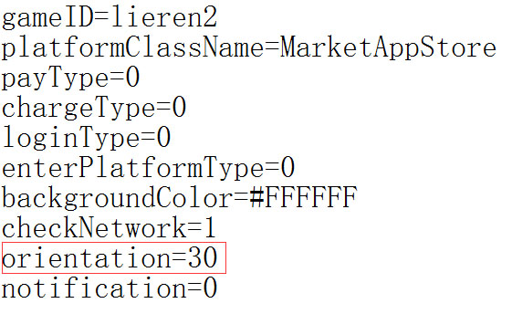

#  横竖屏设置
##1.iOS

iOS 프로젝트 구성 성공 후 resource / config.ini 파일 열기`orientation=30`다음 그림에 제시한 값:


변수의 의미는 다음과 같습니다:

```

orientation=2   //竖屏：IOS home键在下   
orientation=4   //竖屏：IOS home键在上   
orientation=8   //横屏：IOS home键在左   
orientation=16  //横屏：IOS home键在右   
```

orientation 값은 사용할 수 있습니다`按位或`형식 설정:

```

orientation=6   //代表竖屏可以任意旋转  
orientation=24  //代表横屏可以任意旋转  
```


##2.android

android 프로젝트 구성에 성공했습니다. AndroidManifest.xml 파일을 열기, activity 태그 안에 screenOrientation 인자 인자가 자신의 요구에 따라 수정할 수 있습니다.


설정할 수 있는 인자수는 android 의 표준입니다. 여기에서 설명을 많이 하지 않으면 다음과 같습니다.


```

"landscape","portrait","full_sensor","sensor_landscape","sensor_portrait","reverse_landscape","reverse_portrait"
```


##3.html 중 설정

프로젝트 시작 xxx.html (일반적으로 index.html) 화면 방향을 설정하고 screenorientation 값을 수정하면 됩니다

```

<meta name='laya' screenorientation='landscape' />
```


설정할 수 있는 인자가 다음과 같습니다:


```

"landscape","portrait","full_sensor","sensor_landscape","sensor_portrait",
```

Layair로 만든 프로젝트 기본값 증가`<meta name="laya" screenorientation="landscape">`이 라벨은 개발자가 자신의 수요에 따라 수정해야 한다.

##4. 실행 순서

프로그램이 시작할 때 먼저 읽을 것입니다. iOS config 에서 화면 방향이나 android manifest 에서 화면 방향을 설정했습니다.index.html 분석할 때 읽기`<meta name="laya" screenorientation="landscape">`이 탭은 화면 방향을 다시 설정합니다.

예를 들어: android 의 manifest 에서 portrait, html 탭을 landscape, 실행 과정에서 android의 스크린을 돌릴 것이며 세로 화면에서 가로로 돌렸다.

**Tips: 개발자가 두 개의 가치 설정을 일치시켜 실행 과정에서 스크린을 돌리는 현상을 피합니다.**
