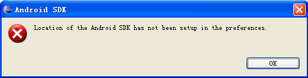
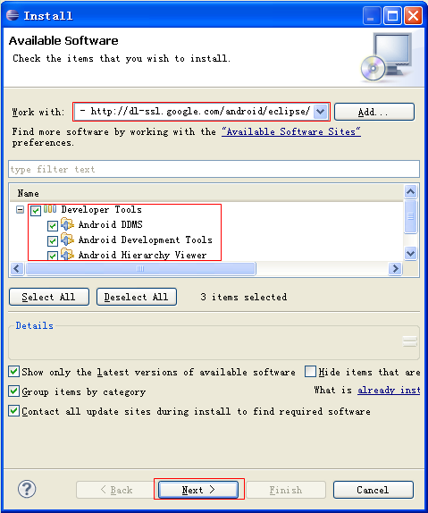
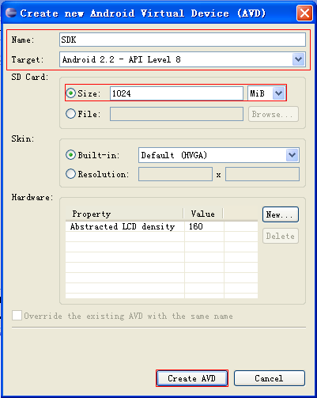
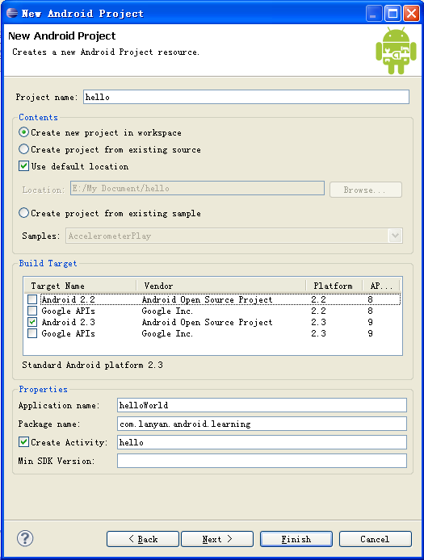
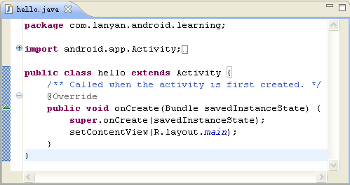
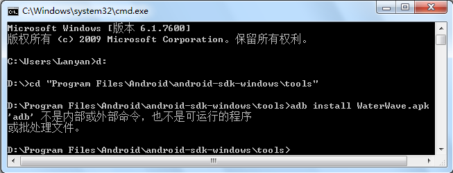
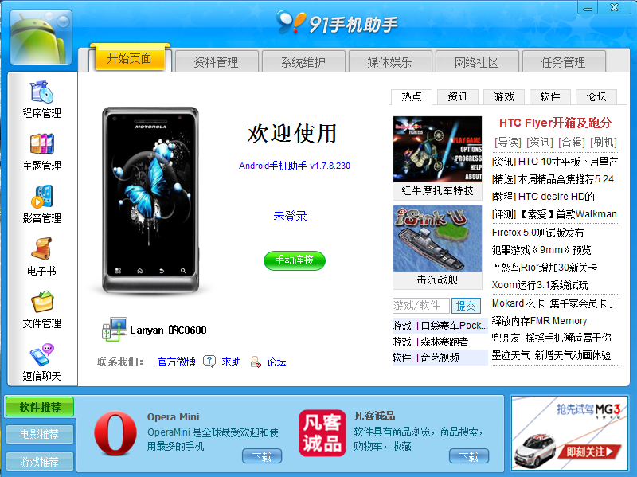

#Eclipse android 환경 만들기

##하나, 설치 JDK

###1, JDK 다운로드

사이트 열기[http://www.oracle.com/technetwork/java/javase/downloads/jdk8-downloads-2133151.html](http://www.oracle.com/technetwork/java/javase/downloads/jdk8-downloads-2133151.html)'자바 SE'를 다운로드하는 페이지를 볼 수 있습니다. 그림 1-1, windows x86 버전을 누르면 됩니다.

**그림 1-1 자바 SE 다운로드**

###2, JDK 설치

jdk-8u121-windows-i586.exe, 그림 1-2 인터페이스.

**그림 1-2 자바 SDK 설정 인터페이스**

"다음 단계" 를 누르면 설치 경로를 변경하고 설치 경로를 확인하십시오. (D  자바  Jdk1.6.0  21  21  Java  jdk1.6.0  21  설치 파일과 D 디스크 파일을 혼합을 방지하고 "다음 단계를 클릭하십시오.

**그림 1-3 자바 대상 폴더 설치 인터페이스**

경로를 변경한 후에 다음 단계를 클릭하고 완성합니다.

###3, 환경 변수 설정

XP: “ 나의 컴퓨터 '- > 오른쪽 키 속성 "> 고급" > 환경 변수 "> 시스템 변수 (WIN7" > 오른쪽 키 속성 "> 고급 시스템 설정" > 고급 "> 환경 변수" > 시스템 변수 >

**다음 세 개의 속성 및 그 값 설정:**

`java_home：D:\Program Files\Java\jdk1.6.0_21`

JDK 설치 경로를 가리키며 이 경로에서 bin, lib 등 디렉터리를 찾을 수 있을 것입니다.JDK 의 설치 경로가 임의 디스크 디렉토리를 선택할 수 있지만 디렉토리 단계가 얕은 것을 권장합니다.

`path：%java_home%\bin;%java_home%\jre\bin`

JDK 의 bin 디렉터리를 가리키는 이 디렉터리에 대한 모든 번역 명령을 수행할 수 있으며, 시스템은 임의로 java 명령을 인식하고, 콘솔 컴파일을 실행할 때 대열 경로를 사용할 수 없습니다. 그렇지 않으면, 앞으로 자바 프로그램을 실행할 때마다 클라스 파일을 먼저 이동하십시오.% java u home%%%% ‧ bin 디렉토리를 열고, DOS 경로 아래로 이동합니다.class 파일.

JDK 를 설치한 후 이 디렉터리에 두 개의 가상기 (JDK의 JRE, JRE, JRE, JRE, JRE, JRE, JRE) 를 포함해 두 개의 가상기 아래의 빈폴더가 필요합니다.

만약 path 에서 'jdk1.6.0 21  bin > 을 추가하지 않았다면, 1-4의 표시 사항이 나타납니다.

**그림 1-4 javac 문제**

`classpath：.;%java_home%\lib\dt.jar;`

java 프로그램이 실행할 때 파일 검색 경로를 번역하는 중 JVM 이 사용하거나 실행하는 class 는 어떤 경로에 저장되거나 JVM에 class 파일을 불러오기 위해 사용자가 import * * *, ",", "번역할 때 현재 디렉터리를 찾을 수 있는 클래스 파일, dt.jar 역할은 환경 라이브러리를 실행할 수 있으며, Java SwinRARR로 불러올 수 있습니다.보면 jar 와 zip 형식처럼 확장명만 다르고, tools.jar 역할은 도구 라이브러리와 실용프로그램의 비핵심 종류, lib 개발 도구 사용 파일을 제공합니다.

'시작'-'실행'을 열기'cmd', dos 시스템 인터페이스를 입력합니다.그리고 "javac" 를 입력하십시오. 설치가 성공한다면, 시스템은 자바 명령에 대한 인자 및 용법을 나타냅니다.

특히 주의하다: JRE 가 아니라 변량명 크기를 구분할 수 없다.

####보충: dt.jar, rt.jar, tools.jar

dt.jar 와 tools.jar 는 두 개의 java 의 기본적인 가방 을 포함 해 java 중 가장 중요 한 lang 가방 은 각종 고급 기능을 시화할 수 있는 swing 가방, java 필수 이다.

카테고리
--------------------------------------------------------------------------------------------------------------------------------------------------------------------------------------------------------------------------------------------------------------------------------------------------------------------------
124444toools.jjarararjjjuqqqqqqqqqqqqqqqqqqqqqqqqqqqqqqqqqqqqqqqqqqqqqqqqqqqqqqqqqqqqqqqqqqqqqqqqqqqqqqqqqqqqq를 실행필요필요필요필요필요한 종류종류가 필요한 종류sun.toools.juns.ols.ols.tools.ols.ols.ols.qqqqqqqqqqqqqqqqqqqqqqqqqqqqqqqqqqqqqqqqqqqqa, javac 는 이 명령에 대한 봉투입니다. 이 때문에 클라spath에 넣지 않아도 됩니다.응용 서버는 JSP 파일을 편집할 때, 응용 서버는 자신이 설치할 필요가 없습니다.124대
1244trt.jar 124qava 기초 카테고리 1244는 뿌리 classloader 가재 경로에서 classpase 경로에 추가할 필요는 없다. classpatr / / lib 아래에 있는 대부분 경로에서 삭제 방법: claspath 중 rt.jar, java verbose 명령으로 검사할 필요가 없다.124대
1244dt.jar (Eclipse) 개발환경을 운영하는 카테고리는 주로 swining 가방 (Swining) 에 쓰이는 것이 가장 좋다. Eclipse 개발환경은 기본적으로 JRE 를 설정해야 한다.124대

**참고 자원:**

세 개의 jar 가방 역할:[http://blog.csdn.net/hlw881008/article/details/5505251](http://blog.csdn.net/hlw881008/article/details/5505251)

Eclipse 아래 세 개의 가방을 보는 역할:[http://blog.csdn.net/dy_paradise/article/details/3909212](http://blog.csdn.net/dy_paradise/article/details/3909212)

JDK 폴더의 역할:[http://blog.csdn.net/qcontriver/archive/2010/03/09/5360975.aspx](http://blog.csdn.net/qcontriver/archive/2010/03/09/5360975.aspx)

##2, Eclipse 설치

###1, Eclipse 다운로드

공식 홈페이지 열기[www.eclipse.org](http://www.eclipse.org/)Downloads 클릭, 윈도ws 32Bit 아래 Eclipse Classic 3.6.1 다운로드, 즉[http://www.eclipse.org/downloads/download.php?file=/eclipse/downloads/drops/R-3.6.1-201009090800/eclipse-SDK-3.6.1-win32.zip](http://www.eclipse.org/downloads/download.php?file=/eclipse/downloads/drops/R-3.6.1-201009090800/eclipse-SDK-3.6.1-win32.zip).D:로 다운로드합니다.

###2, Eclipse 설치

다운로드된 zip 압축 패키를 압축시켜 eclipse.exe 그림의 데스크톱 단축식 (오른쪽 단추 그래프 '-' - '' - '데스크톱 단축식' 을 시작하기 편리합니다.

주의: SDK 는 자바 JDK, ADT 는 eclipse 플러그인만큼 양자의 설치 순서가 엄격한 요구가 없다.

##셋, 설치SDK

###1, SDK 다운로드

사이트 열기[http://www.onlinedown.net/softdown/32289_2.htm](http://www.onlinedown.net/softdown/32289_2.htm)android-sdku r08-windows.zip 다운로드를 다운로드하고 D: Android 로 압축합니다.

###2, SDK 설치

폴더D: Androidandroid-sdku r08-windowsandroid-sdroid-sdk-windows 속 SDK Manager.exe, 그림 3-1, 설치할 파일을 선택하고'Insttall'을 기다리는 시간입니다.

**그림 3-1 SDK 인터페이스 설치**

'Failed to fetch URL'을 만나면...'잘못된 힌트는 HTPS 방식을 HTTTTP 방식으로 바꾸어 'Android SDK and AVD Mand Manager' 창 왼쪽을 'Settings' 를 선택하십시오.' Force htttps: / / 를 선택하여 'Save & Aply' 를 누르고 SDK Setup.exe

이곳에서 나는 시간이 오래 걸렸는데 나중에 좀 지나간 문서를 다운로드한 것을 발견하였기 때문에 주의해야 한다.Available packages 높은 버전의 SDK 를 누르십시오.

**그림 3-2 Available packages**

**그림 3-3 인스타그램**

주의: 사용자가 오래 기다리는 시간을 줄이기 위해 다운로드 디렉터리를 압축 파일로 만들면 바로 해압을 할 수 있으며, 실행 절차 SDK 설치가 필요 없습니다.소프트웨어 디렉토리의 android-sdk-windows.rar 압축 패키지를 참고합니다.

설치가 끝난 후 파일 목록은 다음과 같습니다: 그 중 일부는 쓸데없는 것 같습니다. 인터넷의 해석:

add-ons: 일부 확장 라이브러리, 예를 들어 Google APIs Add-On

docs:API 문서 등등

platforms: 각 버전의 플랫폼 구성 요소

samples:일부 실례 프로그램

각종 보조 도구

usbu driver: windows 아래 일부 usb 드라이브

temp:플랫폼 구성 요소를 다운로드하는 중 임시 파일

###3, SDK 설정

tools 있는 폴더 경로 (D: Program Files  Android  android-sdk-windows  tools  path 환경변수에 합류하는 방법과 같은 방법입니다.

주의하십시오: 현재 Android SDK 의 설치 장치가 성공할 수 있습니다. 다음과 같습니다:

1) SDK Location android 디렉토리

Window preferences 중의 android 옵션, SDK Location 이 작성한 내용은 Android SDK 설치 경로 (D: Android / android-sdk-windows) 가 가능하다.

보충: 만약 SDK 설치 과정에서 앤드래드-sdk-windows.rar 압축백이 필요하다면 먼저 SDK 설정을 해야 SDK 의 설치를 완비할 수 있다.

**그림 3-4 Android SDK 경로 설정**

SDK Location 값을 설정하지 않으면 3-5의 오류가 발생할 것이다.

**그림 3-5 추가 SDK 경로 오류**

2) eclipse 중 SDK 업데이트

'Window'-'Android SDK and AVD Manager'-'Insttalled packages'-'Update All'-'Acccept All'-'Install Acccepted', 자세한 시도 3-6.모든 설치된 시간은 대략 45분으로 'ADB Restart' 대화상자를 나타내며 'Yes' 을 누르면 eclipse 외에는 대화상자를 닫으면 됩니다. 이 때 ADT 설치에 성공합니다.

"Install Acccepted"에 "Failed to fetch URL htp://dl-ssl.google.com/android/reposity//repository.xml"

많은 자료를 수색했는데 방법은 다음과 같다.

1) "Android SDK and AVD Manager"의 왼쪽 "Setting"을 선택하여 "Force https://""이 옵션

2) Ask before restarting ADB4 를 선택하십시오. 이 SDK 다운로드기는 이미 "Save and Apply" 를 수정한 후 도구가 지정된 주소로 지정된 주소를 다운로드하기 위해 repl (save and apply 에 관한 게시물이 많습니다. 환경변수와 enter 보존 등의 방법이 많습니다.제가 처음으로 수정 버전을 내려서 사용할 수 없습니다. 예전 r05 버전으로 설정을 수정한 후에야 r06 다운로드기를 순조롭게 사용했습니다.

3) 연결이 성공하면 OK, 다음은 다운로드 설치

문제: 왼쪽에'Setting'옵션이 없었지만 실천증명은 이 상황이 크지 않다.

필요한 가방 선택:

a. Android 2.0 Emulator(시뮬레이터)를 시도한다면'SDK Platform Android 2.0. API 5, revision 1'을 설치하면 된다.

b. 이 SDK 에서 응용 프로그램과 게임 응용을 개발하려면 모든 허가 내용을 준수해야 합니다(Acccept All)

**그림 3-6 SDK 업데이트 인터페이스**

SDK 가 업데이트를 하지 않으면 안드로이드 Project 를 창건할 때 'An SDK Target must be specified' 오류가 발생할 수 있으며 3-7과 같다.

**그림 3-7 An SDK Target must be specified 인터페이스**

##4、ADT 설정

Eclipse 열기, Help -> Insttall New Software 열기 그림 4-1 대화상자

**그림 4-1 ADT 다운로드 설정**

"Location"에 쓰기[http://dl-ssl.google.com/android/eclipse](http://dl-ssl.google.com/android/eclipse)즉 레드테두리의 내용대로 메우고, 마지막 클릭 OK, 그림 4-2 인터페이스가 나타날 경우'Select All'을 누르고 레드 테두리의 관건 부분은 똑같이 수정하고, 두 번 다른 페이지 아래'Next'을 누르고 나서'I acccept the terms of licese agrement'과'Finish'를 선택하고 인내심을 20분 동안 기다려 시스템 Install Softwaree이에 따라'시크릿 Warning'이 나타날 수 있다는 의미는 ADT 에서 서명이 없는 내용과 진실성을 포함하지 않고 계속 설치 여부를 묻는 질문이 크지 않거나'OK'를 누르면 ADT 효과를 재활성화하고'Restart Now'를 누르면 된다.

**그림 4-2 ADT 설치**

##5, 에뮬레이터 만들기 (AVD)

Windows-> Android SDK and AVD Manager -> Virtual devis-> New 그림 5-1에 따라 메우고 Create AVD 를 누르면 됩니다.

주의: 왼쪽 판넬의 Virtual Devis를 클릭하면 오른쪽에 New 를 누르고, target 하당겨 목록을 선택할 수 없을 때 왼쪽 패널을 누르는 Available Packages, 오른쪽에 https:/ dl-sl.google.com/android/repostory/repory.xml, 그리고 Install Seleced 버튼을 누르면 힌트를 누르는 것이다.

**그림 5-1 새 에뮬레이터 만들기**

해석: Target 는 에뮬레이터의 사용 가능 플랫폼; SD Card 는 메모리 카드이며, Skin 은 에뮬레이터의 화면 크기, 구체적인 인자가:

> WVGA:80*480
>>
> QVGA:320*240
>>
> VGA:640*480
>>
> HVGA:480*320
>>
> WQVGA400:240*400
>>
> WQVGA432:240*432
>>
> WVGA800:800*480
>>
> WVGA854:854*480

아니면 Resolution, 자유 설정 시뮬레이터 화면 크기를 선택할 수 있다.Hardware (AVD 에서 필요한 특수 장치) 의 값: Abstractracted LCD density (해상도) 이 선택한 Skin 자동으로 설정하는 등.

**그림 5-2 실행 시뮬레이터**

SDK Android2.2, 점 중 스타트 - > Launch, 그림 3-3의 시뮬레이터가 나타납니다.

**그림 5-3 시뮬레이터**

**그림 5-4 가상 장치**

android 에뮬레이션이 잘못되었습니다. emulator: ERRRRRor: unknown virtual device name

원인: 내 문서의 기본 위치가 바뀌어, 생성된 파일 경로 인용 오류가 발생했습니다.

법 1: F: Users< username > < username > 아래 파일을 "C: Users  < username > 에서 복제할 수 있지만, 이러한 해결 방안은 더 뚜렷한 단점이 있다면 AVD 를 새로 만들면 다시 복제해야 한다.

법 2 "내 컴퓨터"-> 오른쪽 타격 속성-> 고급"-> 환경 변수"-> 시스템 변수"-> 새로운" ANDROD u SDK HOME그리고 변수치를 AVD 가 있는 '.android' 폴더로 변경하고 싶은 위치로 변경하고 있습니다. 예를 들어: "F: Androidemulator" "Android SDK 백에 안드로이드  Program Files  Android  android-sdk-windows"

##6, Hello World 프로그램

###1, Android Project 만들기

'File'-'New'-'Other'-'Android Project'-'Android Project'이 출현된 후 '프로젝트name, Aplication name, Package name, Package name, Create Actity 콘텐츠를 선택하고 Build Target 를 선택하십시오.

**그중:**

프로젝트name: 프로젝트의 이름, 실제 폴더에 대응합니다.

Build Target: 이 프로그램이 사용하는 SDK 버전을 선택하십시오.

Application name: 프로그램의 명칭은 일반적으로 프로그램의 제목 표시줄에 나타난다.

Pakcage name: 이 이론은 마음대로 할 수 있지만, Pakcage 는 일정한 명명명규범을 가지고 있다. 즉: 첫번째 항목은 조직, Om 일반적으로 회사, org 지칭으로 조직, edu 교육 부분을 가리킨다. 두 번째는 이 조직의 명칭, 예를 들어 Sun 등은 내가 자신의 이름을 썼고, 세 번째는 자신의 분류에 따라 정의할 수 있다.

Creak Activity: Activity 는 Andriod 프로그램의 실행 실체로 C 언어와 비슷한 main 함수와 다르게 Android 프로그램은 main 함수와 비슷한 실체가 많습니다.

Min SDK Version: 이 항목은 일반적으로 Build Target 하나하나 대응해 특별히 지적할 필요가 없다.

**그림 6-1 New Android Project**

###2, AVD 장치 만들기

제5절을 만나다.AVD 장치가 생성되지 않으면 상관없이 오른쪽으로 프로젝트에 ‘Run As’(Run Configurations)’, ‘Android Application’(Android)’, ‘Android’(실행이 필요한 프로젝트명)-> Target > (배치 장치의 선택을 Mannfiguration을 막는 혼란을 막기 위해 > Run >튀어나온 대화상자에서 "Launch a new Android Virtual Device" 를 선택하면 SDK, 클릭하면 됩니다.

###3、컴파일 실행 프로그램

hello.java 파일 열기

**그림 6-2 hello.java 파일 내용**

**그림 6-3 자바 Build Path 설정**

Project-> Properties, 6-3 대화상자를 나타내며 Android 2.2에 클릭, Run-> Run(Ctrl+ F11) -> Yes -> 선택한 SDK, SDK 클릭-> Launch -> OK, 2분 동안 6-4 결과를 나타내며 성공을 나타냅니다.

주의: 오른쪽으로 실행할 java 파일 - -'Run As'-'Run Configurations'-'Android Aplication'-'Android'-'Android'-'Target'장치를 배치할 수 있는 선택을 Mannfiguration으로 설정해 여러 배치 장치의 혼란을 방지하면 된다.

**그림 6-4 실행 결과 인터페이스**

참고 원본:[http://blog.csdn.net/zhq56030207/archive/2010/08/31/5852130.aspx](http://blog.csdn.net/zhq56030207/archive/2010/08/31/5852130.aspx)

###4. 디버그 프로그램

####DDMS 를 통해 디버그 프로그램:

(1) Eclipse 개발 도구의 작업 인터페이스를 DDMS 탭으로 전환합니다.6-5와 그림 6-6의 시범.

**그림 6-5 보기 레이아웃 작업 보이기**

**그림 6-6 보기 레이아웃 상자**

(2) DDDMS "인계에서 'Deviss' 탭탭탭을 선택선택선택선택선택선택선택선택선택메뉴: Debug Process (디디디디디디디작업 프로프로세정보),' DDDDMMS' IDMS' IDDMS' DDevisS' 레이레이설정설정설정설정설정설정설정을 보기: DebDDetMDDMDMDMDDeuisisiss (업업업업업업업업업업업업업업업업업업업업업업업업업업업업업업업업업업업업업업업업업업업업업업업업업업업업업업업업업업업업업업업업업업업업업업업업업업업업업업업항목

####DDMS'Logcat'를 통해 디버그 프로그램

(1)'Logcat'은'andrdoi.util.Log'의 정적 방법으로 오류와 인쇄 시스템 로그 메시지를 찾는다.

andrdoi.util.Log 상용 방법 5개:

Log.v(String tag, String msg), VERBOSE

Log.d (String tag, String msg), DEBUG

Log.i (String tag, String msg), 인FO

Log.w(String tag, String msg);WARN

Log.e (String tag, String msg), ERRRor, 단점 디버그 프로그램에 적용됩니다.

Log.v, Log.d 정보는 개발과정에서 존재할 뿐, 최종 버전은 Log.i, Log.w, Log.e 3가지 로그 정보만 포함할 수 있다.

(2) Run '클릭' Debug 메뉴 명령을 누르고 디버그 모드에 들어간다.

(3) DDMS "인터페이스로 전환하고" Logcat "탭을 누르고, 우리가 방금 프로그램에서 인쇄한 Log 정보를 확인하는 것을 확인하십시오.다른 색으로 등급에 따라 정보를 표시하여 추적 절차를 편리하게 한다.

(4) 디버그 방법

1) 단점 설정, 단기간 실행: 모행 표시줄 쌍

2) 성명 조건 단점, 촉발 완료: 단점 은 표현식의 변화 시 촉발 이다.더블 클릭을 마친 후 오른쪽 클릭 단점을 누르면 "Breakpoint Properties" 를 선택하면 "Enable" "Conditional" "Conditional" 에 표현 변수를 적어, 만족할 때 프로그램을 입력할 때, 입력 조건 표현식을 사용할 수도 있습니다.위 아래 메뉴에서 Ctrl + Shift + I 또는 오른쪽 변수를 통해 인스타그램을 선택하면 결과를 나타냅니다.

**그림 6-7 설정 디버그 인터페이스**

##7、기존 공정 도입

###비엔드로이드 프로젝트를 가져오는 방법:

'File'-'Import'-'General'-'Existing Project into Workspace'-'Next'-'Select root directory'-'Browse', 프로젝트의 위치를 선택합니다.

주의: Android 가방이 없다면'Build Path'를 다시 설정해야 한다.

###Android 프로젝트 방법 가져오기:

File ' - -......' '' '' '' '' '' ' -' Androroid 프로젝트 프로젝트 프로젝트 프로젝트 rojectict '' - 'Next t' Next 'Connents' - - -' Projejejedectie dededetie dedededededededededededededen dededededededededededet name' - - - 'Netett t t dededet' - ' -' Connnentents' - - - - - - - - - - - - 'Cotidenamnamnamnamnamnamnamnamnamnamnamnamnamnamnamnamnamnamname name namnamnamnamnamnamml 소재 폴더까지) -'Build Target'(모드 선택디자이너 플랫폼 버전) -'Finish'

##8, APK 소프트웨어 설치

###1, 에뮬레이터에 APK 소프트웨어 설치

우선 Android SDK 소재 폴더에 들어가기 때문에 시뮬레이션이 몇 분 걸릴 때 명령 (emulator -avd youravdname) 시뮬레이터 (주: 투ols 폴더에 있는 emulator. emulator 실행할 수 없음), 그리고 플랜트form-tools 아래의 파일을 Android SDK 폴더로 복사하기 위한 tools 아래의 tools 아래로 복사하기 (반복 가능합니다.tform-tools 의 환경 변수 를 켜고'실행'을 누르고'확정'을 누르고'adb install'을 입력하고 실행할 apk 은 cmd 에서 Enter 를 누르고 나면 8-1 인터페이스, Succcess!

**그림 8-1 명령 표시 인터페이스**

주의: plantform-tools 아래 파일을 tools 아래로 복사하거나 plantform-tools 경로가 path 환경변수에 가입하기 때문에 adb 명령이 plantform-tools 중 tools 중 tools 에 없다면 이 조작을 하지 않으면 8-2의 오류가 발생할 것이다.

**8-2'adb'은 내부나 외부 명령 인터페이스가 아닙니다.**

만약 apk 파일 이름이 중국어를 포함한다면, 그림 8-3 오류가 발생할 경우, 중국어를 영문과 숫자로 바꾸면 된다.

**그림 8-3'Segmenteation fault'오류 인터페이스**

**그림 8-4 apk 설치 효과 인터페이스**

설치가 성공한 후 에뮬레이터 패널에 빨간 테두리에 표시된 아이콘이 나타날 때 누르면 실행됩니다.

###2, 에뮬레이터에 APK 소프트웨어 해제

"Setting(8-4의 Setting 아이콘)" "Applications"(응용 프로그램) - "Manage Applications"(관리 응용 프로그램) -> Water Water Wave"-> Unnstall"-> OK"(확인)이 때 패널에 있는'WaterWave'아이콘을 삭제합니다.

**그림 8-5 APK 마운트 해제 성공**

###3. 리얼리티에 APK 소프트웨어 설치

우선'설정'-'응용 프로그램'-'미지원'선택 -'되돌림'-'개발'-'USB 디버그'선택

####3.1 방법 1

다운로드 및 91 휴대폰 조수 for 앤드로이드 설치.그리고 USB 로 휴대전화와 컴퓨터를 연결해 91조수를 엽니다.

**도8-6 91 핸드폰 조수 인터페이스 시작**

'수동 연결'-'USB 연결'-'-> 시스템 관리자 '-> 파일 관리' -> 빠른 입구 '-> 메모리 카드 업로드' -> 장치 업로드 "> 파일 '(설치할 파일을 선택합니다." > 더블 클릭 파일을 설치할 것입니다.

**그림 8-7 apk 설치 인터페이스**

또는 간편한 방법: 바로 클릭하면 휴대폰에 설치할 수 있다.

####3.2 방법 2

http://www.hiapk.com/bbs/thread-40417-1.html 위에 하이픽 인스타워(APK 설치기)를 다운로드해 바로 설치 완료(PK에만 포함), 8-8.이 소프트웨어는 자동으로 APK 프로그램에 연관될 것이며 APK 프로그램을 클릭하면 자동으로 휴대전화에 설치할 수 있다.

**그림 8-8 하이에이핑크 인스타워 설치 성공 인터페이스 설치**

####3.3 방법 3

ASTRO (파일 관리자): ASTRO.apk 을 휴대전화 SD 에 설치한 다음 휴대전화 파일 관리자에 있는 SD카드 중 apk 파일을 설치한 후 패널에 아스트로의 아이콘이 나타난다.앞으로 소프트웨어를 설치할 때, apk 파일을 SD 카드에 복사하면 휴대전화에 있는 APK 설치기에 소프트웨어 설치와 마운트할 수 있다.

####3.4 방법 4

휴대폰의 내장 APK 설치기를 다운로드한 후 apk 파일을 SD 카드에 고쳐 휴대폰을 설치하면 됩니다.

보충: 파일 관리자의 기능: 파일 보기, 파일 관리, 파일 검색, 프로그램 해제와 백업, 프로세스 관리, SD 카드 상태.

APK 설치기: apk 파일을 설치하는 과정을 간소화하여 컴퓨터에서 조작하면 apk 소프트웨어를 휴대폰에 설치할 수 있다.

주의자: 휴대폰이 컴퓨터를 연결할 때 드라이브나 APK 설치기(상용 완두콩지갑, 91 조수)를 다운로드해야 한다. 아니면 휴대폰의 메모리 카드만 컴퓨터에 연결되거나 휴대전화가 연결되지 않는다.