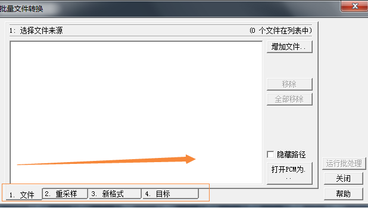
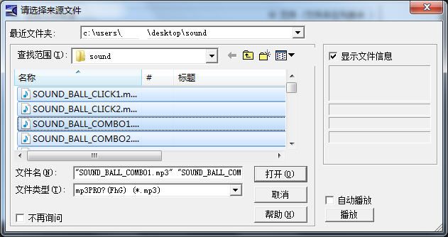

#목소리

LayaPlayer 에서 목소리는 배경음악, 음효 두 가지 모드로 나뉜다.

##1. 배경음악

LayaPlayer 배경음악은 mp3 형식만 지지하고 배경음악만 한 번 틀어야 한다.

##2. 음효

프로젝트에서 음향효과는 고주파발 사건이며 실행 효율을 확보하기 위해 LayaPlayer 가 openAL 을 사용하여 오디오 오디오 효과를 사용할 수 있기 때문에 Mp3 미디어 형식으로 분석할 수 없습니다.
**Tips:**  
**1, LayaPlayer 음향은 wav, ogg 형식만 지원합니다.**  
**2, wav, ogg, 8위와 16위만 지지하고, 아직 32위를 지지하지 않습니다.**
**3, 주의: LayaPlayer-0.9.5 이전 버전, wav, ogg, 2050 채권률, 16bit, 싱글 채널**

현재 LayaPlayer 버전을 살펴보면 두 가지 방법이 있습니다.
1. JS 에서 호출`conch.config.getRuntimeVersion();`방법이 버전 번호를 획득하다.
2, 컴퓨터에 장치를 꽂아서 log 을 보기 위해 하도에서 제시한 것처럼:


##3. 힌트 정보

1. Layaiair-1.7.5 이후 버전`SoundManager.playSound()`하지만 전입된 파일 형식은 mp3, 힌트 메시지, 힌트 메시지 표시 메시지는 다음과 같습니다:
`The sound only supports wav or ogg format,for optimal performance reason,please refer to the official website document.`  
이때 mp3 를 wav 나 ogg 형식으로 바꿔야 합니다.

2. Layaiaia-1.7.5 이전 버전, 오류 없는 메시지 발견**카튼 현상**이 같은 경우는 음향 효과에 따라 mp3 형식을 사용했기 때문에 형식을 바꿔야 할 수 있다.

##4. 호환성 해결

웹 버전에서 오디오 형식을 사용하면 LayaPlayer 에서 wav 형식을 사용합니다.프로젝트를 설정하는 방식으로 다운로드할 때 프로필 파일만 적용하는 곳에서 LayaPlayer 실행 환경의 위조 코드 다음과 같습니다:


```javascript

if(window.conch)
{
    ...加载 "soundConfig-LayaPlayer.json"
}
else
{
    ...加载 "soundConfig-json"
}
SoundManager.playSound(soundJson[0].url,1);
....
SoundManager.playSound(soundJson[1].url,1);
```


**Tips**  
*1, conch, LayaPlayer 환경에서만 호출됩니다. 웹 버전에서는 conch 가 정의되지 않습니다. 존재 여부를 판단해야 합니다.*
*2. as 언어를 사용하면 통과할 수 있다`Browser.window['conch'] `이런 방식은 conch 대상을 받는다.*
*3, 또는 사용`if(Render.isConchApp )`판단도 가능하다.*

##5. Cool Edit Pro 도구로 음성 형식 변환
현재 MP3 에 wav 를 바꿀 수 있는 도구들이 많습니다. Cool Edit Pro 도구를 간단히 소개합니다. mp3 변환 wav의 구체적인 조작 절차:
1, 우선 스스로 다운로드하고 Cool Edit Pro 도구를 설치하고 Cool Edit Pro 프로그램을 열기


2, 왼쪽 위 위 각 '파일' 아래 '대량 변환' 을 클릭, 도량 변환 '하위 메뉴




**주의자: 대량 파일에 따라 아래의 1, 2, 3, 4단계 한 발자국 동작을 진행할 것을 건의합니다**

3, 파일 출력 선택: 오른쪽 추가 파일을 클릭하십시오.여기에서 우리는 sound 파일 아래에 있는 모든 파일을 선택하여 처리할 때 클릭하여 열기를 누르십시오.




4, 변환 샘플링 종류: 샘플링 목록 아래 목표 형식을 클릭하고, 여기에서 필요한 샘플을 선택하면 2050Hz, 싱글 채널, 16위 bit, 클릭


5, 새로운 형식: 출력 형식을 선택합니다. Google Windows PCM (*.wav), 형식 22050Hz, 16위, 싱글 채널;


8, 목표 폴더 및 파일 이름 선택: 간단한 선택으로 출력 디렉터리를 선택하면 됩니다. 그리고 '실행 비트 처리' 를 클릭하여 출력하는 파일을 누르면 '파일 대량 변환 완료됨' 힌트를 표시합니다. MP3 변환 wav 의 대량 전환을 성공적으로 완료했습니다.


9. Cool Edit Pro 도구를 실행할 때 아래의 탄창을 나타낼 때 Resample.xfm 파일을 다시 바꾸고 Cool Edit Pro 를 다시 실행하면 됩니다.


**이 경우, 바이두에서 cool edit resample.xfm, 정판 cool edit, 혹은...(네가 알잖아)**

**10, 만약 인터넷에 다운로드한 cool edit pro 가 대량 변환되지 않으면 한 개만 돌려도 된다**
