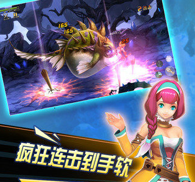

#Layabox 엔진의 게임 사례

Layabox 는 2011년 HTML5 게임 엔진 개발을 시작한 이래 비개원 HTML5 엔진 LAYA, 1세대 HTML5엔진 LayaFlash, 2세대 HTML5엔진 Layaiair, 3단계.

##LAYA 비개발 엔진

**JS 언어 개발에 기초하여 Canvas 를 렌더링 모델로, 주요 상선 대표 작품은 모두 3개다.**

###첫 번째'미친눈덩이'

HTML5 업종은 다양한 온라인 캐주얼 대형게임으로 2012년, 2017년까지 같은 유형의 수준이 없는 HTML5 게임 경쟁품으로 LAYA 엔진의 기술력을 과시했다.

이 게임은 현재 HTML5 버전과 안탁APK 버전, HTML5 버전은 2016년 말까지 QQ 오락홀 PC 클라이언트에서 운영되고 있다.

QQ 게임홀의'미친눈덩이'게임 주소는:[http://qqgame.qq.com/app/gamedetail_10434.shtml](http://qqgame.qq.com/app/gamedetail_10434.shtml) 

​< br >>
그림(1)‘미친눈덩이’

###두 번째'상위주공'

(증용명 3국 야옹전)은 업계 첫 카드카드 전략 HTML5 대형 게임으로 2013년, HTML5 판 대만 판권금 300만, APP 버전은 대만 차트 TOP10 에 로그인했다.2015년 HTML5 판은 안탁의 QQ 브라우저에서 상위했으며, 월유수가 최고 백만 명을 넘어섰다.현재 상위운영 상태로 레이보이스 홈페이지의 사례에서 2차원 코드를 통해 직접 체험할 수 있다.

​< br >>
도(2)‘상상샤 주공’

###제3항'사냥감2'

업종의 첫 중도 동작류 HTML5 대형 게임이다. 2015년 안탁QQQ 브라우저에 오르며 AP급의 정교한 화질과 유창한 액션 효과, HTML5 게임업계에서 막 뜨거운 단계에서 HTML5 기술이 APP 게임의 무게와 효과를 입증했다.LAYA 엔진은 제품의 표현력으로 엔진의 최고 실력을 입증했다.

​< br >>
그림(3) ‘사냥날 2’

##Layabox 1세대 엔진 LayaFlash

AS3 언어개발에 기반 Canvas 를 렌더한 모델로 HTML5 업은 Flash AS3 언어 및 A3원생 API 개발 HTML5 게임의 엔진이다.2015년 발표 후 1년간 이 엔진에 기반된 제품은 QQ 브라우저에서 10여 건이다.2세대 엔진 Layaiair가 더 강한 성능 우세 및 언어 지원 때문에 1세대 엔진 LayaFlsah 업데이트 정지

###LayaFlash 대표작 ‘취서류’

Forgam 그룹 PC 단이 총 6억원을 넘은 최고 MMMMORPG 페이지에서 LayaFlash 엔진을 채택한 이식 작품으로 HTML5 업종의 첫 APPP급 MORPG 대형 게임이다.2016년에 QQ 브라우저에서 처음으로 발행됐다.

​	< br >>
도(4)‘취서류’(소호면 체험)

###LayaFlash 대표 작품'모카 환상'

유명 모바일 게임 개발업체와 네트워크 천만 월 유수 수산물 레이레이레이 플래쉬를 통해 HTML5 로 이식했다.연모와 인터넷의 회사가 변고된 후 이 게임은 QQ 브라우저에서 선두를 중단하고 하선했다.

​< br >>
그림(5) ‘모카 환상’

###LayaFlash 대표 작품'미니헌터'

일본 인기 클래식 만화'전직 헌터'를 개편한 RPG 카드 게임으로 AS3 스타링의 프레임으로 개발됐다. LayaFlash 엔진을 통해 HTML5 게임으로 발표됐다.

​	< br >>
그림(6) ‘미니헌터’(소호면 체험)

##Layabox 2세대 엔진 Layaiair

　　**Action Script3, Typescript, 자바스크립트 3가지 언어개발을 지원하며 Canvas, WebGL 두 가지 렌더링 모드, 2D, 3D, AR, VR 을 개발하는 것을 지원하며 플래쉬, HTML5, APP(안탁과 IOS)의 다양한 버전을 발표할 수 있습니다.**Runtime 브라우저를 필요로 하지 않는 노출 환경 중 Layair 게임의 성능은 APP 게임에 비견된다.Layaiair는 2016년 4월 시작된 이 엔진이 텐센트, 선해, 나비 상호, 즐거움, 삼칠호 오락, 필름, 91wan, 호호 애호호 호응 등 유명 개발업체에 채택됐다.

###Layaiair 대표 작품'무진 기사3D'

HTML5 업계의 첫 상업화된 ARPG 대형 3D 게임이다.기사의 탄생과 유창한 성능 표현은 HTML5 가 AP급 대형 3D 게임의 정품을 실현할 수 있음을 증명한다.

​< br >>
그림 (7) <무한 기사 3D>(스코딩하면 체험)

###Layair 대표 작품'QQ 꽃덩굴'

QQ 공간의 유명 IP 제품입니다. QQ 공간 휴대전화 판에서 폭발적인 사교 대형 캐주얼 게임입니다.휴대폰 QQ 공간 APP 의 파트너는 스코어를 직접 체험할 수 있다.

​	< br >>
그림 (8) <QQ 꽃덩굴>(스코딩하면 체험)

###라야아 대표작'지존 포커'

보드 커뮤니티 게임인데, 이 게임에는 어로게임, 두지주 등 보드게임이 집성됐다.

​	< br >>
그림 (9) ‘ 지존 포커 ’ (소코드 면 체험)

더 많은 Layaiair 대표작품은 Layabox 홈페이지의 사례 항목 스토어 체험: http:wwww.layabox.com/html/game-list/