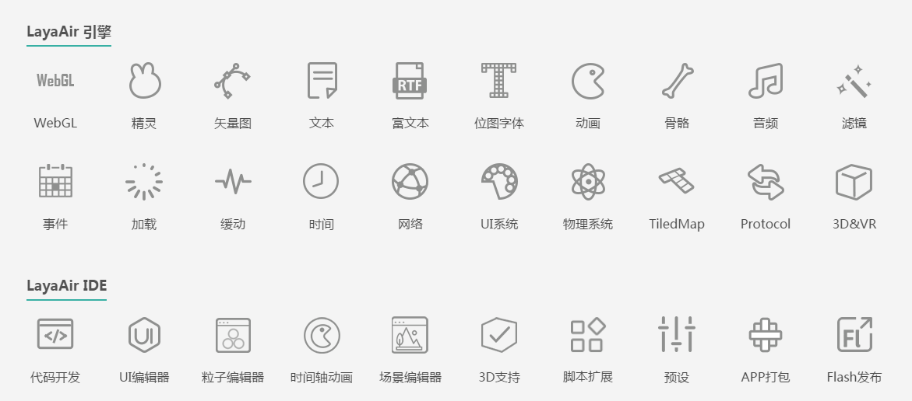

#레이어 기능 소개

Layair 엔진 라이브러리와 Layaiair IDE 두 개의 핵심 부분

##Layair 엔진 라이브러리 기능

Layaia 엔진 지원 요정, 벡터, 텍스트, 부 텍스트, 자켓, 애니메이션, 뼈, 오디오, 영상, 필터, 이벤트, 시간, 유동, 네트워크, UI 시스템, TiledMap, prtocol 등 API, 2D, 3D, VR 제품 개발을 지원하며 Canvas 와 WebGL 모드를 지원하며 HTML5, Flash, APP(IOS, 안탁)다양한 버전.

**그중:**

- laya.core 는 핵심 가방, 디스플레이, 이벤트, 시간 관리, 시간축 애니메이션, 유예, 메시지 교호, 소cket, 로컬 메모리, 소리, 목소리, 색필터, 비디오 글꼴 등을 가재.

- laya.webgl 가방은 webgl 렌더라인 봉투, webgl 렌더를 사용하면 초기화할 때 Laya.init(1000,800, laya.webgl.WebGL);

- laya.ani.js 애니메이션 모듈, swf 애니메이션, 뼈 애니메이션 등이 포함돼 있다.

- laya.filter.js 더 많은 webgl 필터, 예를 들어 외부 발광, 음영, 모호하고 더 많습니다.

- laya.html.js 는 html 동적 조판 기능을 재봉했다.

- laya.ui.js UI 제작의 다양한 구성을 제공했다.

- laya.tilemap.js tileMap 해상 지원 제공.

​

##레이어 IDE 기능

Layaiair ID는 주로 코드 개발 편집기, 가시화 편집기, 제3자 도구 체인 지원 도구를 포함한다.

그 중 주요 기능 포함:

##-코드 개발UI 편집기
##-입자 편집기시간축 애니메이션
##-장면 편집기3D 지원
##-스크립트 확장미리 설치하다
##- APP 클러치Flash 발표
##- JS 혼동 및 압축제3자 도구 체인 변환 도구 (SWF, 유닛 3D, 3Dmax, TiledMap, Spine, 용골 …)