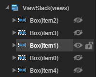

--**작은 게임 배포 프로세스**

다시 번역 옵션 증가

오래된 자원 파일 삭제 여부

자원 트리 필터 모드 개선, 파일 및 폴더 방식을 지원합니다

   

​

--**ETH, NEO 구간 체인 지원, 구간 체인 프로젝트의 생성, 편집, 배치 등 기능**

ETH, NEO 구별 연쇄 적용 개발 지원

지능 계약 개발, 서명, 배치 등 프로세스

--**ViewStack 편집을 완벽하게 하고 노드 컨트롤러를 통해 숨기기 위해 사용하면 더욱 편리하다**

--**1.9.20.1 복구 bug**

프레임 속성 패널 특정 상황에서 보이지 않는 bug

복구 mac 압축 png 및 jpg 신문 오류

​

--**1.9.20.2 복구 bug**

게시판 복구, 압축 잘못된 bug 제거

수정 mac 아래, layanative 잘못된 bug