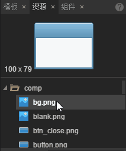
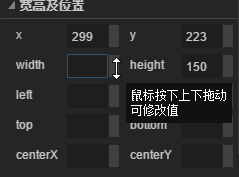

###신특성

편집기 속의 트리 구성 요소는 나무 위쪽과 아래쪽까지 끌며 자동으로 굴러간다

속성 패널 숫자 입력 상자 지원 키보드 위 키 수정 값

애니메이션 패널 증가 Ctrl + C Ctrl + V 복제 점착 프레임

애니메이션 파일을 열 때 오류 데이터가 있는지 확인하고 오류 데이터 삭제

애니메이션 K 프레임 단축키 K 로 변경

자원 패널은 일부 자원을 증가하고, 다음, 포장할 수 있는지 여부를 설정합니다

상대 레이아웃 속성을 삭제할 때 (left right top bottom) 당시의 xy 좌표 저장

붙여넣을 때 var 삭제, var 값을 바꿀 때 같은 값으로 변경된 값을 삭제할 때 삭제합니다

###복구 버그

입력 상자의 crl + A 는 텍스트 상자를 모두 선택할 수 없습니다

변환을 찾을 때 입자 페이지를 열면 잘못된 문제를 보고할 수 있다

중요한 프레임 복구 시 정확한 고침 문제가 없습니다

애니메이션 패널 복구 비정상적인 문제

