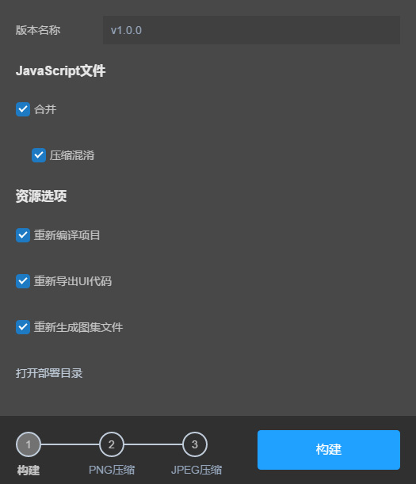

- **기능 개선 (테스트 버전)**

게시 기능 집성, png 압축, jpg 압축, 버전 관리 등 기능, layacmd 명령 실행 가능 버전

  

--**Mac 체험 최적화**

Mac 버전 인증서 핸드백 증가, 사용자 다운로드 후 사용할 수 없는 문제를 피하기
복사 붙여넣기 단축키가 사용할 수 없는 버그 해결
마스크 습관에 맞지 않는 버그 해결
Mac 에서 가벼운 기능을 해결하면, 어떤 때는 구성 요소를 선택할 수 없는 bug
Mac 하위 패널 Delete 키를 해결하고 사용하는 bug

-그림 관련******
사진 격식 지원 Inss + 124테오 + jpeg + 124테오 + svg + 124테크
파일을 자동으로 복사할 지 여부 (항목 설정, 단축키 F9)
그림 접미사 이름의 선택 추가, 기본 json 으로 지정할 수 있으며, atlas (항목 설정, 단축키 F9)
****
--**애니메이션 편집 관련******

애니메이션 편집 모드 변경 아래 층급 패드 노드 삭제 노드 및 애니메이션 데이터 기능
시간 축에서 개선, 노드 전환 후, 디자인 판넬 도 동시에 전환 하여 조작 을 편리 하게 하다
반환 조작 후 애니메이션 모드 추가 노드 버그 증가
삭제 프레임 데이터 해결 노드 순서 변화 버그
****
--**조작 관련 편집******

오른쪽 단추 메뉴 단축키 추가
보기 축소 제한 추가
right bottom 이 있고 pivot 가 있을 때 크기 조절이 잘못된 bug
딜레이 대시간 해결, 상대적인 레이아웃이 있어도 xy bug
설정 상대 레이아웃의 구성 요소를 해결하고, 끌고 나서 크기를 끌어당기면 원래의 위치의 버그
코드 내보내기만 할 때 카드 메인 메뉴의 버그 해결
****
--**입자 편집 관련******

입자 편집 모드, 판넬 드래그 bug
새로 지은 입자가 틀린 버그 를 해결하다
****

--**유닛 Plugin1.4*

새로운 설정 정보 기능 사용
새로 내보내는 지형을 Messh 눈금 으로 내보내며 작은 지형 에서 극대화 성능
Layaiair Run 을 추가하여 유닛에서 Layair를 실행할 수 있습니다.
입자 결정적 프레임 문제를 해결하다
특수 정점 구조 모형 내보내기 문제 해결
UI 를 전면 업데이트, 더 좋은 레이니파이널

