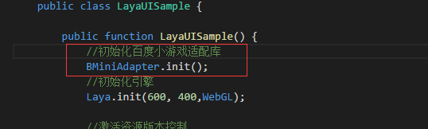

#오래된 항목은 바이두 소규모 게임 상세하게 배합한다.

> author: charley

####일부 오래된 항목이 작은 게임에 적합한 수요가 있기 때문에, 이 편은 오래된 항목의 적절한 절차와 순서를 상세하게 소개할 것이다.

**Tips:**글에서 3D 프로젝트를 시작으로 본편만 3D 프로젝트의 적합한 것은 아니다.문중 적합 방안은 2D와 3D는 모두 통용된 것이며, 단지 언어 버전 중 약간의 차이가 있어 이미 문에서 설명을 했다.

####필수 읽기 힌트:

>> 1, 본문을 읽기 전에 < 바이두 소놀이 만들기 > 를 먼저 읽으십시오. 더 많은 설정 환경의 기초 내용은 다시 소개하지 않습니다.
>>
> 2, 새 게임 프로젝트, 소규모 게임의 예제 항목을 직접 만들기 건의합니다.만약 입항할 때 창건된 것은 일반 프로젝트였으면, 본 편에 있는 작은 게임의 흐름을 배울 수 있다.


###첫 단계: 예시 항목 만들기 (기존 항목이 본 단계를 넘어설 수 있습니다)

LayairIDE를 열어 새 항목 인터페이스를 입력하십시오.Layair 3D 예시 항목을 선택하십시오.

>> Tips:이 절차는 낡은 항목이 배합 프로젝트를 보여주기 위해 일부러 일반적인 3D를 만드는 것이다.
>>

 


항목 이름, 경로를 입력하고, 언어 형식과 엔진 버전을 선택하십시오.

>(프로세스의 기본 일치로 언어의 개발자를 향한 이 편은 TS 프로젝트 프로젝트로 캡처할 경우 다른 언어 버전으로 차이가 있는 경우 추가 설명)

OK, 계속.

창건을 누르면 3D 프로젝트의 생성을 완성합니다.


###2단계: 바이두의 작은 게임을 맞추다

####1, 작은 게임 알맞은 전제 준비

엔진과 IDE 는 현재 최신 beta 버전이나 안정판을 사용하여 LayaiaiairIDE는 1.8.0beta 버전부터 오래된 항목의 버튼을 지원하기 때문에 오래된 버전 아이디와 엔진 라이브러리를 업그레이드 하지 않았으니 먼저 업그레이드하는 것을 잊지 마세요.


####2. 작은 게임 참조 라이브러리 참조

#####TS 와 JS 가 어울리는 방법

1.8.0beta를 시작으로 예제 항목을 생성할 때 TS 와 JS 항목은 자동으로 작은 게임에 맞춰 JS 를 도입할 수 있습니다`“libs/laya.wxmini.js”`그림이 제시한 바와 같다.

 


그림 중 코드:


```html

<!--提供了百度小游戏的适配-->
<script type="text/javascript" src="libs/laya.bdmini.js"></script>
```


1.8.0 전 TS 나 JS 노젝트라면 개발자가 필요합니다.`bin/index.html`중수동가입 그림에 빨간 상자 안에 있는 이 코드 또한 현재 사용된 것은 1.8.0이 아닌 새 버전 엔진 라이브러리입니다. 아니면 새 엔진 라이브러리로 전환할 때 laya.bdmini.js 때문에 오류를 확인할 수 있습니다.

#####AS3 프로젝트 배합 방법

AS3 프로젝트는 1.8.0 이후 새 버전 엔진 라이브러리를 사용한 후 개발자가 입구 클래스에 수동적으로 이 코드를 가입하고 작은 게임이 적당한 라이브러리 도입을 완성합니다.


```java

import laya.bd.mini.MiniAdapter;
```


####3、초기화 작은 게임 적용 라이브러리

구목 이 설립할 때 항목 입구 에 적합 배합 라이브러리 초기화 를 하지 않았기 때문에, 바이두 소규모 게임 버전 을 보장하기 위해 우리는 게임 입구 안에 적용 라이브러리 의 초기화 를 해야 한다.

**Tips**:*바이두의 작은 게임을 초기화하려면 엔진을 초기화하기 전에 필요합니다.*

#####TS 와 JS 프로젝트에 적합한 방법이 아래와 같이 표시되어 있습니다:

 


그림 중 TS 나 JS 항목의 적합한 코드 다음과 같습니다:


```typescript

//初始化小游戏适配库
Laya.BMiniAdapter.init();
```


#####AS3 프로젝트 항목 배합 방법 아래 그림이 제시한 대로:

 


그림 중 AS3 항목의 적합한 코드 다음과 같습니다:


```java

//百度小游戏适配
BMiniAdpter.init(); 
```


####4、번역 배합 코드

적절한 코드 추가를 완료하고 편집 또는 실행 디버그 단추 (F5) 를 눌렀을 경우 3차원의 입방체를 볼 수 있습니다.

 


>> Tips: 적당히 맞추면 편집 또는 디버깅, 그렇지 않으면 코드 부호에 부합되지 않습니다.

디버깅을 실행하는 창 닫기 후.작은 게임이 발표되는 코너에 들어갈 수 있다.

이로써 작은 게임의 적절한 배합은 이미 완성되었다.

간단한 요약 요약, 바로 새 버전 엔진을 사용한 후, 배합 라이브러리 적용, 이 두 개의 핵심 단계입니다.아직 간단하다.

다른 작은 게임 발표, 디버그 등은 모두 새 항목과 통용된다.다른 문서를 볼 수 있습니다.

이 문서에 의문이 있다면 공식 홈페이지 커뮤니티에 질문해 커뮤니티의 링크를 공식 QQ 군에 보낼 수 있습니다 @ 관리자 charley

커뮤니티 사이트: https://ask.layabox.com/


##본문 칭찬

만약 본문은 당신에게 도움이 된다고 생각하시면, 스코드가 작가님을 환영합니다. 당신의 격려는 우리가 더 우수한 문서의 동력입니다.

