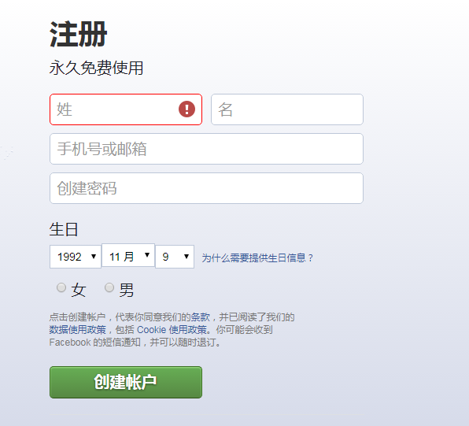
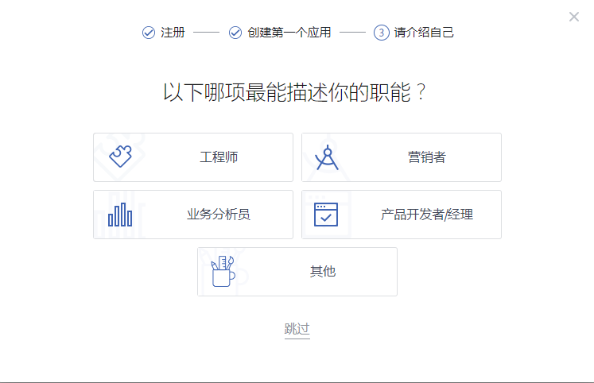

#Facebook 개발자 도움말 안내

###담 넘기기 (VPN)

들어서다[https://www.facebook.com/](https://www.facebook.com/)홈페이지 등록, 등록, 추측 등은 모두 벽을 넘어야 한다.

벽을 넘으면 무슨 공구를 쓰나요?모두들 바이두나 친구를 찾아가 비교해 볼 수 있다.이곳에서 상용 두 개를 들고 있다.

공짜 이름으로 벽을 넘기는 도구는 파란등이고, 무료판에는 유량 제한이 있어 가끔은 불안정한 것 같다.

블루 램프:[https://github.com/getlantern/forum](https://github.com/getlantern/forum)

비용 추천 monnocloud, 오랜 시간 검증, 비교적 안정적이며, 한 달 10위안, 1년에 99, 홈페이지에 여러 가지 세트가 있습니다. 자세한 구별 구매를 할 수 있습니다. 아까 언급한 그것은 일상적인 사용이 충분합니다.

Monocloud:[https://monocloud.net/](https://monocloud.net/)

구체적인 VPN 은 어떻게 사용할지 모르는 자신의 바이두, Monocloud, 구매 후 배경에는 설명이 있어 간단합니다.여기는 세심하게 말할 필요가 없다.(PS: 무료 광고, 아무런 이익 관계 없음^)

###둘째, facebook 개발자가 되어 응용을 생성합니다.

####1. 열다[facebook官网](https://www.facebook.com/)Facebook 계정 생성 (계정이 있으면 이 단계를 건너뛰십시오)

  

이름, 휴대전화, 메일박스, 비밀번호 등을 입력하여 계정을 만들 수 있습니다.디테일은 더 이상 말하지 않는다.

####2、등록 개발자

계정을 작성한 후 https: / developers.facebook.com/Facebook 개발자 센터에 들어간다.오른쪽 모퉁이에 하나 있다`开始`누르다**시작하다**개발자 계좌를 만드는 프로세스

  

인터페이스에서 로그인되면 페이스북 for Developers 계정의 프로세스 프로세스를 직접 클릭하여 개발자 계정을 만들 수 있는 바인터페이스의 바인터페이스를 만들 수 있습니다.**응용**프로세스 생성.로그인되지 않은 사용자는 로그인 창을 팝업해서 로그인할 수 있습니다.

####3, 첫 번째 페이스북을 만들기 (게임)

등록 프로세스 인터페이스 클릭**다음 단계**후탄 후 응용 프로세스를 생성하는 데 들어갔다.

 

응용 이름과 연락함 입력 후 클릭**Next**(다음) 첫 번째 적용을 초기화하기 위한 기초 정보 만들기 시작합니다.

####4, 개발자의 기능

개발자 계좌번호와 응용 기초 정보를 작성한 다음 프로세스는 자기를 소개하고, 인터페이스에 엔지니어, 제품 경리 등 옵션이 있으며, 이 프로세스를 클릭할 수도 있고, 눌러 쓰기는 하지 않는다.

 

5.

