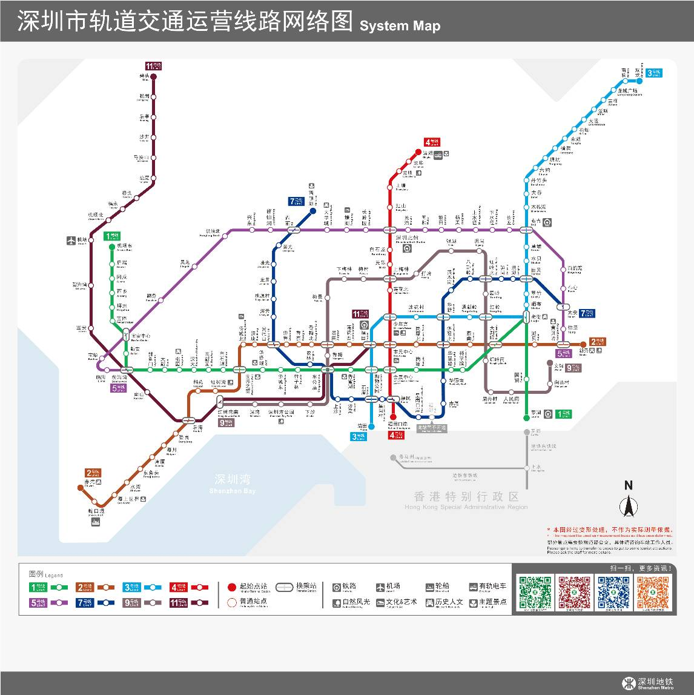

#Burberrryrry 위신친구권에서 크리스 세배 광고를 내놓으며 레이야아 엔진!

2017-01-11

최근 상하이 피읍에서 레이야아 엔진이 개발한 사치 브랜드 버버리 새해 광고가 위신 친구권에 등장해 화제가 되고 있다.

Layaiair 엔진은 게임 분야에서 비롯됐지만 소프트웨어 개발, 광고 마케팅, 생활 서비스 등 분야도 지원한다.오늘 소편은 리야아 엔진 개발을 위한 비게임 사례 3개를 선보였다.

###Layair IDE

Layaiaiair ID는 Layaiaia 엔진 개발, Layair UI 시스템, 가시화 편집 기능과 자적응 효과, 원생 데스크톱 소프트웨어와 차별 없음!

###Burberry 웨이터 H5 광고

사치 브랜드 버블리의 새해 광고: [유복] 연하 체험.H5 는 개인 주문, 제품 전시, 크리스 세배 등 원소를 융합해 정교한 화질, 유창한 체험, 뛰어난 영상 재생 성능을 하나로 융합해 버블리의 영식을 뽐냈다.

###선전 지하철 선로도

2016년 선전지하철은 시민 출입을 편리하게 하기 위해 Layaiair 엔진을 사용하여 온라인 지하철 운영 네트워크 노선도를 제작해 시민들이 실시간 방문 및 환승을 편리하게 하고 시민들의 명확한 기획 출범 선로.

###Layabox 관련

Layabox 는 인터넷 과학 기술(베이징) 유한회사가 만든 중국 톱 게임 엔진 공급업체 브랜드, 차세대 엔진 Layaia Air는 세계 최초로 HTML5 에 기반된 전능형 개원 엔진이다.세계 유일하게 Flash AS3, 자바스크립트, Typescript 3가지 개발언어를 지원하며 APP, HTML5, Flash 3개 버전의 게임 엔진을 개발합니다.2D3D VR AR 의 게임 개발 외에 엔진은 소프트웨어, 광고, 마케팅, 교육 등 많은 분야에 사용할 수 있으며, 성능은 APP 엔진에 필적할 수 있다.