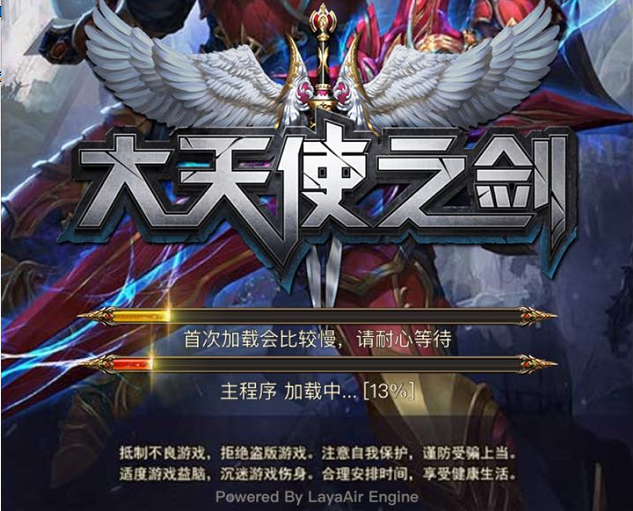

##텐센트는 HTML5 게임'전민대악두'위신, 휴대폰 QQ 동시 공측을 연구한다

지난 3월 3일 텐센트의 격투류 HTML5 게임'전민대악두'는 위신과 휴대전화Q2대 플랫폼 안탁버전 공측에 올랐다.이 게임은 Layaiair 엔진을 채택하여 텐센트 마경 작업실에서 개발했다.텐센트기 아래 첫 번째 선두로 된 자연 HTML5 라운드 게임,'전민대악두'의 출시로 텐센트의 자연팀은 이미 본격적으로 HTML5 게임에 진출했다.

(1) 위신게임'전민대악두H5'(안탁판만 보이기)

###텐센트 자연팀, 본격적으로 HTML5 게임.

마방공작실은 텐센트IEG(상동오락사업군) 4대 작업실 그룹 중 하나로 여러 해 잠재적으로 페이지와 핸드투어 2대 제품 라인을 갖춰'화영닌자 원라인','선검기협전'등 다양한 유명 상품을 가지고 있다.

마경 작업실은 마사 스튜디오의 핵심 작업실 중 하나다.‘전민수호지’ ‘전민농장’, ‘전민농장’, ‘종횡구주’, ‘QQ 수호농장’, ‘QQ농장’, ‘Q 총애대악투’ 등 유명 제품들은 모두 마경 작업실에서 나왔다.탄탄한 연구 실력을 가지고 있다.

(2)‘전민대악두’는 홈페이지 IP ‘큐 대악두’에 이식했다.

레이아라 엔진의 ‘QQ 농장’ ‘QQ 꽃덩굴’ 등 HTML5 제품은 이미 스마트폰 QQ 공간에서 놀자 플랫폼에 올라간다.하지만 모두 텐센트IP 를 사용한 콜라보레이션 제품에 속한다.이번 마경 스튜디오는 DAU 2000만 개를 넘는 페이지 유람IP'큐 대악두'를 HTML5 수유시장에 이식해 텐센트 자연팀을 본격적으로 HTML5 게임에 진출했다.

###마이크로 폰QQ 의 HTML5 게임 입구

8월 3일'전민대악두H5'는 안탁 시스템의 위신과 휴대폰 QQ 를 동시 공측한다.

위신의 게임 채널 중'더 많은 정품 게임'이 열렸다.'H5 게임 다운로드 금지'의 분류에서'전민대악두H5'를 볼 수 있다.'작동'을 누르면'iOS 시스템에서 잠시 열 수 없다.

(도3) 위신게임 첫 라운드 H5 게임'전민대악두'입구

'전민대악두'휴대폰 QQ 입구, 휴대전화Q 게임센터에 위치한 H5 분류 중(그림 4개)에 있다.

(도4) 핸드폰 QQ 첫 라운드 H5 게임'전민대악두'입구

위신과는 다른 점은 친구와 나눔의 링크를 통해'전민대악두'의 아이OS판 휴대전화 QQ 사용자도 제대로 게임에 들어갈 수 있다는 점이다.

###HTML5 게임 품질이 계속 높아지고 있어요.

'전민대악두'는 화질이 정교하고 유창하고, 게임의 전체 품질은 S 급 정품이다.텐센트는 연구진에 참여해 HTML5 게임업계의 품질을 높이는 추세다.

'전민대악두'전투 장면 캡처

‘전민대악두’를 제외하고도 리야아 엔진을 채택한 유명 IP 대작 ‘천사의 검 H5’도 8월 3일 선을 시험했다.37게임의 첫 번째 모델인 HTML5 제품으로, 이 게임은 HTML5 시장을 겨냥한 것이 아니라, 앞으로 HTML5와 APPP 쌍단 동발 전략으로 HTML5와 APP 게임시장에 진출할 계획이다.무엇보다'천사의 검 H5'APP 버전은 Layabox 소속 Layanaative 패키지 방안으로 HTML5 게임을 Native APPP로 직접 싸 주는 것이 좋다.

(도 6) 37 게임 타이틀 HTML5 게임'천사의 검 H5'

7 월 말 텐센트해 올바른 레이어어엔진 3D 제품, 텐센트와 37 게임이 직접 연구한 페이지 IP 이식 대작.APP 품질의 HTML5 게임의 정품이 빈번히 나타나 HTML5 게임업계의 전체적인 품질을 높이고 있는 HTML5 게임에 대한 인지를 바꾸고 있다.

2017년에는 정품과 침전된 한 해, HTML5 게임의 품질이 부단히 다진 해였다.