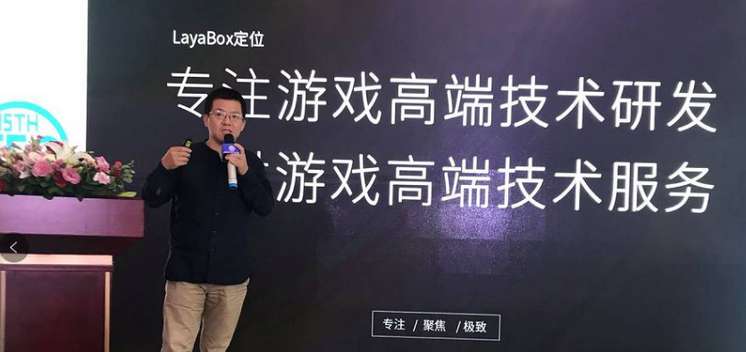
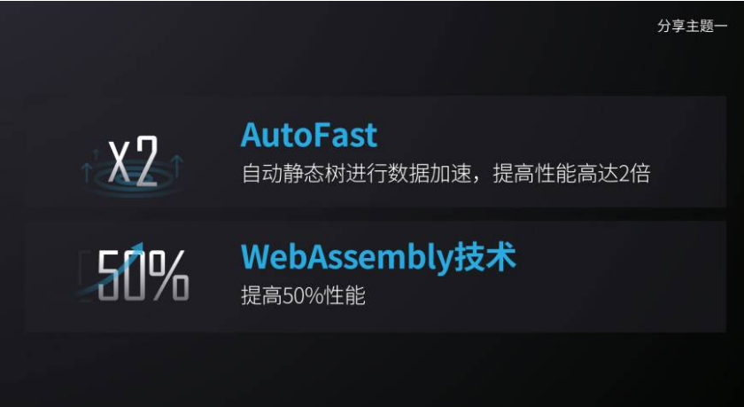
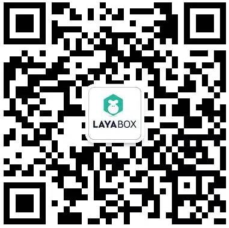

# Layabox谢成鸿出席TFC，公布智能优化方案可提升性能2倍！

2017 제15회 TFC 가 첫 이주 하문, 레이야박스 창시자 사성홍은 TFC와 5 게임이 주최하는 제6회 HTML5 게임 최고급 포럼에 참석해'최고의 게임 기술 공급자'를 주제로 나눌 예정이다.

###Layabox 기업 위치

이성홍은 회의에서 처음으로 Layabox 기업의 위치를 공개해 게임 고단 기술개발에 전념해 게임 하이테크 기술 서비스를 제공했다.짧고 짧은 두 마디로 리야박스의 전략적 중심을 뚜렷하게 그려내는 것은 고단한 기술개발, 최강 성능 엔진을 만들기 쉬운 개발 도구와 제품 프레임, 레이야박스가 가장 어려운 기술을 감당하기 위해 더 많은 제품 연구팀의 기술 원가를 낮추고, 게임 하이테크 서비스를 제공하는 데 도움이 된다.품연발단은 기초 지탱을 잘하고 미래는 첨단 기술서비스로 기업의 가치와 기업의 이익을 실현한다.

###Layaiair 엔진, 3D 이 숲은 유일하게 열매를 익힌 나무

레이야아 엔진은 큰 천사의 검, 전민대악두, 미친 눈덩이, QQ, QQ, QQ 농장 등 많은 유명 2D 게임제품이다.역시 3D 시장에서 유일하게 선상에서 제품을 운영하는 3D 엔진을 가지고 있으며, 현재 선착순 3D 제품은 무진장, 설수리 영주, 촉산, 연발 중인 3D 제품은 용기사, 영웅전장, 어로, 어로와 전투, 무쌍 등이다.

###LayaNative 조력 다플랫폼 동기화 발행

10월 22일 상선 24일간'천사의 검 H5'는 유수 돌파를 선언했다.어제 친구권에서 광범위하게 퍼져 업계의 이슈가 되었다.이 제품은 업계 월류 기록을 갱신하는 제품이다.래야아 엔진을 채택하고 레이나잇을 사용하여 APP 마이크로 플랫폼으로 보급합니다.현재 H5 버전을 발표하면서 안탁마이크로백, 아이오스 마이크로백을 선보여 게임 업계의 새로운 발행 전략이 됐다.

LayaNative 는 2013년부터 이미 응용됐다. 그 때 H5 는 휴대전화 브라우저의 성능이 나빠 게임 발행에 인정되지 않았다.그래서'삼국야옹전'이 먼저 홈페이지 발행 대리 발행에 이어 레이야야야야티브 기술로 안탁과 아이오백, 대만 시장에서 대리 발행됐다.

여러 해 동안 축적과 정성 들여 조성하고, 레이네이트는 여러 해 전에 더욱 성숙해졌고, 미래는 조력업종 페이지, 휴대전화 H5 채널, APP 채널, 매수 채널 등 전면 시장에서 발행한다.

###스마트 최적화 엔진 성능을 수배로 높이다

그동안 레이박스는 성능의 우세로 한 무리의 연구 개발팀을 동원했다.그러나 성능을 추구하는 레이야아 엔진 팀은 이에 만족하지 않고 끊임없이 최적화를 하고 있다.예컨대 UI 와 게임 장면을 겨냥한 Layaia 엔진 팀이 새로운 스마트 최적화 방안을 내놓는다.

레이야아 1.0 버전에서 성능 최적화 수요 수공 감소 drawcall, 최적화 카치아스 등을 줄였다.특히 cacheAs 의 최적화는 다른 응용 장면을 구분해야 한다. 만약'normal'과'bitmap'인자가 부적당하지 않으면 오히려 새로운 성능 문제가 될 것이다.

또 게임 UI, 게임 장면 등 디스플레이 대상 레이어드가 많을 때 수동 최적화된 cacheAs 설정은 모든 최적화할 수 없는 디스플레이 대상을 설정할 수 있으며, 반복 테스트를 해야만 최적화될 수 있는 모듈을 골라 최적화할 수 있다.이때 성능 최적화는 풍부한 연구 경험을 갖춘 고급 인재가 필요해 제품의 최적화는 문턱을 가지고 있다.

Layaiair의 새로운 최적화 방안 AutoFast 를 채택해 CcheAs의 최적화 설정을 직접 통과해 지능과 자동적으로 최적화 목표를 달성할 것이다.성능은 다른 기형 테스트에서 2배 이상 증가했다.개발자의 최적화 작업량을 대폭 줄였다.

AutoFast 스마트 최적화 방안을 제외하고는 미래가 출시되는 Layaiair2.0은 webAssembly 기술을 채택하고 이 기술은 엔진의 전체 성능 50% 를 향상시킬 것이다.HTML5 의 제품의 성능은 엔진 측의 집중 중에 큰 걸음으로 나아가고 있다.

###끝말

이번 연설의 테마와 같이 레이박스가 가장 좋은 게임 기술 공급자, 레이야박스는 하이단 기술을 바탕으로 게임 팀 밑바닥 기술, 개발 도구, 제품 프레임, 연발 서비스, 하이테크 기술 지원 서비스를 제공한다.게임 산업의 개발 과정을 위해 원가를 줄이고 제품 상선을 가속화하고 기술 개발 문턱을 낮춰 끊임없이 노력하고 있다.

QR코드를 일소하다