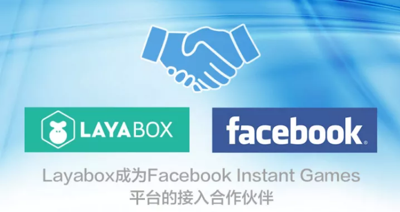

##Facebook 은 HTML5 게임 초심으로 중국 엔진 기업에 선별해 누구에게 이득이 될까?

미국 시간의 10월 24일 페이스북은 레이야박스에 대한 인스타그램 중국 지역의 게임 협동서명을 마쳤다.Layabox 측은 인스타그램 플랫폼의 파트너로, 레이야박스가 페이스북을 통해 중국에서 첫 번째 HTML5 게임을 진행해 국내 HTML5 게임 개발자를 위한 페이스북 플랫폼의 게임 테스트, 상선, 비즈니스 대합 등 최종 심사에 나선다.

또 다른 HTML5 엔진에 이어 페이스북이 된 인스타그램 플랫폼 파트너로, 국내 3대 HTML5 엔진 측이 Facebook 된 HTML5 게임의 파트너가 됐다.이에 따라 페이스북 (Facebook) 은 권한 엔진 측을 통해 선별 및 상선 게임에 협조하여 중국 게임 개발자를 빠르게 얻으며 상품을 가져오는 것을 알 수 있다.

####HTML5 게임 개발업체가 출항하는 큰 기회

페이스북은 전 세계 최초의 커뮤니티 네트워크로 20억대의 거대한 사용자 기수를 가지고 있다.작년 말부터 입장을 선포한 이래 동작이 빈번하다.국내에서도 숱한 목소리를 내며 국내 HTML5 에 적극적으로 참여하는 등 주요 활동에 나섰다.중국의 유명 엔진업체와 연구 개발업체와 깊은 소통과 협력을 벌이고 있다.

국내 HTML5 게임 개발팀 현황은 어떤가요?HTML5 게임의 전체 시장의 흐름이 끊임없이 향상되고 있지만 시장 점유율과 평균 게임의 품질이 끊임없이 높아지고 있다.하지만 HTML5 시장은 현재 빙화 2중천의 경지에 처해 있으며, 대급발행진과 대행진들의 살해로 대IP 제품의 미단 매수량과 전플랫폼의 동시 발행 방식으로 빠른 속도로 출월 유수 억을 넘는 HTML5 게임 제품을 개발하고 있다.한편 중소연발 팀이 HTML5 게임 업계에서 생존할 기회를 찾기 위해 힘겹다.

현재 페이스북이 펼친 올리브 가지는 HTML5 게임 개발팀이 직면한 또 새로운 기회다.한편 페이스북은 엔진 측과 개발자의 밀접한 연계에 의존해 빠른 연발 개발팀을 위해 출해통로를 열었다.한편 페이스북은 HTML5 게임 플랫폼의 사용자 체험을 적극적으로 개선하고 있다. 특히 페이스북기 아래 위신처럼 자리매김한 해외 사교 APP Messenger, HTML5 게임 입구가 일급 메뉴의 위치에 위치하고, 친한 친구의 회화 목록에서도 입구가 나타난다.우수한 HTML5 게임은 해외에서 또 다른 폭발 기회를 가져올 수 있을지도 모른다.

####LayairIDE 중 인스타트 Games SDK

LayaiairID는 Layaia 엔진 개발자의 집성식 개발 환경, UI 가시화 편집, 자원 전환, 프로젝트 발표, 원생 APP 패키지, 지역 문답 등 서비스와 기능을 집성했다.LayairID는 후속 버전에 페이스북을 설치하는 인스타그램 SDK, 개발자의 접입 과정을 감지하고 개발자 출해를 위한 지원과 도움을 제공합니다.

페이스북과 엔진 측이 파트너 관계를 맺고 엔진의 개발자를 빠르게 얻었다.엔진은 개발자와 업무 점도를 강화하고 개발자는 더욱 편리한 출해 기회를 얻었다.3자 공승해야만 HTML5 게임의 전체적인 생태를 더욱 촉진할 수 있다.