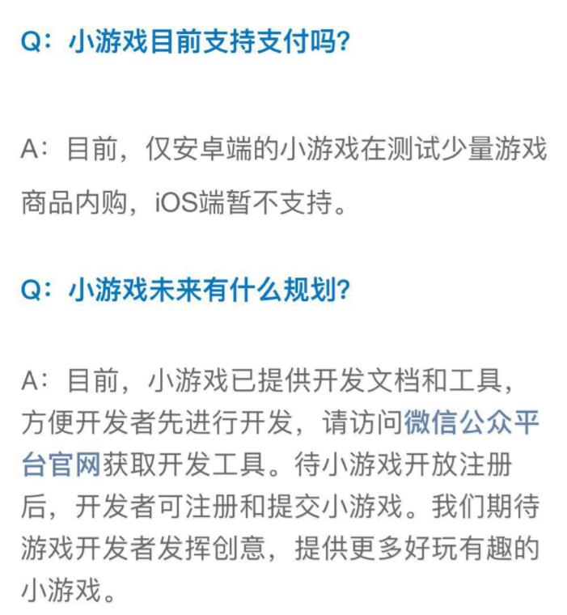

##'마이크로신 게임'플랫폼 12.28 공식 발표, 레이야아 엔진 동기 지원, 짝퉁 미니 게임!

12월 28일, 웨이스트 게임은 6.6.1 버전에서 상위됐다.마이크로신 애플릿 입구의 마이크로보드 플랫폼을 통해 첫 번째 오락품을 볼 수 있으며, 이 중 4개는 Layair 엔진 개발을 채택해 Layabox 애플리케이션을 통해 출시된 마이크로메일을 적용해 발표한 미니시리즈.

###첫 번째 화면 마스터가 밀었던 게임은 3D 기술을 사용했습니다.

위챗 6.6.1 버전을 갱신한 뒤, 첫 스크린 인터페이스와 게임이 자칫, 2013년 위챗 첫 스크린의 HTML5 작은 게임'비행기 대전', 같은 스크린 보급, 같은 소셜 차트에 불과 3D 기술을 운용했으며 기술의 진보에 대한 설명과 함께 위챗 작은 게임은 3D를 지원하는 것으로 드러났다.마지막 소편은 한 점프와 비행기 대전과 같은 불꽃을 예상할 수 있다.

Layaiair 엔진은 2D의 강력한 성능 우세를 제외하고는 3D의 지지에 많은 노력을 기울이고, HTML5 대형 3D 게임의 개원 엔진에서 업계에서 선두를 차지하고 있다.Layair 엔진을 사용하여 개발한'설수리 영주 3D'는 현재 HTML5 업계에서 유일하게 본격적으로 운영하는 대형 3D 상업화 제품이다.반면 웨이보 소규모 게임의 3D에 대한 지원은 레이어어르 엔진이 개발된 제품으로 Layabox 공식에서 제공하는 애플리케이션을 통해 웨이보스 콘텐츠를 알맞게 배고해 웨이보 소규모 게임 상품으로 발표할 수 있다.

###마이크로 게임 지원 게임 형식

많은 개발자들이 소규모 게임만 지원할 수 있을지 우려하고 있다.이것은 잘못된 관점이다.마이크로신 소규모 게임은 마이크로 애플릿 애플리케이션의 분기, 게임의 유형은 다양하고, 3D 게임, 실시간 경쟁 게임, RPG 게임, 라운드 게임, 라운드 게임 등, 첫 상위권의 제품은 주로 레저 게임과 보드 게임이었지만, Layair 엔진을 채택한'전민대악두'를 볼 수 있다.고품질의 대형 라운드 게임입니다.조만간 Layaiair 엔진 대형 게임이 트위터 플랫폼에 잇따라 출시된다.

**마이크로 게임 입구와 지불**

**1, 위신 관계 연쇄**

마이크로신 작은 게임의 중요한 입구는 친구 공유, 단체 공유 등 마이크로폰 체인.

**2, 위신 애플릿 입구**

관계 사슬의 나눔 외에 가장 기초적인 입구는 애플릿 입구다.첫 번째 게임이 열렸다면 위신 애플릿 입구에 들어가 키워드'위신 소게임'을 입력해야 한다. 검색 결과 애플릿'마이크로편지 작은 게임'을 누르면 모든 마이크로신 작은 게임을 볼 수 있다.

**3, 위신 리스트 맨 아래 입구**

하라의 웨이보 리스트를 통해 최근 놀던 마이크로폰 소놀이를 보여줄 수 있다.

**4. 데스크톱 입구**

안탁 버전의 위신, 작은 게임은 데스크톱 입구에 추가되어 있습니다.(작은편집이 데스크톱에 추가되었을 때 실제 성공하지 못했는데, BUG 인지 인터페이스 개방되지 않았는지)

**5、지급 관련**

작은 게임의 공식 답변에는 현재 안탁단의 작은 게임이 소량 게임 상품을 측정하며 IOS는 잠시 지지하지 않는다고 밝혔다.

**Layaiair 엔진 작은 게임 버튼을 지원합니다**

LayaAri 엔진의 개발자에 대한 Layabox 는 작은 게임의 적당한 배급창고를 제공하고, 적당한 배급창고를 도입하고, 초기화 조정 라이브러리를 실행할 수 있는 한 키를 발표해 Layaiairide 도구로 마이크로게임 개발을 진행합니다.

1, AS3 버전 적용 라이브러리를 도입하는 초기화 방법:

> 미니에이드 pter.init();

2, TypeScript 와 자바스크립트 버전이 적용되는 라이브러리를 도입하는 초기화 방법:

> Laya.MiniAdpter.init();

더 자세한 배급창고 사용 교정 개발자는 공식 인터넷 문서를 볼 수 있다.

Layaiair 엔진 사례 코드 1건을 작은 게임의 효과:

