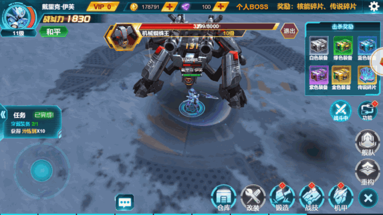

##공상 과학 제재 고청자유 시각 3D H5 게임'우주 기갑'오늘의 삭제 파일 테스트

1월 26일 오전 11시 Layaiair 엔진 개발을 채택해 화수게임 독점 대리의 첫 번째 판타지 장르 3D HTML5 게임'우주기갑'이 정식으로 삭제 서류 테스트를 열었다.

이 게임의 모형은 고해상도 3D 렌더를 채택하고 고결 세밀한 스티커를 사용하여 2K 스크린이든 4K스크린이든 모두 고청무손한 캐릭터 품질을 선보였다.360도의 수평 회전 자유 시각 기능을 새롭게 늘리고, 실제 3D 입체화면을 환원해 H5 업에 속한 것은 이번이 처음이다.비범한 절륜의 공상 기갑 세계를 만들어내며, 유저들의 비주얼 성연을 선사할 예정이다.

>> 왼쪽을 누르면 원문을 직접 체험할 수 있습니다.

####극대화 특효 초강성 촉감

‘우주 기갑’은 가로스크린 조작 전투 패턴을 채택했으며, 여러 사람의 온라인 전투를 지지할 뿐만 아니라, 화면을 잘 표현했다.영화급 화면의 프레임율, 행운유수 같은 동작 표현.최신 HTML5 순3D 입자 기술을 운용하여 극심한 전투타격감, 화려한 폭시적인 기능을 선보였다.로크 컨트롤 방향은 일반 공격이든 스킬 석방도 유창할 수 있다.

《 우주 기갑 》 전투 캡처

####3D HTML5 게임 기술이 끊임없이 강화되고 있다

2016년 Layaiair 엔진 개발에 기반 3D HTML5 게임이 출시된 이래 레이야아 엔진 개발을 도입한 3D HTML5 제품도 늘어나고, 상위Q 공간 등 공개 채널을 운영하는 3D 포각류도 있다.

레이어 3D 엔진이 점점 성숙해지고 있다.3D 특효와 기능을 개발하는 데 대해서도 대담해지고 있다.예를 들어 최근 상위Q 공간에서 놀자 플랫폼의'촉산 3D'는 선협류 3D HTML5 의 선천을 개척할 뿐만 아니라 게임에서 해양의 3D 입자 효과를 운용해 3D 실시간 복장 기술과 감탄을 자아냈다.

'촉산 3D'게임 캡처

현재 ‘우주 기갑’은 고정형 모형과 스티커, 360도 수준의 시각 회전 기능으로 3D 게임을 더욱 리얼하게 한다.업종도 HTML5 3D 표현력이 끊임없이 높아지고 있다.

‘포켓몬’ ‘전무쌍’, ‘봉황무쌍’, ‘The last in wildland’ 등은 Layair 엔진을 기반한 3D HTML5 제품은 최적화 조정 단계에 들어섰고 설날 이후에도 이어질 것으로 보인다.게이머들에게 더 다른 느낌을 주는 시선을 사로잡을 것이다.

####마지막

단유, 페이지, 여행의 발전 역사를 보면, HTML5 3D 는 발전의 필연적인 추세다.3D 성숙한 경험을 갖춘 연구진은 이미 리야아 엔진을 채택해 3D HTML5 에 합류해 이미 알려진 3D HTML5연구진은 수십 개에 이르렀고, 그 중에서도 유명한 페이지와 APPPPP 수유팀도 적지 않다.우수한 3D 개발업체의 진입에 따라 미래가 3D 분야의 우수한 게임이 끊임없이 증가하고 3D 폭행금도 우리에게 점점 가까워지고 있다고 믿는다.