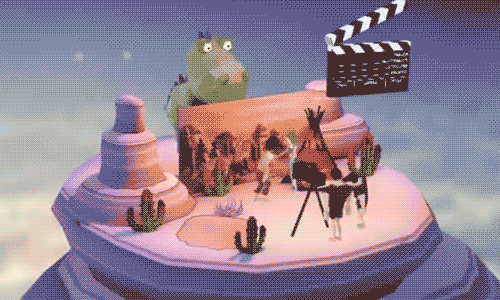

##역천!3D 홈페이지 전시를 이렇게 할 수 있어요.

앞서 레이아라 엔진 3D 시크한 게임을 여러 가지 소개했다.오늘 Layair 엔진을 채택한 3D 웹페이지 전시 제품'불가사의군도'를 소개합니다.

이것은 비게임의 HTML5 홈페이지이며 3차원의 공간기술을 바탕으로 다른 부공작은 섬 사이로 전환한다.클릭 GO 를 통해 매 장면에 들어갈 수 있으며 360도 전각도로 섬의 풍모를 볼 수 있으며 간단한 호동 작업을 할 수 있다.예를 들어 VR 안경 세계를 끼면 화산에서 분출 동작 등을 누르면 웹 페이지의 디스플레이를 보여주는 일종의 오락식 교호 체험이 있다.

직접 식별도 중 QR코드를 누르거나 왼쪽 밑의 읽기 원문을 통해 링크 체험을 열 수 있습니다.

 

**《 불가사의군도 》 의 창작 기원과 창작 과정**

'불가사의군도'는 매트릭스 멀티미디어 사업부가 성립된 지 3주년이 된 부문 경작이며 갑자의 각종 수요 속박도 없이 시작을 하면 더욱 과감하고 자유롭다.

'가벼운 분위기 속에서 소개해 주세요'는 이 작품부터 가장 단순한 동기다.

소개를 하려면 몇 개의 업무 판자를 분명하게 말해야 하니 군도의 개념이 폭풍 모임에서 탄생하였다.

네 가지 특색이 선명한 세계는 각각 네 개의 업무 판자를 대표하고, 모든 섬의 상황을 통해 직관적으로 이해하고 연상할 수 있다.

▲ 노란 사막, 녹색 우림, 파란 빙하, 빨간 화산

다음은 스타일의 설정입니다.3주년 경축은 물론 신나게 즐겨야 한다. 원소는 마침내 깔끔하고 싱그러운 패턴 스타일을 선택했고, 분위기에 맞는, 휴대전화 브라우징 효과를 고려했다.

인물은 정경을 구성하는 필수적인 요소이기 때문에 우리는 모든 장면에서 독특한 성격을 설계했다.

소통은 중점이니, 사용자가 모두에게 ‘노는 것’을 붙여야 한다.우리는 전통의 3차원 서열과 동영상을 포기하기로 결정했다. Layaiair 3D 엔진으로 커널로 모든 코너를 실시간으로 소통할 수 있게 했다.실시간 렌더링 효과는 사용자가 H5 홈페이지를 보고 있는 것을 거의 잊게 하고 3차원 게임을 하고 있다.

 

큰 장면의 전환과 360도만 살펴보면 분명 부족하다는 것. 섬 하나하나 작은 호황을 만들어 보는 재미를 더할 수 있다.VR 안경 세계를 끼면 화산에서 분출 동작이 생길 수 있다.

**매트릭스 소통 Matrix**

매트릭스는 상호 광고와 인터넷 전격 마케팅의 정합 운송 서비스상이며 브랜드를 위해 정상적인 인터넷 이미지를 만들어 기업 마케팅 전략을 상호 해결 방안을 제공하고 있다.소속 멀티미디어 사업부는 전문적이고 전면적인 기술 창작팀으로, 영화 후기, VR&AR 을 포함해 APP 응용 개발, 무대 춤미포장 등 다양한 업무 패키지를 포함했다.