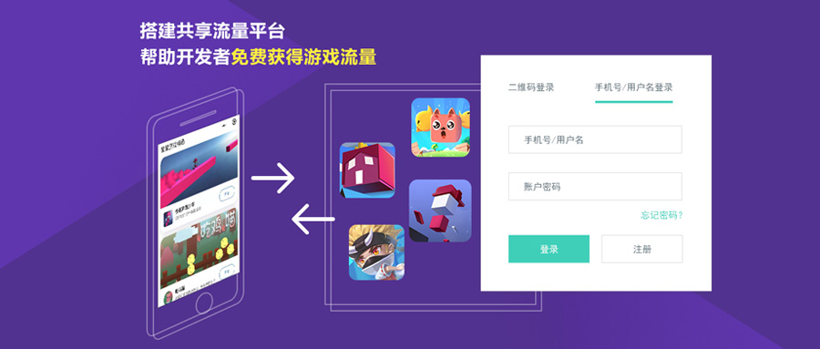

## Layabox推出小游戏流量共享平台，开发者可免费获得游戏流量！

>>*author:charley update:2018-11-1*

 

이 개념을 공유하는 것은 이제 낯설지 않지만, 진정한 의미의 공유는 그리 많지 않다.현재 많은 소위 공유경제는 플랫폼에서 대량의 새로운 자원을 꺼내 공용 비용을 받는다.따라서 일부 새로운 실체자원은 실제 사용 수요를 초과하면 도시 쓰레기를 초래해 자원과 자본의 낭비를 초래할 수 있다.Charley 는 좋은 공유를 사회자원에 대한 효율적인 재결합으로 자신의 여유자원을 공헌하고 다른 사회 자원의 공유를 즐길 수 있다고 생각한다.'나는 사람됨, 사람마다 나'라는 목표를 달성했다.레이박스가 내놓은 작은 게임 흐름이 플랫폼을 공유하는 것은 바로 그렇다.

###마이크로 마이크로폰

마이크로게임 초기 단계에서 웨이터관계 사슬을 이용해 각종 강제 또는 유도 나눔을 하는 것은 소규모 게임의 유량적리 단계로 위신 생태도 불건전한 발전의 영향을 받았다.관련 위신운영조항의 규범에 따라 위신 생태에 영향을 미치는 불량 요소는 제거되고 있으며 작은 게임의 유량 (사용자) 이 난이도가 갈수록 커지고 있다.소량의 머리 작은 오락제품만 내매를 통해 광고를 구입하거나 유통으로 변출할 수 있다.대다수의 작은 게임은 주동적이거나 수동적으로 박스(작은 게임 플랫폼) 대리 운영을 할 뿐, 유량은 얼마의 손해를 보는 장사다.

어느 정도 유량 보장 된 유명 박스 유량주 는 일반적 으로 게임 품질 에 대한 일부 요구 를 받 지 않 았 다. 대리 도 살 수 없는 작은 게임 연구 개발 업체 는 적지 않 았 다. 이 수량 의 많은 긴 꼬리 게임 을 그들 은 어떻게 갈 까?

소신 소규모 게임 산업이 시월부터 온도가 떨어지는 추세를 보이고 있다.작은 게임 외곽 수요가 급격히 감퇴하고, 혹은 몇 개의 긴 꼬리 게임 개발업체들을 손에 쥐고, 어떤 실망은 퇴장하고, 어떤 사람들은 여전히 초조하거나 방황하고….

###어떠한 비용도 내지 않고 나누는 유량 공유 플랫폼

소신 소규모 게임 산업이 시월부터 온도가 떨어지는 추세를 보이고 있다.조건 없이 유량 을 살 수 없는 박스 대리 의 작은 게임 에 실망 을 하 고, 어떤 것 은 아직 초조하거나 방황...

Layabox 는 현재 현재 50만 개설자의 게임 엔진 공급자로서 작은 게임 개발에 있는 한 멤버로, 적시에 파악하고 개발자의 아픔 요점을 이해하고 있다.유량 구매 능력이 없는 많은 개발자들을 돕기 위해 유량 공유 플랫폼을 내놓는다.레이아아이리드 내 집성 유량공유지의 구성 요소를 개발자로 끌어당겨 기술적인 대합을 실현할 수 있도록 게임 정보를 간단히 제출하면 소규모 유량공유 플랫폼에 가입하여 무료 유량으로 유량을 얻을 수 있도록 공짜로 제공할 수 있다.

레이박스는 플랫폼의 운영자와 발기쪽을 공유하며 유량공유 플랫폼의 개발자 비용과 구분을 받지 않습니다.나는 사람됨, 사람됨이 나를 위한 무료로 생태를 공유하는 것을 의미한다.

 

플랫폼 사이트: http://share.layabox.com/

###유량 공유 플랫폼이 뭐예요?

유량 공유 플랫폼, 공유하는 자연은 게임 사용자, 그 게임 사용자는 어떻게 공유할 것인가.이 개념을 이해하기 전에 우리는 먼저 교체된 이야기를 해 보자.

관계 체인 공유 전환, 이름 키워드 검색 최적화, 작은 게임 교환, 몇 가지 중요한 무료 유량 원과 운영 전략이다.반면 교체량은 작은 게임과 작은 게임 사이의 비즈니스 방식을 통해 교환하는 협의를 뜻하며 게임에서 icon 아이콘으로 서로 다른 게임으로 넘어가는 행위를 조회하는 것이다.결국 쌍방이 대등한 사용자가 새로 증가하고 교환할 것이다.

예를 들어 A, B 게임은 모두 5만 명 정도 되는 일일 가입자, A 게임은 B 게임에 1만 개씩 늘어나는 B 게임도 대등한 A 게임에 1만 개가량 늘게 된다.양측은 각자 약속한 신규 조건을 달성하고 앞당겨 입구를 닫고 대등한 사용자 교환을 달성했다.

이 같은 협력 모델은 현재 비교적 흔히 볼 수 있다. 자신의 게임의 충실한 사용자가 반드시 돌아올 수 있기 때문이다. 자신이 충실한 사용자가 유출되는 동시에 새로운 증가할 뿐만 아니라, 새로운 증가에는 반드시 일정한 비율이 있는 사용자가 충실한 사용자이다.그래서 환량 패턴도 주류의 무료 압수 모드 중 하나다.

하지만 이런 패턴도 일정한 한정조건이 있다. 예를 들면 A 게임은 1만일 살며, A 게임은 하루에 B 게임에 수백 가입자를 데려갈 수 있다. B게임은 하루에 A 게임에 수천 가입자를 데려갈 수 있다. 이런 차이는 B 게임과 A 게임과 교환을 원하지 않는다.또 어떻게 더 많은 동급의 게임을 찾아 교환할 수 있는지, 이것은 비교적 큰 비즈니스 자원과 인맥이 필요할 뿐만 아니라, 특히 1만일까지 살 수 없는 긴 꼬리 게임들을 어떻게 바꿀 수 있을까?

Layabox 의 유량 공유 플랫폼 원리는 환량과 비슷하다.비즈니스 교섭 없이 하루 활성 조건 제한 없이 어떤 비용이나 분할을 받지 않고 개발자 직접 로그인 유량공유 플랫폼 셀프 제공 게임, 플랫폼 측이 유량공유 구성 요소 기술이 실현되고 게임이 정상적으로 실행될 수 있다면 플랫폼으로 올라갈 수 있다.기껏해야 수천이나 막 상위권에 불과한 작은 게임은 공유 플랫폼에 수십 자릿수를 기여하거나 100자릿수 조회수를 공헌할 수 있는 경우도 플랫폼 대등이나 예기기간을 초과 보답할 수 있다.

###데이터 공유 플랫폼 데이터 원리

모든 공유 플랫폼의 긴 꼬리 게임은 유량 공유를 위한 구성 요소를 접수해야 한다.이 구성 요소를 통해 일부 플레이어는 통일의 공유 유량지 (공유) 로 이동할 수 있다.**별 게임 정선**) 공유 유량지에 따르면 사용자는 플랫폼 게시판에서 추천 위치와 자신의 취향에 따라 다른 게임에 들어간다.공유 유량지에 대한 양의 2차 분배에 해당한다.

초기 공유 유량지에서 레이박스는 개발된 정품 및 심도 파트너들의 작은 게임을 공유 플랫폼에 넣어 유량지 중 주요 공헌자가 되며 플랫폼에 새로 가입한 장미게임과 새로운 상위권의 소규모 게임은 초기 사용자의 원천을 가져온다.또한 레이박스가 더 많은 정선을 늘릴 수 있는 우수한 자질자연 게임과 양질상품을 초청해 가입하기 위해 가입한 개발자에게 복지를 선사한다. 특히 조기 가입한 개발자는 슈퍼 공유를 즐길 수 있다.

플랫폼의 긴 꼬리 게임이 많아지면서 레이보이스 유량 공유 플랫폼의 큰 데이터 산법과 AI 알산법은 작용을 할 수 있다. 시스템은 무거운 후 싱글 사용자가 작은 게임의 플랫폼 흐름을 계산하는 플랫폼 흐름에 따라 유량의 공헌치에 따라 플랫폼의 작은 게임을 자동으로 바꾸고 전시 위치를 조정하여 사용자에게 좋은 게임을 추천한다.흐름을 지불하고 결국은 상대적으로 균형을 이루게 했다.예를 들어 한 게임이 플랫폼에 가입한 후 게임에서 플랫폼으로 들어가는 유효한 클릭 (무겁다) 은 500, 플랫폼 유효한 유효한 클릭 사용자가 1000, 이 게임의 순이익 수치는 마이너스로 인해 AI 산법이 자동으로 하락되며, 새로 증가하거나 클릭하기 시작한다.작은 게임에서 위치가 바뀌는 등 요인으로 정공헌치의 음수가 감소하거나 순이공헌치가 커지고 있는 경우 노출된 권중이 자동으로 증가하고, 게임에 따른 신증이나 클릭도 자동으로 높아진다.그래서 게임에서 권중의 핵심 요소를 보여주는 것은 공헌과 얻은 순헌치에 달려 있다.

###유량 공유 플랫폼 데이터 조회

플랫폼을 공유하는 데이터는 작은 프로그램의 형식으로 구현된다.플랫폼의 운영 데이터를 열면 플랫폼과 자동으로 바인 애플릿 코드를 생성할 수 있으며, 개발자는 레이야박스 공유 데이터 조수를 열 수 있으며 데이터 조수에서 자신의 게임의 흐름, 흐름 총기여, 유량, 유량, 유량, 유량, 그리고 하나의 게임의 총 기여와 총 획득의 관건을 조회할 수 있다.

###데이터 공유 플랫폼의 기초 지원

Layabox 유량 공유 플랫폼 등재 후 관련 기술 안내.Layabox 공식 관계자는 관련 기술 지원을 제공했다.개발자는 대합과 공유 플랫폼에 가입하는 원활성을 보장한다.

양질의 긴 꼬리 게임에 대해 유량 공유 플랫폼에 가입한 후, 레이야박스는 공식 공중호, QQQ군, 공식 홈페이지 등 경로를 정선한 소게임에 무기한 무료 보급할 예정이다.

탁월한 데이터를 가진 소규모 게임과 헤드게임에 주동적으로 유량을 기여하고, 긴 꼬리 게임의 발전을 지지하고, 레이보이스 엔진 공식 측은 특수한 공헌을 할 수 있는 작은 게임 개발자, 게임 개발 과정에서 무료 엔진 기술을 지원한다.

첫 번째 플랫폼 가입 개발자를 맞이하기 위해, Layabox 는 우선 수량의 양질의 작은 오락제품을 유량공유지에 가입했습니다()**별 게임 정선**) 첫 번째 참여 유량공유 개발자를 위해 기초 유량 보장을 제공했다.

 

**애플릿 QR코드를 훑어보고 별 게임 정선 중 작은 게임 체험**

 