##Layaiair 엔진 3D 미니 게임이 60개, 작은 게임 엔진은 11월 초 93%보다 높았다.

8월.많은 3D 마이크로신의 작은 게임에서 15개를 정선했다.[原来微信里有这么多好玩的3D小游戏了](http://mp.weixin.qq.com/s?__biz=MzAxMjI4NjA1OA==&mid=2650584197&idx=1&sn=f9f23eb6ca11eda7b2e2039854a042db&chksm=83bc3580b4cbbc963e0f735bc6bf494151b14f384c691de6f82710f90580decff796adf05f95&scene=21%3Ch1%3Ewechat_redirect)》 일문 폭발 업종.최근 수월이 지난 한 달 동안 자신의 위터우우열의 전천 제품 중 200대 3D 게임의 총량은 2D 게임보다 훨씬 낮지만 3D 게임의 성장 속도는 2D 게임의 폭발 추세를 보이고 있다.이 3D의 작은 게임에서 다수의 3D 게임은 모두 Layaiair 엔진 제품으로 작은 게임의 3D 엔진이 비례보다 93% 를 넘는다.아래 작은 편성은 많은 3D의 작은 게임에서 추천했던, 중복과 품질이 거칠고 굵은 제품을 제거하고, 게임 업계인 및 게이머 체험 60개를 추천한다.

> 이하 언급한 게임은 Layair 엔진 개발을 채택하여 작은 프로그램코드를 제공하지 않았다면 게임 이름을 검색해 체험할 수 있다.소개순서는 작은 편들이 마음대로 배열하고, 어떤 순위도 근거가 없다.

####1, 절세무신 3D

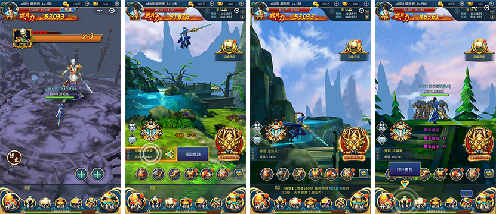 

'절세무신 3D'게임 캡처

**소편 단평**：

'절세무신 3D'는 유명 IPG를 가진 3D APG 게임으로 3D 장면이 유미절륜, 산수 종약 사이에도 선협의 모습을 보여준다.타기 + 손체조의 교호 체험, 게이머들은 게임이 너무 무거워 느끼지 않고 게임을 충분히 체험할 수 있는 재미.유일하게 유감스러운 것은 다른 캐주얼 게임에 비하면, 아마도 가재 시간이 비교적 길다는 점이다.하지만 이런 보기 드문 3D 미니 게임에 대해서는 기다릴 만하다.

> 이런 대형 ARPG 3D 게임 외에도 QQ 는 Layaiair 엔진 3D MOBA 타입의 손Q 가벼운 게임으로 안탁 버전의 휴대전화 QQ에서 AU 를 검색해 체험할 수 있다.위신이 작은 게임에 속하지 않기 때문에 여기는 따로 추천하지 않습니다.

####2, 설렘 연습생

 

'설렘 연습생'게임 캡처

**소편 단평**：

'설렘 연습생'은 환장놀이, 미술 환상적이고 정교하고, 게임의 주인공은 3D의 가상 섹시 소녀, 환장, 양성, 돈 버는 등 다양한 성장 미션 홈, 게이머는 이 사람을 설레게 하는 여자 식사, 목욕, 오락, 세탁, 세탁, 세탁, 세탁, 세탁, 옷...다른 게이머들의 이미지쇼를 감상할 수 있고 설렘 있는 스니커즈는 애플릿 코드를 직접 인식할 수 있다.

####3, 3D 전경

'3D 전경'게임 캡처

**소편 단평**：

‘3D 전경’은 FPS 게임(1인칭 사격류 게임)이다. 게임은 기본적으로 저격시각을 주었고, 게이머는 게임 중 강도를 클릭하여 저격사격을 실현할 수 있으며, 총 폭격의 쾌감을 체험할 수 있다.하지만 게임 과정에서 인질을 삽입하여 오사할 수 없다.이 게임은 관람료의 체험도 있다.아주 우수한 경도 FPS 소놀이입니다.

####4, 간판 저격 OL

《간판 저격 OL》 게임 캡처

**소편 단평**：

‘에이스저격 OL’은 전투 경기에 대한 사격게임으로 게임 과정에서 체험이 매우 리얼하고, 상대 PK 의 승리와 비교적 강한 게임 쾌감을 갖고 있다.게임에서 총기, 총기, 총알, 저격경, 호수활 등을 구매할 수 있어 사격 과정을 안정시킬 수 있다.이 게임은 Layair가 상대적으로 초기의 제품으로, 지난 8월 초반에 추천하고 싶었다. 당시 서버 BUG 때문에 임시 최적화된 최적화로, 이번 사격 게임 애호자들에게 추천했다.

####5, 엄지 양궁

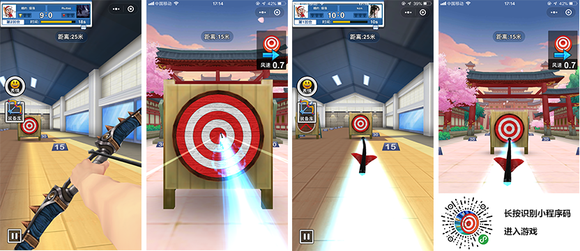

엄지양궁 게임 캡처

**소편 단평**：

'엄지양궁'은 경쟁 경기에 대한 양궁 게임이다. 이 게임의 핵심 장난법은'왕메달 저격 OL'과 기본적으로 총과 활의 직관적인 감별을 제외하고'엄지양궁'은 침관 시스템과 위신 호우와 맞대결의 특색 기능을 갖고 있다.그래서 게이머 체험 체험도 추천합니다.

####6, 총애하는 탱크

 

'귀여운 탱크'게임 캡처

**소편 단평**：

'귀여운 탱크'는 사격류, 게임 화질이 정교하고, 탱크는 주로 싹트한 의인탱크, 인형은 헬리콥터 피부를 볼 수 있다.이 게임은 탱크의 가죽이지만 실제로는 비행 사격놀이를 하는 놀이지만 스크린 이동 사격과 적측의 사격탄막을 피하는 것이다.

####7, 닭 먹는 도시 3D

'닭의 성 3D'게임 캡처

**소편 단평**：

'닭을 먹는 성3D'는 라운드식 난관 사격게임으로, 이 게임의 미술은 놀라지 않았기 때문인지 미술의 주인공이 걱정하는 총이 보이지 않았는지, 총을 겨냥하기 위해 총을 겨누기 전에 작은 몽둥이 같은 것을 연장했다.소편은 오랫동안 연구하였지만, 알아듣지 못했다.게임의 재미는 여전히 있다. 각도를 잘 조정하면 적에게 총을 맞고, 한 총이 뛰면 다음 관문에 들어갈 수 있다. 그렇지 않으면 적에게 반격하게 된다.

####8. 닭 야옹

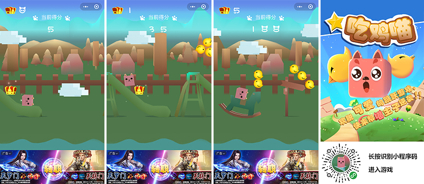

'닭야옹'게임 캡처

**소편 단평**：

'닭을 먹고 야옹'은 물리적 동력에 기반 점프 게임이다. 게임 이름 중 닭의 두 글자와 핫한 사격 게임은 돈 반 푼도 안 된다. 정말 닭을 먹는 야옹 주전 이다.게임의 주인공인 야옹, 게이머 클릭을 통해 점프 하며 닭을 먹고, 먹는 닭이 많아질수록 득점이 많아진다.닭을 먹는 과정에서 어떤 물체 (구름 포함) 도 힘으로 점프하는 데 쓸 수 있는 점프판이다.부주의로 차릴 틈이 없는 곳으로 뛰면 게임은 종결된다.조그마한 느낌을 주는 것은 게임이 간단하고, 어느 정도 가능하지만 학생과 여성에게 더 잘 어울릴 수도 있다.

####9、전민두철

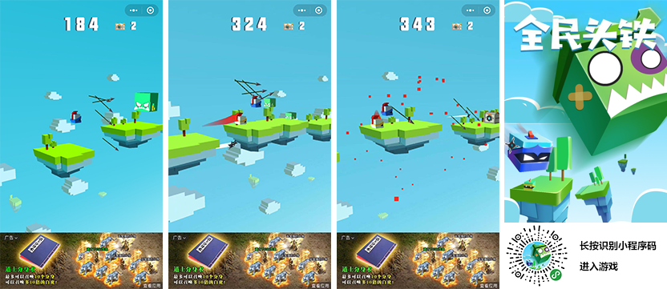 

《 전민두철 》 게임 캡처

**소편 단평**：

‘전민두철’은 리액션을 클릭하는 캐주얼 게임, 게임 화풍이 상큼하고 귀엽고 조작이 간단하다.모든 코스는 클릭의 리듬을 잘 파악하고 게임의 주인공을 전진시키고 하나의 큰 괴수와 작은 괴수를 들이받았다.보물 상자를 먹고 나면 무작위로 도구를 얻는다. 예컨대 다트, 장창 등을 던져 몬스터를 죽인다.

####10, 광야 비행구 OL

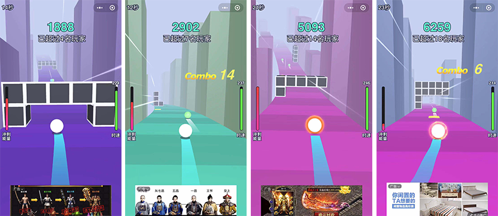

'광야비구 OL'게임 캡처

**소편 단평**：

‘광야플라이볼 OL’은 스피드 레이스를 피하는 작은 볼의 피쿠 게임으로 마성의 있는 데다 게이머의 손속과 반응 능력을 시사하고, 작은 볼 사이의 속도는 레이스 같은 시각 충격감을 가지고 있다.꼬마 편성은 8월 추천한 ‘볼킥 스퍼’ 게임도 마찬가지다. 이어 다양한 APP 게임인 ‘발스래스’를 발견한 마이크로폰 미니시리즈, 몇몇 체험이 좋지 않은 것은 언급하지 않는다. 이 중 ‘광구 스탠딩’, ‘격정구’, ‘미친 볼 정판’도 괜찮은 비슷한 놀이이다.여기에는'광야비구 OL'을 중점적으로 추천하는 이유는, 이 게임은 약간 혁신적이며, 기초의 스피드와 피장법외에 현재 작은 볼의 속도를 표시할 뿐만 아니라, 힌트 플레이어의 속도를 가속벨트를 가속화하는 데 사용되며, 매번 속도를 가속화한 스퍼 에너지를 축적시켜, 스퍼링이 꽉 차면, 시간이 흐르는 무적 모드()를 자동으로 활성화시킬 수 있다.장애를 꿰뚫고 죽지 않을 수 있다. 게이머가 가속대를 밟는 것을 더욱 자극한다.

####11, 공구 스포츠카 게임

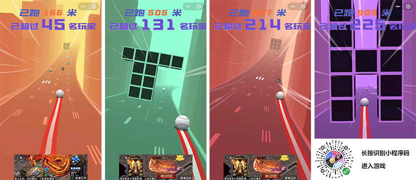

'구구 카리스마 게임'캡처

**소편 단평**：

'구구쿠 레이스 게임'도 스피드 피드킥 피크게임, 핵심 플레이 역시'Balls Race'를 거울로 보지만 색깔의 매끄러운 과도 전환, 원경의 광효와 안개, 피드백과 3D 렌즈 비주얼 처리 등 디테일한 체험을 통해 APP 게임'Balls Race'의 거리를 따돌렸다.다른 유사한 게임과 다른 형태의 바리케이드, 도로를 모방하는 활주로 피부 등 다양한 장르 ‘발스래스’를 체험한 게임 이후 살짝 눈에 띄는 것이 품질이 높은 경속 게임이라고 할 수 있다.

####12, 미친 공 2

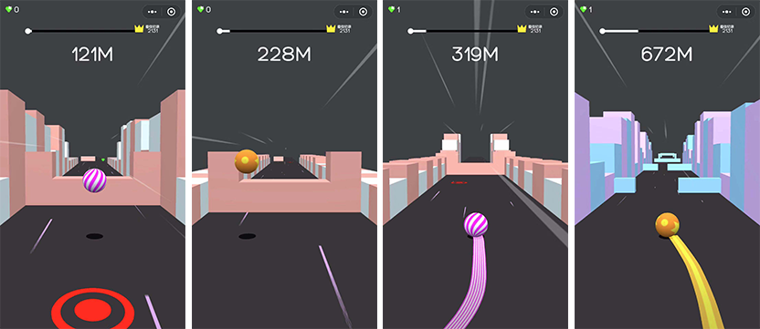  

'미친 볼 2'게임 캡처

**소편 단평**：

‘미친 구구2’의 기초 조작은 앞서 추천한 두 게임과 마찬가지로 피장피쿠 게임으로 좌우 미끄럼을 통해 장애를 피했지만 트랙은 꼿꼿하고 굽지 않고 오르락내리락하지 않고 오르락내리락 등의 느낌을 받았다.이 게임은 APP 게임'캐치업'의 플레이 간화판으로 볼 수 있지만, 게임 체험은'캐치업'에 약하지 않고, 게임의 난이도를 낮춰 작은 게임 게이머들이 손을 더욱 편해졌다.

####13, 점프 공

 

'점프해 볼'게임 캡처

**소편 단평**：

'점프해 볼볼'도'캐치업'의 노하우 간소화판이지만'미친 구2'에서 채택한 바리케이드2'는 바리케이드와 다르다.게임의 전체적인 스타일과 체험하는 느낌은 여전히 ‘캐치업’과 비슷하지만 게임의 존재 가속 벨트(노란색)와 감속대(빨간색)는 ‘캐치업’과 없는, 점프는 3차원의 힌트가 있어 점프 체험을 더욱 우호적이다.플레이어는 체험할 수 있다.

####14, 공은 멈추지 마라

 

'공 멈추지 마'게임 캡처

**소편 단평**：

'구구는 멈추지 않는다'의 핵심 장난법은 이전에 추천한 몇 가지 게임과 기본이 같지만 게임의 미술 배경은 정교하고 다양하고, 바리케이션도 풍부하다.충격, 비탈, 점프, 피장 등 체험이 유창하다.전체적인 스타일은 작은 편집이 어떤 APP 게임을 다시 연상시키지 않을 것이다.

####15, 시크볼

《시크볼》 게임 캡처

**소편 단평**：

'시크슛'은 피장 피쿠 게임이지만 앞서 추천한 게임과는 다르게 360도의 시공행식 3D 허공을 달리고 있다.유일한 부족은 피크닉 볼의 입체감이 강하지 않다는 것이다.

####16、널빤지를 치다

 

《널빤지》게임 캡처

**소편 단평**：

‘널빤지’는 캐주얼 클릭 게임으로 제어판의 길이를 누르고 맞은편에 걸친 다리 위에 걸치면 통과할 수 있다. 그렇지 않으면 짧거나 길어지면 깊은 연못이 떨어진다.게임의 원형은 아마도 APP 게임인 ‘플랭크’, ‘널빤지’가 작은 게임에서 보여준 표현이 원생 APP 수준에 달한다.놀기 좋고 체험 추천.

####17. 여행을 꿈꾸다

 

'꿈 여행'게임 캡처

**소편 단평**：

‘플랭크’의 게임을 보면, 작은 게임에서 특히 ‘슈퍼 구호’ ‘활로영웅’, ‘널빤지’, ‘판자서류’ 등등 게임의 표현은 괜찮지만, 창의성은 잘 안 된다. 유독 ‘꿈여행’의 차이성은 작은 시선을 빛냈다.이 게임은 관문식 을 채택하여 다른 도시 표지성 건축을 목표로 삼고 있는 가운데 실시간 제시 목표 를 목표 에서 몇 걸음 더 있다.목표를 달성한 후 정교한 삼차원 입체건축을 감상할 수 있는 이 게임은 전 세계를 함께 할 수 있게 하세요.

####18. 리듬 볼

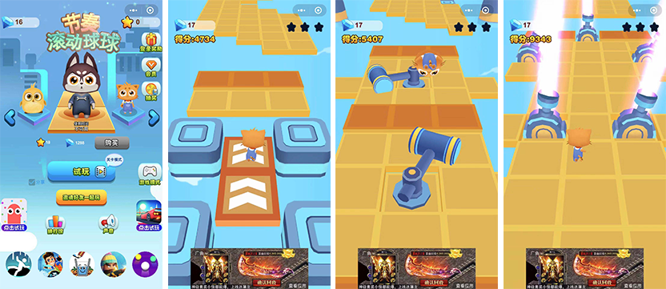 

《리듬 롤러 볼》 게임 캡처

**소편 단평**：

‘리듬 롤러 볼’은 피크닉 게임으로, 게임 속 캐릭터는 귀여운 애완동물 이미지로, 게임에서 뛰고 뛰기, 피할 수 있다.관문과 난관 난이도를 조절하고, 난관 난관을 뚫는 장애는 여전히 놀랄 만하다.마지막으로 홈을 토하고, 게임과 공은 약간의 돈도 없다.

####19.쿨 병아리

 

《쿨런 병아리》 게임 캡처

**소편 단평**：

'시크릿병아리'는 5월 위신소게임에 오르는 3D 피크게임, 3D 피크닉 게임에서 비교적 빠른 편이다.돼지맨과 같은 정품 카리스마 때문에 이 게임은 간단하기 때문에 8월 소편은 추천하지 않았다.얼마 전 연구에 따르면, 한 사람만 개발하고 버튼을 나누지 않고, 광고도 없고, 심지어 순수한 영문 계면의 3D의 작은 게임까지, 반년 만에 살아있다는 사실이 밝혀졌고, 일활약 사용자는 여전히 수천 명이며, 새로운 게임보다 훨씬 더 나은 것으로 나타났다.그래서 이번 소편은 여러분께 추천을 하기로 했다.

####20, 쿨 히어로

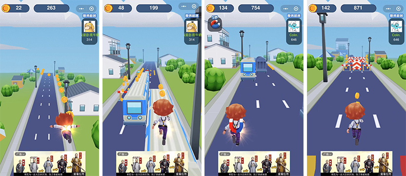  

《쿨달리기 영웅》 게임 캡처

**소편 단평**：

'쿨히어로'는 피크닉 게임으로, 작은 게임의 전명은'쿨히어로 헤엄쳐 할머님 게임'이라는 제목으로 꼬마할머니와 연관된 이유는 왜 할머니와 연관된 지 오래됐고, 게임 중소편은 뛰었는데도 할머니를 찾지 못했다.하지만 게임의 품질은 나쁘지 않아 미술과 촉감이 다 좋다.

####21. 코양양 빨리 정판 뛰기

  

《희양양 달리기 정판》 게임 캡처

**소편 단평**：

'희양조달리기 정판'은 애양과 그레이 늑대 IP 와 미술의 카리스마 놀이를 사용했다.채용된 늑대는 양의 줄거리를 쫓는다.게임은 정교하고 캐릭터 이미지가 인지도가 높다.심부름에 속한 정품.여러분들의 체험을 추천합니다.

####22. 쿵푸개구리

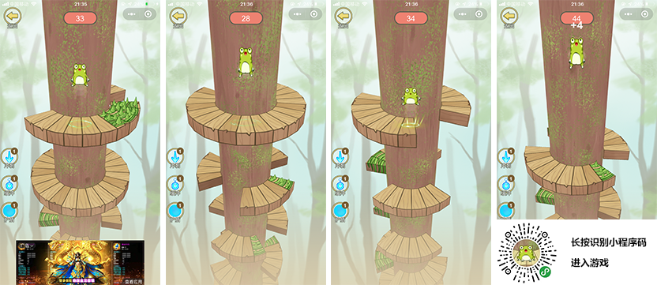 

'쿵푸개구리'게임 캡처

**소편 단평**：

'쿵푸개구리'는 캐주얼 물리 점프 게임이다.개구리 아래로 떨어지는 방향을 잘 통제하고 위험지대에 부딪히는 것을 피하고 살아남는 시간이 갈수록 더 많아진다.즐겨볼 불이 붙은 후, 유사한 게임 편찬이 놀았던 것들이 십여 개나 많은데, 그중 많은 미술이 매우 정교하고 각각기 특색 있는 제품이 있는데, 예를 들면, 하층, 즐거움, 고당구, 매일 즐겨볼, 볼 한 번 뛰기 등이다.'쿵푸개구리'는 애플리케이션 코드가 있기 때문에 애플릿 코드를 직접 인식하고 다른 게임은 이름을 검색해 체험할 수 있다.

####23. 볼이 깡충깡충 뛰다

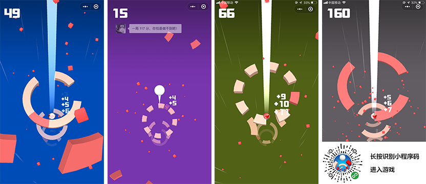 

'볼이 깡충깡충'게임 캡처

**소편 단평**：

'볼이 깡충깡충'은 캐주얼한 물리 점프 게임이다.쿵푸개구리 등 평안시선 아래로 뛰어오르는 게임과 비교해'볼이 팔짝팔짝'은 깊은 우물 아래로 떨어지는 시각이다.아래로 떨어지는 시각 체험이 더 아슬아슬한 자극을 더한 표현이 좋은 조그마한 아이템이다.

####24, 3D 공

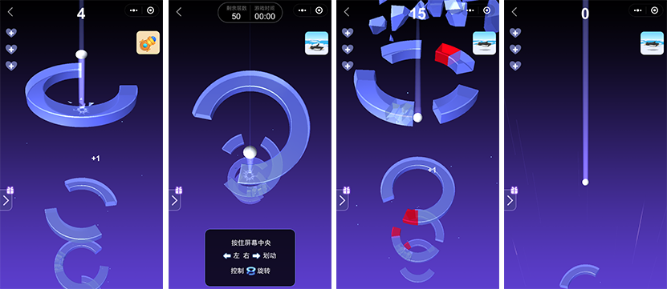
'3D 볼'게임 캡처

**소편 단평**：

'3D 볼'은 캐주얼리점프 게임이자 점프 게임이자 점프 하락과 하락을 통해 피금지폐 구역을 피하거나 부숴 빙판에서 끊임없이 떨어지는 하락 득점이다.시각 체험은 독특하고 특색 점프 타격 음악효과와 파빙효과 체험.체험 체험 추천!

####25. 볼 추락

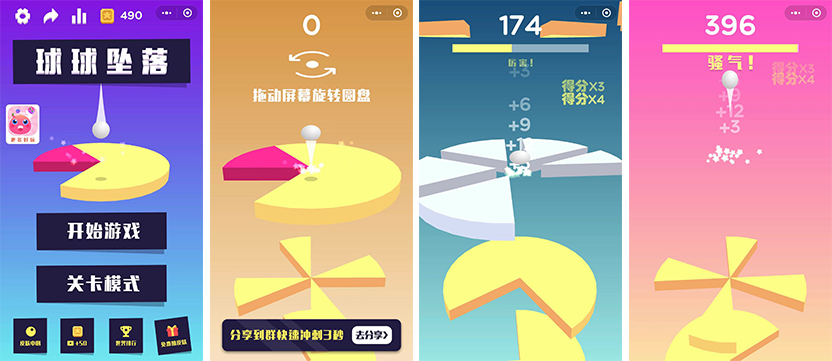 

'볼 추락'게임 캡처

**소편 단평**：

'볼 추락'은 캐주얼 물리 점프 게임이다.게임의 미술, 음악, 문안 디테일 등 모두 짱이다. 한참이나 놀다가, 사실 핵심 완법은 이전에 소개한 쿵푸개구리 같은 게임의 기둥을 제거하는 버전이다.하지만 작은 편성은 동질화를 즐기는 게임을 느끼지 않고, 하락점프하는 과정에서 배경색은 끊임없이 변환되고, 색깔의 코디와 판타지 디테일로 처리되는 것이 좋다.체험 체험 추천!

####26, 애교 네모난 H5

'멍멍 H5'게임 캡처

**소편 단평**：

'멍멍 H5'는 3D 입체의 유익지 해소 마이크로폰.플레이어는 유형별 숫자 힌트를 통해 무익한 방덩이를 끊임없이 없애고, 결국 미스터리한 선물에 숨겨진 것을 찾아야 한다.꼬마는 무뇌 게임을 한 뒤 이 게임을 만난 후 많은 관문을 이끌어내야 할 수 있었다.그래서 이 게임은 아이큐에 대한 요구가 좀 있다. 자신의 게이머들을 한번 도전해 보고 싶다.

####27, 슈퍼 골프

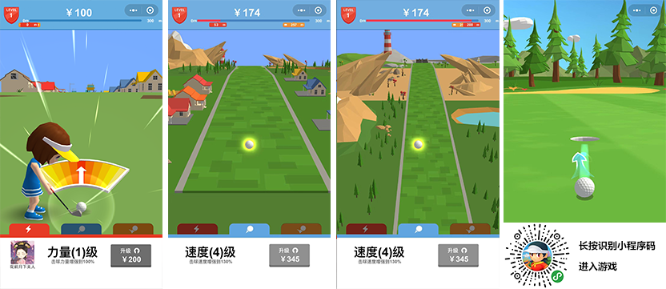 

'슈퍼골프'게임 캡처

**소편 단평**：

'슈퍼골프'는 골프 소재의 캐주얼 경기이다. 게이머는 조회 각도를 통해 공을 제어하는 방향을 누르고 골프를 타서 금전을 획득한 뒤 업그레이드 파워, 스피드, 스판, 골프를 더 멀리 치며 더 많은 게임을 얻을 수 있다.플레이어는 완벽한 타격을 할 때(바늘은 빨간색 중심), 골프 골퍼가 구멍을 뚫는 박진놀음도 가능하다.

####28. 매일 춤

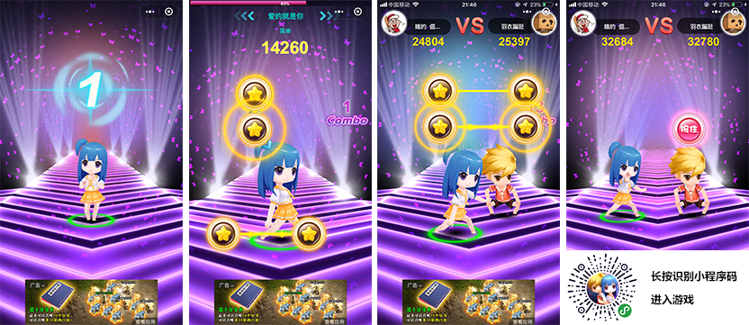《매일 무용》 게임 캡처

**소편 단평**：

‘날마다 춤추기’는 음악 리듬 게임으로, 솔로 모드로 많은 사람과 싸우는 패턴이 있다.손가락과 음악의 리듬을 통해 손가락과 게임 속 캐릭터를 함께 춤추게 한다.이 게임은 작은 편집에 있어서 일정한 난이도가 있지만, 비교적 새로운 의미가 있다.

####29. 블랙홀도 미친

 

'블랙홀도 미친'게임 캡처

**소편 단평**：

'블랙홀도 미친'은 아이오의 대결 게임이다.소편은 8월'블랙홀 대란투'를 추천한 뒤 블랙홀을 삼키는 게임을 많이 했다.다른 블랙홀 게임과는 달리'블랙홀도 미치다'는 도시 내 삼켜버린 장면을 벗어나 걸프와 섬의 장면을 채택해 체험을 삼키는 게임도 유창하고, 어떤 개별 블랙홀 게임처럼 자주 삼킬 수 없는 상황이다.'블랙홀도 미쳐'는 유쾌하게 삼키는 체험을 통해 작은 편들이 시간이 너무 빠르게 느껴졌고, 더는 삼키지 않고 끝냈다.

####30, 블랙홀 폭주

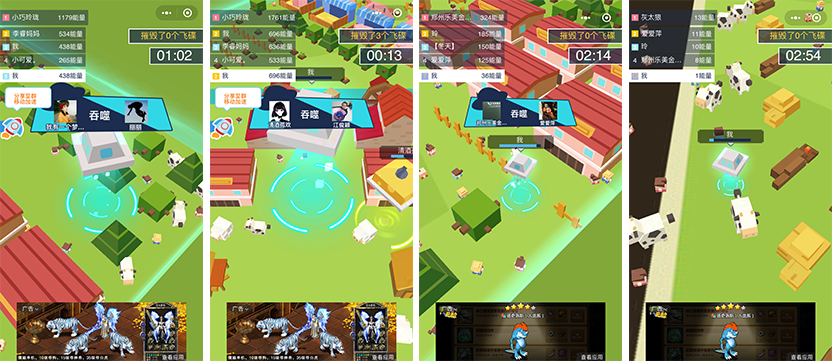 

**소편 단평**：

'블랙홀 폭주'는 아이오의 대결 게임이다.이 블랙홀 게임은 블랙홀을 삼키는 법도 있다.하지만 이미 블랙홀의 느낌을 찾을 수 없었습니다. 게임에서 채택된 목장의 장면은 화풍이 상큼하고 정교하고 정교하고 정교한 놀이와 같이 멀고 먼 게임처럼 검은 동굴에 빠지지 않았고, 채택된 외성 비행 접시에 흡입하였습니다.삼키는 체험도 유창하다.

####31. 토네이도 난투

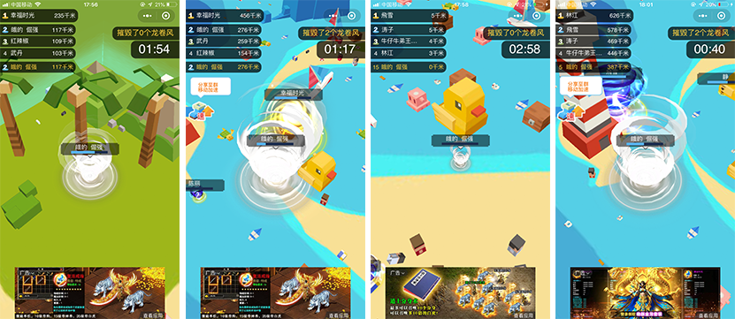  

'토네이도 난투'게임 캡처

**소편 단평**：

'토네이도 난투'는 류아이오의 대결 게임이다.독특한 토네이도가 체험을 삼켜 파괴감이 정말 재미있다.화면 표현이든 게임이든 체험이든, 작은 편들은 모두 짱이라고 생각한다. 이 게임은 절대 플랫폼에 속하고 경험하지 않은 것은 체험할 필요가 있다.

####32, 한 그림은 도대체 대란 투성이다

  

《한 그림은 대란투의 게임 캡처

**소편 단평**：

《한 그림은 대란투다》는 많은 사람들이 경기를 하는 작은 게임이다. 게임에서 채색적인 붓으로 자신만의 색깔을 더 많이 그릴 수 있다.완법은 말미탈락제를 채택하는 방식으로 한동안 마지막 꼴찌를 떨어뜨린다.생존을 위해 플레이어는 끊임없이 뛰어다니며 자신만의 색깔을 더 많이 그려 승리를 거둘 수 있는 관건은 사실 장면에서 랜덤으로 등장하는 도구, 도구를 먹고 자신의 붓 브러쉬를 굵게 만드는 등 효과를 가질 수 있다.게임에서 경쟁이 치열한데 놀기가 좋다.

####33, 닭 충돌차

   

《닭 충돌》 게임 캡처

**소편 단평**：

유년 중 놀이터에 부딪치는 버스도 작은 게임에서 폭발했다. 소편은 수십 개의 2D와 3D의 충돌놀이를 하며 우수한 3D와 부딪치는 게임이 많다. ‘닭과 충돌차’는 다른 충돌 게임에 대해 실제 인터넷 맞대결, 랜덤 지도, 게임지 다양 등 특징을 채택했다.놀음성이 비교적 높다.

####34

  

'환락타치볼'게임 캡처

**소편 단평**：

매우 많은 충돌 게임과 달리 특이한 포인트가 없다면, 장기간 게이머들을 붙잡기 어렵다. ‘환락터치’는 미술뿐만 아니라 게임에 대한 교호 표정을 발송할 수 있는 것이 특징이다.한정시간이 되면 경기장의 면적은 축소된다.생존의 압력이 더 커지고 충돌이 더욱 치열해진다.

####35, 팽이 대란

  

‘팽이 대란투’ 게임 캡처

**소편 단평**：

많은 충돌을 겪은 게임을 체험했다. 작은 편은'팽이 대란투'가 가장 특색 있는 충돌 게임 중 하나로 다른 게임의 직선과 달리 이 게임의 속도가 더 빠르고 방향의 영민도가 높기 때문에 게임에서 팽이의 곡선 운동궤적을 맞출 수 있으며, 게이머들은 곡선을 결합하는 운동의 법칙이 더 좋은 경기에서 승리할 수 있다.

####36, 고릴라 빌딩

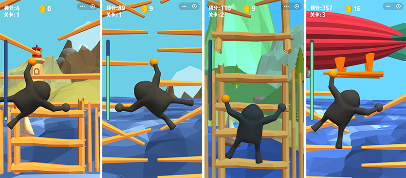  

'고릴라 기어'게임 캡처

**소편 단평**：

홍수가 습격되어 반드시 단단히 잡아야 생환할 희망이 있다!이 ‘고릴라 빌딩’은 기어오르는 3D 레저 게임으로 생존의 압력 아래 약간의 실수가 있으면 홍수에 잠겼다.플레이어는 클릭을 통해 매번의 손바닥을 계단에 닿을 수 있는 기회를 잘 잡아야 한다.

####37, 병아리 리스크

  

'병아리 탐험기'게임 캡처

**소편 단평**：

'병아리 탐험기'는 악고 스타일의 3D 사각놀이 화면을 채택하며 스트라이크는 왼쪽으로 미끄러지거나 오른쪽으로 나선다.길길을 잡은 시기를 통해, 플레이어의 반응능력과 시기를 시험해 능력을 파악하고, 병아리가 오래 지나지 않으면 독수리에게 잡혀간다.

####38, 회전 컬러

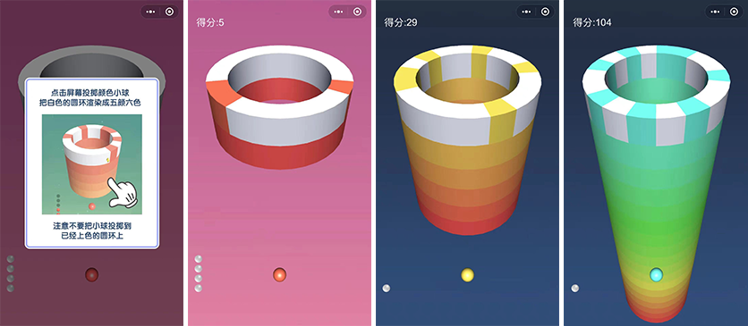   

'회전 도색'게임 캡처

**소편 단평**：

'회전 도색'의 장난은 작은 볼로 회전하고 있는 원환을 던지고, 속 곳에는 색깔을 물들이고, 염색한 곳은 두 번째 맞출 수 없다. 아니면 Game Over.원환의 회전은 변속적이지, 때로는 멈추거나 반향도 한다.그래서 관성 조작을 자제하는 것이 중요하다.수시로 게임의 진전도 난이도가 계속 높아지고 있어 눈질과 손빠른 반응력도 제승의 중요한 요소다.

홍수가 습격되어 반드시 단단히 잡아야 생환할 희망이 있다!이 ‘고릴라 빌딩’은 기어오르는 레저 게임으로 생존의 압력 아래 약간의 실수가 있으면 홍수에 잠긴다.놀음성이 높다.

####39, 도시 표류

  

《 도시이동 》 게임 캡처

**소편 단평**：

‘도시이동’은 게이머의 리액션을 시사하는 민첩한 게임이다. 이중 컬러와 바리케이드 컬러가 일치해야만 순조롭게 통과할 수 있다. 게이머는 레드블루를 클릭할 때마다 위치를 바꾸게 된다.두 고리 보장을 통해 순조롭게 통행하며 시시각각 게이머의 예판 반응 능력을 시험하고 있다.소편은 시험 체험을 추천한다.

####40, 뛰는 공

  

'뛰는 공'게임 캡처

**소편 단평**：

‘뛰는 볼’의 핵심 조작은 ‘도시이동’과 유사한 조회수를 통해 골을 전환하는 운동 궤도를 통해 산체의 형태와 충돌하는 것을 피하는 것이다.작은 구기운동과 피장 과정에서 궤도가 구불구불 구불한 변화로 작은 로프카의 기시감을 가진다.게임의 색깔을 제외하고는 작은편들로 즐겁지 않고 전체적인 체험이 최고다. 게임의 3D 입체감도 많은 3D 게임의 최강 중 하나다.

####41, 3D 공은 벽돌을 친다

   

'3D 볼 타일'게임 캡처

**소편 단평**：

'3D 볼 타일'은 작은 볼로 벽돌을 제거하는 캐주얼 사격 게임이다. 장난법은 단순하고, 게이머들은 고층 앞 보호장치를 피하고 벽돌을 뚫고 만든 고층 건물을 들여 해소할 수 있다. 게임은 시기에 대한 파악력을 시험해 볼 수 있지만, 작은 편은 수십여 관람을 단숨에 뛰어들지만, 압력을 느끼지 않고, 카드 디자인은 너무 간단하다.네?

####42, 계단 슈퍼맨

 

'계단 슈퍼맨'게임 캡처

**소편 단평**：

'계단 슈퍼맨'도 시범 반응 능력의 레저 게임, 게임 속 소인은 끊임없이 전행할 것이며, 게이머들은 지형과 예판의 위험을 미리 관찰해 소인의 전진을 클릭하여 올바른 행로를 선택해야 한다.게임은 좋은 게임이다. 단지 작은 편성에 있어서 이 게임은 난이도가 좀 높아 걷는 속도가 좀 빠르고 아직 오지 않았거나 반응은 따라가지 않았고, 노선은 잘못 걷고 돌이킬 기회가 없다.좌절감이 비교적 강하다.관찰과 예심 능력이 강한 게이머에 도전할 수 있다.

####43, 3차원 깡충깡충

  

'3차원 깡충깡충'게임 캡처

**소편 단평**：

'삼차원 깡충깡충'은 기념비 곡식 미술 스타일을 가지고 있지만, 보기엔 여러 가지 경로가 있지만, 각 관건마다 장애물을 제시할 수 있기 때문에 너무 많은 예판 능력이 필요치 않으며 리액션 능력으로 끊임없이 떨어지는 공중 블록은 노리커가 끊임없이 전행에 박박차를 가하며 게임 체험이 좋다.

####44, 매일 겹치다

  

《 매일 한 겹 》 게임 캡처

**소편 단평**：

‘하루하루가 겹쳐’는 화풍이 아름답게 쌓여 있는 작은 놀이이다. 게이머들은 끊임없이 쌓여 더욱 높은 층을 쌓아 올리고, 네모난 부분이 아래쪽 좌석을 넘으면 잘라진다.마지막은 자를수록 작을수록 8연격(8회 연속 재단되지 않는) 이후 네모나는 커질 수 있고, 매번 연격과 특색 피아노 음효가 있으며, 어쨌든 재미 있는 캐주얼 플레이 게임이다.

####45, 컬러 파워

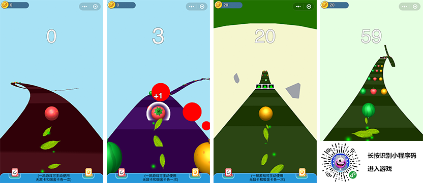  

《컬러 쿨》 게임 캡처

**소편 단평**：

'컬러피쿠'는 이전의 작은 볼피속 게임과 공통성이 있지만 구기 캐릭터와 가까운 원소 피부이며 좌우미끄럼을 통해 작은 볼을 제어하는 이동이다.그러나 눈에 띄는 차이는 심부름에 더욱 신경을 쓴다.같은 색구를 부딪쳐 득점하여, 같은 색 스트라이프 공을 부딪쳐 기초 점수를 높여 다른 색구 죽음을 당했다.변색판 뒷공에 부딪치면 변색될 수 있으며 금화에 부딪치면 금전을 수집할 수 있으며 자석에 부딪쳐 당분간 금전을 자동으로 흡수할 수 있으며 금폐는 새로운 주제를 잠그기 위해 사용할 수 있다.비교적 재미있는 피크닉 유형이다.

####46, 볼 페어

  

《볼 페어카》 게임 캡처

**소편 단평**：

'볼트롤러'와'컬러피크'의 핵심 노하우는 기본적으로 일치하고 있으며, 자석과 금화의 장난법은 없지만'공구 트럭'은 음악공을 늘렸고, 연속적인 당격으로 감동적인 음악 리듬을 띄울 수 있고, 특색도 있고, 공중 비약적인 비트럭 시각도 있다.

####47, 비약구 3D

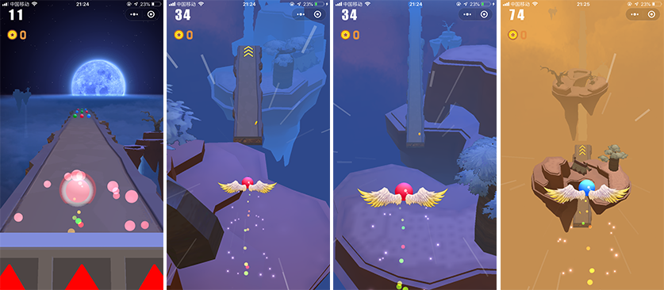   

'비약구 3D'게임 캡처

**소편 단평**：

‘플라이볼 3D’의 핵심 완법은 ‘볼볼렌 트럭’과 비슷하지만, 미술표현과 게임 체험은 작은 편집과 같은 유형의 3D 게임이 가장 좋은 것은 없다.절대 APP 정품 수준의 표현으로 시범을 강력히 추천한다.

####48, 열혈구 대모험

  

'피투구 대모험'게임 캡처

**소편 단평**：

'피투구 대모험'의 주인공 팬더는 게이머를 이용해 조회나 길다란 조회수를 누르며 점프 점프 점프를 진행하고 있다. 이런 유형의 게임은 지난 8월에 추천한 적이 있다. 그 이후에도 다양한 제품을 해봤지만, 이 게임은 작은 볼을 귀여운 팬더 등 다양한 애교로 돌렸다. 전체 게임의 미술은 특히 광효 등 디테일이 잘 된다. 유유람하는 것이 좋다.연극의 완전한 체험도 좋고, 시험적으로 체험할 만하다.

####49

  

'애완아 함께 충충충'게임 캡처

**소편 단평**：

'맹총과 함께 충충충'은'열혈구 대모험'의 장난법과 기본적으로 일치하지만 게임미술은 특히 정교하고 난간 장애 외에도 공중 가시, 공중 폭탄, 화권 등도 늘렸다.하지만 짤막한 패턴은 초정미의 3D 미술으로 코디된 UI 스타일은 심플하고 전체적인 게임 스타일과 어울리지 않는 느낌이 든다.게임 자체를 향하여 시범 체험을 추천하다.

####50, 음악 초주

  

'음악초주'게임 캡처

**소편 단평**：

강렬한 전자음의 리듬 아래 장벽 피쿠.‘음악초주’는 좌우 슬라이드 리듬과 상활 도약 피약장애를 피하는 전음리듬 리듬 피쿠 게임이다.초급장, 중급장, 고급장 등 다양한 작전이 있다.유사한 APP 게임은 디테일 체험에서도 차이가 있다.하지만 전음게임에 대한 애호자들은 역시 체험할 만하다.

####51, 배드민턴

  

《 감동 배드민턴 》 게임 캡처

**소편 단평**：

《감동 배드민턴》은 매우 우수한 배드민턴 대결 게임이다.게임은 3D 엔진과 2D의 혼합 패턴을 채택했다.조작 인터페이스는 주로 네 개의 버튼으로 나뉜다.왼쪽의 좌우 화살표는 인물의 앞뒤 이동을 통제하는 것이다.오른쪽 아래의 커튼은 스윙 버튼을 흔들며 스윙 버튼이 있다.이러한 기능을 마스터하면 온라인 배드민턴을 잘 체험할 수 있다.

####52, 다비러시아

  

'다비러시아'게임 캡처

**소편 단평**：

클래식 러시아 스퀘어 게임은 이미 3D의 다차원 버전으로'다비오로스퀘어'는 3D의 형식으로 러시아 스퀘어 를 선보이며 회전 바닥을 통해 떨어지는 각도도 여러 차원의 형태를 겹쳐 없애거나 해소시킨다.또한 매번 하락마다 피아노음이 쌓인 음향 반주로 나온다.

####53, 벼락 비행기 대전

  

《천둥비행기 대전》 게임 캡처

**소편 단평**：

'천둥비행기 대전'은 3D 엔진을 채택한 비행기 공전 게임, 스트리밍, 무진장 탄막으로 격렬한 공전을 보였다.폭파 등의 효과는 치열하지만 비행기를 통제하는 과정에서 스크린이 흔들리는 작은 편들이 어지러워진다.개발자가 이 일에 대해 좀 더 최적화되기를 바란다.

####54, 전민 미친 비행기 대전

  

《전민광기 대전》 게임 캡처

**소편 단평**：

‘전민광기 대전’과 전격 추천하는 비행기 대전은 같은 개발자의 작품이지만, 이 게임의 미술과 체험, 작은 편감이 편하고 좋은 비행기 공전 게임으로 체험을 추천한다.

####공은 멈추지 않는다

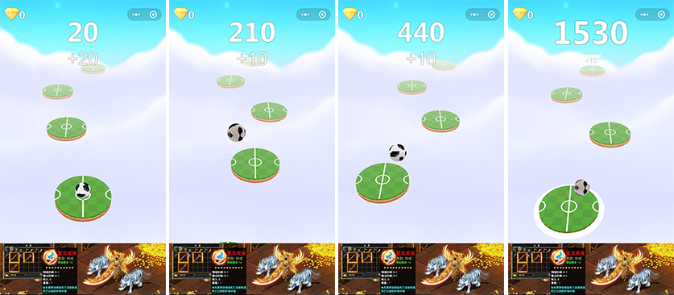  

'공을 멈출 수 없다'게임 캡처

**소편 단평**：

'구는 멈출 수 없다'는 아주 쉽게 손꼽히는 작은 게임이고, 게이머는 스크린 좌우를 눌러야 한다.축구를 구장에 떨어지면 득점할 수 있다. 센터에 떨어지면 추가 포인트 획득할 수 있다.간단해 보이는 작은 게임은 기교적인 체험을 추천한다.

####56、최강변변

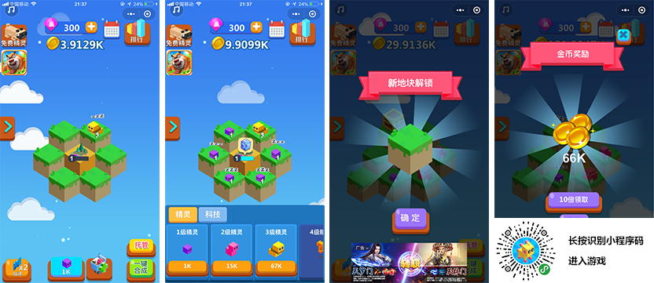  

'최강변변'게임 캡처

**소편 단평**：

합성류의 게임은 너무 많다.하지만 3D가 표현한 합성게임은 그리 많지 않다.'최강변변'은 3D가 표현한 합성류다.놀음은 간단하고 같은 요정은 다른 요정으로 끌어당기면 다른 단계로 변한 요정을 완성할 수 있다. 더 많은 요정 편성은 소개하지 않고, 합성게임을 좋아하는 게이머들은 3D 버전을 체험할 수 있다.

####57, 동그라미 대란

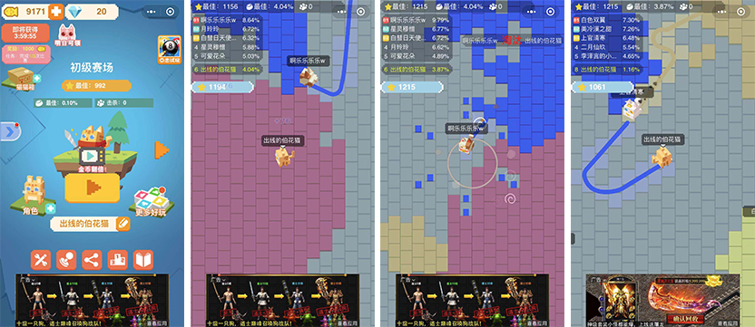  

《동그라미 대란투》 게임 캡처

**소편 단평**：

'동그라미 대란투'는 3D 테두리 대전의 아이오게임, 픽셀 미술 스타일입니다.원형은 어느 유명 해외 APP 게임이다.작은 게임에서도 비슷한 제품이 많다.IO 를 좋아하는 게임은 체험할 수 있다.

####58, 작은 공은 떨어지지 마라

  

'작은 공 빠지지'게임 캡처

**소편 단평**：

'작은 공떨어져라'는 간단한 캐주얼 게임으로, 게임에는 길을 따라 굴러가는 작은 공이 있다. 하지만 길 도중 플레이어 복구를 기다리는 단층이 끊임없이 나타난다.복구하는 방식은 작은 볼을 통과하기 전에 좌우 미끄럼을 통해 복위하는 것이다.만약 작은 공이 지나갈 때 복위를 완성하지 못하면 게임이 끝난다.

####59, 전민 비인

  

'전민비인'게임 캡처

**소편 단평**：

‘전민비인’은 비행과 시크한 결합 게임으로 일정한 거리 안에 동그라미와 금벽돌이 많다.게임의 장난은 이 거리 안에 가능한 많은 다이아몬드와 금벽돌을 얻는 것이다.그래야 더 좋은 순위를 얻을 수 있다.

####농구

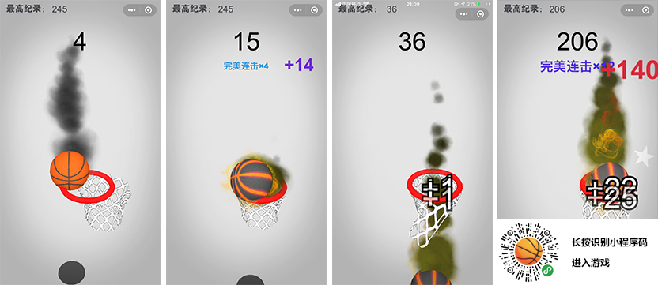  

'농구'게임 캡처

**소편 단평**：

'농구를 가리킨다'는 아날로그 슛의 캐주얼 게임, 게이머는 투수가 아닌 농구, 노는 과정은 온갖 교활한 슛 방향에 직면하여 변화무쌍하다.게임은 보기에는 비교적 간단해 보이지만, 그래도 좀 놀 만한 것이 있다.여러분들의 체험을 추천합니다.

###마지막

3D 소규모 게임의 수가 폭발적으로 증가하고 있지만, 정품의 원창성은 그리 많지 않다.2백 개 이상의 3D 제품들을 모방하고, 대량의 중복성 제품을 제외하고는 APP 게임의 모조 및 표절 현상과 비교적 흔히 볼 수 있다. 다음에는 작은 편집이 더 추천할 때 3D 원작 정품을 많이 많이 가지고 있기를 바란다.