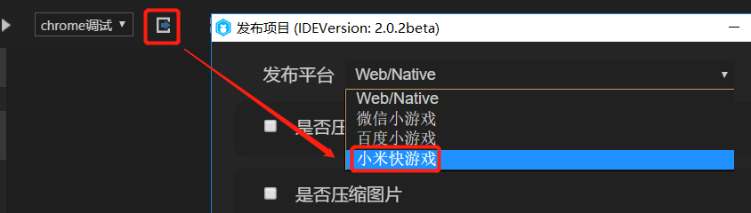
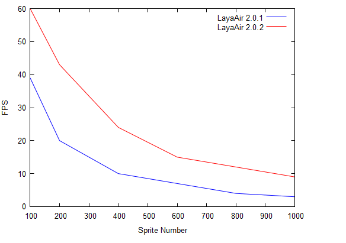
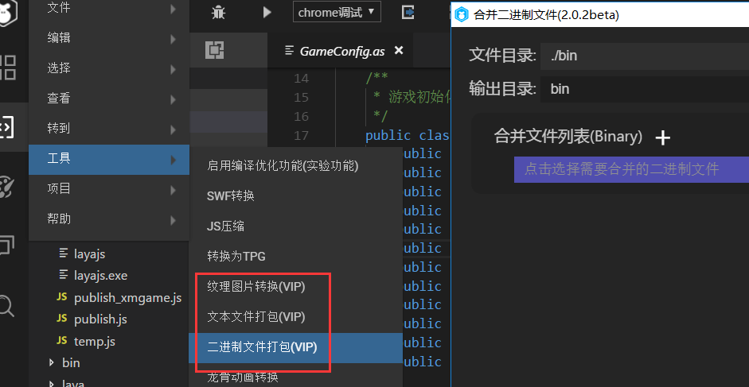
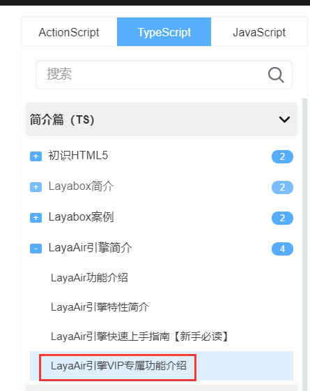
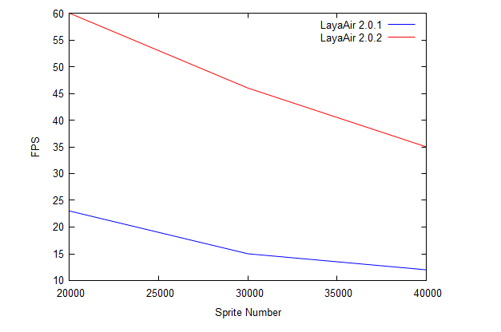

##Layabox 우선 소미의 빠른 게임을 지원합니다. Layaiair 2.0.2 버전은 3D 성능, spinne 성능과 메모리 최적화, 신규 스크린을 적용합니다.

> update: 2019-04-15

지난 번에 리야아 2.0.1beta가 3D 애니메이션 파일을 압축, 메모리 최적화와 성능 최적화, 개방역 프로젝트 창설 등 기능을 한 달 만에 한 달 빠르게 지나갔다. 이 기간 동안 우리는 홈페이지에서 많은 Layaiair 2.03D 문서를 추가하여 2D 문서를 최적화하고, 전체 홈페이지의 3D를 갱신했다.오늘 발표한 Layaiair 2.0.2 beta 판에는 2.0 엔진을 둘러싸고 발전한 메인 라인인 ‘성능, 용성, 3D’라는 핵심점을 다량 업데이트해 소미게임 엔진을 먼저 완성하고 리야아 아이디에서 소미드 게임에 대한 발표를 모았다.

###좁쌀 빠른 게임 배경 소개

TEF 2019 앱 개발자 대회는 3월 20일 베이징에서 막을 내리고, 해신 휴대전화와 중국 이동 터미널 회사들이 빠른 응용 생태플랫폼에 가입해 메이저리그 연합이 12개로 확장됐다.빨리 응용은 원생 APPP와 사용자의 사용 비용, 경험, 높은 특성을 갖추고 있으며, 기능과 체험 차원에서 이미 원생 APPP를 견적할 수 있으며, 사용자의 사용비용에 대한 경량이다.발전은 현재 전체 인터넷 10억 설비를 빨리 응용해 월 2억 이상으로 활성화되고 있으며, 빨리 개설횟수가 20억을 넘어 1억 개의 데스크톱 아이콘을 남겨 7일 유존율이 18% 를 넘는다.

빠른 응용 업체 연맹 멤버 중 하나인 스마트폰 업체 샤미는 엔진 업체가 공개적으로 지원을 받게 되면 많은 게임 CP 와 우수한 제품을 빠르게 도입할 것으로 보인다.레이박스는 첫 집에서 샤오미 스피드 게임 발표 엔진을 공개하며 완전한 발표와 연결 과정을 갖추고 있다.특히 Layaiaiair IDE 내에서 엔진 버튼을 제공하고 개발자는 Layair 엔진에 기반된 게임 프로그램을 소미게임으로 발표하고 전체 접속 과정이 편리하며 개발자의 접입 원가를 크게 낮추었다.

빠른 게임의 입구는 전형적인 원생 응용도 포함되어 있으며, 다양한 시스템급 입구 장면: 브라우저, 응용 상점, 게임 센터, 데스크톱 검색, 데스크톱 검색, 음색 화면, 음성 조수, 어음 조수, 응용 센터, Push, 달력.사용자가 화면을 밝히기만 하면, 언제 어디서나 빠른 속도로 작은 게임에 들어갈 수 있다.미래 억급 사용자가 자원의 지지를 통해 빠른 게임은 생태의 미래가 될 뿐만 아니라 전체 게임업계의 새로운 성장점이 될 것으로 기대된다.

###Layair 2.0.2 beta 버전 포인트

**통용 부분**

1, 엔진은 스크린 물리 해상도 배합 스위치 (useRetinalCanvas) 를 새로 추가하여 사용하면 스크린 물리 해상도를 자동으로 조정할 수 있으며, 게임 화면을 더욱 높게 한다.

2, IDE 업그레이드 업그레이드 버전 기능 강화, 소미게임 발표.

**2D 방면**

1, 엔진이 스핀의 효율을 대폭 향상시켰다(성능, 메모리)

2, ID는 2진제 파일 합병 기능을 새로 증가하고, 파일 합병과 그래프 압축의 역용성을 최적화시켰다.

3, IDE, wav 오디오 증가 구성 요소 인식.

4, IDE 테이프 UI 구성 요소 업데이트 (Assetscomp)

**3D 방면**

1, 엔진 대폭 같은 소재와 메쉬의 메쉬 성능 향상

2, 엔진 골격 최적화 성능 15% 증가

3, 엔진의 성능 통계 정보 증가

4, 엔진 Shaderpass 증가 StateeMap 기능, 컨디션 설정이 원활하고, Shaderpas도 재질

5, Laya U3D 플러그인 복피 메시 내보내기 성능 향상 100배 향상

###신규 물리 해상도 스위치

우리는 일반적으로 스크린에 적합할 때, 고려해야 할 중요한 요소 중 하나는 설계 사이즈이고, 바로 게임은 픽셀 디자인에 따라, 예를 들면`750*1334`.게임 설계 사이즈는 화면의 해상도를 영향을 줄 뿐만 아니라 그림 파일 크기, GPU, 메모리에 영향을 미친다.디자인 사이즈에 비해 크기가 작고, 그림 자원 사이즈가 크며, GPU 렌징 압력이 커서 메모리 점용이 크다.그래서 화면에 대한 정교한 요구가 그리 높지 않았거나 성능 등으로 설계할 때 게임 이미지 크기를 작게 설계하는 경우도 있다. 예를 들면, 예를 들어.`960 * 640`.그리고 스트레칭 확대를 통해 고분율 스크린을 적용합니다.이렇게 가져온 결과는 고화화면에서 또렷하지 않고, 그림이나 텍스트까지 모자이크 현상까지 있다.그래서 개발자는 지나치게 설계 사이즈를 낮추지 말고 주류의 기형을 고려해야 한다.

마이크로신안탁은 7.0.3 버전 이전에 안탁판의 마이크로신 작은 게임 밑층은 스크린 Canvas의 넓이를 스크린 물리 해상도를 강제로 설정한다.개발자가 게임 이미지의 크기를 낮춰도 최종 화면의 표현은 또렷하고, 물론 성능에 영향을 미칠 수 있다는 얘기다.이와 함께 고청의 디스플레이를 필요로 하지 않고 성능을 절약할 수 있는 CP 를 더 원한다.작은 게임 밑단에 해당하는 개발자의 선택권을 박탈했다.하지만 7.0.3부터 작은 게임 밑층이 더 이상 물리 해상율을 강제로 설정하지 않고 성능이 높아지면서 디자인에 문제가 있는 작은 게임(디자인 사이즈가 작아 보이기 때문에 고화폰에서 변한 불분명하거나 경미한 모자이크감이 있는 경우가 많다.Layaiair 엔진은 7.0.3의 버전으로 BUG 를 호용할 수 없기 때문에 이 문제의 기본적으로는 스크린에 대한 이해가 깊지 않고, 배합 경험 부족으로 인한 것이다.

적당한 문턱을 더 낮게 하기 위해 기존의 오래된 게임들이 디자인의 크기를 바꾸지 않는 전제에 자동으로 적당히 적용할 수 있다.그래서 Layaiair 2.0.2beta 버전부터 useRetinalCanvaas라는 강제로 Canvas 를 물리 해상도 설정으로 설정합니다.`Laya.stage.useRetinalCanvas=true`어떤 레이야아의 적절한 패턴을 사용하든 어떤 디자인에서 canvas 는 물리 해상도 크기에 따라 설정됩니다.좋은 점은 디자인 사이즈가 작은 게임들, 그림 크기를 조정하지 않아도 메모리 점용이 증가할 염려가 없고 고청모드로 회복될 수 있다는 점이다.단점은 고청해상도를 강요하고 나면 반드시 GPU 과장 압력을 가져올 수 있다는 점이다. 이 기능을 개시한 후 약간의 성능을 희생해야 한다.그래서 엔진은 기본적으로 꺼져 있다. 개발자가 이 제품의 성능이 더 중요하다고 생각할 때 레이야아의 표준 배열 을 적용해 게임 사이즈를 설계하고, 개발자는 각 화면의 고청시각 표현이 중요할 때 이 기능을 개시할 수 있다.

####최적화와 좁쌀의 빠른 게임 지원 발표

LayaiairIDE의 발표 기능은 2.0버전 발표 기능을 선보였으며 발표 버전의 3.0 으로 일부 개발자는 엔진 버전과 기능 버전의 혼동 또는 의문을 불러일으켰다.이에 따라 Layair 2.0.2beta가 애매한 기능을 모호하게 하는 버전 개념을 제거하고 버튼을 올렸고 기존 게시 버튼을 바로 신판으로 지향했다.기존 버전 게시 기능이 필요하다면 메뉴 표시줄로 가는 항목 옵션을 열 수 있습니다.우리는 새 버전으로 발표하는 것을 추천한다.기능 사용 의문이 있다면 게시 기능 인터페이스를 열어 물음표 아이콘을 누르면 문서를 설명할 수 있습니다.

또 바이두지능의 작은 게임을 먼저 지원한 뒤 레이야아 엔진은 또 다시 한 번 소미 스피드 게임의 엔진을 완성했다.유량대공장의 합류는 개발자들에게 새로운 플랫폼 유량의 이익이 더 많아지게 했다.

 

물론 조기 개발자가 샤오미게임 접입 업무에 대해 잘 모르면 레이야박스의 비즈니스에 더 많은 기술과 상가지원을 받을 수 있다.

**비즈니스 합작 연락메일:**bd@layabox.com

####Spine 효율을 대폭 향상시키다

Layair 2.0.2 beta 판에서 Spine 의 효율을 크게 향상시켰다.3,7. 극광기 아래 큰 천사 프로젝트 팀이 제공한 spinne 모형을 테스트 용례 소재로 모형 155개 골격과 845개 삼각형, 소미6의 내장 탐색기 테스트 환경 아래.상판 엔진에 대해 우리는 성능과 메모리 양면에서 데이터 대비를 했다.

 

**성능 대비:**

레드라인은 2.0.2beta 버전, 블루 선은 2.0.1beta 버전 X 축은 sprite 수량에 해당하는 FPS 프레임속도

  

성능 데이터 대비를 통해 우리는 직관적으로 볼 수 있다.100개의 요정(sprite)은 2.0.2프레임으로 2.0.1은 40프레임에 불과하다.계속 요정 수를 늘리는 과정에서 FPS (프레임속도) 는 하락했지만 2.0.2 시종 성능상의 우세를 유지하고 있다.

**메모리 대비:**

적선은 2.0.2beta 버전, 파란 선은 2.0.1beta 버전 X 축은 sprite 수량으로, Y 축은 해당 sprite 수량에 해당하는 메모리 용량

 

메모리 점용된 데이터 대비를 통해 우리는 직관적으로 볼 수 있다.같은 요정 수량의 경우 레이어어어의 2.0.2 테스트 용례는 리야아 2.0.1 버전 보다 적잖게 줄어든 반면 요정 수가 늘어난 가운데 메모리 점용 곡선도 평온하고 느리다.

####VIP 기능의 증가와 최적화

VIP 기능 측면에서 이번 리야아 2.0.2 beta 버전이 2진제 파일을 추가하기 시작했다.이렇게 사소한 서류에 대해 json 형식의 파일뿐만 아니라 2진제 파일도 합병할 수 있다.파일 합병 기능은 파일 다운로드 수량을 크게 줄여 게임 가재 효율을 높일 수 있다.

  

바이너리 파일의 합병을 늘렸기 때문에, 파일 통합 프로세스 및 규범, 텍스트 (json) 문서를 합병하는 용법도 조정되었다.또한 도집 무늬 압축에 대한 IDE 조작 프로세스를 최적화하고 개발자 수동편집을 필요로 하는 텍스트 메시지를 개발자가 직접 도집 atlas 또는 png 그림을 도구막대에 끌어들이면 자동적으로 인식할 수 있으며 기능의 역용성은 더욱 강화된다.더 디테일한 기능 사용 안내, VIP 기능 소개와 사용 안내를 살펴보세요.

문서 링크:

https://ldc2.layabox.com/doc/? nav=zh-ts-3-3-3

 

 

####IDE 다른 최적화

IDE 와 엔진의 역용성은 우리가 계속 향상시키기 위해 노력하고 있는 것이다.이번 버전은 몇 년 동안 IDE 기본 UI 구성 요소 자원을 전면 교체, 새 UI 구성 요소 자원 사진은 미술 스타일뿐만 아니라 모바일 장치에 따라 미술을 적용해 개발자 DEMO 구성 자원을 더욱 활용해 UI 더욱 아름다움을 더하고 있다.

  

IDE 다른 개선은 wav 오디오 형식 구성 요소 인식을 지원합니다. Layaiair 2.0.2 이전에 IDE 는 mp3 형식의 파일을 오디오 구성 요소로 인식할 수 있으며, 시각화된 장면을 사용하여, 현재 wav 음향의 지지를 높여 Layayair IDE의 비시각화 편집과 창작의 원활함을 더합니다.

 

####3D 성능 분석 기능 추가

3D 게임 제작은 성능 최적화의 중요한 방법 중 하나지만, 도매 최적화 후, 레엔더배티스 얼마나 절약했는지, 개발자는 직관적으로 느끼기 어렵다.그래서 Layaiair 2.0.2beta 판부터 성능 통계 정보 패널에서 savedRenderBatches 인자 인자 수가 최적화된 수량을 적화한 후 절약할 수 있는 도수 수를 살펴보면 얼마나 우월한지 알 수 있다.어떻게 최적화를 시작하는지, savedRenderBatches 인자 수치에 영향을 미치고, 다음과 같은 여러 방면:

#####1, 정적 통합:

Layabox 유닛 플러그인에서 정태 태그를 선택하고 엔진은 정적 물체를 합병처리할 때 렌derBatches를 줄일 수 있으며, 대폭 업그레이드 성능을 합병하여 같은 소재의 모형을 합병하기 때문에 개발자는 편집장 모형을 편집할 때 같은 소재를 사용할 수 있다.

#####2, 동적 통합:

이 최적화는 개발자가 아무 설정도 하지 않고, 동물체는 움직임이 제한되지 않지만 합병원칙은 상대적으로 엄격하고, 메쉬와 같은 재질의 조건이 충족되어야 하지만 3차원 장면에서 이런 모델은 여전히 대량으로 존재하고 있으며, 렌더바스도 크게 줄일 수 있다.

#####3, 동적 정점 합병:

이 최적화 같은 개발자는 아무 설정도 하지 않고, 물체 이동이 제한되지 않고, 합병원칙은 소재와 모형 정점이 10개보다 낮고 상대적으로 엄격하지만 현재 일부 음영과 특효의 모델에서는 공간을 발휘할 수 있으며, RenderBatches 를 적게 줄일 수 있다.

이상 몇 가지 최적화 의 우선급 은 정적 합병 > 동적 합병 > 동적 정적 합병 > 동적 정상 합병, 종합적으로 개발자 의 최적화 원칙 은 간단하다. 장면 의 소재 와 메쉬 같은 소재 를 확보 하지 않 는 물체 가 정적 정태 를 선출 할 수 있다.

 

####3D 성능 대폭 향상

극치적인 성능은 Layair 엔진의 중요한 탭 중 하나이기 때문에 엔진 성능의 극대화 추구도 우리의 엔진 발전의 중점이다.3차원 장면에서 흔히 존재하는 대량의 재질과 같은 메쉬 모형, 예를 들어 장면의 숲, 가로등, 차이는 위치와 크기, 이 엔진 버전에서 시작된 이상 특징을 겨냥한 모형으로 깊이를 강조해 다양한 재질과 같은 메쉬의 모형 합병으로 대량의 비판을 한 번 더 높일 수 있다.물론 개발자는 중복 모델을 최대한 보장하는 메쉬와 마티리얼을 사용하는 것을 주의해야 한다.또한 이 최적화는 물체의 이동변환에 영향을 주지 않는 상황에서 엔진은 동태합병으로 최적화돼 성능을 대폭 향상시킨다.

우리는 Surface Pro6 이라는 테스트 기형에서 대비 테스트를 했다.CPU 는 Inteel i5 8250U, GPU 는 인텔 UHD Graphics 620, 테스트 용례의 모형은 12개의 삼각면을 사용한다.데이터가 개발자에게 직관적인 효과를 느낄 수 있기를 바란다.

  

상도 테스트 용례의 효과는 Layaiair 2.0.2beta 버전은 2만 상정 에 달할 수 있으며, 2.0.1 beta 버전은 20여 프레임에 불과해 요정 을 늘리는 조건 아래 2.0.2beta 는 항상 우세를 유지하고 있다.

애니메이터 애니메이션은 Layaiar3D의 애니메이션 구성 요소로 골격 애니메이션은 가장 상용적인 기능이기 때문에 골격 애니메이션의 성능과 메모리를 최적화한 성격과 메모리 3D의 중점 최적화 임무로 Layaiaiaiar2.0 발표 이후 애니메이터 애니메이션 구성 성능을 최적화했다. 이번 리야아 2 버전 역시 골격 애니메이션 성능을 최적화했다.이 외에도 레이보이스의 유닛이 골격 애니메이션 자원 형식을 최적화하고 신판 유닛 플러그인 내보내기 자원을 사용하면 모형 카보스 도매 성능을 줄일 수 있다.

마지막으로 Layabox 유닛 플러그인 최적화, 이번 버전의 플러그인을 적극 최적화시켜 복피 메쉬를 내보내는 성능을 높여 시간을 내보내는 데 큰 폭의 단축, 효율을 100배 높일 수 있다.원래 300초에 할 일을 3초면 완성할 수 있다.

 

####이번 새로 증가한 3D 엔진 기능

이번 Layair 2.0.2 beta 버전의 신규 기능에서 3D 엔진 Shaderpass 스테어 Map 기능을 증가시켜 보카시 상태를 더욱 잘 설정할 수 있으며 Shaderpass 설정도 재질적으로 설정할 수 있다.

또 3D 엔진의 상용 기능도 증가했다.예를 들어:

Texture2D 증가 setsubpixels 인터페이스 텍스트 증가 mipmapCount 속성 증가 Laya.Lader.create 대량 재생 파일 재생 모드 메쉬클론 인터페이스 증가 BLEND u ENABLE U SEPERATE 혼합 모드 증가

###마지막

엔진은 이 한 달에 많은 일을 하였는데, 여기에 썼는데, 나는 이미 오래간만 쌓았고, 버전 게시에 관한 것은 모두 다 썼다.이곳을 볼 수 있는 개발자도 Layabox 진정한 사랑이다.당신들의 지지에 감사드리며, 여러분도 본문을 공유하는 것을 환영하며, 이번 많은 업데이트를 더 많은 개발자에게 알리도록 하겠습니다.미래는 엔진 방면에서 우리는 더 큰 동작을 할 것이다.엔진 자체 를 제외 한 인터넷 학습 문서 도 모두 가 통 통 통 한 곳 이다. 하지만 우리 는 연후 끊임없이 개선, 문서 에 대한 사례, 동영상 을 지속 을 지속 하 고 지속적 으로 완성 을 할 수 있 는 학습 문턱 을 낮출 수 있 도록 노력 했 다.

