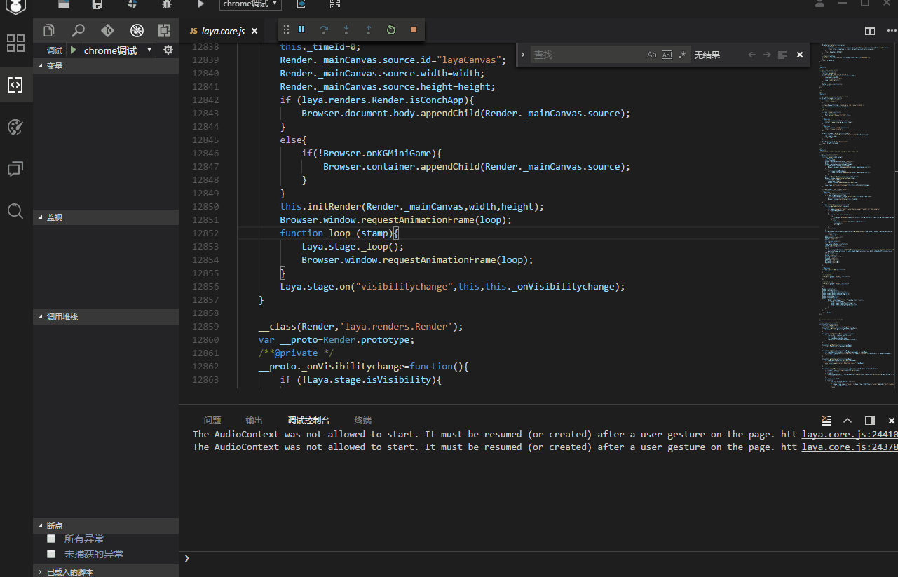

# IDE常见问题的解决方案

> update:  2019-3-13

### 调试工具条被拖动到左边拖不回来

请按照动图操作，然后重启IDE即可解决

### 缓存大法治百病

开发者在使用IDE的时候，有时候会报出一些错误，有的时候直接忽略即可。有的时候，需要重启IDE才可以解决。也有的时候重启也解决不了。这个时候。我们建议开发者先清理缓存来解决。因为大多数情况都是缓存的问题导致。

#### 缓存文件在哪里？

在IDE导航的帮助菜单里有一个选项叫“`打开编辑器本地缓存`”，如图1所示。通过点击这里，可跳转到缓存的资源目录。

 

（图1）

缓存目录打开后，如图2所示。如果是布局问题，可以直接删除layout目录。如果也不清楚什么问题。所有看到的目录和文件都删干净也没关系。

 

删除缓存后，一般可以解决很多常见的问题。如果还没解决，可以联系QQ群管理员，远程协助处理。本文也会根据帮大家解决问题的经验，陆续总结一些经验到本篇文档中。