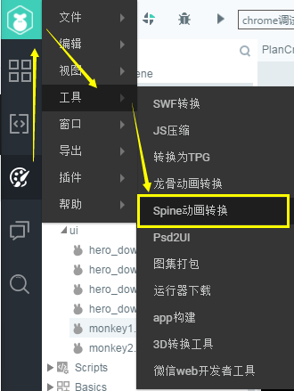
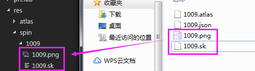

# LayaAir引擎播放Spine骨骼动画

> 本篇采用LayaAirIDE 2.0.0版本截图说明，如有差异，请下载最新稳定版本的LayaAirIDE，并以最新版本为准。

Spine骨骼动画，是游戏中经常使用的骨骼动画之一，对于Spine的支持，LayaAir有两种方案，一种是购买Spine商业适配版，另一种是通过spine转换工具，被引擎免费支持的版本。

## 商业版与免费版区别

### 1、格式的区别

免费版需要通过LayaAirIDE内置的工具，将Spine文件转换成LayaAir引擎识别的格式(本文档中会讲)。

商业适配版，直接适配spine，无需转换，直接对spine的文件进行使用支持。

### 2、新版本的支持

免费版支持spine 3.4.0.2至3.7.89之间的版本导出资源。

商业适配版支持到最新的版本导出资源。

### 3、性能的差异

LayaAir引擎中针对骨骼动画做出过深度优化，使用免费版，由于是通工具将spine转换为LayaAir引擎的格式。性能要更优一些。当使用的spine功能比较基础时，可以优先使用免费版。

商业适配版，spine解析播放过程是由spine官方提供的类库支持，也就是说spine这块所有的js计算，已经委托为spine-core了，只是渲染使用的LayaAir引擎，所以性能的瓶颈在于Spine本身。可能会弱于LayaAir引擎中骨骼动画方案。

### 4、商业版适配版支持，免费版不支持的功能列表

商业适配库包括了免费版中的全部功能，和一些LayaAir spine免费版不支持的功能，但商业适配版中支持的。

以下为商业适配版中支持的常用功能：

> - 支持图片裁剪功能。
> - 支持继承要同时选择旋转跟位移。
> - 支持动画的部位以及整体换色。
> - 支持路径动画。
> - 解除LayaAir引擎对骨骼数量255限制。
> - 解决美术制作动画对IK帧限制。
> - 支持 spine动画融合、蒙皮功能。
> - 支持spine插槽混合模式中除正常以外的另外三个“相加””相乘””滤色”。
> - 支持spine软件对插槽颜色和透明度的动画控制。

以上内容是开发者通常比较关注的，还有一些商业版中存在，但以上没有提及的功能，可以联系商业合作对接人沟通咨询，另外，免费版中支持的功能，商业版中全部支持。

 

（图）商务合作对接人 微信二维码


## 免费版的使用说明

通过LayaAirIDE自带的转换工具，可以将Spine骨骼动画格式转换为LayaAir引擎支持的骨骼动画格式。

### 1、原版Spine骨骼动画导出时的注意事项

原版Spine骨骼动画在导出时，有几个事项需要注意，否则无法完成转换。

#### 1.1 仅支持导出为JSON格式的转换

Spine骨骼动画支持JSON与二进制两种数据导出方式，需要注意的是LayaAirIDE的Spine转换工具只支持JSON格式的转换。请导出时选择JSON格式导出。

#### 1.2 导出时必须创建图集

LayaAirIDE的Spine转换工具只支持图集模式的Spine骨骼动画转换，因此，在使用Spine骨骼动画编辑工具导出时，必须勾选`创建图集`，如图1所示。

 

(图1) Spine 骨骼动画编辑工具的导出界面

#### 1.3 在图集打包的设置项里，不能勾选旋转选项

在Spine骨骼动画编辑工具的创建图集右侧，点击`设置`按钮进入图集打包设置（Pack Settings）界面。要确认区域设置里的`旋转`选项处于未勾选状态。勾选`旋转`选项后，LayaAirIDE转换Spine工具，无法转换成功。

 

(图2) Spine 骨骼动画导出的图集打包设置界面

#### 1.4 要注意导出的Spine版本

LayaAirIDE并非所有Spine版本都支持转换。支持的版本号在Spine转换工具面板中有显示。截止到本篇文档时，Spine从3.4.0.2版本开始，已支持到3.6.16版本。后续LayaAirIDE会不定期进行Spine版本支持的更新，开发者可关注转换工具面板上的版本号支持状态的改变。

#### 1.5  转换整个导出的目录

导出生成的文件为`atlas,json,png`格式的文件，如图3所示。需要注意的是，使用转换工具转换时，不要直接拖动文件去转换，要将整个父级目录（*如图3中的spine目录*）拖入到转换面板中。

 

(图3)


### 2、将Spine动画转换为LayaAir引擎识别的格式

#### 2.1 打开转换工具面板

在LayaAirIDE的`设计模式`中，依次点击菜单栏的 `工具` --> `Spine动画转换` ，如图4所示，即可打开`Spine格式转换`工具。

 

(图4)


在打开的`Spine格式转换`工具面板中，顶部Spine后面的括号内是支持转换的spine版本号，如图5所示，当前支持将Spine 3.4.0.2和3.6.16版本以及两个版本之间的Spine骨骼动画转换为LayaAir引擎支持的格式。

 

(图5)


#### 2.2 生成.sk后缀的骨骼动画文件

打开`Spine格式转换`工具面板后，将spine导出的资源目录拖入到转换面板，或者点击浏览按钮选择spine导出的资源目录。然后点击`确定` ，即可在原资源目录下生成一个新的.sk后缀的骨骼动画文件。如图6所示。

 

(图6)


### 3、Spine动画的加载显示

#### 3.1 将转换后的spine动画资源复制到项目对应的目录。

除了转换生成的.sk格式文件，.png后缀的图集资源也需要复制到项目的目录中，如图7所示。（*其它导出的文件则不用管，仅供转换工具使用。*）

 

(图7)

#### 3.2 spine动画播放示例

下面的示例将用到`laya.ani.bone.Skeleton` 类，具体API说明可直接打开链接查看：[https://layaair.ldc.layabox.com/api/?category=Bone&class=laya.ani.bone.Skeleton](https://layaair.ldc.layabox.com/api/?category=Bone&class=laya.ani.bone.Skeleton)

创建文档类SpineDemo.as，代码编写如下：

```java
package
{
	import laya.ani.bone.Skeleton;

	public class SpineDemo
	{
		public function SpineDemo()
		{
			//初始化舞台
			Laya.init(1334, 750);
			
			//创建一个Skeleton对象
			var skeleton:Skeleton = new Skeleton();
			//添加到舞台
			Laya.stage.addChild(skeleton);
			
			skeleton.pos(600,700);
			
			//通过加载直接创建动画
			skeleton.load("res/spine/spineboy/spineboy.sk");
		}
	}
}
```
运行效果如动图8所示

 

(动图8)

