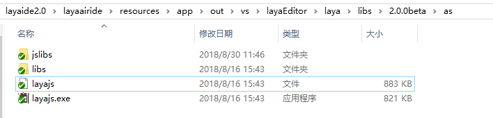
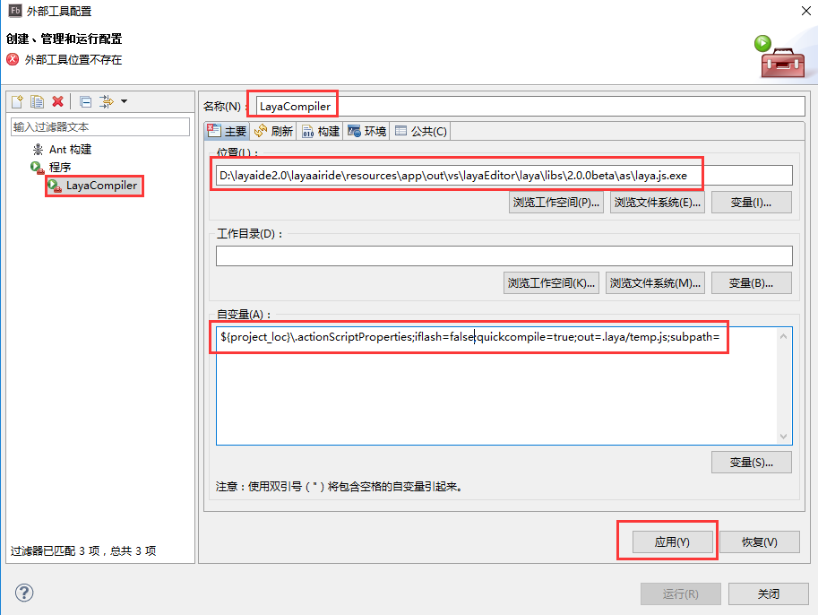
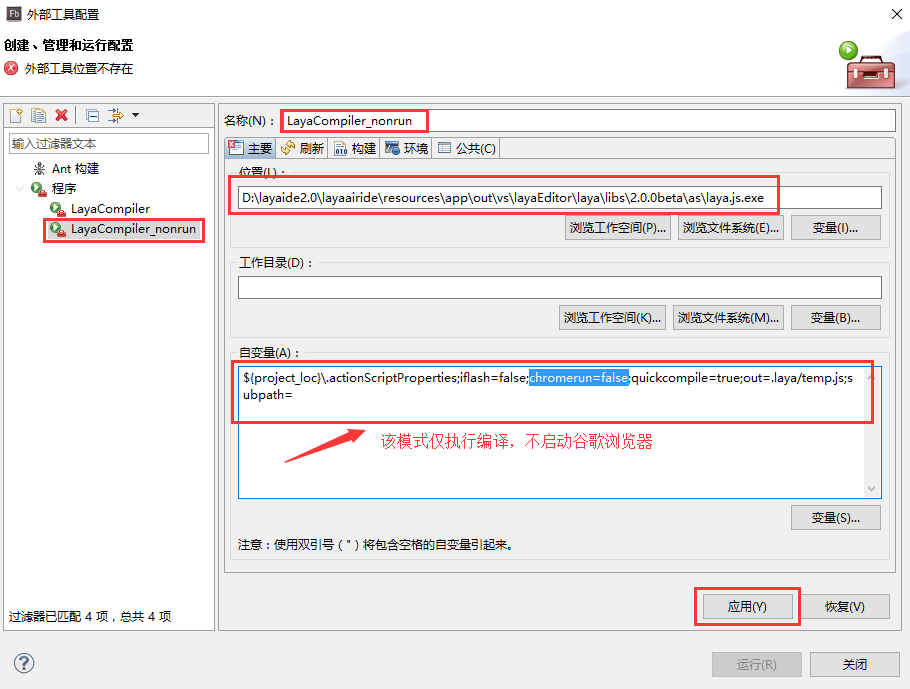

# Flash Builder开发环境配置

### 第一步： LayaAir Engine下载

#### 1.1 引擎下载

​     使用LayaAirIDE开发的话，下载LayaAirIDE会自带引擎包。若开发者使用第三方工具开发，那需要先下载引擎。在官网首页或者开发者中心菜单中，拥有引擎下载的链接入口，打开链接后会出现引擎各个版本的下载列表，每一个版本均提供AS3、TS、JS三种开发语言，选择对应的开发语言包，直接点击下载即可。 

#### 1.2 引擎包目录结构介绍  

我们下载AS3版本的引擎包。当下载解压后，可以看到AS3版本的目录结构如下图所示：

    （图1） 

- “LayaAirFlash”目录内是发布Flash的版本才需要的引擎库代码。

- “libs”引擎代码目录，LayaAir引擎库代码处于该目录的src子目录中。

- “laya.js.exe”为Windows系统下的AS3代码编译器，用于将AS3代码编译为JS代码。

- “LayaJSMac”为苹果MAC系统下的AS3代码编译器，用于将AS3代码编译为JS代码。

- “playerglobal.swc”用于替换AS3原生编译器SDK，去除原生API语法提示，增加引擎API提示。 

- "worker.js"，指定worker.js路径，可以开启使用WorkerLoader来加载解码图片的功能，起到优化加载优化的作用，具体使用查看相关文档。

  ​

### 第二步 安装Google Chrome浏览器

​    当执行AS3代码编译后，默认调用Chrome浏览器打开运行项目，需要安装此浏览器进行项目调试。已安装的可跳过本步骤。

### 第三步 配置Flash Builder中的AS3编译环境

​**    步骤一**：打开Flash Builder，找到“外部工具 配置”并打开该配置窗口。

​     
​  图（2）  

​**    步骤二**：在配置窗口内，右键选中“程序”，点击“新建”，打开新建配置窗口。

​     
​   图（3） 

**步骤三**：

首先修改外部程序名称为“`LayaCompiler`”。

然后点击“浏览文件系统”找到“`laya.js.exe`”或者直接复制”`laya.js.exe`”的路径粘贴到“位置”输入栏。

最后在“自变量”栏里输入`"${project_loc}\.actionScriptProperties;iflash=false"`，点击”应用“即可完成本次配置。

如果我们不想每次编译都启动一个新的谷歌浏览器进程，按刚才的配置方式再次创建一个外部程序，仅需将自变量参数改为`"${project_loc}\.actionScriptProperties;iflash=false;chromerun=false;"`如图4、图5所示。

   （图4）

   (图5)

 

**Tips：“D:\LayaBox\LayaAirAs3_1.7.3_beta\as\laya.js.exe”应为laya.js.exe的实际所在路径。MAC系统下为“D:\LayaBox\LayaAirAs3_1.7.3_beta\as\LayaJSMac”**

至此，建立项目前的LayaAir引擎下载，浏览器下载，Flash Builder环境下的AS3编译器配置就结束了。欢迎开发者在其它章节里继续学习。