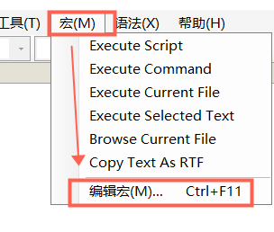
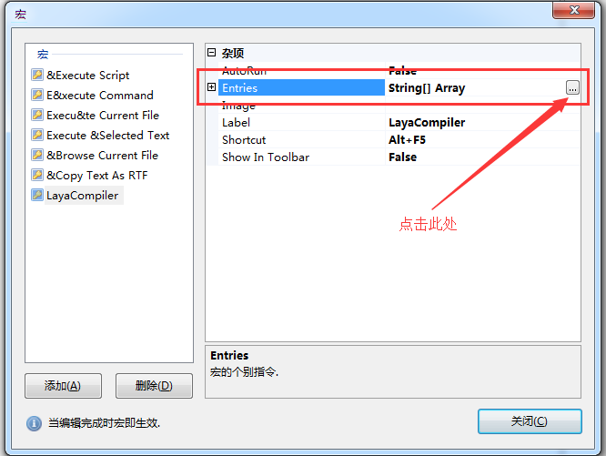
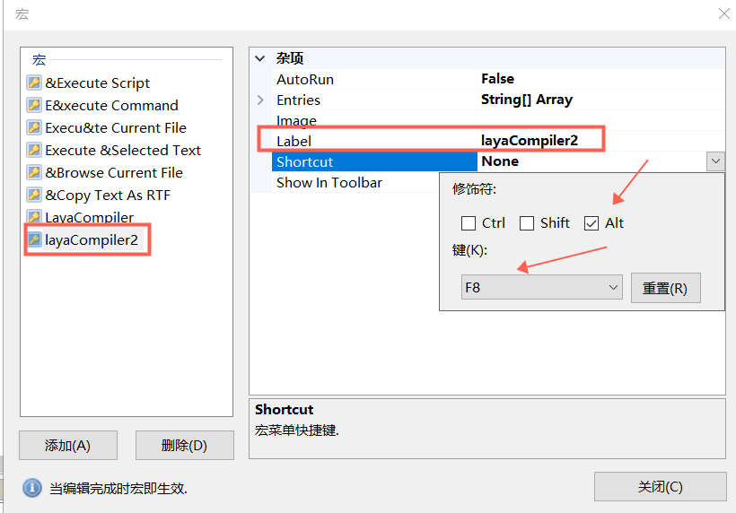

# FlashDevelop开发环境配置

*LayaAir Version : 2.4.0 beta    FlashDevelop Version：5.3.3   Date：2019-11-15*

### 第一步： LayaAir Engine下载

#### 1.1 引擎下载

​     使用LayaAirIDE开发的话，下载LayaAirIDE会自带引擎包。若开发者使用第三方工具开发，那需要先下载引擎。在官网首页或者开发者中心菜单中，拥有引擎下载的链接入口，打开链接后会出现引擎各个版本的下载列表，每一个版本均提供AS3、TS、JS三种开发语言，选择对应的开发语言包，去官网下载。

LayaAir 2.x引擎下载地址为： [https://ldc2.layabox.com/layadownload/?type=layaair](https://ldc2.layabox.com/layadownload/?type=layaair ) 


####  1.2 引擎包目录结构介绍 

由于本篇介绍的是FlashDevelop开发环境，所以我们下载AS3版本的引擎包。当下载解压后，可以看到AS3版本的目录结构如下图所示：

​      ​  图(1)

- `jslibs`、`libs`为引擎代码目录，LayaAir引擎库代码处于该目录中。

- `laya.js.exe`为Windows系统下的AS3代码编译器，用于将AS3代码编译为JS代码。

- `Layajs`为苹果MAC系统下的AS3代码编译器，用于将AS3代码编译为JS代码。

  


### 第二步 下载安装Google Chrome浏览器

​    当执行AS3代码编译后，默认调用Chrome浏览器打开运行项目，需要安装此浏览器进行项目调试。已安装的可跳过本步骤。


### 第三步 下载安装FlashDevelop

FlashDevelop是一款免费的AS3编码工具，易用性稍弱于FlashBuilder（简称FB），但比FB轻便且免费，也是一款应用广泛的AS3编码工具。

本篇文档基于FlashDevelop 5.3.3，如果文档未及时更新，请以工具实际为准，相差应该不会太大。

FlashDevelop 官方下载地址：[https://www.flashdevelop.org/](https://www.flashdevelop.org/ ) 


### 第四步  配置FlashDevelop中的AS3编译环境

​    **步骤一**：打开FlashDevelop，在菜单栏里找到“宏”并打开“编辑宏”面板。

​     

  图(2)

​    **步骤二**：首先点击“添加”增加一条宏命令，然后选中刚刚增加的宏命令，在“Label”栏修改宏命令的菜单名称为“LayaCompiler”，以及在“Shortcut”栏设置宏菜单快捷键为“Alt+F5”（快捷键设置仅作参考，不要和别的快捷键冲突）。

​    <br/>
​  图(3)

​    **步骤三**：在“Entries”栏的右侧位置点击“...”操作区域，打开“字符串集合编辑器”窗口。

​    <br/>
​  图(4)

​    **步骤四**：在字符串集合编辑器面板里，输入宏指令：

​    <br/>
​  图(5)

layaAir **2.2以前的**版本可以参照下面的指令配置。

```json
SaveAllModified
RunProcessCaptured|D:\layaide2.0\layaairide\resources\app\out\vs\layaEditor\laya\libs\2.0.0beta1\as\layajs.exe;"$(ProjectPath)";iflash=false;quickcompile=true;out=bin/js/bundle.js;subpath=
```

layaAir **2.2开始的**版本可以参照下面的指令配置。

```typescript
SaveAllModified
RunProcessCaptured|D:\layaide2.0\layaairide\resources\app\out\vs\layaEditor\laya\libs\2.0.0beta1\as\layajs.exe;"$(ProjectPath)";asconfig.json;iflash=false;quickcompile=true;out=.laya/temp.js;subpath=;script=ES6;outlaya=true;layaists=true
```

**Tips**：“`D:\layaide2.0\layaairide\resources\app\out\vs\layaEditor\laya\libs\2.0.0beta1\as\laya.js.exe`”应为`laya.js.ex`e的实际所在路径，开发者要灵活参照进行修改，别直接复制。

​    **步骤五**：点击”确定“完成宏指令配置后，已经完成宏命令“LayaJsCompiler”全部配置，并即时生效，直接点击“关闭”按钮即可。

以后直接采用快捷键Alt＋F5就可以开始把AS编译成JS，并调起chrome了。

如果开发者不想每次都调起chrome，只是想编译项目生成新的JS。

那我们也可以重复之前的步骤，新建一个宏，label换一个名字，如layaCompiler2。再换一个编译快捷键，如Alt+F8，然后，Entries配置指令那里，加入`chromerun=false;` ，这样就只编译不启动谷歌浏览器了。

指令参照如下：（指令示例为layaAir **2.2开始的**版本）

```
SaveAllModified
RunProcessCaptured|D:\layaide2.0\layaairide\resources\app\out\vs\layaEditor\laya\libs\2.0.0beta1\as\layajs.exe;"$(ProjectPath)";asconfig.json;iflash=false;chromerun=false;quickcompile=true;out=.laya/temp.js;subpath=;script=ES6;outlaya=true;layaists=true
```




至此，

FlashDevelop环境下的AS3编译器配置就结束了。欢迎开发者在其它章节里继续学习。

