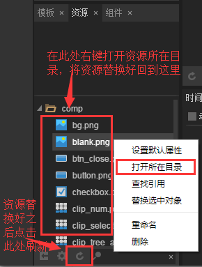
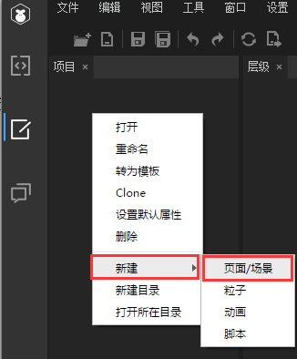
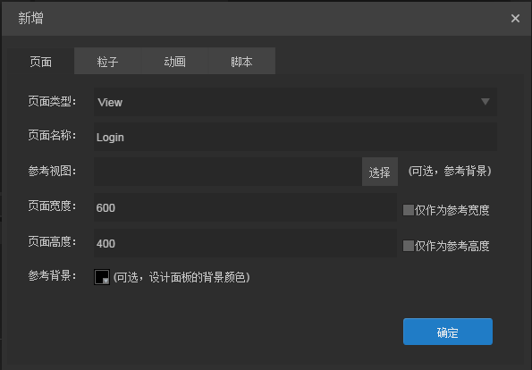
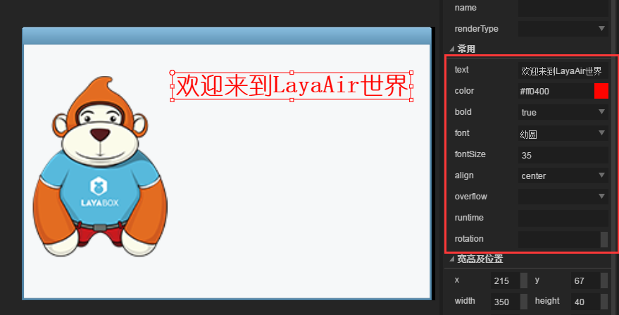

# 使用LayaAir IDE制作游戏的登陆注册界面

只要是游戏开发者相信大家对游戏的登陆、注册页面不陌生。如何使用LayaAirIDE制作一个登陆注册页面呢？那么就请耐心的看完本篇教程吧~~（注：本篇文档只是一个显示效果，并没有实际数据）

**先来看下最终实现的效果。如图1、图2、图3、图4所示**


(图1)在IDE中拼好界面之后到代码中将登陆页面实例化并添加到舞台上，点击注册按钮弹出注册面板（图2所示）。


(图2)点击提交注册提示注册成功页面（图3所示），点击右上角关闭按钮则关闭注册页面。


(图3)点击确定或者右上角关闭按钮则关闭注册成功提示页面


(图4)点击登录面板上的登陆按钮则弹出登陆成功页面（注：登陆成功和注册成功面板用的是用一个面板，传入的数据不同）。

## 1、新建项目

打开已安装好的LayaAirIDE，创建一个空项目（本篇为AS版）。给项目命名、选择路径、选择项目类，最后点击创建。如图5所示


(图5)创建好的项目结构就不在此详细讲解了，请切换到相关的文档页面中查看

## 2、创建登陆页面并完成登陆页面UI的拼接

### 2.1添加资源

如果当前所在的IDE页面不是编辑模式则需切换到编辑模式下。如图6所示


(图6)

使用LayaAirIDE创建出来的项目在编辑模式—资源目录下都会有一个名字为comp的资源文件，里边存放的是一些常用的UI组件资源。在此文档中使用不了那么多的资源，所以将资源删除一些，并添加一张新的资源。最终资源文件中所保留的资源如图7所示。


(图7)资源操作步骤：在资源面板中右键—打开所在目录（资源所在目录）—将多余的资源删除、添加一张资源—回到IDE资源面板中刷新资源。如图8所示


(图8)

### 2.2创建登陆页面

在编辑模式项目模块中右键—新建—页面创建一个登陆页面（如图9所示），接着会弹出创建页面的面板（如图10所示）


(图9)


(图10)

**页面类型：**

分两种，View和Dialog。两者的区别是：Dialog继承自View，View有的功能Dialog都有，不同于View的是Dialog组件是一个弹出对话框，实现对话框的弹出，拖动，模式窗口功能。View在实际项目中可作为固定显示的面板，而Dialog在实际项目中可作为弹出框显示

**页面名称：**

此页面的名称

**参考视图：**

在实际项目中有一些界面上的资源可能会非常多，这时候就需要按照美术给的示意图去对这些位置。如果没有一个参照物就只是看着示意图去操作的话时间肯定会比较长。参考视图的作用就是可以将美术给的示意图添加进来照着做（参考视图最终不会用于实际项目中）

**页面宽度、页面高度：**

页面的宽高，可以看到后边有个“仅作为参考”的勾选框。如果这个勾选框是勾选的状态，那么前边填的这个宽高在实际项目中就是无效的，会自动计算当前页面上元素的宽高，从而得出整个页面的宽高（此操作会比较消耗性能，请谨慎使用）。如果不勾选这个选项框，那么前边设置的宽高就是实际页面的宽高（如果资源超出了设置的宽高，那么超出的部分则不会被渲染，无法添加任何事件）

**参考背景：**

编辑页面时背景的颜色（仅作为参考，实际项目中不会生效）

最后点击确定按钮就会发现IDE中间有个可视区域

### 2.3编辑登陆页面

**一个登陆页面中常见的就是游戏的Logo、标题、用户名、密码、记住密码选项框、自动登陆选项框、注册按钮、登陆按钮等元素，那么接下来咱们就制作一个这样的登陆页面（注：所有组件的属性都能在API中找到，如有不懂的请自行查找对应的API）。**

**2.3.1.添加背景**：

选中背景资源，将背景资源以拖拽的形式放到页面中。在右侧属性栏中找到sizeGrid属性（设置九宫格，设置为35,20,20,20），设置九宫格的目的是避免拉伸图片时图片模糊，然后将背景图的宽高设置成页面的宽高。如图11所示


(图11)

**2.3.2.添加logo资源：**

将LayaBox的Logo小猴子添加到页面中，放在靠左侧的位置（在此就先不截图看效果了，在图12中会看到）

**2.3.3.添加标题：**

将资源面板中的Label组件拖拽到页面中。在右侧属性面板—常用属性中设置text属性为“欢迎来到LayaAir世界”，设置color颜色为红色“#ff0400”，设置bold是否加粗为“true”，设置font字体为“幼圆”（注意，该字体必须是电脑中已有的字体。**此项目中所有的文字都会设置为幼圆，之后就不在提了**），设置fontSize文本字体大小为“35”，设置align水平对齐方式为居中对齐“center”。如图11所示


(图12)

**2.3.4.添加用户名和密码：**

从资源列表中拖到页面上两个Label放在合适的位置，然后在右侧属性面板中设置text为“用户名：”和“密码：”，将字体都设置为“幼圆”，字体大小设置为“20”。

从资源列表中拖到页面上两个输入框“TextInput”放在用户名和密码对应的位置，在右侧属性栏中给用户名输入框的var声明个变量“userName”（var和name的区别：var是全局唯一的变量，可直接通过此变量修改该组件下的所有属性。name可通过父节点.getChildByName("name")获取到该对象，从而修改它的属性），给用户名的prompt提示符设置为“请输入用户名”，字体同样是“幼圆”。密码输入框跟用户名输入框同理，设置var变量为"userPassword",设置prompt为“请输入密码”。如图13、图14所示


(图13)


(图14)

**2.3.5.添加勾选框:**

添加记住密码和自动登录勾选框，用于记录状态

从资源目录中拖出两个勾选框组件，在右侧属性面板中设置label为“记住密码”和“自动登录”，然后在其他选项中设置labelBold是否加粗为“true”，labelFont设置为“幼圆”。如图15、图16所示


(图15)


(图16)

**2.3.6.添加注册、登陆按钮：**

注册按钮：点击之后弹出注册页面；登陆按钮：点击弹出登陆提示

按钮属性设置如图17、图18所示


(图17)


(图18)

**到这里登陆界面就已经全部完成了，接下来继续拼注册窗口跟提示窗口。等UI界面全部完成之后再用代码实现对应的功能**

## 3、创建注册页面并完成注册页面UI的拼接

**3.1创建注册页面**

步骤跟2.2登陆页面一致。不同的是注册页面是Dialog类型的（在上边2.2创建登陆界面时已经详细说过Dialog和View的区别了，在此不再详细叙述了），点击确定按钮完成创建页面。如图19所示


(图19)

**3.2添加页面背景**

参考步骤2.3.1，将背景资源拖入页面中，设置九宫格以及图片大小

**3.3添加标题**

参考步骤2.3.3，将Label组件拖入页面中，放在标题位置，设置对应的属性。如图20所示


(图20)

**3.4添加用户名、用户名输入框、输入密码等组件**

从资源面板中拖出一个Label组件，设置字体为“幼圆”、fontSize字体大小为“16”、对齐方式algin为左对齐“left”以及显示文字text。选中Label按快捷键Ctrl+R复制出5个相同的组件。如图21所示


(图21)点击确定之后就能看到页面上有5个相同的Label，适当的调整下位置，修改每个Label的text文本内容。如图22所示


(图22)

显示文本除了text文本内容不一样，其它内容均一致。红框name那里的内容可以不用去管，是用快捷键复制组件时自动生成的，不影响任何内容。有了前边的文本显示内容，后边肯定是要有对应的输入框的。从资源面板中拖出一个文本输入框TextInput放到用户名后边，再次使用快捷键Ctrl+R复制出5个相同的文本输入框，微调位置，在输入提示符prompt输入提示内容、设置字体font为“幼圆”。如图23所示


(图23)

**3.5添加提交注册按钮和关闭页面按钮**

从资源面板中拖出一个Button组件放到正下方位置，label显示文字设置为“提交注册”，var变量名为“btn_submit”（点击按钮时关闭注册页面）。然后再从资源面板中拖入一个关闭按钮放在右上角，给关闭按钮的name命名为“close”（Dialog页面中可以给页面上的组件name命名为close，点击该组件就会关闭Dialog页面），把关闭按钮默认显示的label文字删除。如图24、25所示


(图24)


(图25)

## 4、创建提示页面并完成提示页面UI的拼接

**4.1创建页面**

步骤跟3.1一致，页面名称改为NormalDig，点击确定

**4.2添加显示组件**

从资源面板中拖入一个Label组件，给var变量定义为“txtContent”，设置常用属性如图26所示


(图26)

**4.3添加确定按钮和关闭页面按钮**

跟3.5步骤一致，给确定按钮定义var变量为“btn_sure”。如图27、28所示


(图27)


(图28)

## 5、用代码实现图1、2、3、4效果

写代码之前先在编辑模式下F12导出下资源，然后到代码模式下的bin/h5/res/atlas目录下看看是否生成了对应的图集文件，如果没有的话就回到编辑模式下按快捷键Ctrl+F12清理并导出资源。（AS项目建议开发者使用FB或者FD来编写，本篇文章中以FB为例。）

**5.1用FB导入项目**

导入项目步骤：打开FB—文件—导入FlashBuilder项目（弹出导入项目选择框）—选择项目文件夹将项目目录复制进来—完成。（不明白的请参考基础文档）

**5.2预加载资源并显示登陆页面**

预加载资源的目的是避免使用资源的时候加载时间过长（按钮资源必须要预加载！），预加载资源之后在资源加载完成回调中实例化登陆页面。代码如下：

```typescript
package {
	import laya.net.Loader;
	import laya.utils.Handler;
	
	import ui.LoginUI;

	public class LayaSample {
		public function LayaSample() {
			//初始化引擎
			Laya.init(1136, 640);
			//预加载资源
			Laya.loader.load("res/atlas/comp.json",Handler.create(this,onLoaded),null,Loader.ATLAS);
		}		
		//资源加载完成回调
		private function onLoaded():void
		{
			//实例化登陆页面
			var login_ui:LoginUI = new LoginUI();
			//把登陆页面添加到舞台上
			Laya.stage.addChild(login_ui);
		}
	}
}
```

编译效果如图29所示


(图29)

在实际项目中如果对UI页面上的元素有很多的操作，那么就不建议直接在入口类中实例化UI页面了，建议创建一个UI逻辑类继承UI页面，然后操作里边的元素。所以在此修改下代码，创建一个登陆页面继承对应的ui页面，在入口类中实例化登陆页面

新建登陆逻辑类如图30所示


(图30)

然后将入口类的代码修改为以下代码

```typescript
package {
	import laya.net.Loader;
	import laya.utils.Handler;
	
	import ui.LoginUI;

	public class LayaSample {
		public function LayaSample() {
			//初始化引擎
			Laya.init(1136, 640);
			//预加载资源
			Laya.loader.load("res/atlas/comp.json",Handler.create(this,onLoaded),null,Loader.ATLAS);
		}		
		//资源加载完成回调
		private function onLoaded():void
		{
          	/////修改此处/////
			//实例化登陆页面
			var login_view:LoginView = new LoginView();
			//把登陆页面添加到舞台上
			Laya.stage.addChild(login_view);
		}
	}
}
```

**5.3给登陆、注册按钮添加事件打开对应的页面**

在给登陆、注册按钮添加点击事件之前先创建一个登陆页面的逻辑类和注册页面的逻辑类来继承各自的UI页面，从而操作对应的UI界面。如图31、32所示


(图31)


(图32)

打开LoginView类，给注册按钮添加点击事件，点击注册按钮弹出注册页面。代码如下：

```typescript
package
{
	import laya.events.Event;
	import ui.LoginUI;

	public class LoginView extends LoginUI
	{
		public function LoginView()
		{
			//给注册按钮添加点击事件
			this.btn_reg.on(Event.CLICK,this,onReg);
		}
		private function onReg(e:Event):void{
			//实例化并弹出注册页面
			var reg:RegDlg = new RegDlg();
			//弹出注册页面
			reg.popup();
		}
	}
}
```

以上代码实现的效果如图33所示（效果与图2一致）


(图33)点击关闭按钮即可关闭注册页面（因为在UI页面中给关闭按钮的name命名为“close”了）

给提交注册按钮添加点击事件，点击之后弹出提示面板。但是弹出的同时需要给提示面板中的提示内容赋值，所以先切换到提示页面NormalDig类中，添加一个公开的方法用来给文本赋值同时给确定按钮添加点击事件，点击关闭提示页面。代码如下：

```typescript
package
{
	import laya.events.Event;
	
	import ui.NormalDigUI;

	/**
	 * 提示页面
	 * @author Laya
	 * 
	 */
	public class NormalDig extends NormalDigUI
	{
		public function NormalDig()
		{
			//给确定按钮侦听点击事件，点击后关闭面板
			this.btn_sure.on(Event.CLICK,this,onClick);
		}
		private function onClick(e:Event):void{
			//关闭页面
			this.close();
		}
		public function popupContent(msg:String):void{
			//给文本赋值
			this.txtContent.text = msg;
			//弹出页面
			this.popup();
		}
	}
}
```

打开注册页面RegDlg类，给提示面板传入显示文字“注册成功！”，代码如下：

```typescript
package
{
	import laya.events.Event;
	import ui.RegDlgUI;
	/**
	 * 注册页面
	 * @author Laya
	 * 
	 */
	public class RegDlg extends RegDlgUI
	{
		public function RegDlg()
		{
			//给提交注册按钮侦听点击事件
			this.btn_submit.on(Event.CLICK,this,onClick);
		}
		private function onClick():void
		{
			//实例化提示页面（目的是为了给提示面板中的文本赋值）
			var dlg:NormalDig = new NormalDig();
			dlg.popupContent("注册成功！");
		}
	}
}
```

以上代码运行效果如图34所示（跟图三显示一致）


(图34)

**到此处注册页面相关代码已全部完成，接下来继续完成登陆页面的逻辑代码**

打开登陆LoginView类，给登陆按钮注册点击事件，点击弹出提示页面并显示登陆成功字样。代码如下：

```typescript
package
{
	import laya.events.Event;
	import ui.LoginUI;
	public class LoginView extends LoginUI
	{
		private var dlg:NormalDig;
		public function LoginView()
		{
			//实例化提示面板（目的是为了在点击登陆按钮时给提示页面中的文本赋值）
			dlg = new NormalDig();
			//给注册按钮添加点击事件
			this.btn_reg.on(Event.CLICK,this,onReg);
			//给登陆按钮添加点击事件
			this.btn_login.on(Event.CLICK,this,onLogin);
		}
		private function onReg(e:Event):void{
			//实例化并弹出注册页面
			var reg:RegDlg = new RegDlg();
			//弹出注册页面
			reg.popup();
		}
		private function onLogin(e:Event):void 
		{
			//给提示面板赋值
			dlg.popupContent("登陆成功！");
		}
	}
}
```

以上代码运行效果如图35所示（跟图4效果一致）


(图35)

至此，本篇登陆、注册示例文档已全部完成，开发者可以在此基础上实现更完整的登陆、注册功能。如有问题请提交到论坛上[http://ask.layabox.com/](http://ask.layabox.com/)