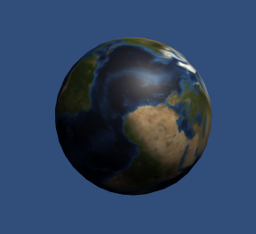

# 材质的功能介绍

###### *version :2.1.0beta   Update:2019-5-14*

### 1.从模型上获取材质

​	使用导出的模型时，引擎会自动在模型上加载材质，并且很多时候一个模型上会有多个标准材质，自动的方式为我们省下了很多开发时间。但在这种情况下，如果我们需要改变、更换材质怎么呢？我们首先需要在模型上获取当前的材质。

​	LayaAir 3D引擎为我们提供了网格渲染器MeshRenderer类和蒙皮动画网格渲染器SkinnedMeshRenderer，在可视模型上提供了它们的实例，我们可以通过它们来获取模型上的材质。

​	**Tips**：MeshSprite3D模型中为meshRenderer，SkinnedMeshSprite3D模型中为skinnedMeshRenderer。

###### 这两个类多是一些继承自'父类'的共有的接口，可以查看'父类' **BaseRenderer** 的API（[API地址](https://layaair.ldc.layabox.com/api2/Chinese/index.html?category=3D&class=laya.d3.core.render.BaseRender)）。

​	获取的材质分为两种类型：

​	自身材质 **Material**，如果自身材质被修改了，只有自身模型显示进行变化；

​	共享材质 **SharedMaterial** ，因为材质相对独立，多个模型都可以用同一个材质，如果获取的是共享材质并修改了，自身模型显示会变化，其他模型用到这个材质的部分也会发生改变。

<br><br>

如何使用，开发者们需要根据具体需求自行选择。

以下是节选代码，具体代码可以查看demo（[demo地址](https://layaair.ldc.layabox.com/demo2/?language=ch&category=3d&group=Material&name=MaterialDemo)）。

<br>(图3)

> 通过网格渲染器获取模型上的材质

```typescript
//初始化3D场景
var scene:Scene3D = Laya.stage.addChild(Loader.getRes("res/threeDimen/scene/ChangeMaterialDemo/Conventional/scene.ls")) as Scene3D;
//从场景获取球型精灵
sphere = scene.getChildByName("Sphere") as MeshSprite3D;
//获取球型精灵自带的BlinnPhong材质
billinMaterial = sphere.meshRenderer.material;
```

> 拿到材质之后，我们可以修改材质或者将这个材质给其他模型使用，这里我们就是将上面拿到的材质添加给新创建的球：
>

```typescript
//代码创建一个球体
var sphere2:MeshSprite3D = scene.addChild(new MeshSprite3D(PrimitiveMesh.createSphere(0.5))) as MeshSprite3D;
//将创建的球放置在导出球的同一点
sphere2.transform.position =  sphere.transform.position;
//将创建的球平移
sphere2.transform.translate(new Vector3(0, 1.3, 0),false);
//将从导出球上拿到的材质 贴给代码创建的球
sphere2.meshRenderer.material = billinMaterial;
```

然后就可以看到效果了，如图4所示：

<br>(图4)

### 	2. 修改模型上的材质

既然能拿到材质，自然也能够更换材质了。

同样的还是通过网格精灵的`meshRenderer`  网格渲染器 来修改。

```typescript
......
//创建一个新的PBRStandard材质
pbrStandardMaterial = new PBRStandardMaterial();
//获取新的纹理
pbrTexture = Loader.getRes("res/threeDimen/texture/earth.png") as Texture2D;
//为PBRStandard材质设置漫反射贴图
pbrStandardMaterial.albedoTexture = pbrTexture;
//修改导出球的材质
sphere.meshRenderer.material = pbrStandardMaterial;
```

<br>(图5)

### 3.是否能接受阴影

阴影在前面的 **灯光篇** 的 **如何为灯光添加阴影** 节有介绍（[地址](https://ldc2.layabox.com/doc/?nav=zh-as-4-6-4)）。这里只讲解在材质中需要设置的相对应的属性:

渲染器类中的 `castShadow` 是否能产生阴影 与 `receiveShadow` 是否能接受阴影。

> 下面的代码来自于阴影的示例

```typescript
//前面给灯光设置好阴影参数之后，获取猴子模型与地板模型并且分别设置产生阴影与接受阴影
//地面接收阴影
var grid:Sprite3D = scene.addChild(Loader.getRes("res/threeDimen/staticModel/grid/plane.lh")) as Sprite3D;
//设置地板可以接受阴影
(grid.getChildAt(0) as MeshSprite3D).meshRenderer.receiveShadow = true;

//获取一个静态网格猴子
var staticLayaMonkey:MeshSprite3D = scene.addChild(new MeshSprite3D(Loader.getRes("res/threeDimen/skinModel/LayaMonkey/Assets/LayaMonkey/LayaMonkey-LayaMonkey.lm"))) as MeshSprite3D;

//省略调整猴子的代码.....

//设置静态网格猴子产生阴影
staticLayaMonkey.meshRenderer.castShadow = true;

//获取蒙皮网格猴子
var layaMonkey:Sprite3D = scene.addChild(Loader.getRes("res/threeDimen/skinModel/LayaMonkey/LayaMonkey.lh")) as Sprite3D;

//设置蒙皮网格猴子可以产生阴影
(layaMonkey.getChildAt(0).getChildAt(0) as SkinnedMeshSprite3D).skinnedMeshRenderer.castShadow = true;
```

<br>(图6)

### 4.关于材质优化

​		引擎在加载场景时会对物体进行合并处理，可大幅度提升场景性能。合并原则为同材质的模型，所以开发者在编辑场景模型时尽量使用相同材质，并且越少越好。这样就可以达到今后性能优化的最基本条件。更具体的会在今后的性能优化篇讲解。	