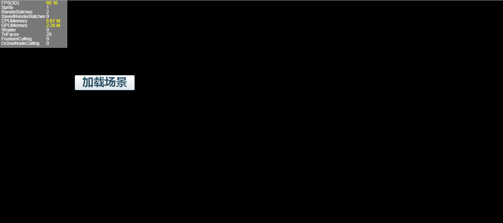

# 批量销毁释放内存

​		Scene3D、Sprite3D调用destroy()之后，引用的材质，纹理，网格并不会跟随一起销毁，需要使用`Laya.loader.getRes(url:String)`接口获取到需要销毁的资源，调用他的`destroy()`方法销毁。但是这种方法是非常麻烦的。LayaAir2.0为了方便开发者，提供了`Resource.destroyUnusedResources()`接口统一销毁。

​	**Tip**：注意Scene3D，Sprite3D调用destroy()方法的，必须是所有对象，包括本体与克隆体。同时`destroyUnusedResources` 方法会自动释放掉所有没有使用且没有**上锁**的资源。

<br>(图1)

如图1所示，我们地图上添加了一个按钮。并且给按钮添加了以下事件。

> 以下代码节选自官方示例（[demo地址](https://layaair.ldc.layabox.com/demo2/?language=ch&category=3d&group=Resource&name=GarbageCollection)）

```typescript
function(e:Event):void {
    _castType++;
    _castType %= 2;
    switch (_castType) {
    case 0: 
    	(e.target as Button).label = "释放显存";
    	loadScene();
    break;
    case 1: 
    	(e.target as Button).label = "加载场景";
    	if (_scene)//_scene不为空表示场景已加载完成
    	garbageCollection();
    break;
}
    
/**
 * @private 销毁场景并且释放资源
 */
public function garbageCollection():void {
   _scene.destroy();//销毁场景
   _scene = null;
   Resource.destroyUnusedResources();//销毁无用资源(没有被场景树引用,并且没有加资源锁的)
}

/**
 * @private 加载场景，并且将该场景添加到stage上
 */
public function loadScene():void {
    Scene3D.load("res/threeDimen/scene/ParticleScene/Example_01.ls", Handler.create(this, function(scene:Scene3D):void {
      	_scene = Laya.stage.addChildAt(scene, 0) as Scene3D;
     	var camera:Camera = scene.addChild(new Camera(0, 0.1, 100)) as Camera;
    	camera.transform.translate(new Vector3(0, 1, 0));
     	camera.addComponent(CameraMoveScript);
    }));
 }
```

我们点击加载场景，再来看状态。

<br>(图2)

在场景显示出来后，我们可以看到在 **Stat** 面板中 **GPUMemory** 有一个比较明显的涨幅。

然后我们来点击释放显存。

<br>(图3)

#### 关于资源上锁

​		因为`destroyUnusedResources` 接口的释放机制。所以那些我们需要对没有被使用到的且不能被释放的资源**上锁**。目前上锁的方法因为2D，3D单资源加载与3D批量加载的区别，有击中不同的上锁方式。

​		**注意：**上锁实际上是对父类为`Resource`的资源对象上锁。

##### 3D单资源加载时，资源上锁

​		使用对应的资源加载方式加载资源时，通过对回调拿到的资源对象直接上锁实现。对应资源的加载方式可以查看 **资源加载篇** 的 **资源加载** 节，不包括场景与预设的加载。单个场景与预设的加载回调值类型分别是Scene3D与Sprite3D，并不是继承自Resource的资源对象。

```typescript
//加载Mesh
Mesh.load("res/threeDimen/skinModel/LayaMonkey2/Assets/LayaMonkey/LayaMonkey-LayaMonkey.lm", Handler.create(this, function(mesh:Mesh):void {
    //给该网格资源上锁
    mesh.lock = true;
	........
    //中间省略，我们再网格加载完成3秒后对该网格进行销毁
    Laya.timer.once(3000,this,function ():void 
    {
        //销毁了使用该网格的节点
        layaMonkey.destroy();
        //对使用资源进行销毁,注意调用资源destroy的话，就算加锁也是会被销毁的。
        Resource.destroyUnusedResources();
    });
}));
```

<br>(图4) 调用自动释放前

<br>(图5) 调用自动释放后

​	可以看到，加锁后调用资源释放GPUMemory并没有减少。

​	加载`.lh` 与 `.ls` 文件实际上会自动加载其使用到的相关文件，如`.lmat`材质文件,`.lani`动画文件,`.lm`网格文件等。对于这种资源的资源加锁需要通过回调中的Scene3D与Sprite3D来获取对于的资源节点来加锁。

```typescript
//加载精灵
Sprite3D.load("res/threeDimen/skinModel/LayaMonkey/LayaMonkey.lh", Handler.create(this, function(sp:Sprite3D):void {
    //获取蒙皮网格精灵
    var skinnedmesh:SkinnedMeshSprite3D = sp.getChildAt(0).getChildAt(0) as SkinnedMeshSprite3D;
    //对预设的网格上锁
    skinnedmesh.meshFilter.sharedMesh.lock = true;
    //对预设所有的材质上锁
    for (var i:int = 0; i < skinnedmesh.skinnedMeshRenderer.sharedMaterials.length;i++ ){
    	skinnedmesh.skinnedMeshRenderer.sharedMaterials[i].lock = true;
    }
}));
```

##### 3D批量加载时，资源上锁

​	在批量加载资源的时候，无法拿到回调值。这时候就需要开发者通过 `Laya.loader.getRes(url)`来获取对应的资源来上锁。

```typescript
//批量预加载方式
public function PreloadingRes():void {
//预加载所有资源
var resource:Array = [
    "res/threeDimen/scene/TerrainScene/XunLongShi.ls",
    "res/threeDimen/skyBox/skyBox2/skyBox2.lmat",
    "res/threeDimen/texture/earth.png", 
    "res/threeDimen/skinModel/LayaMonkey/Assets/LayaMonkey/LayaMonkey-LayaMonkey.lm",
    "res/threeDimen/skinModel/LayaMonkey/LayaMonkey.lh", 
    "res/threeDimen/skinModel/BoneLinkScene/PangZiNoAni.lh",
    "res/threeDimen/skinModel/BoneLinkScene/Assets/Model3D/PangZi-Take 001.lani"
];
    
    //开始加载
    Laya.loader.create(resource, Handler.create(this, onPreLoadFinish));
}

//加载完成回调
public function onPreLoadFinish():void {
    //获取需要上锁的资源
    var skyboxMaterial:BaseMaterial = Loader.getRes("res/threeDimen/skyBox/skyBox2/skyBox2.lmat") as BaseMaterial;
    //资源上锁
    skyboxMaterial.lock = true;
    .......
    //获取需要上锁的资源
    var mesh:Mesh = Loader.getRes("res/threeDimen/skinModel/LayaMonkey/Assets/LayaMonkey/LayaMonkey-LayaMonkey.lm") as Mesh;
    //资源上锁 
	mesh.lock = true;
	.......
}
```

##### 2D资源加载，资源上锁

​	在2D中，图片使用的是`Texture`纹理（注意不是3D中的`Texture2D`）。但是实质上Texture就是对Texture2D的再封装，Texture的`bitmap` 属性就是他所属的Texture2D ，Texture本身是记录了Texture2的uv属性，来实现图集中的单图片显示。

​	所以在2D中，同一个图集中的多个不同 Texture 是共用的一个 Bitmap。这样的机制，就可能让开发者在内存管理时产生误解："销毁了一个2D的 Texture ，那么他所占的显存也应该被释放"。

​	**这样想是不对的。由于多个Texture引用同一个bitmap ，而Texture并不是真正的显存,bitmap才是真正的显存对象。销毁Texture并不等于销毁bitmap， 所以在这个时候是释放不掉显存的。**

​	所以2D图集与图片资源加锁，实际上是对相对应的Texture的bitmap上锁。在加载图集之后，还是使用`Laya.loader.getRes(url)`拿到图集中的一个Texture纹理，然后通过Texture的bitmap属性上锁。

```typescript
private function init():void {
	//加载场景
	Laya.loader.load('res/atlas/comp.atlas',Handler.create(this,onComplete));
}

private function onComplete():void{
	//获取图集中的一个单图
	var a:Texture = Laya.loader.getRes('comp/button.png');
	//通过单图的bitmap对图集加锁
	a.bitmap.lock = true;
}
```
