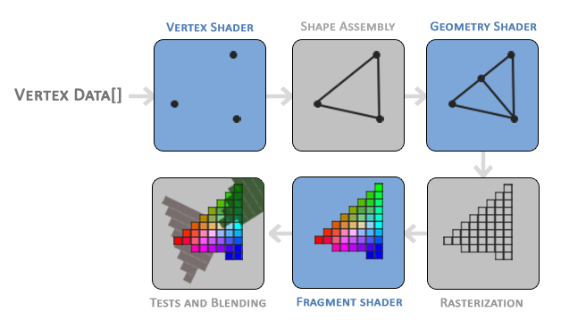

# Shader概述

###### *version :2.7.0beta   Update:2020-06-8*

**Shader** 中文名着色器，着色器是用户定义的程序，旨在在图形处理器的某个阶段运行。着色器为渲染管线的某些可编程阶段提供代码。它们也可以以稍微受限制的形式用于常规的GPU上计算。

渲染管道如下图所示:



渲染管道将某些部分定义为可编程的(图中的VERTEX SHADER、GEOMETRY SHADER、FRAGMENT SHADER)。在LayaAir中，目前引擎支持可编程的VERTEX SHADER和FRAGMENT SHADER，这些部分或阶段中的每一个都代表一种特定类型的可编程处理。每个阶段都有一组输入和输出，这些输入和输出从上一阶段传递到后续阶段（无论是否可编程）。


**LayaAir自定义Shader支持的两种类型：**

​	**顶点着色器(Vertex shader)** ：顶点着色器是渲染管线中的可编程着色器阶段，用于处理各个顶点。向顶点着色器提供顶点属性数据，该数据是由绘图命令从顶点数组对象指定的。顶点着色器从顶点流接收单个顶点，并为输出顶点流生成单个顶点。从输入顶点到输出顶点必须存在1：1映射。

顶点着色器通常执行到投影后空间的转换，以供顶点后处理阶段使用。它们还可以用于进行每个顶点的照明，或用于后续着色器阶段的设置工作。

​	**片元着色器(Fragment shader)** ：片段着色器是着色器阶段，它将把通过栅格化生成的片段处理为一组颜色和一个深度值。片段着色器是栅格化图元之后的OpenGL流水线阶段。对于由图元覆盖的像素的每个样本，都会生成“片段”。每个片段都有一个“窗口空间”位置以及其他一些值，并且它包含来自上一个“顶点处理”阶段的所有内插的每个顶点输出值。片段着色器的输出是深度值，可能的模板值（片段着色器未修改）以及可能会写入当前帧缓冲区中的缓冲区的零个或多个颜色值。片段着色器将单个片段作为输入，并生成单个片段作为输出。


**LayaAir中的Shader**

LayaAir中的Shader3D是一个壳，一个Shader3D可以包含多个SubShader，Shader3D负责管理多个SubShader，一般情况下一个Shader3D下只有一个SubShader。

SubShader是真正的着色器程序，SubShader可以包含多个ShaderPass，ShaderPass可以attach顶点着色器和片元着色器，完成各种效果的渲染。当一个SubShader包含多个ShaderPass的时候，实质为多Pass渲染，每一个ShaderPass，都会对使用该Shader的精灵渲染一次，所以可以实现各种特殊的效果，但是也会为性能带来一定的压力。Shader3D负责管理多个SubShader，一般情况下一个Shader3D下只有一个SubShader。

以下是Shader3D的功能介绍:

- 1.创建一个Shader3D：创建Shader3D的函数是一个静态函数，通过Shader3D.add直接进行创建

```typescript
static add(name: String, attributeMap: any = null, uniformMap: any = null, enableInstancing: Boolean = false): Shader3D;
```

创建时传入用户自定义Shader的name即可，此时便创建了一个名为name的Shader3D壳。

enableInstancing:为true时，表示开启GPU Instancing，即使用该Shader的精灵可以进行GPU Instancing渲染。

- 2.为Shader3D添加SubShader

```
addSubShader(subShader: SubShader): void;
```

- 3.通过宏定义遮罩编译shader,建议使用compileShaderByDefineNames。

```typescript
static compileShader(shaderName: String, subShaderIndex: Number, passIndex: Number, ...defineMask)
```

- 4.注册宏定义。(注册一个宏定义，并非是在Shader中开启了该宏定义,开启Shader的宏定义使用的是材质中(Material)的_shaderValues.addDefine进行开启,关闭是removeDefine，后面的章节会做详细的使用说明)。

```typescript
static getDefineByName(name: String): ShaderDefine
```

- 5.通过Shader属性名称获得唯一ID。(这里所说的属性名称指的是Shader中的uniform，那么对应的唯一ID便是uniform在该Shader中的索引值)。

```typescript
static propertyNameToID(name: String): Number
```

- 6.添加函数库引用。(这个函数增加了Shader文件可复用性，如果有通用的函数功能，可以将其写在一个Shader文件中，比如光照计算，Shader中的矩阵变换函数等等，在使用到这些功能函数的时候，只需要addInclude一下就可以了，需要注意的是全局同一个Shader文件只能addInclude一次。)

```typescript
static addInclude(fileName: String, txt: String): void;
```

- 7.根据名字获取Shader3D对象，这是一个静态函数。

```typescript
static find(name: String): Shader3D
```

- 8.在特定索引获取SubShader。

```typescript
getSubShaderAt(index: Number): SubShader
```

- 9.是否开启调试模式设置：在调试代码阶段，可以开启Shader调试模式，那么将在控制太输出编译的Shader信息，包括宏定义信息，SubShaderIndex，PassIndex等等，当然在Shader存在语法问题时，也会报出编译错误或者链接错误。

```typescript
Shader3D.debugMode = true;
```


**LayaAir中使用Shader**

创建了一个Shader3D之后，LayaAir并非直接使用该对象和精灵进行关联。LayaAir定义了材质(Material),材质定义各种渲染状态以及使用的Shader。只需要将该材质赋予精灵，那么精灵在渲染的时候便会使用材质对应的Shader进行渲染。在材质中使用setShaderName("ShaderName")进行设置。

```typescript
//name设置使用Shader名字。
setShaderName(name: String): void
```

