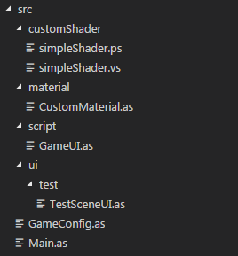
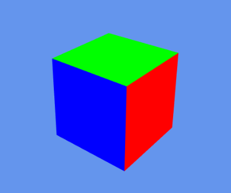

# 如何自定义Shader

###### *version :2.3.0   Update:2019-10-8*

在这里我们将简单的介绍下如何使用自定义shader。本次是在LayaAirIDE的3D示例项目基础上修改。

#### 1.编写顶点着色器与片元着色器程序。

放在项目代码同级的文件夹 `customMaterials`下

顶点着色器 `simpleShader.vs` 代码如下：

```c++
#include "Lighting.glsl";

attribute vec4 a_Position;

uniform mat4 u_MvpMatrix;
uniform mat4 u_WorldMat;


attribute vec3 a_Normal;
varying vec3 v_Normal;

void main()
{
	gl_Position = u_MvpMatrix * a_Position;
	mat3 worldMat=mat3(u_WorldMat);
	v_Normal=worldMat*a_Normal;
	gl_Position=remapGLPositionZ(gl_Position);
}
```

片元着色器 `simpleShader.ps` 代码如下:

```c++
#ifdef FSHIGHPRECISION
precision highp float;
#else
precision mediump float;
#endif

varying vec3 v_Normal;

void main()
{	
  gl_FragColor=vec4(v_Normal,1.0);
}
```

放置后得到的目录结构:

<br>(图1)

#### 2.代码中组成Shader

​		在这段代码中我们使用一个LayaCompiler编译器提供的一个宏编译函数 `__INCLUDESTR__`， 该函数包含一个文本文件到程序代码里。识别一个文本，并转换为字符串。

在代码中**"组装"** Shader，本段代码添加在 Main.as 。

```typescript
//初始化我们的自定义shader
public function initShader():void {
    
    //所有的attributeMap属性
    var attributeMap:Object = {'a_Position': VertexMesh.MESH_POSITION0, 'a_Normal': VertexMesh.MESH_NORMAL0};
    
    //所有的uniform属性
    var uniformMap:Object = {'u_MvpMatrix': Shader3D.PERIOD_SPRITE, 'u_WorldMat': Shader3D.PERIOD_SPRITE};
    
    //通过 __INCLUDESTR__ 方法引入顶点着色器程序和片元着色器程序。
    var vs:String = __INCLUDESTR__("customShader/simpleShader.vs");
    var ps:String = __INCLUDESTR__("customShader/simpleShader.ps");
    
    //注册CustomShader 
    var customShader:Shader3D = Shader3D.add("CustomShader");
    
    //创建一个SubShader
    var subShader:SubShader = new SubShader(attributeMap, uniformMap);
    
    //我们的自定义shader customShader中添加我们新创建的subShader
    customShader.addSubShader(subShader);
    
    //往新创建的subShader中添加shaderPass
    subShader.addShaderPass(vs, ps);
}
```

#### 3.实现自定义材质

我们自定义材质，并且设置该材质使用的Shader。

```typescript
package material {
	import laya.d3.core.material.BaseMaterial;
	
	public class CustomMaterial extends BaseMaterial {
		public function CustomMaterial() {
			super();
			//设置本材质使用的shader名字
			setShaderName("CustomShader");
		}
	}
}
```

#### 4.使用自定义材质

​	在使用自定义材质之前，一定要记得初始化自己的Shader。LayaAir中自带的材质会随着`Laya3D.init`初始化。这里我们需要调用我们写的 `initShader` 方法。这里我们直接在Main中初始化自己的Shader。

```typescript
........	
	Laya.alertGlobalError = true;

	//初始化自定义Shader
    initShader();

    //激活资源版本控制，版本文件由发布功能生成
    ResourceVersion.enable("version.json", Handler.create(this, this.onVersionLoaded), ResourceVersion.FILENAME_VERSION);
.......
```

在GameUI中使用我们的自定义材质。

```typescript
//添加自定义模型
var box:MeshSprite3D = scene.addChild(new MeshSprite3D(PrimitiveMesh.createBox(1, 1, 1))) as MeshSprite3D;

//为了更好的表现该自定义shader我们去掉模型旋转,同时给摄影机添加了移动脚本
camera.addComponent(CameraMoveScript);
//box.transform.rotate(new Vector3(0, 45, 0), false, false);
// var material:BlinnPhongMaterial = new BlinnPhongMaterial();
// Texture2D.load("res/layabox.png", Handler.create(null, function(tex:Texture2D):void {
// 	material.albedoTexture = tex;
// }));
// box.meshRenderer.material = material;

//创建一个自定义材质，并且添加给box
var _material : CustomMaterial = new CustomMaterial();
box.meshRenderer.material = _material;
```

运行起来后，我们调整视角得到的效果图：

<br>(图2)

在这个着色器中，我们将获取到的点的世界坐标转换为三维矩阵，再与法线相乘等到的 `v_Normal` 值作为该点的颜色值用于显示。得到的就是这个样子的模型了。