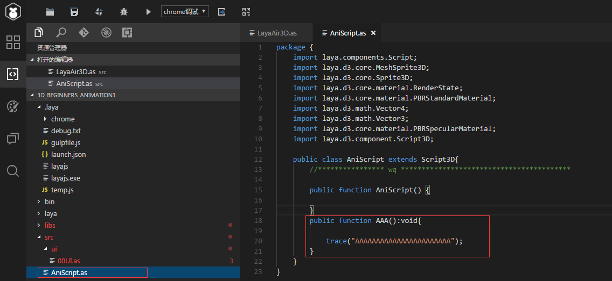

#                   Laya2.0模型动画的使用

laya2.0中对3D模型动画做了深度修改与优化，导致某些功能与1.0的使用方法不同或增加删除接口等！这里这篇文档主要针对最近开发者反馈较多的3D模型动画的播放问题暂停监听事件等问题的一个总结！

### 一、动画的暂停

在1.0中我们的3D系统针对于动画播放的主动暂停是根据skinAni.player.stop();这个stop方法直接暂停动画，这个在2.0中我们进行了修改对3D动画的播放速度参数进行了优化！开发者可以直接使用动画的播放速度控制动画的暂停与播放，所以我们取消了1.0中stop方法，

2.0的3D动画暂停改为 Animator.speed=0;如图1

```javascript
//添加蒙皮动画角色模型
Sprite3D.load("h5/LayaScene_monkey/ACG_man.lh",Handler.create(this,function(sp:Sprite3D):void{
//加载到场景
var hero:Sprite3D = scene.addChild(sp)as Sprite3D;
//让摄影机指向角色
camera.transform.lookAt(hero.transform.position,new Vector3(0,1,0))
//获取角色动画组件
var ani:Animator = hero.getChildAt(0).getComponent(Animator);
ani.speed = 0;//暂停动画播放	
}));
```

（图1）

### 二、动画的播放监听事件！

在3D角色动画的使用中我们经常会对一个角色的动画播放状态进行监听来达到我们想要的攻击或者行走效果！，在2.0中我们给出了两种新的监听方式来进行动画监听。

##### 1、当前动画播放的百分比

  

（图2）

##### 当动画为非循环播放时

如注释所写的相同当动画为**非循环**（非循环模式）播放的时候这个 normalizedTime会返回一个0.0~1的数1就是代表当前动画已经播放到百分之百也就是已经播放完成了，这个数就是可以理解为当前动画播放的百分比，0.1就是当前播放到百分之10了。

##### **当动画为循环播放时**

这个值会在每边播放完成后+1也就是说整数位为当前播放动画播放完成了多少次，而小数位为当前正在播放的动画的百分比。比如循环动画循环播放了3次了呐这个数就应该是3.0当第四次播放到一半时这个数就应该为3.5.

这样了解完返回值的意思我们就可以根据这个返回值进行动画的状态监听例：如图3

我进行监听的动画时一个循环动画，当动画每次播放到百分之60到百分之50之间时我就让角色生成一个box，

```javascript
	public class LayaAir3D {
		public var box :MeshSprite3D;
		public var scene:Scene3D;
		public var weaponIsClone:Boolean = false;
		public var heroAni:Animator;
		public function LayaAir3D() {

			//初始化引擎
			Laya3D.init(0, 0);
			
			//适配模式
			Laya.stage.scaleMode = Stage.SCALE_FULL;
			Laya.stage.screenMode = Stage.SCREEN_NONE;

			//开启统计信息
			Stat.show();
			
			//添加3D场景
			scene = Laya.stage.addChild(new Scene3D()) as Scene3D;
			
			//添加照相机
			var camera:Camera = (scene.addChild(new Camera( 0, 0.1, 100))) as Camera;
			camera.transform.translate(new Vector3(0, 3, 3));
			camera.transform.rotate(new Vector3( -30, 0, 0), true, false);
			camera.clearColor = null;

			//添加方向光
			var directionLight:DirectionLight = scene.addChild(new DirectionLight()) as DirectionLight;
			directionLight.color = new Vector3(0.6, 0.6, 0.6);
			directionLight.transform.worldMatrix.setForward(new Vector3(1, -1, 0));

			box = new MeshSprite3D(new BoxMesh(0.3,0.3,0.3));

			Sprite3D.load("h5/LayaScene_monkey/ACG_man.lh",Handler.create(this,function(sp:Sprite3D):void{
				var hero:Sprite3D = scene.addChild(sp)as Sprite3D;
				hero.getChildAt(0).addChild(box);
				heroAni = hero.getChildAt(0).getComponent(Animator)
				heroAni.linkSprite3DToAvatarNode("Dummy002",box);
				
				Laya.timer.frameLoop(1,this,onFrame)
			}));
		}
		private function onFrame():void{ 
		trace(heroAni.getCurrentAnimatorPlayState(0).normalizedTime);
		//当动画播放到百分之五十到六十之间时进行克隆
		if (0.6>(heroAni.getCurrentAnimatorPlayState(0).normalizedTime-Math.floor(heroAni.getCurrentAnimatorPlayState(0).normalizedTime))>0.5)
			{
				if(weaponIsClone)return;
				trace("sssssss")
				//克隆模型（位置，矩阵，等信息全被克隆）
				var weaponClone:Sprite3D = Sprite3D.instantiate(this.box);
				//为模型添加在定义脚本
				weaponClone.addComponent(WeaponScript);		
				//把克隆的武器放入场景中
				scene.addChild(weaponClone);
				weaponIsClone = true;
			}
			else if ((heroAni.getCurrentAnimatorPlayState(0)._normalizedTime-Math.floor(heroAni.getCurrentAnimatorPlayState(0)._normalizedTime))>0.98)
			{
				weaponIsClone = false;
			}
			
		}
	}
```

（图3）

### 三、unity中设置动画事件

在unity的Animator中我们我们可以添加动画触发事件  AAA   如图4

这个事件就是说在动画播放到这个位置的时候，就会触发我们AAA这个名字的方法。

在unity中设置好事件然后Apply，最后导出动画模型。

 

（图4）

在laya中我们就可以创建一个脚本来接收这个事件方法，

首先我们在laya中创建一个脚本，脚本名不影响事件的触发所以是随意起名，在脚本中创建一个方法名字为”AAA“这个方法名要与unity中设置的事件名相同，如图5

 

（图5）

然后我们只需要把这个脚本添加到动画节点上就可以了（*一定是动画节点就是你在unity中挂这个animator组件的那个物体节点上*）如图6

 

（图6）