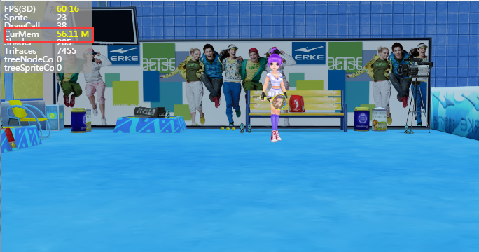

## LayaAir3D之资源释放


### 为什么要资源释放

在LayaAir 3D游戏开发中，资源释放非常重要。3D资源包括了模型、贴图、材质、动画等，为了达到好的画面效果，文件会比2D大很多，而3D引擎基本所有资源都会放入GPU中进行计算渲染，因此占用很多的显存。当游戏关卡的不断加载，游戏不断深入，放入显存中的资源越来越多，如果不释放资源，那么游戏最后终将崩溃。

显存不像内存，内存有垃圾回收机制，而显存不一样，必须手动释放，因此显存的资源释放必须受到重视！

观察图1、图2中统计工具中的显存大小

图1为游戏启动后加载的第一个场景，面数为30527，占用显存85.2M。

<br>（图1）

图2为游戏加载的第二场景，面数只有7455，但加载后显存资源却有118.91M。这是什么原因呢？面数少，场景小，贴图其实也比图1中场景少很多，光照贴图也小很多，但显存资源却更大了！

这就是因为第一关场景并未被释放掉，它的资源还在显存中，因此显存占用变大了。如果不手动清除，游戏继续切换其他场景，当达到一定量后，手机显存将被耗光，游戏卡死、闪退、发热等现象就有频出。

<br>（图2）


### 加载资源时处理原则

通过上图的例子我们可以看到LayaAir3D引擎处理资源与显存的关系，为了达到游戏性能优化目的，在加载资源时也要注意一些原则。

1、加载资源时不要一次性把所有资源全部加载，只加载需要资源（分段加载模式）。3D资源加载完成后会根据资源后缀名称直接创建出3D显示对象，比如.ls会创建出Scene，.lh会创建Sprite3D对象等，创建好的对象资源哪怕是没有放到舞台上，也会直接放入显存当中，因此资源过多会占有大量显存。

2、合理管理显存，经常反复使用的资源在显存中不需要释放，而不反复使用的资源在使用完后立即释放以节省性能开销。比如主角资源，3D道具资源，玩家经常使用，可以一直存放在显存中，提取速度快；而一些大型场景，在切换时可以释放掉资源，场景关卡贴图、模型资源都较大，释放后能省几十上百兆大小的显存开销。


### 释放显存资源方法

释放显存资源有两种方法，一种是通过对象来释放显存资源，但遍历资源对象太麻烦，在此不作推荐，另一种是通过资源地址来释放显存资源，从资源管理角度上来说，通过资源地址方法更加灵活，可以配置JSON数据表来管理。

#### 切换场景和释放资源的过渡界面

在加载资源和切换场景时，我们在IDE中制作一个进度显示界面用于过渡，如图3

<br>（图3）

IDE发布后，编写一个控制类，逻辑代码参考如下：

```java
package view {
  import ui.ProgressBarUI;

  public class loading extends ProgressBarUI {

    public function loading() {

    }
    public function setValue(num:Number):void{
      this.pro.value = num;
    }
    public function init():void{
      this.pro.value = 0;
      //进度增加帧循环
      Laya.timer.loop(20,this,loop);
    }		
    //资源加载进度模拟*（假进度）
    private function loop():void{
      //进度增加
      this.pro.value +=0.01;
      //最高进度度100%
      if(this.pro.value>=1)
      {
        this.pro.value = 100;
        Laya.timer.clearAll(this);
        this.removeSelf();
      }
    }
  }
}
```


#### 通过资源地址表释放显存资源

在主类中，我们以鼠标双击舞台方式切换场景，使用资源地址释放显存资源的方法，并加载新场景。

通过资源路径列表方法灵活，可以通过配置表的方式，表里增加删除资源也很方便。比如美术在导出场景时，新建一个JSON表，将此场景中切换后不需要的资源路径都放到J表中，有用的资源不入表，资源就不释放，比如一些公用的NPC、道具、特效等游戏元素资源。

Tips：资源包括：场景光照贴图lightmap、材质.lmat、模型.lm、各种类型贴图.png或.jpg、动画.lani、骨骼.lav等资源。

下面我们来介绍一下资源表方法，首先在导出的资源文件目录中建立json文件并编辑需释放的路径资源，形成一个Json数组，名字与.ls文件一致，方使逻辑调用，本例中为 loveScene.json。如图5、6。

<br>（图5）

<br>（图6）

Json编辑完成后，可用检查工具检测格式是否正确。然后创建主类代码如下：

```java
package {
  import laya.d3.core.Camera;
  import laya.d3.core.MeshSprite3D;
  import laya.d3.core.Sprite3D;
  import laya.d3.core.light.DirectionLight;
  import laya.d3.math.Vector3;
  import laya.d3.math.Vector4;
  import laya.d3.resource.models.BoxMesh;
  import laya.display.Stage;
  import laya.utils.Stat;
  import laya.d3.core.scene.Scene3D;
  import laya.d3.core.material.BlinnPhongMaterial;
  import laya.webgl.resource.Texture2D;
  import laya.utils.Handler;
  import view.loading;
  import laya.events.Event;
  import laya.resource.Resource;
  public class LayaAir3D {
    public var load:loading;
    private var scene:Scene3D;
    public function LayaAir3D() {

      //初始化引擎
      Laya3D.init(0, 0);

      //适配模式
      Laya.stage.scaleMode = Stage.SCALE_FULL;
      Laya.stage.screenMode = Stage.SCREEN_NONE;

      //开启统计信息
      Stat.show();
      //加载2D资源文件
      Laya.loader.load("h5/res/atlas/comp.atlas",Handler.create(this,Complete2D));
    }
    public function Complete2D():void{
      //实例化加载进度界面
      load = new loading();
      Laya.stage.addChild(load);
      load.init();
      //加载场景3D资源(不能全部加载，否则太占显存)
      Laya.loader.create(["h5/LayaScene_test/test.ls","h5/LayaScene_twonScene/twonScene.ls"],Handler.create(this,Complete3D))

    }	
    //加载3D资源完成的回调
    public function	Complete3D():void{
      //添加场景
      scene = Laya.stage.addChild(Laya.loader.getRes("h5/LayaScene_test/test.ls"))as Scene3D;
      Laya.stage.setChildIndex(scene,0);
      //点击游戏画面切换场景
      Laya.stage.on(Event.MOUSE_DOWN,this,ChangeScene);
    }
    //加载第二关场景资源，切换场景
    private function ChangeScene():void{
      //去除场景的点击切换事件
      Laya.stage.off(Event.MOUSE_DOWN,this,ChangeScene);
      //移出之前的场景
      scene.removeSelf();
      load.init();
      Laya.stage.addChild(load);
      scene.destroy();

      //加载第二关场景资源到游戏中
      scene = Laya.loader.getRes("h5/LayaScene_twonScene/twonScene.ls");
      Laya.stage.addChild(scene);
      //设置游戏场景层级
      Laya.stage.setChildIndex(scene,0);

      //列表释放显存资源的方法（利用资源表方式，每个场景配置资源路径表）
      assetsDispose();
    }
    private function assetsDispose():void{
      //加载释放的资源配置表
      Laya.loader.load("loveScene.json",Handler.create(this,this.onAssetOK));
    }
    //加载资源释放表完成后
    private function onAssetOK():void{
      
      
      //获取加载的数据（Json数据转换成数组）
      var arr:Array = Laya.loader.getRes("loveScene.json");
      for(var i:Number = arr.length-1;i>-1;i--)
      {
        //根据资源路径获取资源
        var resource:Resource = Laya.loader.getRes(arr[i].url)as Resource;
        //非空
        if(resource)
        {
          //销毁资源（非强制销毁）
          resource.releaseResource(false);
        }
        else
        {
          console.log(arr[i].url);
        }
      }
    }
  }
}
```

观察上述代码assetsDispose(assetsUrl:String)方法，加载完配置表后，我们通过Laya.loader.getRes(arr[i].url)方法直接获取资源产生的对象（创建时会根据url后缀名产生不同的类型对象，getRes方法可直接读出来），它们都是Resource类的子类，因此对象调用 releaseResource(false);方法后就可释放资源。

释放完资源后，还可通过Loader.loadeMap属性查看现有缓存中的资源。

编译运行上述代码我们可以看到图4效果，释放完成并加载新场景时，显存占用比之前小很多了。之前未释放资源时为118.91M，释放后显存只占了56.11M。

<br>（图4）

LayaAir2.0为了 方便开发者开发对3D资源释放添加了更方便的释放方式

在加载3D资源时给资源指定相应的分组，然后依靠 Resource.destroyUnusedResources("组名字");

进行资源的整体释放

```
//加载资源时指定资源的相应分组
Laya.loader.load("h5/LayaScene_test/test.ls",Handler.create(this,this.onAssetOK),null,null,1,true,"Scene1");
//销毁当前没有被使用的资源,该函数会忽略lock=true的资源。(指定分组)
Resource.destroyUnusedResources("scene1");
```

