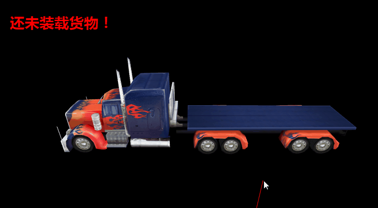

## LayaAir3D之鼠标交互

### 鼠标交互概述

在LayaAir2D引擎中，2D显示对象都有鼠标事件供我们使用，编写逻辑简单方便。在LayaAir 3D引擎中并未实现这种功能，3D空间更为复杂，显示对象在空间中有纵深远近、层叠、裁剪、父子等关系，并且空间还在不断变换。因此3D引擎采用了碰撞器、层与物理射线检测、碰撞信息的方式进行鼠标判断，下面先让我们来先了解它们的概念与作用。


#### 碰撞器Collider

碰撞器是一种物理组件，可以添加到3D显示对象上，主要用于3D空间中的物体进行碰撞检测，根据3D显示对象的形状不同，也分为了不同的类型。

LayaAir3D引擎现支持的碰撞器有三种类型，分别是**球型碰撞器SphereCollider**，**盒型碰撞器BoxCollider**，**网格碰撞器MeshCollider**。从**碰撞检测精确度**和**消耗性能**从低到高依次为SphereCollider—BoxCollider—MeshCollider；可以根据游戏中开发需求，选择适合的碰撞器。

3D显示对象代码添加碰撞器组件的方法如下（引擎1.7.12版），建议开发者不要用代码添加方试，较麻烦，可直接在Unity中添加碰撞组件导出使用。

Tips：碰撞器必须添加到MeshSprite3D类型的显示对象上，不能添加到Sprite3D对象上，否则会失效。

```java
/**
* 给3D精灵添加碰撞器组件
* BoxCollider    : 盒型碰撞器
* SphereCollider : 球型碰撞器
* MeshCollider   : 网格碰撞器
*/

//添加自定义模型(box)
var box:MeshSprite3D = scene.addChild(new MeshSprite3D(new BoxMesh(1,1,1))) as MeshSprite3D;
box.transform.rotate(new Vector3(0,45,0),false,false);
box.transform.translate(new Vector3(3,0,0));
//创建一个球体
sphere = scene.addChild(new MeshSprite3D(new SphereMesh(0.5)))as MeshSprite3D;
//创建一个面片
var plane:MeshSprite3D = scene.addChild(new MeshSprite3D(new PlaneMesh(20,20)))as MeshSprite3D;
plane.transform.translate(new Vector3(0,-2,0));

//给模型添加碰撞器前需要先给模型添加碰撞组件
var boxCollider:PhysicsCollider =  box.addComponent(PhysicsCollider)as PhysicsCollider;
var boxShape:BoxColliderShape = new BoxColliderShape(1,1,1);

//给球添加碰撞组件
var sphereCollider:PhysicsCollider = sphere.addComponent(PhysicsCollider)as PhysicsCollider;
var sphereShape:SphereColliderShape = new SphereColliderShape(0.5);
sphereCollider.colliderShape = sphereShape;

//给面片添加碰撞器
var planeCollider:PhysicsCollider = plane.addComponent(PhysicsCollider)as PhysicsCollider;
var planeShape:BoxColliderShape = new BoxColliderShape(20,0,20);
planeCollider.colliderShape = planeShape;		
```

在引擎1.7.12与导出插件1.7.0版开始，在Unity中添加到3D模型上的Collider可以导出并且引擎自动加载创建。不过目前暂时不支持MeshCollider的导出，将在后续版本中完善该功能。 

在Unity中为模型添加了BoxCollider与SphereCollider后，还可以根据需求对碰撞盒或碰撞球的大小进行设置，碰撞盒可以比实际模型偏小或者偏大，位置也可更改，方便开发者们逻辑处理。

Tips：在Unity编辑器中，一个3D物体可支持多个碰撞器，但LayaAir导出插件（1.7.0版）目前只支持第一个碰撞器的导出，它请开发者们注意。如果希望在模型上添加多可碰撞器，可在制作模型时分解成多个子网格模型，在子网格模型上各自添加碰撞器用于检测。在后续的1.7.13版本中，我们将支持无子网格的3D物体多个碰撞器导出。


#### 层Layer

默认场景中有32层，你可以选择把3D精灵扔在任意层内。用在摄像机上，摄像机可以根据层级进行裁剪；**用在碰撞检测上，可以控制碰撞什么层，不碰撞什么层**。

指定3D精灵层的方法如下：

```java
		//指定3D精灵的层
		plane.layer = 10;
		
```


#### 射线Ray

射线是一个数据类型，并不是显示对象，它有原点origin、方向direction的属性。

在游戏中，因为视图空间经常变化，为了模拟鼠标的在3D空间中的位置，LayaAir3D引擎提供了摄像机Camera创建射线的方法，它产生了一条与屏幕垂直的一条射线。

摄像机创建射线方法如下：

```java
//射线初始化（必须初始化）
ray = new Ray(new Vector3(0, 0, 0), new Vector3(0, 0, 0));

//获取鼠标在屏幕空间位置
var point:Vector2 = new Vector2();
point.elements[0] = Laya.stage.mouseX;
point.elements[1] = Laya.stage.mouseY;

camera.viewportPointToRay(point,ray);
		
```


#### 物理射线检测

当我们为场景中3D显示对象创建了碰撞器，为它们设置了层（默认在第0层），并创建了射线后，就可以用物理射线碰撞来进行是否相交检测了，开发者可以根据需求进行自己的逻辑判断，比如鼠标拾取、选择、创建等。

物理射线检测我们使用了Physics物理类，它提供了我们两个方法，检测获取发生碰撞的第一个碰撞器信息方法rayCast()，和检测获取发生碰撞的所有碰撞器信息rayCastAll()方法，它们都是静态方法，开发者可以根据需求选择使用，API如（图1）

 <br>（图1）


#### 碰撞信息HitResult

射线检测的碰撞信息在检测前必须初始化，如果射线与3D显示对象相交了，可以从碰撞信息HitResult属性中获得相交对象、相交的空间位置、相交的三角面顶点等各种信息。

HitResult.collider.owner即是相交的Node对象。

point为射线与模型相交的点的空间位置。

succeeded 是否与物体相交，相交即为true。

normal 是碰撞的物体法线（Vector3）。


### 鼠标拾取示例（射线 / 覆写脚本）

#### 射线：

根据以上的概念和方法，我们来制作一个鼠标射线拾取的示例，按以下步骤进行：

1、在unity场景中创建几个3D物品，以三辆汽车为例，通过导出导出插件使用。

2、建立场景Scene的实例。

3、获取模型的Mesh,利用Mesh给模型添加碰撞器。

4、初始化一条射线。

5、加入鼠标点击事件，如果点击了鼠标且又与3D物品相交，那么我们就让3D物品消失并提示获取信息。

主类代码如下：

```java
Scene3D.load("h5/LayaScene_monkey/monkey.ls",Handler.create(this,function(s:Scene3D):void{
  scene = Laya.stage.addChild(s)as Scene3D;

  //添加照相机
  camera = (scene.addChild(new Camera( 0, 0.1, 100))) as Camera;
  camera.transform.translate(new Vector3(0, 3, 3));
  camera.transform.rotate(new Vector3( -30, 0, 0), true, false);
  camera.clearColor = null;

  //添加方向光
  var directionLight:DirectionLight = scene.addChild(new DirectionLight()) as DirectionLight;
  directionLight.color = new Vector3(0.6, 0.6, 0.6);
  directionLight.transform.worldMatrix.setForward(new Vector3(1, -1, 0));
//对场景的所有物体进行循环
  for(var i:int = (scene.numChildren-1);i>-1;i--)
  {
    //如果模型为meshsprite3D
    if(scene.getChildAt(i)is MeshSprite3D)
    {
      trace(scene.getChildAt(i).name);
      //获取模型的MeshSprite3D
      var meshSprite3D:MeshSprite3D = scene.getChildAt(i)as MeshSprite3D;
      //给模型添加碰撞组件
      var meshCollider:PhysicsCollider = meshSprite3D.addComponent(PhysicsCollider);
      //创建网格碰撞器
      var meshShape:MeshColliderShape = new MeshColliderShape();
      //获取模型的mesh
      meshShape.mesh = meshSprite3D.meshFilter.sharedMesh as Mesh
        //设置模型的碰撞形状
        meshCollider.colliderShape = meshShape;
    }
  }
}))
  //射线初始化（必须初始化）
  	ray = new Ray(new Vector3(0, 0, 0), new Vector3(0, 0, 0));
	addMouseEvent();
}	
public function addMouseEvent():void{
  //鼠标事件监听
  Laya.stage.on(Event.MOUSE_DOWN,this,onMouseDown);
}
public var _outHitResult:HitResult = new HitResult();
public function onMouseDown():void{
//产生射线
  camera.viewportPointToRay(point,ray);
  //拿到射线碰撞的物体
  scene.physicsSimulation.rayCast(ray,_outHitResult);
//如果碰撞到物体
  if (_outHitResult.succeeded)
  {
    //删除碰撞到的物体
    _outHitResult.collider.owner.removeSelf();
    trace("碰撞到物体！！")
  }
```

脚本类SceneScript代码如下：

**直接覆写Script3D的onMouseDown鼠标监听事件，当鼠标点击到模型时会被触发。**

```java
package common{
  import laya.components.Script;
  import laya.d3.core.MeshSprite3D;
  import laya.d3.core.Sprite3D;
  import laya.d3.core.material.RenderState;
  import laya.d3.core.material.PBRStandardMaterial;
  import laya.d3.math.Vector4;
  import laya.d3.math.Vector3;
  import laya.d3.core.material.PBRSpecularMaterial;
  import laya.events.Event;
  import laya.d3.component.Script3D;
  import laya.d3.loaders.MeshReader;
  import laya.d3.core.material.BlinnPhongMaterial;
  import laya.d3.physics.Collision;

  public class SceneScript extends Script3D{
    //**************** wq *****************************************
    public var box :MeshSprite3D ;
    public function SceneScript() {
    }
    /**
		 * 复写3D对象组件被激活后执行，此时所有节点和组件均已创建完毕，次方法只执行一次
		 */
    override public function onAwake():void{
      box = this.owner as MeshSprite3D;
    }
    /**
		 * 覆写组件更新方法（相当于帧循环）
		 */	
    override public function onUpdate():void{

    }
    //物体必须拥有碰撞组件（Collider）
    //当被鼠标点击
    override public function onMouseDown(e:Event):void{
      trace("点击到了我box");
      //从父容器销毁我自己
      box.removeSelf();
    }
    //当产生碰撞
    override public function onCollisionEnter(collision:Collision):void {
      (box.meshRenderer.sharedMaterial as BlinnPhongMaterial).albedoColor = new Vector4(0.0,0.0,0.0,1.0);
      // box.removeSelf();

    }

  }
}
```

编译上示代码，可以得到以下效果（图2），鼠标点击获得汽车，并从场景中移除汽车模型。

 <br>（图2）


### 鼠标创建放置物体

在游戏中我们还经常使用鼠标控制放置游戏物品，比如养成类游戏在地面放置建筑、角色、道具等。

鼠标放置物体与拾取物体大致方法差不多，同样需要使用碰撞器、射线、射线检测、碰撞信息等3D元素与方法。 

而创建物品时，点击模型射线与之相交后，我们可以通过碰撞信息rayCastHit.position获得点击的位置，然后将创建的物品放置此处。并且，创建物品时我们使用了克隆的方式，开发者们注意其方法。

在拾取示例中我们使用了盒型碰撞器BoxCollider，在创建示例中我们使用网格碰撞器MeshCollider，它更精确，可以获取模型上的相交三角面顶点，方法为rayCastHit.trianglePositions，根据顶点位置我们可以把它画出来用于观察！

主类代码修改如下：

创建货车模型，并为货车车身添加网格碰撞器组件。

```java
package
{
  import laya.d3.component.physics.MeshCollider;
  import laya.d3.core.Camera;
  import laya.d3.core.MeshSprite3D;
  import laya.d3.core.Sprite3D;
  import laya.d3.core.scene.Scene;
  import laya.display.Stage;
  import laya.display.Text;
  import laya.events.Event;
  import laya.utils.Handler;

  public class LayaAir3D_MouseInteraction
  {
    /**自定义场景**/		
    private var gameScene:GameScene;
    /**提示信息文本框**/
    public static var txt:Text;

    public function LayaAir3D_MouseInteraction()
    {
      //初始化引擎
      Laya3D.init(1000, 500,true);

      //适配模式
      Laya.stage.scaleMode = Stage.SCALE_FULL;
      Laya.stage.screenMode = Stage.SCREEN_NONE;

      //加载3D资源
      Laya.loader.create([{url:"LayaScene_truck/truck.lh"},
                          {url:"LayaScene_box/box.lh"}],Handler.create(this,onComplete));

      //创建信息提示框
      txt=new Text();
      txt.text="还未装载货物！";
      txt.color="#ff0000";
      txt.bold=true;
      txt.fontSize=30;
      txt.pos(100,50);
      Laya.stage.addChild(txt);			
    }

    private function onComplete():void
    {
      //创建3D场景
      var scene:Scene3D=new Scene3D();
      //初始化场景（摄像机、碰撞相关对象、添加碰撞器等）
      Laya.stage.addChild(scene);
      //为场景添加控制脚本
      scene.addScript(SceneScript);
      //创建货车模型，加载到场景中
      Sprite3D.load("h5/LayaScene_willhero/chengqiang35.lh",Handler.create(this,function(sp:Sprite3D):void{
        var cheng:MeshSprite3D = scene.addChild(sp.getChildAt(0))as MeshSprite3D;
        var chengCollider:PhysicsCollider = cheng.addComponent(PhysicsCollider);
        //添加网格型碰撞器组件
        var chengshape:MeshColliderShape = new MeshColliderShape();
        //为Mesh碰撞器mesh网格（否则没有尺寸，无法被射线检测）
        chengshape.mesh = cheng.meshFilter.sharedMesh as Mesh; 
      }))
    }
  }
}
```

场景脚本控制类代码修改如下：

```java
package common{
  import laya.d3.core.MeshSprite3D;
  import laya.d3.core.Sprite3D;
  import laya.d3.core.material.RenderState;
  import laya.d3.core.material.PBRStandardMaterial;
  import laya.d3.math.Vector4;
  import laya.d3.math.Vector3;
  import laya.d3.core.material.PBRSpecularMaterial;
  import laya.events.Event;
  import laya.d3.component.Script3D;
  import laya.d3.loaders.MeshReader;
  import laya.d3.core.material.BlinnPhongMaterial;
  import laya.d3.physics.Collision;
  import laya.d3.core.scene.Scene3D;
  import laya.d3.core.Camera;
  import laya.d3.math.Ray;
  import laya.d3.physics.HitResult;
  import laya.d3.resource.models.BoxMesh;
  import laya.physics.Physics;
  import laya.d3.math.Vector2;
  import laya.events.MouseManager;
  import laya.d3.physics.PhysicsCollider;
  import laya.d3.physics.shape.BoxColliderShape;

  public class SceneScript extends Script3D{
    //**************** wq *****************************************
    public var scene:Scene3D;
    public var camera:Camera;
    public var ray:Ray;
    public var rayCastHit:HitResult = new HitResult();
    public var box :MeshSprite3D;

    public var point:Vector2 = new Vector2();

    public function SceneScript() {
    }
    override public function onAwake():void
    {
      scene = owner as Scene3D
    }
    override public function onStart():void
    {
      //添加照相机
      camera = (scene.addChild(new Camera( 0, 0.1, 100))) as Camera;
      camera.transform.translate(new Vector3(0, 3, 3));
      camera.transform.rotate(new Vector3( -30, 0, 0), true, false);
      camera.clearColor = null;

      ray = new Ray(new Vector3(0,0,0),new Vector3(0,0,0));

      //创建一个货物模型
      box = scene.addChild(new MeshSprite3D(new BoxMesh(0.5,0.5,0.5)))as MeshSprite3D;
      Laya.stage.on(Event.MOUSE_DOWN,this,onMouseDown);
    }
    override public function onUpdate():void{

    }
    private function onMouseDown():void{
      point.x = MouseManager.instance.mouseX;
      point.y = MouseManager.instance.mouseY;

      camera.viewportPointToRay(point,ray);
      scene.physicsSimulation.rayCast(ray,rayCastHit);

      if (rayCastHit.succeeded)
      {
        //克隆一个货物模型
        var cloneBox:MeshSprite3D = Sprite3D.instantiate(box) as MeshSprite3D;
        //给物体添加碰撞组件
        var meshCollider:PhysicsCollider = cloneBox.addComponent(PhysicsCollider);
        var cloneMesh:BoxColliderShape = new BoxColliderShape(0.5,0.5,0.5);
        meshCollider.colliderShape = cloneMesh;

        scene.addChild(cloneBox);
        cloneBox.transform.position = rayCastHit.point;
      }
    }
  }
}
```


编译运行上示代码，我们可以看见可以通过鼠标点击创建物体了（图3），并且射线与模型相交时显示了模型相交处的三角面。

<br>（图3）