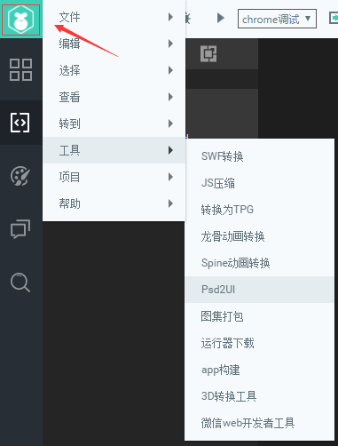
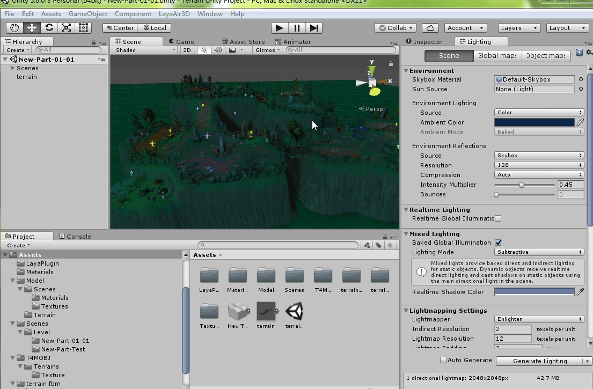
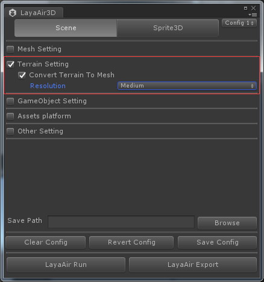

## Unity插件使用

> ### 重要提示：

### LayaAir 2.0版本的引擎，适配的是Unity 5.6.x以上版本。所以请开发者对应下载Unity 5.6.x以上的版本。对于其它版本，可能会有部分不兼容的情况。


## 1、下载LayaAir3D导出工具

下载地址:

http://ldc.layabox.com/download/tools/LayaAir3DConvertTools.zip

或者在LayaAirIDE 的**工具**菜单下，点击 **3D转换工具** 即可跳转到下载链接 如图1所示。

<br>（图1）

*Tips: 导出插件会不定期更新，如果5.6.x的版本上，发现引擎与插件存在不适配的情况，也可以点击链接，重新下载，查看是否插件已升级更新。*


## 2、安装导出插件

启动unity，新建个项目，并导入游戏需要的资源与材质、贴图等，项目名称可以按照自己的需要来命名。ctrl+s保存我们的场景，我们这里保存名字叫truck。

在资源管理界面右键导入LayaAir3D转换工具。插件版本会随着LayaAir引擎功能的增加而更新，但导入的方法是完全一致的。

导入工具成功后，在资源管理界面中会出现一个名为LayaPlugin文件夹，同时在unity菜单栏中也会出现导出插件菜单LayaPlugin。如图2：

<br>（图2）

​

### 导出资源设置

点击菜单栏LayaPlugin，会出现导出设置面板，在这我们将详细为大家讲解。

**Tips：**

点击菜单LayaAir3D后，下拉菜单中出现了更多的子项，LayaAir Export是指导出资设置面板，可以把它拖拉到unity3D的界面的适合位置上，下次打开这个项目时，它会保持在设定的位置。

**LayaAir Demo、Study、Ansewers等可以点击打开LayaAir官网，分别代表着示例、学习文档、论坛，方便开发者们解惑。**

<br>（图3）


#### 导出资源类别

**Scene类别**是指的整个场景，无论场景中的模型、材质、贴图、动画、还是光照贴图全部导出，主要用于场景制作，文件扩展名是.ls，需要用Scene类或它的继承类加载。

**Sprite3D类别**比场景少了光照贴图的导出，经常用于角色或游戏中活动物品的单独资源导出，文件扩展名的是.lh，要用Spite3D加载。

它们的加载我们将在“3D技术文档—LayaAir3D之模型篇"介绍。

#### Mesh Setting

网格数据的导出设置，勾选后出现两条信息（图4），它们的可起到压缩模型网格lm文件大小的作用，建议如项目中不用切线（不用法线贴图）与顶点色，请都勾选，可节省20%左右的模型资源大小。

Ignore Vertices Tangent       忽略顶点切线信息
Ignore Vertices Color            忽略顶点颜色信息

<br>（图4）


#### Texture Setting

贴图导出设置，勾选后出下如（图5）信息，在layaAir引擎中只支持png与jpg格式的图片，如果项目中使用了其它格式，游戏加载时会报错，因此需要转换。

Original Texture Type　需要转换格式的原始纹理格式种类
Non-PNG|JPG　　非png|jpg 现在支持 tga、psd、gif、tif、bmp、exr格式
PNG、JPG　　　　原始场景中所用png格式资源及所用jpg格式资源
LightMap　　　　光照贴图，（只有选择Scene类别导出才会有），建议手动ps处理

Target Texture Type　 转换目标纹理类型
PNG 　　　　　　 转换成png格式，带透明通道
JPG　　　　　　　转换为jpg附带压缩功能，可选择压缩质量

<br>（图5）


#### Animation Setting

动画导出设置（图6）

Optimize Bones   删除动画中无用骨骼，只删除不影响骨骼动画播放的无用骨骼，如果需要做骨骼挂点，请谨慎选择
Compress Lsani   暂时无用，开发中，压缩骨骼动画数据，减小文件大小

<br>（图6）


#### Terrain Setting

unity地型导出设置（图7）

Convert Terrain To Mesh  
如果场景中有地型，转换地型成网格模型。
untiy的地型制作非常方便，可以用笔刷绘制地型高度，如山川、河沟等，还支持笔刷绘制多张细节贴图，用于几种贴图的地表制作。LayaAir导出插件会把地型转化成Mesh，方便开发者使用。有区别的是材质和普通材质不同，包含了细节贴图。

Resolution
导出的模型网格面数优化设置，一般默认Medium中等即可。以下为设置的优化等级，每小一级相当于除以4的面数精度。
Very Height  优化后的面数最高
Height           优化后的面数相对高
Medium	       优化后的面数中等
Low		       优化后的面数低
Very Low       优化后的面数最低     

<br>（图7）


#### GameObject Setting 

游戏物品节点设置（图8）

Ignore Null Game Objects 
导出时忽略空节点，LayaAir引擎不支持的节点也记作空节点，如灯光节点，可减少精灵数。
注：1.5.0版已支持摄像机导出，因此忽略空节点不会影响摄像机导出。

Ignore Not Active Game Objects 
导出时忽略在unity场景中未激活的节点。

Optimize Game Objects 
导出时从unity场景中第一级节点开始拍平树形结构，删除所有无用节点，可最大程度减少精灵数。

Batch Make The First Level Game Objects 
批量导出（必须选择sprite3d才会有）批量导出场景中所有一级节点。

 <br>（图8）


#### Other Setting

其他设置（图9）

Cover Original Export Files 
导出时覆盖原始导出文件

Customize Export Root Directory Name 
自定义导出文件夹名字，默认的文件夹名字为“layaScene+场景名”。

Automatically Save The Configuration 
导出时自动保存当前配置

 <br>（图9）


#### 导出设置

Borower             保存的文件路径
Clear Config      清空当前配置
Revert  Config   从配置表中读取已保存配置
Save  Config      保存当前配置，保存后，下次打开后会直接使用之前配置，方便开发者们操作。
LayaAir Run       点击可使用LayaAir引擎直接运行该场景。
​        		     LayaAirRun使用须知：                
​	                    1.必须安装Node环境，express拓展模块（工具内置了express，如果无法正常使用，请自行安装）；
​          	            2.场景中确保有一个照相机,自行调整其位置，角度，最终layaAir运行效果会与Unity运行结果保持一致。
LayaAir Export  导出当前资源，点击后，将导出当前场景或模型的数据到指定路径上。

 <br>（图10）


### 导出的资源简单介绍

我们在unity中创建一个汽车模型，然后我们用LayaAir的插件导出。当配置好输出场景设置后，点击Laya Export 按钮，导出后生成了默认的LayaScene_truck文件夹（图11）。

 <br>（图11）

见上图文件资源，导出后生成了.ls、.lm、.lmat数据资源，及贴图png、tga资源。

.ls为场景文件，选择导出Scene类别时生成，包含了场景需要的各种数据，模型、光照贴图、位置等，需用Scene类加载。

.lh为模型文件，选择导出Sprite3D类别时生成，缺少光照贴图文件信息，其他与.ls相同。

.lm为模型数据文件，相当于FBX格式的转换，可用MeshSprite3D类加载。

.lmat为材质数据文件，是在unity中为模型设置的材质信息，加载.ls或.lh文件时会自动加载.lmat产生材质。.lmat还可手动修改其中某些属性。

.lani为动画数据文件（图10中模型未有动画，因此导出时未生成），如果模型上有动画，导出后将生成动画配置文件，包含了骨骼或帧动画信息。

它们的具体用法，将在后续课程文档中详细介绍。


### 简单加载实例

我们把LayaScene_truck文件夹内容全部复制到项目的根目录的bin/h5/下。

Tips：本章节中只介绍简单加载应用，导出后会生成各种格式，它们的详细说明我们将在3D技术文档中“LayaAir3D之场景Scene”和“LayaAir3D之模型”篇介绍。

加载场景.ls示例代码如下。

```java
package {
	import laya.d3.core.Camera;
	import laya.d3.core.MeshSprite3D;
	import laya.d3.core.Sprite3D;
	import laya.d3.core.light.DirectionLight;
	import laya.d3.math.Vector3;
	import laya.d3.math.Vector4;
	import laya.d3.resource.models.BoxMesh;
	import laya.display.Stage;
	import laya.utils.Stat;
	import laya.d3.core.scene.Scene3D;
	import laya.d3.core.material.BlinnPhongMaterial;
	import laya.webgl.resource.Texture2D;
	import laya.utils.Handler;
	public class LayaAir3D {
		
		public function LayaAir3D() {

			//初始化引擎
			Laya3D.init(0, 0);
			
			//适配模式
			Laya.stage.scaleMode = Stage.SCALE_FULL;
			Laya.stage.screenMode = Stage.SCREEN_NONE;

			//开启统计信息
			Stat.show();
			
			//添加3D场景     Scene3D.load("LayaScene_truck/truck.ls",Handler.create(this,function(sprite:Sprite3D):void{
				var scene:Scene3D = Laya.stage.addChild(sprite)as Scene3D;
				//创建摄影机（纵横比，近距离裁剪，远距离裁剪）*Unity中导出的Scene如果有Camera就不用再次创建Camera*
				var camera:Camera = scene.addChild(new Camera(0, 0.1, 100)) as Camera;
				//移动摄影机位置
				camera.transform.translate(new Vector3(0, 1, 0));
			}));
		
		}		
	}
}
```

编译运行上述简单代码，我们发现场景加载成功，场景中的模型也显示到了3D视图上（图12）。

 <br>（图12）

