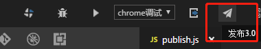
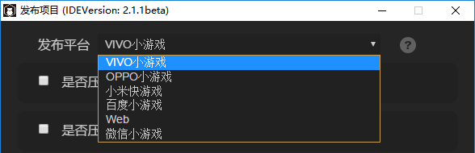
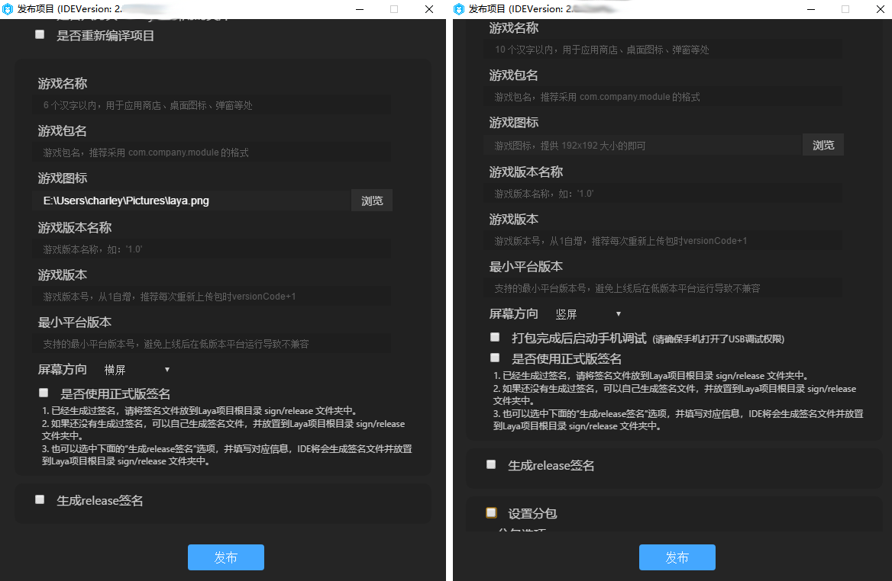

# 项目发布详解（新版）

> *author: charley      version: LayaAir IDE 2.1.1       update：2019-06-25*

[TOC]

LayaAir IDE在项目发布的功能上一直在不断的优化，中间历经多个大小版本的升级迭代。在新的版本里，不仅加强了发布流程的自定义，让发布筛选更加灵活，也为一键发布成为小游戏项目提升了更为便利的用户体验。

 

（图1-1）   

下面为大家针对各项功能逐一的详细介绍：

### 一、发布平台选项

到本文撰写时的IDE 2.1.1版本，发布平台中有目前有六种选择选项，分别为：VIVO小游戏、OPPO小游戏、小米快游戏、百度小游戏、Web、微信小游戏。如图1-2所示。

 

（图1-2）

选择不同的平台类型，会在发布的时候适配不同的平台。

`Web` 是指发布为HTML5版本，运行于浏览器环境、webView、LayaNative的APP环境中。

`微信小游戏` 是指发布为已适配微信小游戏的项目，发布后的项目可以运行于微信开发者工具内（关于微信小游戏可阅读相关的文档）。

`百度小游戏` 是指发布为已适配百度小游戏的项目，发布后的项目可以运行于百度开发者工具内（关于百度小游戏可阅读相关的文档）。

`小米快游戏`是指发布为已适配小米快游戏的项目，发布后的项目可以运行小米开发者工具内（关于小米快游戏可阅读相关的文档）。

`OPPO小游戏`是指发布为已适配OPPO小游戏的项目，发布后的项目可以运行OPPO开发者工具内（关于OPPO小游戏可阅读相关的文档）。

`VIVO小游戏`是指发布为已适配VIVO小游戏的项目，发布后的项目可以运行VIVO开发者工具内（关于VIVO小游戏可阅读相关的文档）。

### 二、Node-glob模块在压缩与版本管理功能的应用

混淆压缩与版本管理是发布时比较常用的功能。但如何更灵活的管理和控制哪些目录和文件是要压缩，或者哪些是要启动版本管理的，哪些是不需要的。LayaAirIDE也是进行了多次的优化和改版，自新版的发布开始，在发布功能中内置了node-glob模块，可以让目录与文件的匹配工作变的更加灵活。

LayaAirIDE的发布功能默认集成了常用的排除与包含功能，也允许开发者自定义文件筛选匹配规则。下面将结合发布面板中的功能进行逐个说明介绍。

#### 1、压缩功能（JSON、JS、图片）

当勾选是否压缩JSON、是否压缩图片、是否压缩JS文件等功能选项后，将会启动这些对应的压缩功能。色块区域内显示了默认的文件筛选匹配规则，如果要修改默认的文件匹配规则，可以点击色块区域。如图2-1所示。

 

(图2-1)

 点击色块内的区域后，可以进入区块对应的规则编辑界面，比如我们点击是否压缩图片的色块区域，会打开压缩图片的规则编辑界面，如图2-2所示。

 

(图2-2)  

`文件夹`文件夹默认是bin目录，可以指定压缩范围到其子目录或更低一级的目录，但是不允许跳出bin目录。

`后缀列表` 不同压缩类型点击进入后的后缀列表默认值也有所不同，比如压缩JSON的默认值是json，压缩图片的默认值是png,jpg。压缩JS文件的默认值是js。

虽然后缀列表中允许更改或者新增，但是由于每个分类调用的处理机制是有区别的，开发者不要随便增加不相干的后缀，否则可能会引起报错。比如，压缩JSON里的后缀规则，即使新增了其它的后缀名，但是文件还是要json格式的。又比如js后缀，压缩的同时还会检测语法并进行混淆。这与json格式的压缩机制也是不同的。压缩图片的功能就更不用说了，同理。

`排除这些文件`该选项是基于后缀列表筛选的辅助筛选功能 ，当勾选了该功能选项后，则不是压缩当前匹配的文件，而是排除当前匹配的文件。这个机制通常用于多个匹配规则结合起来。比如，我们默认要压缩bin目录下的全部png和jpg的文件。但是我想把bin目录下的res目录忽略掉不压缩。那么，我们可以点击是否压缩图片右侧的加号，新建一个排除规则，如图2-3所示。

 

（图2-3)

  增加了这个排除规则后，点击确定，结合后的匹配规则如图2-4所示。

 （图2-4)

`包含子文件夹` 该选项也是基于后缀列表筛选的辅助筛选功能 。不勾选则仅限于匹配`文件夹`选项中设置的当前目录文件，勾选后则会在匹配的规则中会包含其下的所有子文件夹目录。

`筛选器结果`筛选器结果栏中不仅会显示当前设置的筛选功能，还可以直接在该栏中编辑更为复杂的筛选条件，需要注意的是直接编辑筛选条件后，要先点击`确定`进行保存，否则当设置了其它筛选参数后，会把这里的设置自动替换掉。

至于筛选器内的规则是类似正则表达式的glob匹配规则，在解析路径模型的时候, 大括号里用多个逗号隔开的内容会被展开, 里面的部分也可以包含"/" ,比如  a{/b/c, bcd}  会被展开成 a/b/c 和 abcd ，这里简单介绍一下常用的匹配符规则：

| 匹配符                          | 说明                                       |
| ---------------------------- | ---------------------------------------- |
| `*`                          | 匹配文件路径中的0个或多个字符，但不会匹配路径分隔符，除非路径分隔符出现在末尾  |
| `**`                         | 匹配路径中的0个或多个目录及其子目录,需要单独出现，即它左右不能有其他东西了。如果出现在末尾，也能匹配文件。 |
| `?`                          | 匹配文件路径中的一个字符(不会匹配路径分隔符)                  |
| `[...]`                      | 匹配方括号中出现的字符中的任意一个，当方括号中第一个字符为^或!时，则表示不匹配方括号中出现的其他字符中的任意一个。注意不能组合，只能是其中一个字符。比如，[xyz].js 只能匹配 x.js,y.js,z.js,不会匹配xy.js,xyz.js等, |
| `!(pattern｜pattern｜pattern)` | 匹配任何与括号中给定的任一模式都不匹配的                     |
| `?(pattern｜pattern｜pattern)` | 匹配括号中给定的任一模式0次或1次，类似于js正则中的`(pattern｜pattern｜pattern)?` |
| `+(pattern｜pattern｜pattern)` | 匹配括号中给定的任一模式至少1次，类似于js正则中的`(pattern｜pattern｜pattern)+` |
| `*(pattern｜pattern｜pattern)` | 匹配括号中给定的任一模式0次或多次，类似于js正则中的`(pattern｜pattern｜pattern)*` |
| `@(pattern｜pattern｜pattern)` | 匹配括号中给定的任一模式1次，类似于js正则中的`(pattern｜pattern｜pattern)` |

开发者如果想了解更多的glob编写规则，可以在百度等搜索引擎中查找node-glob相关的文档。这里就不详细介绍了。

`说明` 说明栏中可以填写一些规则的备忘信息，用于针对该规则的提示，避免长期不用之后遗忘了该规则的作用。例如图2-3中，写清了这个规则是用于“排除bin\res目录内的图片压缩”。

#### 压缩使用提醒

启用压缩功能，会导致发布时间变慢，要压缩的文件越多，消耗的压缩时间越长，如果不是最终上线或者是必要的测试。上线调试阶段尽量不要勾选，尤其是JS压缩后，会混淆代码，让代码可读性变的很差，影响调试。

#### 2、启用版本管理

关于版本管理，最开始是采用链接后加随机数的方式来管理，但是微信等环境下，缓存问题很严重，随机数方式并不能有效解决缓存问题，还是会出现因更新版本导致页面混乱等现象出现。因此，LayaAirIDE在发布的时候增加了一种从根本上解决缓存问题的方案，那就是直接改名文件名，文件名都不一样了，缓存问题自然就不存在了。

##### 版本管理的机制

当开发者启用版本管理之后，发布时将会自动生成带hash字符串的文件名，同时生成一个version.json的文件名映射文件。通过版本管理类ResourceVersion自动关联代码中的实际文件名和重命名后的版本管理控制的文件。开发者启用版本管理的文件只要发生改变，就会在发布时自动更新改变文件名中的hash字符串，这于运行环境而言，这相当于调用了新的文件，自然就不会存在缓存引起的问题。

而开发者在开发的过程中，无需关注版本管理最终生成的文件名是什么。甚至，由于LayaAirIDE 2.0在创建项目的时候，已经自动在代码里集成了版本管理类ResourceVersion，开发者连怎么去使用ResourceVersion类都无须关注，只需要在打算启用版本管理时，在项目发布界面，勾选是否启用版本管理的选项即可。

##### 启用版本管理的效果

在项目发布界面，勾选是否启用版本管理后，筛选规则与压缩是一样的，都是采用的glob规则来控制哪些文件参与版本管理和哪些文件不参与版本管理。默认html页面不参与管理，这个开发者不要去掉，因为html更改后很容易出现问题。其它文件如果开发者有特定需求，可以自行控制。

需要注意的是，如果是发布微信小游戏等特定的小游戏渠道，这些小游戏自身的项目文件和默认指定文件名的文件是自动给忽略处理，不会加入版本管理，比如game.js和game.json等。

 

(图3)

如图3所示的效果，左边是开发环境下的bin目录，右边是启用版本管理后的发布目录，我们可以看到game.js与game.json这些小游戏项目必须存在的文件被自动忽略了，而js目录下的js文件与res目录下的png图片文件名，都被加入了hash字符串。


### 三、提取本地包

微信、百度等小游戏的平台比较火热。但因为这些平台都存在本地包的概念，并且对包体有限制，所以提取本地包的功能以及易用性就显的非常重要，目前的版本也是历经多次优化后的最友好版本，优化了以前种种的不便，完全可以满足开发者一键发布为小游戏项目本地包的需求。具体的本地包相关的介绍和文档直接查看对应的文档，这里重点介绍一下如何提取。

#### 1、选择文件

点击`选择文件`右则的输入框会弹出如图4这样的bin目录结构树。开发者勾选本地包中要使用的代码或者资源。点击**确定**后，会自动保存已选择的目录和文件，以便于发布工具筛选和复制提取指定的本地包内容。

 

（图4）

#### 2、目标目录

默认不选的时候，本地包目录会在release目录下创建一个wxgame_pack目录，用于存放本地包的内容。当然，开发者也可以随意指定一个目录，用于存放小游戏项目的本地包内容。

具体操作为：点击图5 `目标目录` 右侧的输入框选定对应的目录即可。


（图5） 

小游戏的提取文件就`选择文件`和`目标目录`这两个核心功能，别看操作简单，却是非常实用的功能。

最早的版本不能提取本地包，全包复制的提取比较麻烦。又或者复制时如果遗漏了小游戏项目文件，那还需要再手工复制。这些问题在这个版本统统得到了解决，不仅本地包目录可以自定义筛选。选择对应的小游戏平台后，该平台对应的项目文件即使不勾选到本地包文件列表，也会自动提取过去，保障小游戏项目的完整性。


### 四、其它功能

 

（图6）

#### 1、开放域项目

微信和百度等小游戏开放域项目默认的入口文件和主域的入口文件并不一样，所以勾选`是否为微信/百度开放数据域项目`后，会自动将入口的问题处理好，不用开发者每次在发布后，手工处理。极大的增加了开发者的小游戏发布易用性。

> Tips:对于不支持开放域的平台，会在选择不同平台后，自动屏蔽了功能的勾选。

#### 2、是否只拷贝index.js里引用的类库

默认是勾选状态，勾选后只会拷贝index.js里引用的类库（通常我们都是在编辑模式下，用F9的类库配置来控制 类库的引用）。否则会将libs下用到的没用到的全都复制过去，这样会增加整个包体的体积，除非有特别用途，否则建议不要动，保持勾选。

#### 3、发布前重新编译

如果开发者担心因为遗忘了编译，导致发布的代码并非最近代码的话，可以勾选`是否重新编译项目`，勾选后会在每次发布时先编译项目再执行发布流程。可以避免因遗忘编译导致的项目发布后报错。


### 五、发布过程的体验优化

由于最终发布的时候，通常还是不可避免要对图片，js，json等进行压缩，如果项目越大，那发布编译的时间也越长，这个很难避免，尤其是JS压缩还需要分析语法并进行混淆。

之前有不少不太理解的开发者反馈发布时间过长，这个时间的长短取决于勾选的压缩内容及项目大小，所以只能建议开发者在不是最终发布的时候，调试阶段不要进行混淆和压缩。

> LayaAir引擎官方比较重视开发者的体验反馈，并持续不断的进行着优化。

 

（图7）

### 六、小米、OPPO、VIVO的特殊配置

由于小米快游戏、OPPO小游戏、VIVO小游戏中没有可视化开发调试工具，所以只能是LayaAirIDE中配置好相关参数，如图8-1和所示。然后直接在LayaAirIDE内一键发布成功（生成一个rpk的包）。至于调试方式，则是通过小米手机里安装一个apk调试环境，在apk里选择打开rpk的文件，然后通过chrome在PC上用数据线连接手机进行调试。

   

（图8-1）左侧是小米快游戏和VIVO小游戏发布界面，右侧是OPPO小游戏发布界面。


下面我们来介绍一下这些功能参数的填写

#### 1、游戏名称

一般都填写中文汉字，英文也可以。用于应用商店、桌面图标、弹窗等游戏入口处。一个好的名字是游戏能不能吸量的重要元素。这里要注意的是小米和VIVO要求必须是6个汉字以内，OPPO是10个汉字以内就可以。我们的建议是都不要超过6个汉字，游戏名太长没什么好处。

#### 2、游戏包名

游戏包名的格式是`com.company.module`第一位com不要变，第二位是公司名，第三位是项目名。都要写英文，例如：`com.layabox.demoGame`。

#### 3、游戏图标

游戏图标也是重要的游戏入口标识，和游戏名称一样，是非常重要的吸量元素，如果游戏图标设计的好，游戏名称起的好。同样的位置会获得比其它游戏更多的点击率。游戏图标需要提供`192 * 192`的正方形尺寸。

#### 4、游戏版本名称

游戏版本名称是真实的版本，一般是用于功能性版本的区别。比如我有个大版本改动。原来是1.0，可以变成2.0，如果只是改改Bug，那1.0完全可以改成1.1。以此类推，我们建议采用浮点数命名。比如“0.1”、“1.3”、“5.0”……

#### 5、游戏版本

游戏版本与版本名称用处不同，这里是渠道平台用于区别版本更新。每次提审都要至少递归+1，自己测试无所谓。但是提审这里的值必须要比上次提审的值至少要+1，+N也是可以的，绝对不能等于或者小于上个版本值，建议是提审版本号递归+1。这里需要注意的是，游戏版本必须为正整数。

#### 6、最小平台号

最小平台号，小米和OPPO目前只能设置为1050(以实际测试app上的版本为准)，未来有变更或者有了其它更新方式，请及时关注本文档。

vivo不太一样，vivo目前在官网下载的快应用调试，内置的版本号是1034。我们推荐1041或更高的版本，如果调试器上显示的版本号小于1041，那大家要先去vivo官网更新小游戏引擎的apk安装包。打开网址[[https://minigame.vivo.com.cn/documents/#/download/engine](https://minigame.vivo.com.cn/documents/#/download/engine)]选择新版本点击下载，然后进行安装，即可实现小游戏平台的引擎版本升级。安装完成后，IDE里的最小平台号，按调试器上显示的平台版本号，进行填写即可。

#### 7、屏幕方向

这里和微信小游戏的横竖屏设置一样，大家要注意和游戏实际以及引擎的横竖屏设置保持统一。

#### 8、打包完成后启动手机调试

这个选项是用于启动真机调试用的。

小米发布不需要，LayaAirIDE发布小米快游戏成功后会生成一个二维码，开发者在手机上扫IDE生成的二维码即可启动本机调试。

OPPO需要真机调试的时候，发布时必须勾选，并且要保障PC环境中已安装了ADB [ ADB官网下载:  [http://adbshell.com/downloads](http://adbshell.com/downloads) ]，同时还要确保手机与PC是联通的，并且打开了USB调试权限。

#### 9、是否使用正式版签名

如果只是测试版本调试，这里可以不用勾选。正式上线发布前（提版本到平台）必须勾选。

如果勾选了，就会启用正式版签名。关于release签名:

①对于公司,一般一个公司只用一个签名，如果公司已经有签名了，推荐使用公司的签名。如果没有的话，IDE中的发布集成了这个功能，方便开发者生成签名。

②对于个人开发者，可以多个项目使用一个正式签名。只需要生成一次即可。

如果已经release签名了，将签名文件放到Laya项目 sign/release 文件夹下，如图8-2所示。

 

(图8-2)

#### 10、生成release签名

这个功能是为了生成正式版签名，不勾选上一个功能或者已经有release签名的时候，不用配置这里。勾选后，配置参数如下(注意生成release签名需要`OpenSSL`环境)：

 

(图8-3)

签名内容建议写英文，帮大家翻译一下及示例如下：

```
//国家简称，例如中国CN
Country Name (2 letter code) [AU]:
CN 

//省或直辖市名字，例如北京市BeiJing
State or Province Name (full name) [Some-State]:
BeiJing 

//区或市县的名称，例如海淀区HaiDian
Locality Name (eg, city) []:
HaiDian 

//公司或组织名,例如Layabox
Organization Name (eg, company) [Internet Widgits Pty Ltd]:
Layabox 

//单位或者是部门名称，例如游戏部门Game
Organizational Unit Name (eg, section) []:
Game 

//Email地址,例如：游戏对接合作 bd@layabox.com
Email Address []:
bd@layabox.com 
```


### 特别提醒

#### 1、如果改了旧版发布publish.js的需要注意

LayaAir 2.0.2beta版开始，对publish.js进行了修改（增加小米快游戏支持），如果改了旧版publish.js的开发者请自行将修改的内容移值到新版中去。如图9文字内容所示。2.1.0beta 版本的OPPO也会有类似的提示。

 

（图9）

#### 2、新项目首次发布时间会较长。

点击发布后，会进行编译发布。如图10所示。

 

(图10)

由于在发布前会检查rpk发布环境（用于生成rpk包），如果没有发布环境的，则会开始下载，所以新项目首次发布大概需要十分钟左右，具体时间视网络速度快慢而有所差异。但正常网速下，肯定不会超过30分钟，如果超过30分钟的，则需要直接关闭发布界面，进行重新发布，假如重新发布仍然不成功的，可以联系Layabox官方进行反馈（QQ群管理员）。

> 这里提一下未来版本的优化方案。当前的发布，是每一个新的项目，都会检查发布环境，项目中没有发布环境的都需要重新下载。多个项目则每个新项目都会检查并更新，导致每个新项目的首次发布都较慢。OPPO小游戏没有这个问题，OPPO的机制是第一次慢，后面就不会慢了。
>
> 在未来的版本里，小米快游戏也会只在首次发布项目，或者发布环境需要更新版本时才会下载。否则，新项目会采用之前项目已下载好的环境复制使用。这样可减少下载环境的发布时间。

#### 3、小米快游戏发布成功后如果没有二维码是什么原因

在发布之前，需要把其它的发布界面关闭，否则无法出现二维码（因端口被占用导致）。

小米快游戏正常的发布成功后，如图11所示。否则请检查是否有其它界面没有关，关闭后重新发布即可。

 

（图11）

> 注意：OPPO小游戏是没有二维码的。只有小米快游戏和VIVO小游戏才有。


### 七、命令行发布

对于一些存在制作自动打包工具需求的开发者，项目发布还提供了`layaair2-cmd`命令行发布方式。开发者可以使用`layaair2-cmd`在不打开IDE的情况下对layaair 2.0项目进行压缩、版本管理、引擎适配等编译发布等操作。可以避免多个项目之间发布时的繁琐切换流程。

#### 1、layaair2-cmd 安装方式

```
npm install layaair2-cmd -g
```

> 如果有npm安装都不会用的开发者请面壁并跳过命令行发布文档，老老实实的用LayaAirIDE的界面发布。

#### 2、layaair2-cmd 都支持哪些命令

我们通过输入 `layaair2-cmd -h` 回车后 可以查看到layaair2-cmd的帮助信息，

回车后输出内容如下：

```
Usage: layaair2-cmd [command] [args]

Options:
  -v, --version  output the version number
  -h, --help     output usage information

Commands:
  compile        compile project.
  publish        publish project.
  help [cmd]     display help for [cmd]
```

#### layaair2-cmd的帮助说明：

帮助中首先给出了命令的使用范例：

```
Usage: layaair2-cmd [command] [args]
```

说明：layaair2-cmd 后面先是 具体对应命令，然后是该命令的参数。

```
Options:
  -v, --version  output the version number
  -h, --help     output usage information
```

说明：不输入命令的时候 `-h` 打印输出的是刚刚看到的layaair2-cmd帮助说明。`-v`  打印输出的是layaair2-cmd版本号。当然，如果输入具体命令，那 -h 和 -v 就是对应命令的帮助说明和版本号了。

```
Commands:
  compile        compile project.
  publish        publish project.
  help [cmd]     display help for [cmd]
```

说明：那layaair2-cmd都支持哪些命令呢，-h的帮助说明里也直接给出了三个命令，compile、publish、help。

`compile`是项目编译命令，该命令会生成编译后的JavaScript文件，相当于IDE里的F8编译。这里需要注意的是，如果发布面板那里勾选了`是否重新编译项目`，那开发者在自己的命令行发布流程里就不要再调用这个命令了，否则会导致项目被编译两次，浪费发布时间。

`publish`是项目发布，相当于发布面板里点击了发布按钮。这块比较重要，一会拿出来单独介绍。

`help`是layaair2-cmd的帮助说明，与 `layaair2-cmd -h`显示效果一样。

#### 3、项目发布命令的使用与注意事项

我们还是先通过`layaair2-cmd publish -h`查看一下发布命令的帮助。

回车后输入内容如下：

```
    Usage: layaair2-cmd publish [options]

    Options:
    -v, --version              output the version number
    -c, --config <configPlatform>  Set the publishing platform name[web|wxgame|qqw
    anyiwan|bdgame]
    -h, --help                     output usage information
```

我们通过帮助可以看到，最关键的参数是 `-c` ，目前支持的参数有：

`web`是发布HTML5的web版本。

`wxgame`是发布微信小游戏平台。

`qqgame`是发布QQ轻游戏平台。

`bdgame`是发布百度小游戏平台。

`biligame`是哔哩哔哩小游戏平台。

`bytedancegame`是字节跳动平台。

`hwgame`是华为平台。

`oppogame`是oppo平台。

`taobaominiapp`是淘宝小游戏。

`taobaowidget`是淘宝小部件。

`vivogame`是vivo平台。

`xmgame`是小米平台。

`youkugame`是优酷平台。

`aipaygame`是支付宝平台。

##### 使用示例如下：

```
layaair2-cmd publish -c wxgame
```

#### 发布注意事项

1. layaair2-cmd的项目编译（compile）与项目发布（publish）命令必须要在项目的根目录来执行使用。
2. 在调用项目发布命令行前要检查一下，是否有发布平台对应的json，比如发布web版，项目文件夹`.laya`目录下，应该有web.json。发布微信小游戏要有wxgame.json。同理，QQ小游戏要有qqgame.json，百度小游戏要有bdgame.json。
   


本篇至此结束，

如有疑问请到社区提出：[https://ask.layabox.com](https://ask.layabox.com)


## 本文赞赏

如果您觉得本文对您有帮助，欢迎扫码赞赏作者，您的激励是我们写出更多优质文档的动力。

