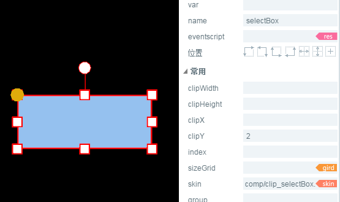
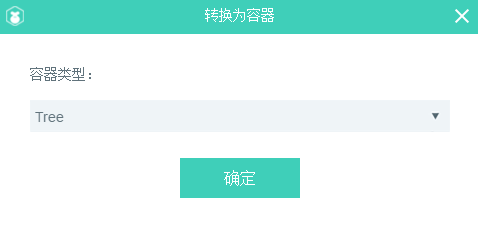

# Tree 组件参考


## 一、通过LayaAirIDE创建Tree组件

​        Tree 组件用来显示树状结构。用户可以查看排列为可扩展树的层次结构数据。
​        Tree 组件的脚本接口请参考 [Tree API](https://layaair2.ldc2.layabox.com/api2/Chinese/index.html?version=2.9.0beta&type=2D&category=UI&class=laya.ui.Tree)。

 

### 1.1 Tree 组件主要由两个部分组成：

- 项单元格（可以是 Box 、页面 View、自定义页面）；
- 纵向滚动条 VScrollBar；


### 1.2 Tree 组件的单元格通常由四部分组成：

- 一个单元格选择状态切片动画 Clip；
- 一个折叠箭头切片动画 Clip ；
- 一个文件状态切片动画 Clip ；
- 单元格其他内容元素；


### 1.3 Tree 组件的图像资源示例

1. 单元格选择状态切片动画 Clip 资源：
   切片数为2，切片索引从0开始依次代表：单元格未被选中状态图、单元格选中或悬停状态图。
   ​        <br/>
   ​    （图）
2. 折叠箭头切片动画 Clip 资源：
   切片数为2，切片索引从0开始依次代表：文件夹节点折叠状态图、文件夹节点展开状态图。
   ​        <br/>
   ​    （图）
3. 文件状态切片动画 Clip 资源：
   如果切片数是3，则切片索引从0开始依次代表：文件夹节点折叠状态图、文件夹节点展开状态图、非文件夹节点状态图；
   如果切片数是2，则切片索引从0开始依次代表：文件夹节点状态图、非文件夹节点状态图；
   ​        <br/>
   ​    （图）


### 1.4创建 Tree 组件

 ####1. 编辑 Tree 组件的列表项。

   列表项可以是 Box 类型、View（页面） 类型或自定义的页面类型。此处以Box 类型为例。
   a.从资源面板里选择拖入一个单元格选择状态的切片动画（ Clip 组件），设置此Clip 组件对象的 name 属性值为 selectBox，设置属性 clipY 的值为2；
   *注意：此处的选择状态切片动画 （Clip 组件）对象的 name 属性值必须设置为 selectBox，只有这样程序才能识别它，并实现此 Clip 组件对象的显示状态跟随单元项的选择状态而改变的功能，否则此 Clip 对象将会被识别为此单元项的普通显示对象。*

​        <br/>
​    （图）


   b.从资源面板里选择并拖拽一个单元格的折叠箭头切片动画（Clip 组件），设置此 Clip 组件对象的 name 属性值为 arrow，设置属性 clipY 的值为2；
   *注意：此处的折叠箭头切片动画 （Clip 组件）的 name 属性值必须设置为 arrow，只有这样程序才能识别它，并实现点击此 Clip 对象打开或折叠树形节点的功能。否则此 Clip 对象将会被识别为此单元项的普通显示对象。*
​        <br/>
​    （图）
   c.从资源面板里选择并拖拽一个单元格的文件状态切片动画（Clip 组件），设置此 Clip 组件对象的 name 属性值为 folder，设置属性 clipY 的值为 3；
   *注意：此处的文件状态切片动画（Clip 组件）的 name 属性值必须设置为 folder，只有这样程序才能识别它，并实现此 Clip 组件对象的显示状态跟随单元项的折叠、展开、节点类型（是否有字节点）而改变的功能。否则此 Clip 对象将会被识别为此单元项的普通显示对象。*
​        <br/>
​    （图）

    d.拖入此单元项的普通显示对象。
   此处以 Label 为例，从资源面板里选择并拖入一个 Label 组件对象，在此给这个 Label 对象设置一下属性 name 值为 label ，方便在脚本中对它进行赋值，此name 属性值自定义即可。再设置一下 Label 对象显示相关的属性，使它看起来更美观。

​        <br/>
​    （图）
   e.选中以上编辑的所有组件对象，使用快捷键 Ctrl + B 或选择 **\*菜单栏->编辑->转换为容器*** 选项，打开转换为容器设置面板，选择容器类型为 Box，然后点击确定按钮完成 Box 容器的添加。
​        <br/>
​    （图）

​    

####2. 转化为 Tree 容器。
   选择列表渲染项对象，使用快捷键 Ctrl + B 或选择 **菜单栏->编辑->转换为容器** 选项，打开转换为容器设置面板，选择容器类型为 Tree，然后点击确定按钮完成 Tree 容器的添加。
​           <br/>
   ​    （图）

####3. 指定 Tree 组件的列表渲染项。
   双击 Tree 组件对象，进入 Tree 对象内部进行编辑，设置 Tree 组件的列表渲染项的属性 name 的值为 render。
   *注意：此处列表渲染项属性 name 的值必须为 render，否则程序将无法识别。*
   ​        <br/>
   ​    （图）

####4. 为 Tree 组件添加滚动条。
   从资源面板里选择一个 VScrollBar 组件，将VScrollBar 组件的资源地址（skin 属性值）设置为 Tree 组件属性scrollBarSkin 的值。
​           <br/>
   ​    （图）

####5. 调整 Tree 的宽高。
​	设置 Tree 对象的属性 var（全局引用名）的值为 m_tree ，此处名字可以自定义，目的是在脚本中对此 Tree 组件对象赋值。
​           <br/>
​       （图）

####6. 在代码里给 Tree 对象赋值

```javascript
//树结构数据源
var xmlString:String="<data>"+
                        "<dir label='box1' isOpen='true'>"+
                            "<file label='child1 ' isOpen='true'/>"+
                            "<file label='child2 ' isOpen='true'/>"+
                            "<file label='child3 ' isOpen='true'/>"+
                            "<file label='child4 ' isOpen='true'/>"+
                            "<file label='child5 ' isOpen='true'/>"+
                        "</dir>"+
                        "<dir label='box2' isOpen='true'>"+
                            "<file label='child1 ' isOpen='true'/>"+
                            "<file label='child2 ' isOpen='true'/>"+
                            "<file label='child3 ' isOpen='true'/>"+
                            "<file label='child4 ' isOpen='true'/>"+
                            "<file label='child5 ' isOpen='true'/>"+
                        "</dir>"+
  					"</data>";
//解析xml字符。 
var xml:* = domParser.parseFromString(xmlString, "text/xml");
//设置 m_tree 的数据源。
m_tree.xml =xml;
```
#### 7. 在程序中运行查看效果。

​           <br/>
   ​    （图）

### 1.5 Tree 组件常用属性

​        <br/>
​    （图）

 

| **属性**        | **功能说明**          |
| ------------- | ----------------- |
| scrollBarSkin | 滚动条皮肤。            |
| spaceBottom   | 每一项之间的间隔距离。单位是像素。 |
| spaceLeft     | 左侧缩进距离。单位是像素。     |


##  二、通过代码创建Tree组件

​	在我们进行书写代码的时候，免不了通过代码控制UI，创建UI_Tree类，在代码中导入`laya.ui.Tree`的包，并通过代码设定Tree相关的属性。

**运行示例效果：**
​	<br/>
​	(图5)通过代码创建Tree

​	Tree的其他属性也可以通过代码来设置，下述示例代码演示了如何通过代码创建不同皮肤（样式）的Tree，

有兴趣的读者可以自己通过代码设置Tree，创建出符合自己需要的文件夹。

**示例代码：**

```javascript
package
{
	import laya.display.Stage;
	import laya.ui.Tree;
	import laya.utils.Browser;
	import laya.utils.Handler;
	import laya.utils.Utils;
	import laya.webgl.WebGL;

	public class UI_Tree
	{
		public function UI_Tree()
		{
			// 不支持WebGL时自动切换至Canvas
			Laya.init(800, 600, WebGL);
			//画布垂直居中对齐
			Laya.stage.alignV = Stage.ALIGN_MIDDLE;
			//画布水平居中对齐
			Laya.stage.alignH = Stage.ALIGN_CENTER;
			//等比缩放
			Laya.stage.scaleMode = Stage.SCALE_SHOWALL;
			//背景颜色
			Laya.stage.bgColor = "#232628";
			//图像资源
			var res:Array = [
				"../../../../res/ui/vscroll.png", 
				"../../../../res/ui/vscroll$bar.png", 
				"../../../../res/ui/vscroll$down.png", 
				"../../../../res/ui/vscroll$up.png", 
				"../../../../res/ui/tree/clip_selectBox.png", 
				"../../../../res/ui/tree/clip_tree_folder.png", 
				"../../../../res/ui/tree/clip_tree_arrow.png"
			];
			//加载资源
			Laya.loader.load(res, new Handler(this, onLoadComplete));
		}
		
		/***加载资源完成***/
		private function onLoadComplete(e:*=null):void
		{
			// 组装tree的数据
			var treeData:String = "<data>";
			//外层循环为树的父节点（相当于文件夹）
			for(var i:int = 0; i < 5; ++i)
			{
				treeData += "<dir label='Directory " + (i + 1) + "' isOpen='true'>";
				//内层循环为子节点（相当于文件）
				for(var j:int = 0; j < 5; ++j)
				{
					treeData += "<file label='File " + (j + 1) + "'/>";
				}
				treeData += "</dir>";
			}
			treeData += "</data>";
			// 把数据转化成xml格式
			var xml:* = Utils.parseXMLFromString(treeData);
			//实例化树结构
			var tree:Tree = new Tree();
			//滚动条资源
			tree.scrollBarSkin = "../../../../res/ui/vscroll.png";
			//设置单元格为Item类（只能用类，不能用实例的对象）
			tree.itemRender = Item;
			
			//对树形结构赋值
			tree.xml = xml;
			//修改大小
			tree.size(300, 300);
			//修改树的位置
			tree.x = (Laya.stage.width - tree.width) / 2;
			tree.y = (Laya.stage.height - tree.height) / 2;
			//加载到舞台
			Laya.stage.addChild(tree);
		}	
	}
}


import laya.ui.Box;
import laya.ui.Clip;
import laya.ui.Label;

// IDE中生成的此类对应的json对象，在此作为参考，对应树形结构中的单元格Item类
// {"child": [{"type": "Clip", "props": {"x": "13", "y": "0", "left": "12", "height": "24", "name": "selectBox", "skin": "ui/clip_selectBox.png", "right": "0", "clipY": "2"}}, {"type": "Clip", "props": {"y": "4", "x": "14", "name": "folder", "clipX": "1", "skin": "ui/clip_tree_folder.png", "clipY": "3"}}, {"type": "Label", "props": {"y": "1", "text": "treeItem", "width": "150", "left": "33", "height": "22", "name": "label", "color": "#ffff00", "right": "0", "x": "33"}}, {"type": "Clip", "props": {"x": "0", "name": "arrow", "y": "5", "skin": "ui/clip_tree_arrow.png", "clipY": "2"}}], "type": "Box", "props": {"name": "render", "right": "0", "left": "0"}};

/****树形结构中的单元格****/
class Item extends Box
{
	public function Item()
	{
		//实例“文件夹”背景切片对象
		var selectBox:Clip = new Clip("../../../../res/ui/tree/clip_selectBox.png", 1, 2);
		//设置 selectBox 的name 为“selectBox”时，将被识别为树结构的项的背景。2帧：悬停时背景、选中时背景。	
		selectBox.name = "selectBox";
		selectBox.height = 32;
		selectBox.x = 13;
		selectBox.left = 12;
		addChild(selectBox);
		
		//实例“文件夹”图标切片对象
		var folder:Clip = new Clip("../../../../res/ui/tree/clip_tree_folder.png", 1, 3);
		//设置 folder 的name 为“folder”时，将被识别为树结构的文件夹开启状态图表。2帧：折叠状态、打开状态。
		folder.name = "folder";
		folder.x = 14;
		folder.y = 4;
		addChild(folder);
		
		//实例文件夹名字文本或子节点名字文本对象
		var label:Label = new Label();
		//设置 label 的name 为“label”时，此值将用于树结构数据赋值。
		label.name = "label";
		label.fontSize = 20;
		label.color = "#FFFFFF";
		label.padding = "6,0,0,13";
		label.width = 150;
		label.height = 30;
		label.x = 33;
		label.y = 1;
		label.left = 33;
		label.right = 0;
		addChild(label);
		
		//实例左边折叠小三角箭头对象
		var arrow:Clip = new Clip("../../../../res/ui/tree/clip_tree_arrow.png", 1, 2);
		//设置 arrow 的name 为“arrow”时，将被识别为树结构的文件夹开启状态图表。2帧：折叠状态、打开状态。
		arrow.name = "arrow";
		arrow.x = 0;
		arrow.y = 5;
		addChild(arrow);	
	}
}


```


 