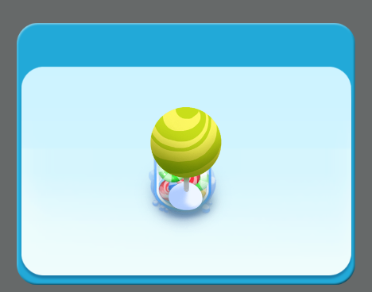

# ViewStack 组件详解

> 由于很多组件属性是通用的，常用及通用的组件属性在`属性设置器`文档中已进行介绍。阅读本篇内容前请先阅读《属性设置器》文档。另外，本篇中会涉及一些Tab组件知识，请先阅读Tab组件详解的文档。

## 1、了解ViewStack组件

### 1.1 ViewStack组件的作用

ViewStack组件主要用于多页面视图切换。它包含多个子页面，但默认只显示一个，可以通过子页面索引进行显示切换。一般情况我们用它与Tab标签组合制作标签切换页面。如动图1所示。

<br/>（动图1） 

### 1.2 ViewStack组件的资源（skin）规范

ViewStack组件是通过`Ctrl+B`转换而来的容器类组件，没有独立的组件资源规范。本例中直接采用的是image组件资源，在实际的游戏开发中，可以根据实际开发需求使用各种UI组件。

### 1.3 ViewStack组件的API介绍

​	ViewStack 组件的API使用请参考 [http://layaair.ldc.layabox.com/api/index.html?category=Core&class=laya.ui.ViewStack](https://layaair2.ldc2.layabox.com/api2/Chinese/index.html?version=2.9.0beta&type=2D&category=UI&class=laya.ui.ViewStack)。


## 2、通过LayaAirIDE创建ViewStack组件

### 2.1 创建ViewStack页面  

#### 2.1.1 准备美术资源

准备好页面背景图以及需要切换的页面美术资源，放到LayaAirIDE资源管理器对应的项目目录中。

#### 2.1.2 为页面背景图片设置九宫格

弹出框的页面背景通常会采用九宫格，这里我们先将背景的九宫格属性设置好。如动图2-1所示。

 <br />(动图2-1)

#### 2.1.3 创建页面背景

将刚刚设置过九宫格的背景图拖拽到场景编辑器中。如动图2-2所示。

 <br />(动图2-2)

#### 2.1.4 创建ViewStack页面

将页面中涉及的UI基础组件拖拽到ui文件的`场景编辑器`，然后快捷键`Ctrl+B`转换成`ViewStack`容器组件。如动图3-1所示。

 <br /> (动图3-1)


#### 2.1.5 设置ViewStack组件的子页面name属性

ViewStack子页面name属性的命名规则为item0、item1、item2.....”如果有更多页面以此类推，如动图3-2所示，不按此规则增加name属性，生成的ViewStack组件为无效组件，不能正常运行。

 <br /> (动图3-2)

**Tips**：*name属性那里字符必须为item,不能改为其它。当修改完退出ViewStack子页面后，默认只显示item0时为正常，否则ViewStack组件没有生效。*


#### 2.1.6 调整页面的UI布局

​	设置好name属性后，可以双击进入veiwStack组件内，先把子页面的UI布局调整好。本例中，我们仅将不同页面用到的资源大小、位置调整好，并让三个子页面居中对齐。效果如图3-3所示。

​        <br/> （图3-3）


### 2.2   设置ViewStack的页面索引selectedIndex

​	ViewStack组件默认显示name属性为item0的图片，因为控制默认索引的属性selectedIndex默认值为0。我们可以通过调整selectedIndex属性值来改变ViewStack组件的默认显示页面。效果如动图4所示。

<br/>（动图4）

**Tips**：

**ViewStack组件的Var值必须要设置，在编写代码时需要通过Var声名的全局变量来控制ViewStack组件，从而改变selectedIndex的属性，实现页面的切换。本例中采用的是viewStack，如动图4右上角所示，开发者也可以取别的名字。**


### 2.3 创建控制用Tab标签

​	 通常，ViewStack组件需要一个相应的控制标签，我们创建一个Tab标签来控制ViewStack的子页面切换显示。

​	点击选择资源面板里的 Tab 组件，拖拽到UI页面的场景编辑器生成 Tab 组件。 Tab 组件的美术资源如图5所示，它与上图中的背景风格配套。

​        <br/>
​      （图5）

​        Tab 组件拖拽到编辑器后，调位置与背景图适配对齐。设置公用属性var为tab，用于程序调用控制。设置常用属性labels为“雪人,糖罐,绿树”， 选择的按钮索引selectedIndex 为0。再设置其他属性中的字体大小、粗体、字体状态颜色等。

​	显示效果如图6所示：

​        <br/>
​    （图6）


## 3、通过代码控制ViewStack组件切换显示

​	在上面几个制作步骤中，我们完成了在IDE里的组件创建与组合，下面我们通过程序代码把Tab标签和ViewStack的子页面切换显示关联起来。

​	保存页面，按F12发布页面，发布后在项目ui文件夹中生成了ComponentDemoUI.as类，我们直接使用它。


创建ComponentDemo.as并设置默认程序，编写代码如下：

```java
package
{
	import laya.utils.Handler;
	import laya.webgl.WebGL;	
	//导入UI发布生成的类
	import ui.ComponentDemoUI;

	public class ComponentDemo
	{
		/**包含tab与viewStack组件的测试页面**/
		private var comp:ComponentDemoUI;		
		public function ComponentDemo()
		{
			Laya.init(1334,750, WebGL);
			
			Laya.stage.scaleMode = "full";
			Laya.stage.bgColor = "#ffffff";
			//加载图集成功后，执行onLoaded回调方法
			Laya.loader.load("./res/atlas/ui.atlas", Handler.create(this, onLoaded));

		}
		
		private function onLoaded():void {
			//创建一个UI实例
			comp = new ComponentDemoUI();
						
			//添加到舞台上显示
			Laya.stage.addChild(comp);
			
			//点击Tab选择按钮的处理
			comp.tab.selectHandler=new Handler(this,onSelecte);	
			
		}
		/**根据选择tab的索引切换页面**/
		private function onSelecte(index:int):void
		{
			//切换ViewStack子页面
			comp.viewStack.selectedIndex=index;
		}
	}
}
```

运行示例代码，效果如动图10所示。

<br/>（动图10） 