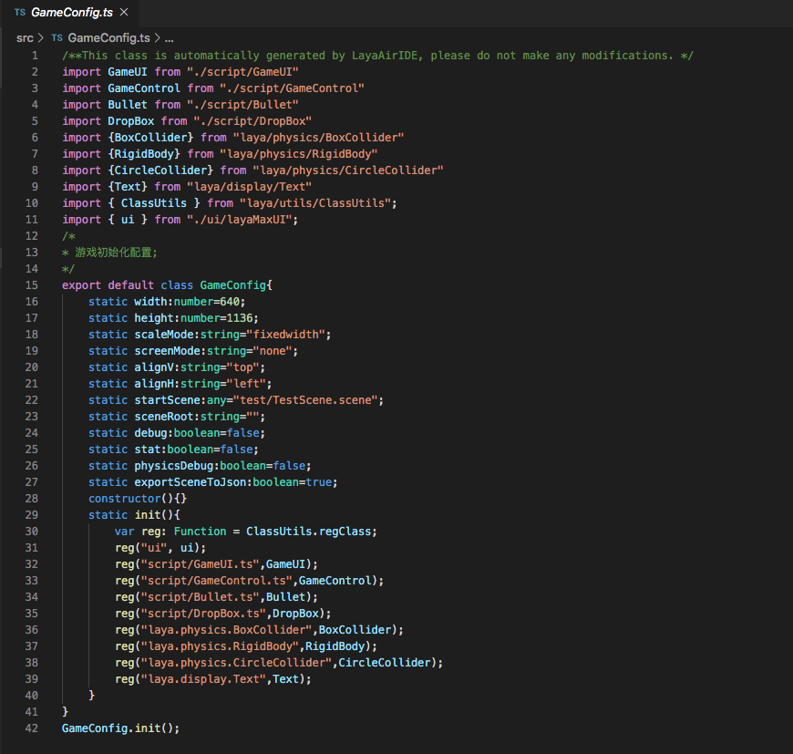
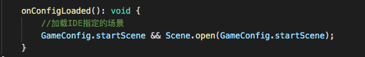
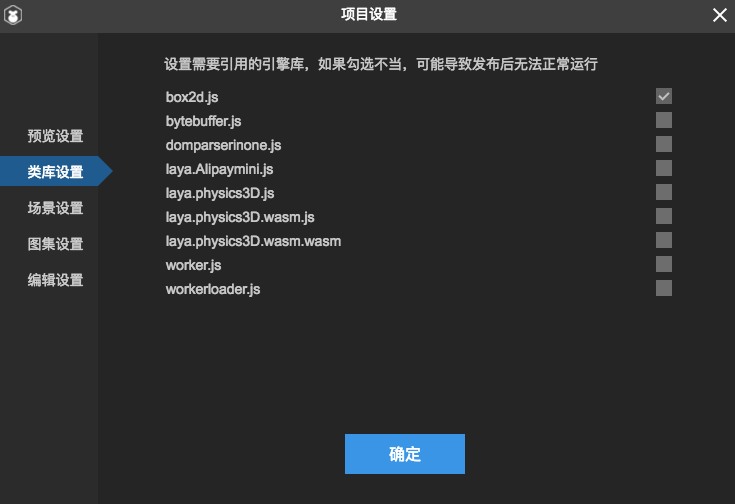
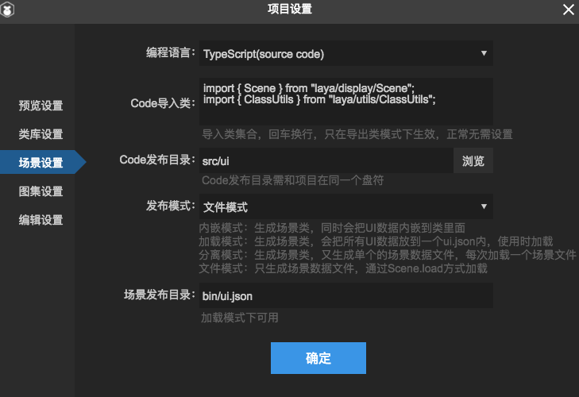

# F9！项目设置介绍

> 本篇采用LayaAirIDE 2.0.1 bate 截图，如有不同，请下载最新的LayaAirIDE，以最新版本IDE为准。

## 概述

​    快捷键F9，是LayaIDE最常用，也最不可或缺的功能，熟悉Laya的开发者都知道F9的重要性，而这一点早在1.0就已经被开发者们所熟知，在2.0引擎中，想不使用F9是不可能的。然而很多刚接触Laya的开发者并不了解F9的功能，本篇就为大家介绍一下。（熟手可以忽略本篇）

### 一、预览设置

​        项目设置的第一页为预览设置，这里主要设置起始场景（程序启动第一个加载的场景，选择当前场景就是在编辑器最后一次焦点所在的场景），以及其他设置，这个设置会影响IDE的自动生成类GameConfig,手动修改这个类无效，只能在IDE里设置。

GameConfig如下图：

对应的启动当前场景代码，在Main类中，开发者也可以根据自身需求不使用默认的启动设置。

### 二、类库设置

​	 为了减小代码包体的大小，开发者可以只引入使用到的类库，没有用到的功能便不用再占用代码包的大小，

类库设置是非常常用的功能，在勾选Webgl库情况下，引擎初始化即为webgl模式，反之为canvas模式。

其他的类库可根据实际需求自行取舍。如果没勾选类库却使用类库功能会报错。

### 三、场景设置

​     这里一般不需要动，主要就是发布模式，为了减少小游戏的代码包体大小，IDE统一默认是文件模式；

四种模式的区别如下：

 **内嵌模式**：内嵌模式会把编辑器的UI内容生成一个场景类代码文件，代码脚本里包含IDE创建的UI场景的信息，在小游戏和轻游戏还没有问世的时候，不用考虑js 的大小，正常开发h5最常用的选择，而且不涉及异步加载打开页面速度也最快。

**加载模式**： 加载模式也会生成场景类，其他的UI数据信息会放到一个ui.json内，使用时需要加载这个json，同样在没有小游戏的时代不常用，场景信息可以不在js中，可以节省js包体大小，给小游戏4m包节省更多空间。使用时可以作为资源加载。

**分离模式**： 分离模式是在加载模式基础上，同样也会生成场景类，但他会把每个场景生成单独的场景数据文件，每次单独加载场景文件，区别于加载模式一次把所有场景都加载。在2.0以后，开发小游戏或轻游戏，为了减少主包大小和提升加载速度都是常用的模式。

**文件模式**：文件模式是2.0特有的，为了开发小游戏而创建的，他不生成场景类，也就是能进一步减少js包的大小，使用的时候用Scene.load方式加载，区别于前三种最大的的不同就是，文件模式不能直接调用场景内的变量，需要getchild获取之后进行操作。前三种的场景类里声明了变量，有代码提示直接可以操作内部的变量。

### 四、图集设置

​    图集设置可以设置自动打包图集的各项规则，目录最好不要修改。

### 五、编辑设置

​       如图，这个不做过多介绍

