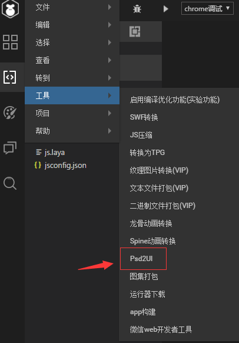

# PsDToUI与使用详解

> author: Laya        update: 2019.03.27  

*【注意】本篇教程采用LayaAirIDE 2.0.0正式版，文中如有不同请以最新LayaAirIDE版本为准。*

laya的集成工具里的Psd2UI 可以把ps按照一定规则制作的psd文件用工具转成laya可以使用的UI。

打开工具后会看到如下图的界面，把包含psd的文件夹拖入，点击确定即可转换。

前面提到过，制作psd要按照一定的规则才可以转换成laya使用的UI，规则如下：

1，不能识别的类型统统为image，这一点和IDE的编辑器一致；

2，除box和Label特殊一些，其他的都和IDE的ui命名规则一致，前缀或后缀；

3，控件都需要按照前缀，后缀规则命名，3态如下图，要建立子文件夹 normal，over，down

4，Container_前缀会识别为Box容器，Label不仅要用文本控件，还要以小写txt作为前缀，或大写Txt作为后缀

   

转换后会看到两个文件夹

我们需要把assets文件夹里面的内容 放到项目的assets文件夹中， pages文件夹里面的内容放到工程的pages文件夹中，也可以直接把两个文件夹粘贴到laya文件夹中选择合并两个文件夹。

然后打开项目的编辑模式，可以看到ui被制作出来，效果如下：

更多问题请访问ask.layabox.com