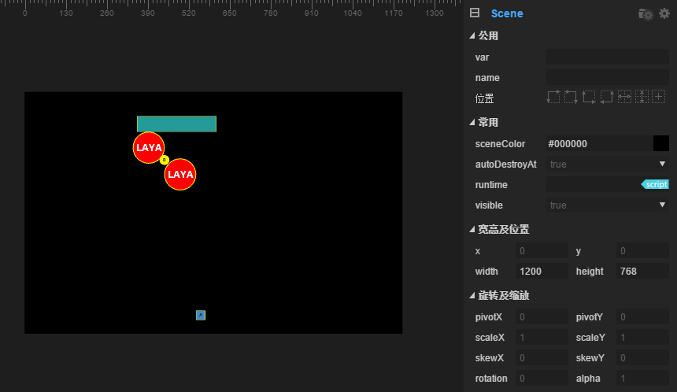

# 平移，旋转，与齿轮关节

## 内容概述

​	   在游戏开发中，关卡设计需要传送带，齿轮传动，移动平台等装置，使用以下关节组合，可以快速的制作出能产生约束关系的系统。

​           本篇内容需要用到三种关节：

​           平移关节`PrismaticJoint` ， 旋转关节`RevoluteJiont`，齿轮关节`GearJoint`。

​	 使用关节组合，可以做出一些机关装置，比如一个横向的平移平台带动齿轮旋转，并将小方块提起来。

​         

### 1.平移关节介绍

平移关节`PrismaticJoint` ： 移动关节允许两个物体沿指定轴相对移动，它会阻止相对旋转。

#####       属性介绍

##### otherBody

[首次设置有效]关节的连接刚体，可不设置，默认为左上角空刚体,拖入刚体对象即可设置完成。

##### anchor

[首次设置有效]关节的控制点，是相对于自身刚体的左上角位置偏移。

##### axis

[首次设置有效]一个向量值，描述运动方向，比如1,0是沿X轴向右。

##### enableMotor

是否开启马达，开启马达可使目标刚体运动。

##### motorSpeed

启用马达后，在axis坐标轴上移动可以达到的最大速度。

##### maxMotorForce

启用马达后，可以施加的最大作用力。

##### enableLimit

是否对刚体的移动范围加以约束。

##### lowerTranslation

启用约束后，刚体移动范围的下限，是距离anchor的偏移量（负值）。

##### upperTranslation

启用约束后，刚体移动范围的上限，是距离anchor的偏移量（正值）。

##### collideConnected

[首次设置有效]两个刚体是否可以发生碰撞，默认为false。

#### 实例演练

一个最基本的平移关节，单独使用是很简单的，拖入一个方块并添加`boxcollider`碰撞体，给他添加平移关节`PrismaticJoint`，在刚体`rigidbody`重力`gravityScale`设置为0，axis设置为（1,0）并设置马达开启，速度为1， 限制一下最大最小偏移量，效果如图所示

运行效果如下（下图是显示了物理辅助线的效果，上篇文档有介绍，按f9可以勾选。）

​      

为了使游戏更有乐趣，我们会需要使用到平台与平台的关联移动，再拖入一个方块，拉成长方形，然后添加碰撞体，刚体`rigidbody`重力`gravityScale`设置为0，并将刚体拖入第一个方块的平移关节`PrismaticJoint`的`otherbody`上，将马达开启，并设置速度为1，方向为1,0并进行大小偏移限制，如图所示

运行效果如下

​        到这里，举一反三的开发者会注意到，这个平移只能是相向，或者背向平移，也就是说只能在一个轴上靠近或者远离，并不能同时向一个方向移动。平移关节只是相对移动，笔者查阅了国内外的文档，和官方手册，都没有详细介绍关节的细节，笔者经过实验用组合方法实现了功能，所以我们使用物理系统的时候，一定要按照物理思想去设计，去思考。

​      我们继续上一个例子，把第上面方块的平移关节`PrismaticJoint`里的`otherBody`删除，如图

然后给他添加一个距离关节`DistanceJoint`，并给下面方块添加一个平移关节`PrismaticJoint` 然后将此物体刚体`RigidBody`拖入到上面物体的距离关节的`otherBody` 中，如图

设置好之后，运行效果如下（上面方块的马达牵动方块向右平移，再由距离关节牵动下面方块物体向右平移）：

### 2. 旋转关节介绍

 旋转关节`RevoluteJiont`：强制两个物体共享一个锚点，两个物体相对旋转。

##### 属性介绍

##### otherBody

[首次设置有效]关节的连接刚体，可不设置，默认为左上角空刚体,拖入刚体对象即可设置完成。

##### anchor

[首次设置有效]关节的控制点，是相对于自身刚体的左上角位置偏移。

##### enableMotor

是否开启马达，开启马达可使目标刚体运动。

##### motorSpeed

启用马达后，可以达到的最大旋转速度。

##### maxMotorTorque

启用马达后，可以施加的最大扭距，如果最大扭矩太小，会导致不旋转。

##### enableLimit

是否对刚体的旋转范围加以约束。

##### lowerAngle

启用约束后，刚体移动范围的下限，是距离anchor的偏移量（负值）。

##### upperAngle

启用约束后，刚体移动范围的上限，是距离anchor的偏移量（正值）。

##### collideConnected

[首次设置有效]两个刚体是否可以发生碰撞，默认为false。

#### 实例演练

新建一个场景，然后拖入一个圆形图片，给它添加圆形碰撞体 `CircleCollider`，IDE会自动添加刚体`RigidBody`, 然后再给它添加一个旋转关节`RevoluteJoint`,关节的锚点设在圆心，并且开启马达并设置旋转速度为1。如图：

点击运行，我们可以看到旋转的圆形：

单独使用非常的简单，接下来我们要使用一下组合：在此例基础上，添加一个带有方块碰撞体`BoxCollider`的长条矩形作为平台，如图

然后平移关节`PrismaticJoint`，和一个添加了多边形碰撞体`PolygonCollider`的三角形作为底座，用来让圆形在三角形上绕点旋转，（注意三角形节点应当在圆形节点层级的上方，在下方的在最前显示），最终效果如下图，添加过程请开发者自行完成。

点击运行，效果如下:

### 3.齿轮关节介绍

  齿轮关节`GearJoint`：用来模拟两个齿轮间的约束关系，齿轮旋转时，产生的动量有两种输出方式，一种是齿轮本身的角速度，另一种是齿轮表面的线速度。

##### 属性介绍

##### joint1

[首次设置有效]要绑定的第1个关节，类型可以是RevoluteJoint或者PrismaticJoint。

##### joint2

[首次设置有效]要绑定的第2个关节，类型可以是RevoluteJoint或者PrismaticJoint。

##### ratio

两个齿轮角速度比例，默认1。

##### collideConnect

两个刚体是否可以发生碰撞，默认为false。

#### 实例演练

​       在掌握了平移关节，和旋转关节之后，就可以使用齿轮关节使两个关节关联起来，这样我们就可以依次对关节进行约束，可以完成一个整体的系统。下面我们来制作一个稍微复杂点的小组合。

​       新建一个空场景，取名为gear，在场景中拖入方块，圆形，并摆成下图效果：

从上到下的sprite命名依次为：box,circle1,yellow,circle2,sprite。命名是为了方便我们定位具体的物体。然后每个物体添加相应的碰撞体，IDE会自动为其添加刚体，（此步骤需要用前文中介绍的知识，如果不知道如何添加，请回到之前内容学习）。

摆好位置之后给最上方的方块添加一个平移关节`PrismaticJoint`并且设置相应属性使其和下图一致

然后，给circle1物体添加相应的关节，添加旋转关节`RevoluteJoint` ，齿轮关节`GearJoint` ，并把平移关节和旋转关节拖到joint1，joint2的位置，使两个关节关联。

同理，给余下的圆形添加旋转关节`RevoluteJoint` ，并且用齿轮关节`GearJoint` 依次连接两个物体，yellow连接circle1，circle2连接yellow，sprite连接circle2，sprite的平移关节`PrismaticJoint`  设置如下，注意他的y轴符号：

需要注意，只有第一个方块box 马达开启，它将带动场景中所有物体的移动或者转动，最终运行效果如下：

更多问题请访问社区 http://ask.layabox.com