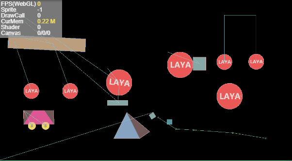

# 2D物理系统

### 1. 2D物理系统概述

​        在游戏开发中，物理系统虽说不是每款必用，但它是提升游戏用户体验的重要因素之一，一些经典的物理游戏如：愤怒的小鸟，小鳄鱼顽皮爱洗澡等，都是用物理系统制作的丰富关卡，风靡全球，伴随着广大游戏开发者的需求以及引擎的迭代，Laya2.0集成了Box2D物理系统，对Box2D进行封装之后，使得开发者可以免去接入Box2D物理系统需要面对的种种困难，和使用不便。

​	 LayaAir引擎中集成的Box2D是刚体物理系统（其他的还有软体物理系统，流体物理系统）说到刚体物理系统，首先就要了解刚体`rigidbody` 和碰撞体`collider`，当物体包含刚体的时候就可以收到物理引擎的影响，当物体包含碰撞体的时候物体可以发生碰撞，当物体含有碰撞体不含有刚体的时候可以被碰撞但不发生物理运动学动力影响。

刚体`rigidbody` ：刚体是指在运动中和受力作用后，形状和大小不变，而且内部各点的相对位置不变的物体。

碰撞体`collider`：碰撞体是给物体加一个判定框，当碰撞框重叠的时候，两物体发生碰撞。

关节`joint`: 关节可以对两个或多个物体进行一种约束。

**Box2D支持的关节有**：

距离关节`DistanceJoint`：两个物体上面各自有一点，两点之间的距离固定不变。

齿轮关节`GearJoint`：用来模拟两个齿轮间的约束关系，齿轮旋转时，产生的动量有两种输出方式，一种是齿轮本身的角速度，另一种是齿轮表面的线速度。

发动机关节`MotorJoint`

鼠标关节`MouseJoint`：用于鼠标操控物体。它试图将物体拖向当前鼠标光标的位置。而在旋转方面就没有限制。

平移关节`PrismaticJoint` ：  移动关节允许两个物体沿指定轴相对移动，它会阻止相对旋转。

滑轮关节`PulleyJoint`：它将两个物体接地(ground)并彼此连接，当一个物体上升，另一个物体就会下降。

旋转关节`RevoluteJiont`：强制两个物体共享一个锚点，两个物体相对旋转。

绳索关节`RopeJoint` ：限制两个点之间的最大距离。即使在很大的负载下也阻止连接的物体之间的拉伸。

焊接关节`WeldJoint`：使两个物体不能相对运动，两个刚体的相对位置和角度都保持不变，像一个整体。

轮子关节`WheelJoint`：围绕节点旋转，包含弹性属性，使得刚体在节点位置发生弹性偏移。

### 2.刚体组件介绍

#### 2.1 刚体

RigidBody类继承自 Component，刚体支持三种类型:`static`，`dynamic`和`kinematic`，默认为`dynamic`。

`static`为静态类型，静止不动，不受重力影响，质量无限大，可以通过节点移动，旋转，缩放进行控制;

`dynamic`为动态类型，受重力影响;

`kinematic`为运动类型，不受重力影响，可以通过施加速度或者力的方式使其运动。

 

#### 属性说明

##### type 

前文中提到三种类型:`static`，`dynamic`和`kinematic`，默认为`dynamic`。

##### gravityScale  

重力缩放系数，默认为1，即正常重力，设置为0为没有重力。

##### angularVelocity

角速度，设置会导致旋转,单位为弧度，实际使用中需要约束。

##### angularDampin

旋转速度阻尼系数，范围从0到无穷大，0表示没有阻尼，无穷大表示满阻尼，通常阻尼的值应该在0到0.1之间。

##### linearVelocity

线性运动速度，需要输入向量，比如10,10，代表x轴向右速度10，y轴向下速度10。

##### linearDamping

线性速度阻尼系数，范围从0到无穷大，0表示没有阻尼，无穷大表示满阻尼，通常阻尼的值应该在0到0.1之间。

##### bullet

是否高速移动的物体，设置为true，可以防止高速穿透。

##### allowSleep

是否允许休眠，允许休眠能提高性能,这个一般都要设置为true。

##### allowRotation

是否允许旋转，如果不希望刚体旋转，这设置为false。

##### group

指定了该主体所属的碰撞组，默认为0.

碰撞规则如下：

 1.如果两个对象group相等且

​      group值大于零，它们将始终发生碰撞

​      group值小于零，它们将永远不会发生碰撞

​      group值等于0，则使用规则3

  2.如果group值不相等，则使用规则3

  3.每个刚体都有一个category类别，此属性接收位字段，范围为[1,2^31]范围内的2的幂

​     每个刚体也都有一个mask类别，指定与其碰撞的类别值之和（值是所有category按位AND的值）

##### category

碰撞类别，使用2的幂次方值指定，有32种不同的碰撞类别可用。

##### mask

指定冲突位掩码碰撞的类别，category位操作的结果。

##### label

自定义标签

#### 2.2 碰撞体 

碰撞体有四种：

矩形碰撞体，圆形碰撞体，线形碰撞体，多边形碰撞体。如图，每个碰撞体都是继承自碰撞体基类。

##### 碰撞体基类属性

##### x,y 

相对节点x,y轴偏移。

##### friction

摩擦力，取值范围0-1，值越大，摩擦越大，默认值为0.2。

##### restitution

弹性系数，取值范围0-1，值越大，弹性越大，默认值为0。

##### density

密度值，值可以为零或者是正数，建议使用相似的密度，这样做可以改善堆叠稳定性，默认值为10。

##### isSensor

是否是传感器，传感器能够触发碰撞事件，但不会产生碰撞反应。可以理解为Trigger。

##### label

自定义标签

#### 矩形碰撞体

##### 属性说明

##### width,height

矩形的宽度和高度。

##### fitsize按钮

点一下这个按钮，碰撞体的大小就会自适应为节点宽高。

#### 圆形碰撞体

##### 属性说明

##### radius

圆的半径，必须为正数。

#### 线形碰撞体

##### 属性说明

##### points

用逗号隔开的点的集合，格式：x,y,x,y ... 设置点之后，从第一个点依次连接到最后一个点的连线即为线形碰撞体。在编辑器中，在线上单击左键增加一个点，点可以拖拽，双击点会删除这个点。

#### 多边形碰撞体

##### 属性说明

##### points

用逗号隔开的点的集合，格式：x,y,x,y .. 

2D多边形碰撞体，暂时不支持凹多边形，如果是凹多边形，先手动拆分为多个凸多边形

节点个数最多是b2_maxPolygonVertices，这数值默认是8，所以点的数量不建议超过8个。

### 3. 物理演示

#### 物理系统演示

新建一个2d示例项目，并且在编辑模式下创建一个场景,然后一系列操作，最终如效果如下，后续的章节会详细介绍这些效果如何制作。

